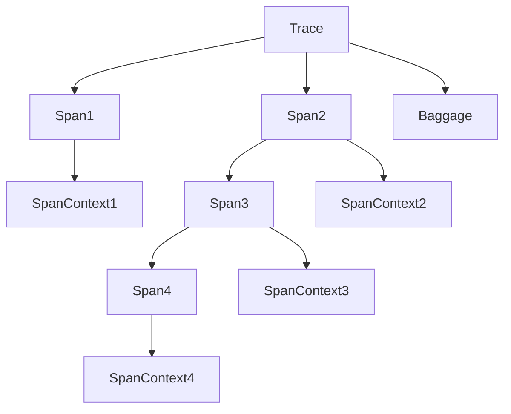
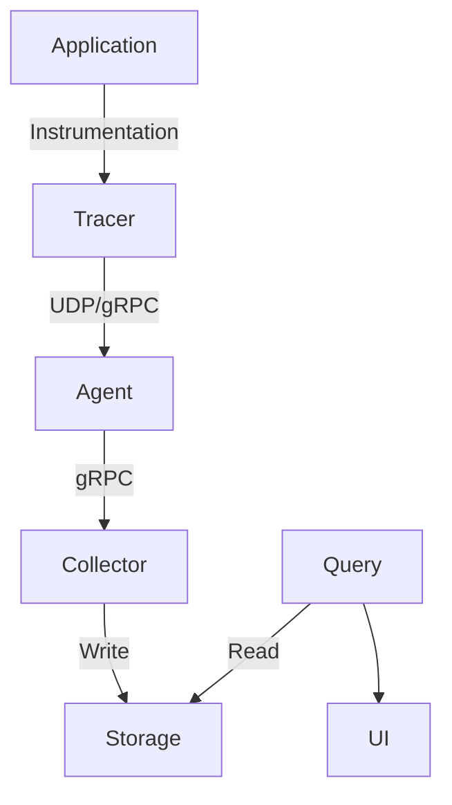

# AI系统Jaeger原理与代码实战案例讲解

## 1.背景介绍

在当今时代,人工智能(AI)已经渗透到各个领域,成为推动科技创新和社会进步的核心驱动力之一。随着数据的爆炸式增长和计算能力的不断提升,AI系统的复杂性也与日俱增。为了有效地管理和监控这些复杂的分布式AI系统,需要一种全面、高效的分布式跟踪系统。这就是Jaeger的用武之地。

Jaeger是一个开源的、云原生的分布式跟踪系统,由Uber公司开发并捐赠给开源社区。它旨在帮助开发人员监控和排查基于微服务架构的复杂分布式系统中的性能问题。Jaeger提供了端到端的分布式事务监控功能,可以跟踪整个系统的请求流程,并可视化显示各个组件的延迟和依赖关系。

## 2.核心概念与联系

在深入探讨Jaeger的原理之前,我们需要先了解一些核心概念:

1. **Trace(跟踪)**: 一个分布式事务,由多个Span组成。
2. **Span(跨度)**: 一个逻辑工作单元,如一个远程过程调用或一个数据库查询。
3. **SpanContext(跨度上下文)**: Span的元数据,包括操作名称、开始时间、持续时间等。
4. **Baggage(背包)**: 一组键值对,用于在整个Trace中传递横切关注点。

这些概念之间的关系如下Mermaid流程图所示:



## 3.核心算法原理具体操作步骤

Jaeger的核心算法原理可以分为以下几个步骤:

### 3.1 数据采集

Jaeger使用了OpenTracing API来采集分布式系统中的跟踪数据。开发人员需要在应用程序代码中插入相应的instrumentation代码,以创建和传播Span。

### 3.2 数据传输

采集到的Span数据通过UDP或gRPC协议传输到Jaeger Agent。Agent是一个轻量级的代理进程,负责批量将数据发送到Jaeger Collector。

### 3.3 数据处理

Jaeger Collector是一个有状态的组件,负责验证、索引和持久化接收到的跟踪数据。Collector支持将数据写入多种后端存储,如Cassandra、Elasticsearch等。

### 3.4 数据查询

Jaeger Query是一个查询服务,允许用户通过Web UI或命令行工具查询和检索存储的跟踪数据。它从存储后端读取数据,并将其转换为可视化的形式。

### 3.5 数据可视化

Jaeger UI是一个基于Web的用户界面,用于可视化查询到的跟踪数据。它提供了多种视图,如跟踪视图、依赖关系视图等,帮助开发人员快速定位和诊断问题。

整个过程可以用下面的Mermaid流程图来概括:



## 4.数学模型和公式详细讲解举例说明

在分布式跟踪系统中,一个关键的指标是跟踪采样率(Sampling Rate)。采样率决定了有多少比例的跟踪数据会被实际采集和处理。过高的采样率会导致大量的数据,增加系统开销;而过低的采样率则可能导致重要的跟踪数据丢失。因此,需要一个合理的采样策略来平衡成本和效益。

Jaeger采用了基于优先级(Priority Sampling)的采样策略。每个Span都被赋予一个优先级值,优先级越高,被采样的概率就越大。优先级值的范围是 $[0, 2^{64}-1]$,其中0表示不被采样,而 $2^{64}-1$ 表示必须被采样。

对于一个给定的采样率 $r$ (介于0和1之间),优先级 $p$ 的Span被采样的概率为:

$$
P(采样) = \begin{cases}
0, & \text{if }p=0\\
r^{(p-1)/(2^{64}-2)}, & \text{if }0<p<2^{64}-1\\
1, & \text{if }p=2^{64}-1
\end{cases}
$$

例如,如果采样率 $r=0.1$,优先级 $p=10^6$ 的Span被采样的概率约为0.63。

此外,Jaeger还支持基于服务名称、操作名称等维度进行采样,以及远程采样策略,以适应不同的场景需求。

## 5.项目实践:代码实例和详细解释说明

下面是一个使用Jaeger进行分布式跟踪的Python示例代码:

```python
import time
import logging
from jaeger_client import Config

# 初始化Jaeger Tracer
def init_tracer(service):
    logging.getLogger('').handlers = []
    logging.basicConfig(format='%(message)s', level=logging.DEBUG)

    config = Config(
        config={
            'sampler': {
                'type': 'const',
                'param': 1,
            },
            'logging': True,
        },
        service_name=service,
    )

    # 这将发送一个"jaeger.version"度量值
    return config.initialize_tracer()

# 创建Span并执行一些工作
def tracer_test(tracer, operation_name):
    with tracer.start_span(operation_name) as span:
        span.log_kv({'event': 'test message', 'life': 42})

        # 模拟一些延迟
        time.sleep(2)

# 主函数
def main():
    tracer = init_tracer('hello-world')
    tracer_test(tracer, 'say-hello')
    time.sleep(2)   # 给Jaeger一些时间来完成跟踪
    tracer.close()

if __name__ == "__main__":
    main()
```

这段代码首先初始化了一个Jaeger Tracer,并配置了一个常量采样器,确保所有Span都被采样。然后,它创建了一个名为"say-hello"的Span,记录了一些键值对日志,并模拟了2秒的延迟。

在实际应用中,您需要在应用程序的关键点插入instrumentation代码,创建和完成Span。例如,在处理HTTP请求时,您可以在请求开始时创建一个Span,并在请求结束时完成该Span。

您还可以使用OpenTracing的上下文传播功能,在分布式系统的不同组件之间传递Span上下文,从而实现端到端的跟踪。

## 6.实际应用场景

Jaeger作为一个分布式跟踪系统,在以下场景中发挥着重要作用:

1. **微服务架构**: 在基于微服务的分布式系统中,Jaeger可以跟踪整个请求流程,帮助开发人员快速定位性能瓶颈和故障根源。

2. **云原生应用**: 对于部署在Kubernetes等云原生环境中的应用,Jaeger提供了与云原生生态系统的无缝集成,方便监控和故障排查。

3. **大数据处理**: 在处理大规模数据的分布式系统中,Jaeger可以帮助开发人员了解数据流的流向和延迟情况。

4. **在线服务**: 对于高并发、低延迟的在线服务,Jaeger可以监控关键路径的性能,确保服务质量。

5. **IoT和边缘计算**: Jaeger还可以应用于物联网和边缘计算领域,跟踪分布在不同设备上的工作流程。

总的来说,任何需要监控和优化分布式系统性能的场景,都可以考虑使用Jaeger。

## 7.工具和资源推荐

除了Jaeger本身,还有一些其他工具和资源可以帮助您更好地使用和理解分布式跟踪:

1. **OpenTracing**: 一个供应商中立的API,用于分布式跟踪instrumentation。Jaeger就是基于OpenTracing API实现的。

2. **Zipkin**: 另一个流行的开源分布式跟踪系统,与Jaeger有一些相似之处。

3. **Prometheus**: 一个开源的监控和警报系统,可以与Jaeger集成,提供更全面的监控能力。

4. **Grafana**: 一个开源的数据可视化和监控平台,可以与Jaeger和Prometheus集成,提供丰富的可视化功能。

5. **OpenTelemetry**: 一个新兴的云原生观测标准,旨在统一指标、日志和跟踪等不同观测数据源。

6. **分布式系统观测模式(Distributed Systems Observability Patterns)**: 一本由Cindy Sridharan撰写的书籍,介绍了分布式系统观测的最佳实践和模式。

7. **Jaeger官方文档**: Jaeger的官方文档提供了详细的安装、配置和使用指南,是学习Jaeger的绝佳资源。

通过结合使用这些工具和资源,您可以构建一个更加完整和强大的分布式系统观测解决方案。

## 8.总结:未来发展趋势与挑战

随着云原生技术的不断发展,分布式系统的复杂性也在不断增加。因此,分布式跟踪系统如Jaeger将在未来发挥越来越重要的作用。

未来,Jaeger可能会面临以下一些发展趋势和挑战:

1. **开放遥测(OpenTelemetry)的兴起**: OpenTelemetry旨在统一指标、日志和跟踪等不同观测数据源,可能会对现有的专用跟踪系统产生一定影响。Jaeger需要与OpenTelemetry进行良好的集成和协作。

2. **人工智能辅助分析**: 随着机器学习和人工智能技术的进步,可能会出现利用AI算法自动分析和诊断跟踪数据的新方法,提高故障排查的效率。

3. **云边一体化**: 随着边缘计算和物联网的发展,分布式系统将不仅限于云端,还会扩展到边缘设备。Jaeger需要适应这种新的架构模式。

4. **可观测性即代码(Observability as Code)**: 将可观测性视为代码的一部分,通过基础设施即代码(IaC)的方式来管理和部署观测工具,可能会成为未来的趋势。

5. **隐私和安全性**: 随着对隐私和数据安全的关注不断增加,分布式跟踪系统需要提供更好的隐私保护和安全性措施。

6. **成本优化**: 随着采集的跟踪数据量的增加,如何优化存储和计算成本将成为一个重要的挑战。

总的来说,Jaeger作为一个成熟的分布式跟踪系统,未来仍将在云原生和分布式系统领域发挥重要作用。但同时也需要与时俱进,不断适应新的技术趋势和挑战。

## 9.附录:常见问题与解答

1. **Jaeger与Zipkin有什么区别?**

Jaeger和Zipkin都是开源的分布式跟踪系统,但它们有一些区别:

- Jaeger基于OpenTracing API,而Zipkin使用自己的API。
- Jaeger支持更多的存储后端,如Cassandra、Elasticsearch等,而Zipkin主要支持Elasticsearch。
- Jaeger提供了更丰富的采样策略和配置选项。
- Jaeger的UI更加现代化和用户友好。
- Zipkin在社区中使用更加广泛,但Jaeger的发展势头也很强劲。

2. **如何选择合适的采样策略?**

选择合适的采样策略需要权衡成本和效益。一般来说,对于生产环境,建议采用基于优先级的采样策略,将重要的跟踪数据设置为高优先级,以确保被采样。同时,也可以根据服务名称、操作名称等维度进行采样,以降低成本。

3. **Jaeger如何与其他观测工具集成?**

Jaeger可以与其他观测工具进行集成,提供更全面的监控能力。例如,可以将Jaeger与Prometheus集成,从而获取分布式系统的指标数据;也可以与Grafana集成,提供丰富的可视化功能。

4. **如何保证Jaeger的高可用性?**

为了确保Jaeger的高可用性,可以采取以下措施:

- 部署多个Jaeger Agent实例,实现负载均衡和故障