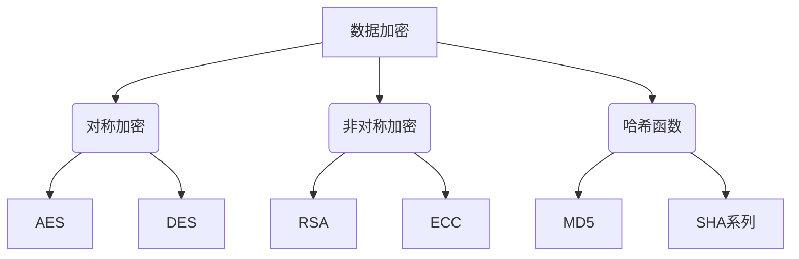
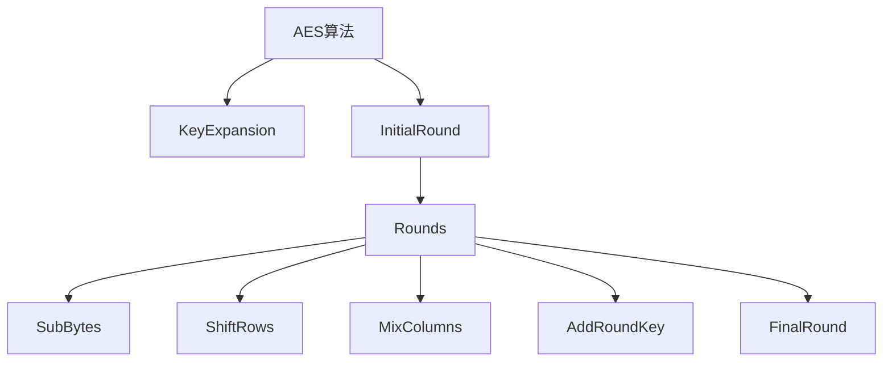
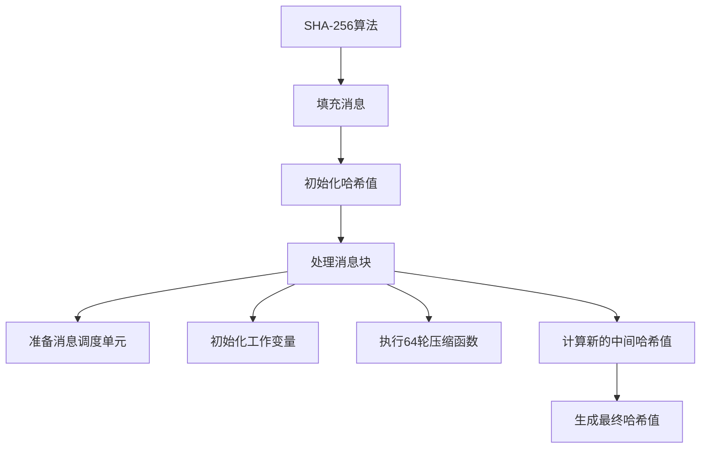

# AI系统数据加密原理与代码实战案例讲解

## 1.背景介绍

随着人工智能(AI)系统在各个领域的广泛应用,确保AI系统处理的数据安全性和隐私保护变得至关重要。数据加密是保护敏感信息免受未经授权访问的关键手段。本文将探讨AI系统中数据加密的原理、算法和实现方式,并提供实战案例供读者参考。

## 2.核心概念与联系

### 2.1 数据加密

数据加密是将明文(可读数据)转换为密文(无法直接阅读的数据)的过程,使其对未经授权的用户无法理解。解密则是将密文恢复为明文的反向过程。加密和解密过程通常使用密钥,这是一段特殊的数据,用于控制加密和解密算法。

### 2.2 对称加密与非对称加密

加密算法分为两大类:

- **对称加密**:加密和解密使用相同的密钥。优点是运算速度快,适合大量数据加密,缺点是密钥分发和管理较为困难。常见算法有AES、DES等。

- **非对称加密**:加密和解密使用不同的密钥(公钥和私钥)。公钥用于加密,私钥用于解密。优点是密钥管理相对简单,缺点是运算速度较慢。常见算法有RSA、ECC等。

### 2.3 哈希函数

哈希函数将任意长度的数据映射为固定长度的哈希值,具有单向性和抗冲突性。常用于数据完整性验证和数字签名。常见算法有MD5、SHA系列等。



## 3.核心算法原理具体操作步骤

### 3.1 AES算法

高级加密标准(AES)是一种对称加密算法,使用相同的密钥进行加密和解密。它的操作步骤如下:

1. **KeyExpansion(密钥扩展)**:根据输入的密钥生成一组round keys。
2. **InitialRound(初始轮)**:将明文数据与初始round key进行异或运算。
3. **Rounds(轮函数)**:重复执行以下4个步骤,轮数取决于密钥长度。
    - **SubBytes(字节代换)**:使用S-box对每个字节进行非线性代换。
    - **ShiftRows(行移位)**:对每一行进行循环移位。
    - **MixColumns(列混淆)**:对每一列进行线性变换。
    - **AddRoundKey(轮密钥加)**:将当前round key与数据进行异或运算。
4. **FinalRound(最终轮)**:执行SubBytes、ShiftRows和AddRoundKey步骤,生成密文输出。



### 3.2 RSA算法

RSA是一种广泛使用的非对称加密算法,基于大数的因数分解的困难性。其操作步骤如下:

1. **选择两个大质数p和q**。
2. **计算n=p*q**。
3. **计算欧拉函数φ(n)=(p-1)(q-1)**。
4. **选择一个与φ(n)互质的整数e,作为公钥指数**。
5. **计算d,使得(d*e)%φ(n)=1,d作为私钥指数**。
6. **公钥为(e,n),私钥为(d,n)**。
7. **加密**:将明文m转换为密文c,c=m^e mod n。
8. **解密**:将密文c转换为明文m,m=c^d mod n。

```mermaid
graph TD
    A[RSA算法] --> B[选择p和q]
    B --> C[计算n]
    C --> D[计算φ(n)]
    D --> E[选择e]
    E --> F[计算d]
    F --> G[生成公钥和私钥]
    G --> H[加密]
    G --> I[解密]
```

### 3.3 SHA-256哈希算法

SHA-256是一种广泛使用的加密哈希函数,可用于数据完整性验证和数字签名。其操作步骤如下:

1. **填充消息**:将消息填充至长度为64位的倍数。
2. **初始化哈希值**:使用预定义的常量初始化8个32位哈希值。
3. **处理消息块**:对每个512位消息块执行以下步骤:
    - 准备消息调度单元
    - 初始化工作变量
    - 执行64轮压缩函数
    - 计算新的中间哈希值
4. **生成最终哈希值**:将最后一个中间哈希值作为最终256位哈希值输出。



## 4.数学模型和公式详细讲解举例说明

### 4.1 AES中的有限域GF(2^8)

AES算法中的字节代换(SubBytes)操作使用了有限域GF(2^8)上的乘法逆元。有限域GF(2^8)是一个包含2^8=256个元素的数学结构,每个元素可表示为一个8位二进制多项式,其中最高次项的系数为1。

在GF(2^8)中,多项式的加法和减法运算等同于对应二进制位的异或运算。乘法运算则更为复杂,需要先将多项式相乘,然后对结果多项式进行模m(x)的余数运算,其中m(x)=x^8+x^4+x^3+x+1是一个不可约多项式。

例如,在GF(2^8)中,多项式a(x)=x^7+x^3+1和b(x)=x^6+x^5+x^4+x^2+1的乘法运算如下:

$$
\begin{aligned}
a(x) \times b(x) &= (x^7 + x^3 + 1)(x^6 + x^5 + x^4 + x^2 + 1) \\
                &= x^{13} + x^{12} + x^{11} + x^9 + x^8 + x^7 + x^5 + x^3 + x^2 + 1 \\
                &\equiv x^5 + x^3 + x + 1 \pmod{m(x)}
\end{aligned}
$$

其中$\pmod{m(x)}$表示对m(x)取模运算。

### 4.2 RSA算法中的模运算

RSA算法中的加密和解密过程都涉及到模运算,即对一个大数取其与另一个数的余数。模运算的快速计算是RSA算法效率的关键。

一种常用的快速模运算算法是蒙哥马利算法(Montgomery Algorithm),它可以避免在每次乘法运算后都进行一次开销较大的模运算。蒙哥马利算法的核心思想是将模n的运算转换为模R(R=2^k,k为合适的整数)的运算,从而简化计算过程。

假设要计算a*b mod n,其中a,b,n都是大整数。蒙哥马利算法的步骤如下:

1. 选择R=2^k,使得R>n。
2. 计算n'=-(n^-1) mod R,其中n^-1是n在模R下的乘法逆元。
3. 计算aR=a*R mod n和bR=b*R mod n。
4. 计算t=aR*bR*n' mod R。
5. 计算u=t*n+aR*bR mod R。
6. 如果u>=n,则a*b mod n=u-n;否则a*b mod n=u。

这种方法避免了在每次乘法运算后进行开销较大的模n运算,而是将所有运算转换为模R的运算,从而提高了效率。

## 5.项目实践:代码实例和详细解释说明

本节将提供一些Python代码示例,演示如何在实际项目中实现数据加密。

### 5.1 AES加密示例

以下代码使用PyCryptodome库实现AES加密:

```python
from Cryptodome.Cipher import AES

# 密钥和初始化向量
key = b'Sixteen byte key'
iv = b'Sixteen byte IV '

# 创建AES加密器对象
cipher = AES.new(key, AES.MODE_CBC, iv)

# 加密明文
plaintext = b'This is a secret message!'
ciphertext = cipher.encrypt(pad(plaintext, AES.block_size))

# 解密密文
decrypted = unpad(cipher.decrypt(ciphertext), AES.block_size)

print(f'Plaintext: {plaintext}')
print(f'Ciphertext: {ciphertext}')
print(f'Decrypted: {decrypted}')
```

在上面的示例中,我们首先创建一个AES加密器对象,指定密钥、初始化向量和加密模式(这里使用CBC模式)。然后使用该加密器对象加密明文数据,得到密文。解密过程则是使用相同的密钥和初始化向量,对密文进行解密操作。

需要注意的是,AES加密要求明文长度为128位的倍数,因此在加密前需要使用PKCS#7填充,在解密后需要移除填充。

### 5.2 RSA加密示例

以下代码使用Python的cryptography库实现RSA加密:

```python
from cryptography.hazmat.primitives.asymmetric import rsa
from cryptography.hazmat.primitives import hashes
from cryptography.hazmat.primitives.asymmetric import padding

# 生成RSA密钥对
private_key = rsa.generate_private_key(
    public_exponent=65537,
    key_size=2048
)
public_key = private_key.public_key()

# 加密明文
plaintext = b'This is a secret message!'
ciphertext = public_key.encrypt(
    plaintext,
    padding.OAEP(
        mgf=padding.MGF1(algorithm=hashes.SHA256()),
        algorithm=hashes.SHA256(),
        label=None
    )
)

# 解密密文
decrypted = private_key.decrypt(
    ciphertext,
    padding.OAEP(
        mgf=padding.MGF1(algorithm=hashes.SHA256()),
        algorithm=hashes.SHA256(),
        label=None
    )
)

print(f'Plaintext: {plaintext}')
print(f'Ciphertext: {ciphertext}')
print(f'Decrypted: {decrypted}')
```

在这个示例中,我们首先使用rsa.generate_private_key()函数生成一对RSA密钥。然后使用公钥对明文进行加密,使用OAEP(Optimal Asymmetric Encryption Padding)填充方案。解密则使用私钥和相同的填充方案对密文进行解密。

需要注意的是,RSA加密的明文长度有限制,通常不能超过密钥长度的一定比例。如果需要加密较长的数据,可以先使用对称加密算法(如AES)加密数据,然后使用RSA加密对称密钥。

### 5.3 SHA-256哈希示例

以下代码使用Python的hashlib库计算SHA-256哈希值:

```python
import hashlib

# 计算SHA-256哈希值
message = b'This is a message to be hashed.'
sha256_hash = hashlib.sha256(message).hexdigest()

print(f'Message: {message}')
print(f'SHA-256 hash: {sha256_hash}')
```

在这个示例中,我们使用hashlib.sha256()函数计算给定消息的SHA-256哈希值,并使用hexdigest()方法将二进制哈希值转换为十六进制字符串形式输出。

哈希函数常用于数据完整性验证和数字签名等场景。例如,可以先计算一个文件的哈希值,然后在传输或存储该文件时附加哈希值。接收方可以重新计算文件的哈希值,并与附加的哈希值进行比对,从而验证文件在传输或存储过程中是否被篡改。

## 6.实际应用场景

数据加密在AI系统中有广泛的应用场景,包括但不限于:

1. **隐私保护**:在处理包含个人隐私信息(如医疗记录、金融数据等)的数据时,加密是保护数据免受未经授权访问的关键手段。

2. **安全通信**: