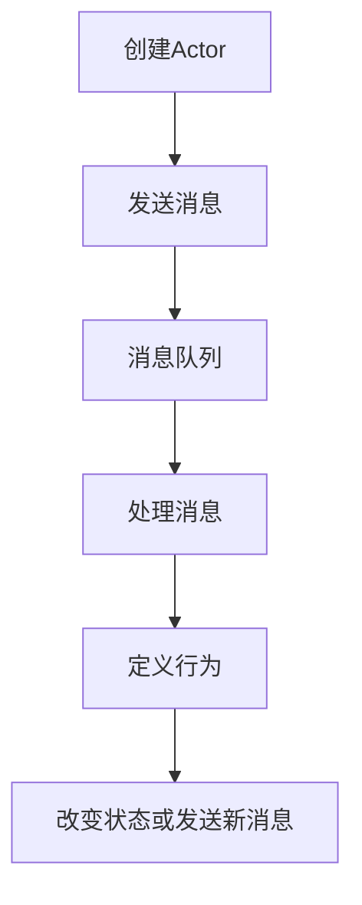

# Actor Model原理与代码实例讲解

## 1.背景介绍

在计算机科学领域，Actor Model（演员模型）是一种用于并发计算的数学模型。它由Carl Hewitt在1973年提出，并在并发编程中得到了广泛应用。随着多核处理器和分布式系统的普及，传统的线程和锁机制在处理并发任务时显得越来越复杂和低效。Actor Model通过将计算单元抽象为“演员”，并通过消息传递进行通信，提供了一种更为直观和高效的并发编程方式。

## 2.核心概念与联系

### 2.1 Actor（演员）

在Actor Model中，Actor是基本的计算单元。每个Actor都有自己的状态，并且能够执行以下三种操作：

1. **创建新的Actor**：一个Actor可以创建新的Actor。
2. **发送消息**：Actor之间通过消息传递进行通信。
3. **定义行为**：每个Actor都有一个行为，用于处理接收到的消息。

### 2.2 消息传递

消息传递是Actor Model的核心机制。Actor之间不共享状态，而是通过消息传递进行通信。这种方式避免了传统并发编程中的数据竞争和死锁问题。

### 2.3 非阻塞

Actor Model中的消息传递是非阻塞的。一个Actor在发送消息后，不需要等待接收方处理完消息，而是可以继续执行其他任务。

### 2.4 并发与隔离

每个Actor都有自己的独立状态，彼此之间不共享内存。这种隔离性使得并发编程变得更加安全和高效。

## 3.核心算法原理具体操作步骤

### 3.1 Actor的创建

Actor的创建是通过发送消息来实现的。一个Actor可以创建新的Actor，并将其加入到系统中。

### 3.2 消息传递机制

消息传递是通过消息队列实现的。每个Actor都有一个消息队列，用于存储接收到的消息。当一个Actor接收到消息时，它会将消息放入队列中，并在适当的时候处理这些消息。

### 3.3 行为定义

每个Actor都有一个行为，用于处理接收到的消息。行为可以是一个函数或方法，定义了Actor在接收到消息时的响应方式。

### 3.4 消息处理

消息处理是Actor Model的核心操作。当一个Actor接收到消息时，它会根据定义的行为来处理消息。处理完消息后，Actor可以选择改变自己的状态，或者发送新的消息。

以下是一个Mermaid流程图，展示了Actor Model的基本操作流程：



## 4.数学模型和公式详细讲解举例说明

Actor Model可以用数学模型来描述。假设有一个Actor $A$，它的状态为 $S$，接收到的消息为 $M$，行为为 $B$。则Actor $A$的状态转移可以表示为：

$$
S' = B(S, M)
$$

其中，$S'$ 是处理消息 $M$ 后的新的状态。

### 举例说明

假设有一个计数器Actor，它的状态是一个整数，初始值为0。它可以接收两种消息：`increment` 和 `decrement`。计数器Actor的行为可以定义为：

$$
B(S, M) = 
\begin{cases} 
S + 1 & \text{if } M = \text{increment} \\
S - 1 & \text{if } M = \text{decrement}
\end{cases}
$$

如果计数器Actor接收到一条 `increment` 消息，它的状态将从 $S$ 变为 $S + 1$。如果接收到一条 `decrement` 消息，它的状态将从 $S$ 变为 $S - 1$。

## 5.项目实践：代码实例和详细解释说明

### 5.1 使用Akka实现Actor Model

Akka是一个流行的Actor Model框架，基于Scala和Java。下面是一个使用Akka实现计数器Actor的示例代码。

#### 5.1.1 依赖配置

首先，在项目的`build.sbt`文件中添加Akka的依赖：

```sbt
libraryDependencies += "com.typesafe.akka" %% "akka-actor" % "2.6.14"
```

#### 5.1.2 定义消息

定义计数器Actor接收的消息类型：

```scala
sealed trait CounterMessage
case object Increment extends CounterMessage
case object Decrement extends CounterMessage
```

#### 5.1.3 定义计数器Actor

定义计数器Actor的行为：

```scala
import akka.actor.{Actor, Props}

class CounterActor extends Actor {
  var count = 0

  def receive: Receive = {
    case Increment =>
      count += 1
      println(s"Count incremented to $count")
    case Decrement =>
      count -= 1
      println(s"Count decremented to $count")
  }
}

object CounterActor {
  def props: Props = Props[CounterActor]
}
```

#### 5.1.4 创建Actor系统并发送消息

在主程序中创建Actor系统，并向计数器Actor发送消息：

```scala
import akka.actor.ActorSystem

object Main extends App {
  val system = ActorSystem("CounterSystem")
  val counterActor = system.actorOf(CounterActor.props, "counterActor")

  counterActor ! Increment
  counterActor ! Increment
  counterActor ! Decrement

  system.terminate()
}
```

### 5.2 详细解释

1. **依赖配置**：在项目的`build.sbt`文件中添加Akka的依赖。
2. **定义消息**：使用Scala的`sealed trait`和`case object`定义计数器Actor接收的消息类型。
3. **定义计数器Actor**：继承`Actor`类，并实现`receive`方法，定义计数器Actor的行为。
4. **创建Actor系统并发送消息**：在主程序中创建Actor系统，并向计数器Actor发送消息。

## 6.实际应用场景

### 6.1 分布式系统

Actor Model在分布式系统中得到了广泛应用。由于Actor之间通过消息传递进行通信，并且不共享状态，这使得Actor Model非常适合在分布式环境中实现高并发和高可用性。

### 6.2 并发编程

在多核处理器的时代，并发编程变得越来越重要。Actor Model提供了一种简单而高效的并发编程方式，避免了传统并发编程中的数据竞争和死锁问题。

### 6.3 游戏开发

在游戏开发中，Actor Model也得到了广泛应用。游戏中的每个角色或对象可以被建模为一个Actor，通过消息传递进行交互。这种方式使得游戏逻辑更加清晰和易于维护。

## 7.工具和资源推荐

### 7.1 Akka

Akka是一个流行的Actor Model框架，基于Scala和Java。它提供了丰富的功能和工具，帮助开发者实现高并发和分布式系统。

### 7.2 Erlang/OTP

Erlang是一种函数式编程语言，OTP是其标准库。Erlang/OTP提供了强大的Actor Model支持，广泛应用于电信和实时系统中。

### 7.3 Microsoft Orleans

Microsoft Orleans是一个基于Actor Model的分布式应用框架，主要用于构建云计算和大规模分布式系统。

## 8.总结：未来发展趋势与挑战

### 8.1 未来发展趋势

随着多核处理器和分布式系统的普及，Actor Model在并发编程中的应用将会越来越广泛。未来，Actor Model可能会在以下几个方面得到进一步发展：

1. **性能优化**：通过改进消息传递机制和调度算法，提高Actor Model的性能。
2. **工具和框架**：开发更多的工具和框架，简化Actor Model的开发和调试过程。
3. **跨语言支持**：提供跨语言的Actor Model实现，支持更多的编程语言。

### 8.2 挑战

尽管Actor Model在并发编程中具有许多优势，但也面临一些挑战：

1. **调试和监控**：由于Actor之间通过消息传递进行通信，调试和监控变得更加复杂。
2. **性能瓶颈**：在高并发场景下，消息传递和调度可能成为性能瓶颈。
3. **学习曲线**：对于传统编程模型的开发者来说，Actor Model可能需要一定的学习成本。

## 9.附录：常见问题与解答

### 9.1 什么是Actor Model？

Actor Model是一种用于并发计算的数学模型，通过将计算单元抽象为“演员”，并通过消息传递进行通信。

### 9.2 Actor Model的优势是什么？

Actor Model的优势包括：避免数据竞争和死锁问题、提供高并发和高可用性、简化并发编程。

### 9.3 Actor Model的应用场景有哪些？

Actor Model广泛应用于分布式系统、并发编程和游戏开发等领域。

### 9.4 如何使用Akka实现Actor Model？

可以通过添加Akka依赖、定义消息类型、定义Actor行为、创建Actor系统并发送消息来实现Actor Model。

### 9.5 Actor Model的未来发展趋势是什么？

未来，Actor Model可能会在性能优化、工具和框架开发、跨语言支持等方面得到进一步发展。

---

作者：禅与计算机程序设计艺术 / Zen and the Art of Computer Programming