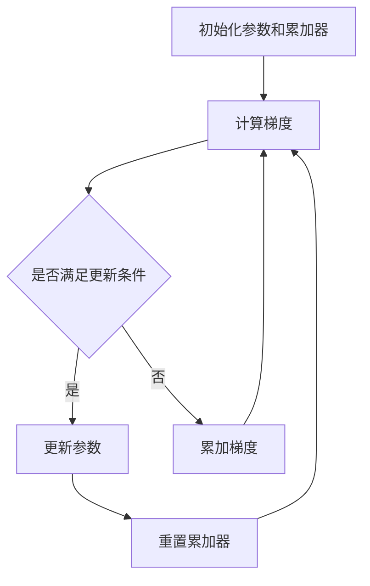

# AdaGrad优化器与Accumulator优化器的区别与选择

## 1.背景介绍

在机器学习和深度学习领域，优化器是训练模型的关键组件。优化器的选择直接影响模型的收敛速度和最终性能。AdaGrad和Accumulator是两种常见的优化器，它们各自有独特的特点和适用场景。本文将深入探讨这两种优化器的核心概念、算法原理、数学模型、实际应用以及未来发展趋势，帮助读者在实际项目中做出更明智的选择。

## 2.核心概念与联系

### 2.1 AdaGrad优化器

AdaGrad（Adaptive Gradient Algorithm）是一种自适应学习率优化算法。它通过对每个参数的历史梯度平方和进行累加，从而调整每个参数的学习率。其核心思想是对频繁更新的参数进行较小的更新，对不常更新的参数进行较大的更新。

### 2.2 Accumulator优化器

Accumulator优化器是一种基于累加器的优化算法。它通过累加梯度信息来调整参数更新的步伐。与AdaGrad不同，Accumulator优化器通常会在一定的迭代次数后进行参数更新，以减少计算开销和提高训练效率。

### 2.3 联系与区别

两者的主要联系在于它们都使用了累加器的概念来调整参数更新。然而，AdaGrad是基于每个参数的历史梯度平方和进行调整，而Accumulator优化器则是基于梯度的累加进行调整。AdaGrad适用于稀疏数据集，而Accumulator优化器更适用于大规模数据集和分布式训练。

## 3.核心算法原理具体操作步骤

### 3.1 AdaGrad算法原理

1. 初始化参数 $\theta$ 和累加器 $G = 0$。
2. 对于每个迭代步骤 $t$：
   1. 计算梯度 $g_t$。
   2. 更新累加器 $G = G + g_t^2$。
   3. 更新参数 $\theta = \theta - \frac{\eta}{\sqrt{G + \epsilon}} \cdot g_t$。

### 3.2 Accumulator算法原理

1. 初始化参数 $\theta$ 和累加器 $A = 0$。
2. 对于每个迭代步骤 $t$：
   1. 计算梯度 $g_t$。
   2. 累加梯度 $A = A + g_t$。
   3. 如果满足更新条件（如达到一定的迭代次数）：
      1. 更新参数 $\theta = \theta - \eta \cdot A$。
      2. 重置累加器 $A = 0$。

### 3.3 Mermaid流程图



## 4.数学模型和公式详细讲解举例说明

### 4.1 AdaGrad数学模型

AdaGrad的更新公式为：

$$
\theta_{t+1} = \theta_t - \frac{\eta}{\sqrt{G_t + \epsilon}} \cdot g_t
$$

其中，$G_t$ 是梯度的累加平方和：

$$
G_t = \sum_{i=1}^t g_i^2
$$

### 4.2 Accumulator数学模型

Accumulator的更新公式为：

$$
\theta_{t+1} = \theta_t - \eta \cdot A_t
$$

其中，$A_t$ 是梯度的累加和：

$$
A_t = \sum_{i=1}^t g_i
$$

### 4.3 举例说明

假设我们有一个简单的线性回归问题，目标是最小化损失函数 $L(\theta) = \frac{1}{2} (\theta x - y)^2$。对于AdaGrad和Accumulator优化器，我们分别计算梯度并更新参数。

#### AdaGrad示例

1. 初始化 $\theta = 0$，$G = 0$。
2. 计算梯度 $g = (\theta x - y) x$。
3. 更新累加器 $G = G + g^2$。
4. 更新参数 $\theta = \theta - \frac{\eta}{\sqrt{G + \epsilon}} \cdot g$。

#### Accumulator示例

1. 初始化 $\theta = 0$，$A = 0$。
2. 计算梯度 $g = (\theta x - y) x$。
3. 累加梯度 $A = A + g$。
4. 如果满足更新条件，更新参数 $\theta = \theta - \eta \cdot A$，并重置累加器 $A = 0$。

## 5.项目实践：代码实例和详细解释说明

### 5.1 AdaGrad代码实例

```python
import numpy as np

def adagrad_optimizer(gradient_func, initial_theta, learning_rate=0.01, epsilon=1e-8, num_iterations=1000):
    theta = initial_theta
    G = np.zeros_like(theta)
    
    for t in range(1, num_iterations + 1):
        gradient = gradient_func(theta)
        G += gradient ** 2
        adjusted_gradient = gradient / (np.sqrt(G) + epsilon)
        theta -= learning_rate * adjusted_gradient
        
    return theta

# 示例梯度函数
def gradient_func(theta):
    return 2 * theta

# 初始化参数
initial_theta = np.array([1.0, 1.0])
optimized_theta = adagrad_optimizer(gradient_func, initial_theta)
print("Optimized Theta:", optimized_theta)
```

### 5.2 Accumulator代码实例

```python
import numpy as np

def accumulator_optimizer(gradient_func, initial_theta, learning_rate=0.01, update_interval=10, num_iterations=1000):
    theta = initial_theta
    A = np.zeros_like(theta)
    
    for t in range(1, num_iterations + 1):
        gradient = gradient_func(theta)
        A += gradient
        
        if t % update_interval == 0:
            theta -= learning_rate * A
            A = np.zeros_like(theta)
            
    return theta

# 示例梯度函数
def gradient_func(theta):
    return 2 * theta

# 初始化参数
initial_theta = np.array([1.0, 1.0])
optimized_theta = accumulator_optimizer(gradient_func, initial_theta)
print("Optimized Theta:", optimized_theta)
```

### 5.3 详细解释说明

在上述代码实例中，我们分别实现了AdaGrad和Accumulator优化器。AdaGrad通过累加梯度的平方和来调整每个参数的学习率，而Accumulator则通过累加梯度并在一定的迭代次数后进行参数更新。两者的核心区别在于累加器的使用方式和参数更新的频率。

## 6.实际应用场景

### 6.1 AdaGrad的应用场景

AdaGrad适用于稀疏数据集和高维数据集，特别是在自然语言处理和推荐系统中表现出色。由于其自适应学习率的特性，AdaGrad能够有效处理频繁和不频繁更新的参数。

### 6.2 Accumulator的应用场景

Accumulator优化器适用于大规模数据集和分布式训练。通过减少参数更新的频率，Accumulator优化器能够显著降低计算开销，提高训练效率。在图像分类和大规模推荐系统中，Accumulator优化器表现出色。

## 7.工具和资源推荐

### 7.1 工具推荐

- **TensorFlow**：一个开源的机器学习框架，支持多种优化器，包括AdaGrad和Accumulator。
- **PyTorch**：另一个流行的深度学习框架，提供了丰富的优化器选择。
- **Keras**：一个高级神经网络API，能够与TensorFlow和Theano集成，支持多种优化器。

### 7.2 资源推荐

- **《深度学习》**：由Ian Goodfellow等人编写的经典教材，详细介绍了各种优化算法。
- **Coursera和Udacity的深度学习课程**：提供了丰富的在线学习资源，涵盖了优化器的理论和实践。
- **arXiv**：一个开放获取的学术论文预印本平台，包含了大量关于优化算法的最新研究。

## 8.总结：未来发展趋势与挑战

### 8.1 未来发展趋势

随着深度学习的不断发展，优化器的研究也在不断进步。未来，优化器将更加智能化和自适应，能够根据不同的任务和数据集自动调整参数。此外，分布式优化和大规模并行计算将成为优化器研究的重要方向。

### 8.2 挑战

尽管优化器在深度学习中发挥了重要作用，但仍然面临一些挑战。例如，如何在不增加计算开销的情况下提高收敛速度和模型性能，如何处理大规模数据集和高维数据等问题，仍然需要进一步研究和探索。

## 9.附录：常见问题与解答

### 9.1 AdaGrad和Accumulator优化器的主要区别是什么？

AdaGrad通过累加梯度的平方和来调整每个参数的学习率，而Accumulator优化器则通过累加梯度并在一定的迭代次数后进行参数更新。

### 9.2 什么时候应该选择AdaGrad优化器？

AdaGrad适用于稀疏数据集和高维数据集，特别是在自然语言处理和推荐系统中表现出色。

### 9.3 什么时候应该选择Accumulator优化器？

Accumulator优化器适用于大规模数据集和分布式训练，通过减少参数更新的频率来降低计算开销和提高训练效率。

### 9.4 AdaGrad和Accumulator优化器是否可以结合使用？

理论上可以结合使用，但需要根据具体的任务和数据集进行调整和实验，以确定最佳的组合方式。

### 9.5 如何调试和优化AdaGrad和Accumulator优化器的参数？

可以通过交叉验证和网格搜索等方法来调试和优化优化器的参数。此外，结合实际应用场景和数据集的特点，进行多次实验和调整也是必要的。

---

作者：禅与计算机程序设计艺术 / Zen and the Art of Computer Programming