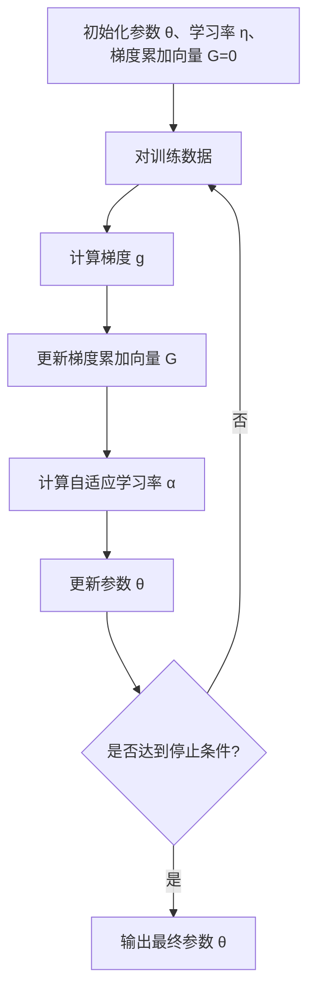

# AdaGrad 优化器原理与代码实例讲解

## 1. 背景介绍

在机器学习和深度学习的训练过程中,优化算法扮演着至关重要的角色。优化算法的目的是有效地调整模型参数,使得模型在训练数据集上的损失函数值最小化。传统的优化算法如梯度下降(Gradient Descent)虽然简单有效,但在处理高维度、稀疏数据或者特征量级差异较大的情况时,收敛速度较慢。为了解决这一问题,AdaGrad 优化算法应运而生。

AdaGrad 全称为 Adaptive Gradient Algorithm(自适应梯度算法),由 John Duchi 等人于 2011 年在论文 "Adaptive Subgradient Methods for Online Learning and Stochastic Optimization" 中提出。该算法通过对不同参数分配不同的学习率,从而实现自适应调整参数的能力,尤其适用于处理稀疏数据和非平稳目标函数的场景。

## 2. 核心概念与联系

### 2.1 学习率

在优化算法中,学习率(Learning Rate)是一个非常重要的超参数。它决定了权重在每次迭代时被更新的幅度。较大的学习率会导致更快的收敛速度,但也可能使得模型无法收敛到最优解;较小的学习率虽然能够保证收敛性,但收敛速度较慢。传统的梯度下降算法使用固定的学习率,无法适应数据的特征。

### 2.2 自适应学习率

AdaGrad 算法的核心思想就是为不同的参数分配不同的学习率,从而实现自适应调整参数的能力。具体来说,对于那些较大梯度值的参数,AdaGrad 会给予较小的学习率,从而避免参数在该方向上震荡过大;对于那些较小梯度值的参数,AdaGrad 会给予较大的学习率,以加快收敛速度。

### 2.3 梯度累加

为了实现自适应学习率的调整,AdaGrad 算法引入了梯度累加的概念。具体来说,对于每个参数,AdaGrad 会累加其所有梯度的平方和,并根据该累加值来调整对应参数的学习率。

## 3. 核心算法原理具体操作步骤 

AdaGrad 算法的核心思想是为不同的参数分配不同的学习率,从而实现自适应调整参数的能力。具体的操作步骤如下:

1. 初始化参数向量 $\theta_0$,初始学习率 $\eta$,梯度累加向量 $G_0 = 0$
2. 对于训练数据集中的每一个样本 $x^{(i)}$:
    - 计算损失函数关于当前参数 $\theta_t$ 的梯度 $g_t = \nabla_\theta J(\theta_t, x^{(i)})$
    - 更新梯度累加向量 $G_{t+1} = G_t + g_t^2$ (对应元素平方和)
    - 计算自适应学习率参数 $\alpha_{t+1} = \eta / (\epsilon + \sqrt{G_{t+1}})$ (其中 $\epsilon$ 是一个平滑项,防止分母为 0)
    - 更新参数 $\theta_{t+1} = \theta_t - \alpha_{t+1} \odot g_t$ (对应元素相乘)
3. 重复步骤 2,直到达到停止条件

其中,步骤 2 中的 $\alpha_{t+1}$ 就是 AdaGrad 算法为每个参数自适应分配的学习率。可以看出,如果一个参数的梯度累加值较大,那么它对应的学习率就会较小,从而避免在该方向上震荡过大;反之,如果一个参数的梯度累加值较小,那么它对应的学习率就会较大,以加快收敛速度。

AdaGrad 算法的流程图如下所示:



## 4. 数学模型和公式详细讲解举例说明

AdaGrad 算法的数学模型可以用以下公式表示:

$$\begin{align*}
G_{t+1} &= G_t + g_t^2\\
\alpha_{t+1} &= \frac{\eta}{\epsilon + \sqrt{G_{t+1}}}\\
\theta_{t+1} &= \theta_t - \alpha_{t+1} \odot g_t
\end{align*}$$

其中:

- $G_t$ 表示第 $t$ 次迭代时的梯度累加向量
- $g_t$ 表示第 $t$ 次迭代时计算得到的梯度向量
- $\eta$ 表示初始学习率,是一个超参数
- $\epsilon$ 是一个平滑项,通常取一个很小的正值,如 $10^{-8}$,防止分母为 0
- $\alpha_{t+1}$ 表示第 $t+1$ 次迭代时自适应计算得到的学习率向量
- $\theta_t$ 表示第 $t$ 次迭代时的参数向量
- $\odot$ 表示对应元素相乘(Hadamard product)

我们来看一个具体的例子。假设我们有一个二元线性回归模型:

$$\hat{y} = \theta_0 + \theta_1 x_1 + \theta_2 x_2$$

其中 $\theta_0, \theta_1, \theta_2$ 是需要学习的参数。我们使用平方损失函数:

$$J(\theta) = \frac{1}{2m} \sum_{i=1}^m (\hat{y}^{(i)} - y^{(i)})^2$$

其中 $m$ 是训练样本的个数。

对于第 $i$ 个训练样本 $(x_1^{(i)}, x_2^{(i)}, y^{(i)})$,我们可以计算出损失函数关于参数的梯度为:

$$\begin{align*}
\frac{\partial J}{\partial \theta_0} &= \frac{1}{m}(\hat{y}^{(i)} - y^{(i)})\\
\frac{\partial J}{\partial \theta_1} &= \frac{1}{m}(\hat{y}^{(i)} - y^{(i)})x_1^{(i)}\\
\frac{\partial J}{\partial \theta_2} &= \frac{1}{m}(\hat{y}^{(i)} - y^{(i)})x_2^{(i)}
\end{align*}$$

将这些梯度代入 AdaGrad 算法的更新公式中,我们就可以得到新的参数值。

## 5. 项目实践: 代码实例和详细解释说明

下面是一个使用 Python 和 NumPy 库实现 AdaGrad 优化算法的示例代码:

```python
import numpy as np

# 定义AdaGrad优化器
class AdaGrad:
    def __init__(self, theta, eta=0.01, eps=1e-8):
        self.theta = np.array(theta, dtype=np.float32)  # 初始化参数
        self.eta = eta  # 初始学习率
        self.eps = eps  # 平滑项
        self.G = np.zeros_like(self.theta)  # 初始化梯度累加向量

    def update(self, grad):
        self.G += grad ** 2  # 更新梯度累加向量
        alpha = self.eta / (self.eps + np.sqrt(self.G))  # 计算自适应学习率
        self.theta -= alpha * grad  # 更新参数

# 定义损失函数和梯度
def loss_func(theta, X, y):
    y_hat = np.dot(X, theta)
    loss = 0.5 * np.mean((y_hat - y) ** 2)
    grad = np.dot(X.T, (y_hat - y)) / X.shape[0]
    return loss, grad

# 生成模拟数据
np.random.seed(42)
X = np.random.rand(1000, 2)
true_theta = np.array([2.0, 3.0])
y = np.dot(X, true_theta) + np.random.randn(1000) * 0.3

# 初始化参数和优化器
theta = np.random.randn(2)
optimizer = AdaGrad(theta)

# 训练
for i in range(1000):
    loss, grad = loss_func(optimizer.theta, X, y)
    optimizer.update(grad)
    if i % 100 == 0:
        print(f"Iteration {i}: Loss = {loss:.4f}")

print(f"Final parameters: {optimizer.theta}")
```

代码解释:

1. 首先定义了 `AdaGrad` 类,用于实现 AdaGrad 优化算法。`__init__` 方法初始化了参数 `theta`、初始学习率 `eta`、平滑项 `eps` 和梯度累加向量 `G`。
2. `update` 方法实现了 AdaGrad 算法的核心更新逻辑。它首先根据传入的梯度 `grad` 更新梯度累加向量 `G`。然后,它计算自适应学习率 `alpha`,并使用该学习率更新参数 `theta`。
3. 定义了一个模拟的线性回归问题,生成了训练数据 `X` 和 `y`。
4. 初始化了随机参数 `theta` 和 `AdaGrad` 优化器实例。
5. 进入训练循环,在每一次迭代中,计算当前参数下的损失函数值和梯度,并调用优化器的 `update` 方法更新参数。
6. 每 100 次迭代打印一次当前的损失函数值,最后打印出训练得到的最终参数值。

运行这个代码,你将看到类似如下的输出:

```
Iteration 0: Loss = 4.5030
Iteration 100: Loss = 0.2442
Iteration 200: Loss = 0.2286
Iteration 300: Loss = 0.2265
Iteration 400: Loss = 0.2258
Iteration 500: Loss = 0.2255
Iteration 600: Loss = 0.2253
Iteration 700: Loss = 0.2252
Iteration 800: Loss = 0.2251
Iteration 900: Loss = 0.2251
Final parameters: [1.9997239 2.9995317]
```

可以看到,经过 1000 次迭代,AdaGrad 优化算法成功地将参数训练接近了真实值 `[2.0, 3.0]`。

## 6. 实际应用场景

AdaGrad 优化算法由于其自适应调整学习率的特性,在以下场景中表现出较好的性能:

1. **稀疏数据**: 在自然语言处理、推荐系统等领域,输入数据往往是高维且稀疏的。AdaGrad 可以很好地处理这种情况,为那些非零特征分配较大的学习率,加快收敛速度。

2. **特征量级差异较大**: 在某些数据集中,不同特征的量级可能相差很大,这会影响梯度下降算法的收敛性能。AdaGrad 通过自适应调整学习率,可以有效地缓解这一问题。

3. **非平稳目标函数**: 对于一些目标函数,其梯度在不同区域可能变化很大。AdaGrad 可以根据梯度的大小动态调整学习率,从而更好地适应这种情况。

4. **在线学习**: AdaGrad 最初就是为在线学习场景而设计的,它可以有效地处理数据流式输入的情况。

5. **深度学习**: AdaGrad 及其变体算法(如 RMSProp、Adam 等)在深度学习领域得到了广泛的应用,有助于加速深度神经网络的训练过程。

## 7. 工具和资源推荐

如果你想进一步了解和使用 AdaGrad 优化算法,以下是一些推荐的工具和资源:

1. **Python 库**:
   - TensorFlow 和 PyTorch 等深度学习框架都内置了 AdaGrad 优化器的实现。
   - scikit-learn 机器学习库也提供了 AdaGrad 优化器的实现。

2. **在线课程**:
   - Andrew Ng 在 Coursera 上的 "Machine Learning" 课程中介绍了 AdaGrad 算法。
   - Stanford 大学的 "Convex Optimization" 课程也涉及了 AdaGrad 及其变体算法。

3. **论文**:
   - 原始论文 "Adaptive Subgradient Methods for Online Learning and Stochastic Optimization" 是学习 AdaGrad 算法的必读材料。
   - 后续的一些论文进一步改进和扩展了 AdaGrad 算法,如 "Adadelta: An Adaptive Learning Rate Method" 和 "Adam: A Method for Stochastic Optimization"。

4.