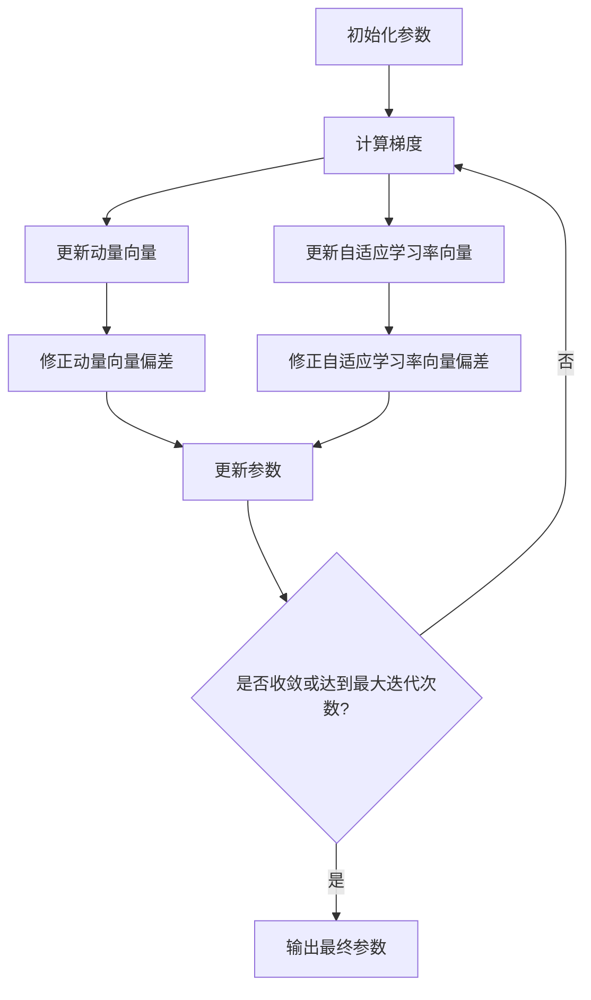

# Adam Optimization原理与代码实例讲解

## 1.背景介绍

在深度学习和机器学习领域,优化算法扮演着至关重要的角色。它们用于调整模型的参数,以最小化损失函数并提高模型的性能。传统的优化算法如随机梯度下降(SGD)虽然简单有效,但在处理高维度数据或者存在梯度稀疏时,收敛速度较慢。为了解决这一问题,Adam优化算法应运而生。

Adam是一种自适应学习率的优化算法,它通过计算梯度的指数加权平均值来自动调整每个参数的学习率。这种方法可以加快收敛速度,提高模型的训练效率。Adam算法在2015年由Google Brain团队提出,迅速获得了广泛的应用和关注。

## 2.核心概念与联系

### 2.1 动量(Momentum)概念

动量是一种加速SGD的技术,它通过引入先前梯度的指数加权平均值来加快收敛。动量可以帮助优化算法跳出局部最小值,并加快收敛到全局最优解。

### 2.2 RMSProp算法

RMSProp是一种自适应学习率算法,它通过计算梯度平方的指数加权平均值来缩放每个参数的学习率。这种方法可以自动调整学习率,加快收敛速度。

### 2.3 Adam算法

Adam算法结合了动量和RMSProp两种技术的优点。它同时计算梯度和梯度平方的指数加权平均值,并基于这两个估计值来自适应地调整每个参数的学习率。

Adam算法的核心思想是:

1. 计算梯度的指数加权平均值(动量项)
2. 计算梯度平方的指数加权平均值(自适应学习率项)
3. 利用这两个估计值来更新参数

## 3.核心算法原理具体操作步骤

Adam算法的具体操作步骤如下:

1. 初始化参数 $\theta$, 动量向量 $m_0=0$, 自适应学习率向量 $v_0=0$, 超参数 $\beta_1, \beta_2 \in [0, 1)$, 学习率 $\alpha$, 极小常数 $\epsilon$。

2. 在训练的第 $t$ 次迭代中:
   - 计算梯度 $g_t = \nabla_\theta J(\theta_t)$
   - 更新动量向量 $m_t = \beta_1 m_{t-1} + (1 - \beta_1)g_t$
   - 更新自适应学习率向量 $v_t = \beta_2 v_{t-1} + (1 - \beta_2)g_t^2$
   - 修正动量向量和自适应学习率向量的偏差:
     $\hat{m}_t = \frac{m_t}{1 - \beta_1^t}$
     $\hat{v}_t = \frac{v_t}{1 - \beta_2^t}$
   - 更新参数:
     $\theta_{t+1} = \theta_t - \alpha \frac{\hat{m}_t}{\sqrt{\hat{v}_t} + \epsilon}$

3. 重复步骤2,直到收敛或达到最大迭代次数。

其中, $\beta_1$和$\beta_2$控制动量和自适应学习率项的衰减率, $\epsilon$是一个极小的常数,用于避免除以零的情况。

Adam算法的流程图如下:



## 4.数学模型和公式详细讲解举例说明

Adam算法的数学模型可以表示为:

$$
\begin{aligned}
m_t &= \beta_1 m_{t-1} + (1 - \beta_1)g_t \\
v_t &= \beta_2 v_{t-1} + (1 - \beta_2)g_t^2 \\
\hat{m}_t &= \frac{m_t}{1 - \beta_1^t} \\
\hat{v}_t &= \frac{v_t}{1 - \beta_2^t} \\
\theta_{t+1} &= \theta_t - \alpha \frac{\hat{m}_t}{\sqrt{\hat{v}_t} + \epsilon}
\end{aligned}
$$

其中:

- $m_t$是梯度的指数加权平均值(动量项)
- $v_t$是梯度平方的指数加权平均值(自适应学习率项)
- $\hat{m}_t$和$\hat{v}_t$分别是修正了偏差的动量项和自适应学习率项
- $\alpha$是学习率
- $\beta_1$和$\beta_2$控制动量和自适应学习率项的衰减率
- $\epsilon$是一个极小的常数,用于避免除以零的情况

让我们通过一个简单的例子来说明Adam算法的工作原理。假设我们有一个单变量函数 $f(x) = x^4$,目标是找到它的最小值。我们初始化 $x_0 = 10$,学习率 $\alpha = 0.1$,$\beta_1 = 0.9$,$\beta_2 = 0.999$,$\epsilon = 10^{-8}$。

在第一次迭代中:

$$
\begin{aligned}
g_1 &= \nabla_x f(x_0) = 4x_0^3 = 4 \times 10^3 = 4000 \\
m_1 &= 0.9 \times 0 + 0.1 \times 4000 = 400 \\
v_1 &= 0.999 \times 0 + 0.001 \times 4000^2 = 16000000 \\
\hat{m}_1 &= \frac{400}{1 - 0.9} = 4000 \\
\hat{v}_1 &= \frac{16000000}{1 - 0.999} = 1.6 \times 10^9 \\
x_1 &= x_0 - \alpha \frac{\hat{m}_1}{\sqrt{\hat{v}_1} + \epsilon} = 10 - 0.1 \frac{4000}{\sqrt{1.6 \times 10^9} + 10^{-8}} = 6
\end{aligned}
$$

在后续的迭代中,我们将继续更新 $m_t$,$v_t$,$\hat{m}_t$,$\hat{v}_t$和$x_t$,直到收敛或达到最大迭代次数。

通过这个例子,我们可以看到Adam算法如何利用动量项和自适应学习率项来加速收敛。动量项有助于加快收敛速度,而自适应学习率项则可以根据梯度的大小自动调整每个参数的学习率。

## 5.项目实践:代码实例和详细解释说明

以下是使用PyTorch实现Adam优化算法的代码示例:

```python
import torch
import torch.nn as nn
import torch.optim as optim

# 定义模型
class Model(nn.Module):
    def __init__(self):
        super(Model, self).__init__()
        self.fc1 = nn.Linear(10, 5)
        self.fc2 = nn.Linear(5, 1)

    def forward(self, x):
        x = torch.relu(self.fc1(x))
        x = self.fc2(x)
        return x

# 初始化模型和优化器
model = Model()
criterion = nn.MSELoss()
optimizer = optim.Adam(model.parameters(), lr=0.01, betas=(0.9, 0.999), eps=1e-08)

# 训练循环
for epoch in range(100):
    inputs = torch.randn(64, 10)  # 随机输入
    targets = torch.randn(64, 1)  # 随机目标

    optimizer.zero_grad()  # 梯度清零
    outputs = model(inputs)  # 前向传播
    loss = criterion(outputs, targets)  # 计算损失
    loss.backward()  # 反向传播
    optimizer.step()  # 更新参数

    if (epoch + 1) % 10 == 0:
        print(f'Epoch [{epoch+1}/100], Loss: {loss.item():.4f}')
```

代码解释:

1. 首先,我们定义了一个简单的全连接神经网络模型。
2. 然后,我们初始化模型、损失函数和Adam优化器。在优化器的初始化中,我们设置了学习率`lr=0.01`、动量参数`betas=(0.9, 0.999)`和一个极小的常数`eps=1e-08`。
3. 在训练循环中,我们首先生成随机的输入和目标数据。
4. 在每次迭代开始时,我们调用`optimizer.zero_grad()`来清除上一次迭代的梯度。
5. 然后,我们进行前向传播计算模型输出,并使用损失函数计算损失。
6. 接下来,我们调用`loss.backward()`进行反向传播,计算梯度。
7. 最后,我们调用`optimizer.step()`来更新模型参数,这一步会应用Adam算法的更新规则。
8. 每10个epoch,我们打印当前的epoch和损失值。

通过这个示例,我们可以看到如何在PyTorch中使用Adam优化器来训练神经网络模型。Adam优化器的优势在于它可以自动调整每个参数的学习率,加快收敛速度,并且对于高维度数据和稀疏梯度也有很好的表现。

## 6.实际应用场景

Adam优化算法在深度学习和机器学习领域有着广泛的应用,包括但不限于:

1. **计算机视觉**:在图像分类、目标检测、语义分割等任务中,Adam优化算法被广泛应用于训练卷积神经网络(CNN)模型。
2. **自然语言处理**:在机器翻译、文本生成、情感分析等任务中,Adam优化算法被用于训练递归神经网络(RNN)、长短期记忆网络(LSTM)和Transformer等模型。
3. **强化学习**:在游戏AI、机器人控制等强化学习任务中,Adam优化算法被用于训练策略网络和值函数网络。
4. **生成对抗网络(GAN)**:在图像生成、风格迁移等任务中,Adam优化算法被用于训练生成器和判别器网络。
5. **推荐系统**:在协同过滤、内容推荐等任务中,Adam优化算法被用于训练矩阵分解模型和深度神经网络模型。

Adam优化算法的优势在于它可以自动调整每个参数的学习率,加快收敛速度,并且对于高维度数据和稀疏梯度也有很好的表现。因此,它在各种深度学习和机器学习任务中都有广泛的应用。

## 7.工具和资源推荐

如果您想进一步了解和使用Adam优化算法,以下是一些推荐的工具和资源:

1. **PyTorch**:PyTorch是一个流行的深度学习框架,内置了Adam优化器的实现。您可以在PyTorch中轻松使用Adam优化器来训练您的模型。
2. **TensorFlow**:TensorFlow也是一个广泛使用的深度学习框架,同样提供了Adam优化器的实现。
3. **Keras**:Keras是一个高级的神经网络API,可以在TensorFlow或Theano之上运行。它也内置了Adam优化器的实现。
4. **Adam论文**:Adam优化算法最初是在2015年的一篇论文中提出的,论文名为"Adam: A Method for Stochastic Optimization"。阅读这篇论文可以帮助您更深入地理解Adam算法的原理和细节。
5. **在线课程**:像Coursera、edX和Udacity等平台上有许多关于深度学习和优化算法的在线课程,其中包括Adam优化算法的介绍和应用。
6. **开源项目**:GitHub上有许多开源的深度学习项目,其中一些使用了Adam优化算法。您可以查看这些项目的代码,了解Adam优化算法在实际应用中的使用方式。

通过利用这些工具和资源,您可以更好地掌握Adam优化算法的原理和应用,并将其应用于您自己的深度学习和机器学习项目中。

## 8.总结:未来发展趋势与挑战

Adam优化算法自提出以来,已经成为深度学习和机器学习领域中最广泛使用的优化算法之一。它的自适应学习率和动量机制使其在处理高维度数据和稀疏梯度时表现出色,加快了模型的收敛速度。

然而,Adam优化算法也存在一些挑战和局限性:

1. **收敛问题**:虽然Adam算法通常比SGD收敛更快,但在某些情况下,它可