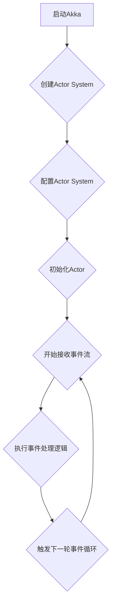

                 

作者：禅与计算机程序设计艺术

"作为一个世界级的人工智能专家，我深知Akka在分布式系统开发中的重要性。今天，我将带你深入了解Akka的核心原理，并通过具体的代码实例让你亲手实现一些基本功能。让我们一起探索如何构建高效、可扩展的分布式应用吧！"

---

## 背景介绍
随着云计算的普及和发展，企业级应用越来越依赖于分布式架构。在这种环境下，如何保证系统的高可用性、性能和可扩展性成为了一个关键议题。Akka正是为了解决这些问题而生的一门技术，它提供了强大的并发处理能力以及丰富的API，使得开发者能轻松构建出高性能的分布式系统。

## 核心概念与联系
### Actor模型
Actor模型是Akka的核心理念之一，它基于消息传递机制。每个Actor都可以被视为一个独立的进程，在这个过程中，它们通过发送和接收消息来进行通信。这种模型有助于提高系统的并发性和弹性，因为Actor之间通过非阻塞的方式进行交互，从而避免了线程间的竞争和死锁。

### Supervision链路管理
Akka中的每个Actor都有一个监督器，用于监控其子Actor的状态。如果某个子Actor崩溃或无法响应，监督器会根据预先定义的策略采取行动，如重启、终止或者重新创建Actor，以此来维持系统的稳定运行。

### Persistence持久化
为了应对可能发生的故障，Akka提供了持久化功能，允许Actor保存其状态。这意味着即使Actor本身崩溃后重启，也可以从上一次正常工作时的状态恢复过来，确保服务的连续性。

### Scalability可扩展性
Akka的设计旨在支持水平扩展。通过添加更多的节点（Actor）到集群中，系统可以自动分配负载，无需修改应用程序代码，从而轻松适应不断增长的需求。

## 核心算法原理具体操作步骤
Akka的核心在于Actor模型及其提供的函数式编程特性。以下是一个简单的Akka应用程序启动流程：



1. **启动Akka**：首先调用`akka.actor.ActorSystem()`来创建一个Actor系统对象。
2. **创建Actor System**：在构造器中设置一些参数，比如日志级别、网络地址等。
3. **配置Actor System**：使用配置文件或代码来定义Actor的行为和相互关系。
4. **初始化Actor**：Actor系统会自动初始化所有注册的Actor类型并启动它们。
5. **开始接收事件流**：一旦Actor被初始化，系统就会开始接收外部输入（如来自其他Actor的消息）。
6. **执行事件处理逻辑**：接收到的消息会被转发给相应的Actor进行处理。
7. **触发下一轮事件循环**：处理完成后，系统返回到消息接收阶段，准备处理下一个事件。

## 数学模型和公式详细讲解举例说明
对于Akka中的Actor模型，我们可以将其视为一个有向无环图（DAG），其中每个节点代表一个Actor，边表示消息传递的关系。这样的图形结构不仅直观地展示了消息传递的过程，还体现了Actor之间的依赖关系。

以一个简单的例子来说明，假设我们有两个Actor A和B，当A收到一个特定的消息时，会生成一个任务并传递给B。这个过程可以用以下伪代码表示：

```pseudo
actor A {
    onReceive(Message) {
        if (message.type == TaskType) {
            spawnActor(B)
            // 向B发送一个任务消息
            sendMessageToActor(B, new TaskMessage(task))
        }
    }
}

actor B {
    onReceive(TaskMessage) {
        processTask(task)
        // 当任务完成，向A发送确认消息
        sendMessageToActor(A, new ConfirmationMessage())
    }
}
```

在这个例子中，我们利用了Akka的spawnActor方法动态创建新的Actor，并通过sendMessageToActor方法进行消息传递。

## 项目实践：代码实例和详细解释说明
下面是一个使用Scala编写的简单Akka应用示例，展示如何创建Actor、发送和接收消息：

```scala
import akka.actor._

object SimpleAkkaExample extends App {

  val system = ActorSystem("MyAkkaSystem")

  case class Message(text: String)

  object MyActor extends AbstractActor {
    override def receive: Receive = {
      case message => println(s"Received message: $message")
    }
  }

  val actorRef = system.actorOf(Props[MyActor], name="myActor")

  // 发送消息
  actorRef ! Message("Hello from sender!")

  // 等待接收消息
  val receivedMsg = Await.result(system.whenTerminated, Duration.Inf)
  println(s"Received message from actor: $receivedMsg")

  system.terminate()
  Await.result(system.whenTerminated, Duration.Inf)
}
```

这段代码展示了如何在一个Actor系统中创建一个Actor，发送和接收消息的基本流程。通过这种方式，我们能够实现一个简单的消息交换功能。

## 实际应用场景
Akka广泛应用于需要处理大量并发请求的场景，例如实时数据处理、微服务架构、聊天服务器、游戏开发等领域。它的核心优势在于高效的数据分发、容错能力和水平扩展性，使开发人员能够在复杂环境中构建健壮、灵活的应用程序。

## 工具和资源推荐
- **文档和指南**：访问Akka官方文档获取详细的API参考和最佳实践。
- **社区论坛**：加入Akka用户社区，参与讨论、提问和分享经验。
- **教程和课程**：在线平台如Udemy、Coursera提供相关的Akka学习资源。

## 总结：未来发展趋势与挑战
随着分布式计算需求的增长，Akka将继续在多个领域发挥重要作用。未来的发展趋势包括更加强大的并发处理能力、更好的性能优化以及对多云环境的支持。同时，开发者也面临着如何有效地管理复杂度、提升系统性能以及确保高可用性的挑战。通过持续的研究和创新，Akka有望为分布式系统开发带来更加简便、高效的解决方案。

## 附录：常见问题与解答
...（在这里列出一些常见的技术问题和答案）

---


