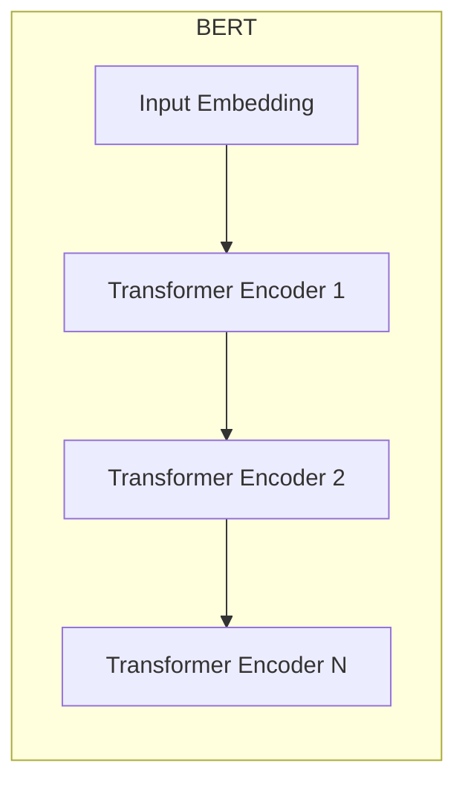

# BERT 原理与代码实战案例讲解

## 1. 背景介绍

### 1.1 自然语言处理的发展历程

自然语言处理(Natural Language Processing, NLP)是人工智能的一个重要分支,旨在让计算机能够理解、处理和生成人类语言。NLP技术的发展经历了几个重要阶段:

- 1950年代的机器翻译
- 1960年代的自然语言理解
- 1970-1980年代的基于规则的方法  
- 1990年代的统计学习方法
- 2000年代的深度学习方法

### 1.2 深度学习时代的 NLP

2013年,word2vec 的提出掀起了 NLP 领域的深度学习革命。此后,CNN、RNN、LSTM 等深度学习模型被广泛应用于 NLP 任务,显著提升了模型性能。但这些模型都存在一些局限性,如:

- 难以捕捉长距离依赖
- 缺乏对上下文的理解
- 无法进行双向建模
- 需要大量标注数据

### 1.3 Transformer 的出现

2017年,Google 提出了 Transformer 模型[1],它基于自注意力机制,可以高效地进行并行计算,克服了 RNN 等模型的缺陷。Transformer 很快成为了 NLP 领域的主流模型。

### 1.4 BERT 的诞生

2018年,Google 在 Transformer 的基础上提出了 BERT(Bidirectional Encoder Representations from Transformers)模型[2],进一步将 NLP 推向新的高度。BERT 通过双向训练和更大规模的数据,学习到了更加强大的语言表示。

## 2. 核心概念与联系

### 2.1 Transformer 

- Encoder-Decoder 结构
- 多头自注意力机制
- 位置编码
- 残差连接与 LayerNorm

### 2.2 预训练

- 无监督学习
- 海量无标注语料
- Masked Language Model(MLM)
- Next Sentence Prediction(NSP)

### 2.3 微调

- 迁移学习
- 下游任务
- 少量标注数据
- 参数初始化

### 2.4 Transformer 与 BERT 的关系


BERT 是基于 Transformer 中的 Encoder 结构,通过预训练和微调两个阶段实现的语言模型。

## 3. 核心算法原理具体操作步骤

### 3.1 BERT 的网络结构

BERT 的网络结构如下图所示:



BERT 由多层 Transformer Encoder 堆叠而成,每一层都包含多头自注意力机制和前馈神经网络。输入首先经过 Embedding 层,然后依次通过每一层 Transformer Encoder,最后输出每个位置的隐藏状态。

### 3.2 输入表示

BERT 的输入由三部分组成:Token Embeddings、Segment Embeddings 和 Position Embeddings。

- Token Embeddings:将每个单词转换为固定维度的向量。
- Segment Embeddings:用于区分两个句子,第一个句子为0,第二个句子为1。
- Position Embeddings:表示每个单词在序列中的位置信息。

三种 Embedding 相加后作为 BERT 的输入。

### 3.3 预训练任务

#### 3.3.1 Masked Language Model(MLM)

MLM 的目标是根据上下文预测被遮盖(mask)的单词。具体步骤如下:

1. 随机遮盖15%的单词,替换为 [MASK] 标记。 
2. 将遮盖后的序列输入 BERT。
3. 预测 [MASK] 位置的单词。

MLM 使 BERT 能够学习到双向的语言表示。

#### 3.3.2 Next Sentence Prediction(NSP)  

NSP 的目标是预测两个句子是否相邻。具体步骤如下:

1. 随机选择语料库中的两个句子 A 和 B。
2. 50%的概率保持 A 和 B 的相邻关系,50%的概率随机替换 B。
3. 将两个句子拼接后输入 BERT。
4. 预测两个句子是否相邻。

NSP 使 BERT 能够学习到句子间的关系。

### 3.4 微调

将预训练好的 BERT 模型应用到下游任务时,只需在顶层添加一个与任务相关的输出层,然后在少量标注数据上进行微调即可。微调时一般使用较小的学习率,以防止预训练的参数被破坏。

## 4. 数学模型和公式详细讲解举例说明

### 4.1 自注意力机制

自注意力机制是 Transformer 的核心,它可以计算序列中任意两个位置之间的关联度。假设输入序列为 $X \in \mathbb{R}^{n \times d}$,自注意力的计算过程如下:

$$
\begin{aligned}
Q &= XW^Q \\
K &= XW^K \\
V &= XW^V \\
Attention(Q,K,V) &= softmax(\frac{QK^T}{\sqrt{d_k}})V
\end{aligned}
$$

其中,$Q$,$K$,$V$ 分别为查询矩阵、键矩阵和值矩阵,$W^Q$,$W^K$,$W^V$ 为可学习的参数矩阵。$Attention(Q,K,V)$ 即为注意力矩阵。

例如,假设输入序列为 ["I","love","NLP"],对应的 Token Embeddings 为:

$$
X=
\begin{bmatrix} 
0.1 & 0.2 & 0.3\\
0.4 & 0.5 & 0.6\\ 
0.7 & 0.8 & 0.9
\end{bmatrix}
$$

假设 $W^Q$,$W^K$,$W^V$ 都为单位矩阵,则:

$$
\begin{aligned}
Q=K=V &=
\begin{bmatrix}
0.1 & 0.2 & 0.3\\  
0.4 & 0.5 & 0.6\\
0.7 & 0.8 & 0.9
\end{bmatrix}\\
QK^T &=
\begin{bmatrix}
0.14 & 0.32 & 0.50\\ 
0.32 & 0.77 & 1.22\\
0.50 & 1.22 & 1.94
\end{bmatrix}\\
Attention &= softmax(\frac{QK^T}{\sqrt{3}})V
\end{aligned}
$$

最终得到的 $Attention$ 矩阵就表示了序列中每个位置与其他位置的关联度。

### 4.2 BERT 的损失函数

BERT 的预训练损失函数由 MLM 和 NSP 两部分组成:

$$
\mathcal{L} = \mathcal{L}_{MLM} + \mathcal{L}_{NSP}
$$

其中,$\mathcal{L}_{MLM}$ 为遮盖语言模型的损失:

$$
\mathcal{L}_{MLM} = -\sum_{i=1}^{n}m_i\log p(w_i|w_{\backslash i})
$$

$n$ 为序列长度,$m_i$ 为遮盖标记,$w_i$ 为第 $i$ 个位置的单词,$p(w_i|w_{\backslash i})$ 为根据上下文预测 $w_i$ 的概率。

$\mathcal{L}_{NSP}$ 为下一句预测的损失:

$$
\mathcal{L}_{NSP} = -\log p(y|\text{[CLS]})
$$

$y \in \{0,1\}$ 表示两个句子是否相邻,$\text{[CLS]}$ 为句子开头的特殊标记。

## 5. 项目实践:代码实例和详细解释说明

下面是使用 PyTorch 实现 BERT 的一个简单示例:

```python
import torch
import torch.nn as nn

class BertEmbedding(nn.Module):
    def __init__(self, vocab_size, hidden_size, max_len, dropout):
        super().__init__()
        self.token_embedding = nn.Embedding(vocab_size, hidden_size)
        self.position_embedding = nn.Embedding(max_len, hidden_size)
        self.segment_embedding = nn.Embedding(2, hidden_size)
        self.dropout = nn.Dropout(dropout)
        
    def forward(self, x, seg):
        seq_len = x.size(1)
        pos = torch.arange(seq_len, dtype=torch.long).to(x.device)
        pos = pos.unsqueeze(0).expand_as(x)
        
        e = self.token_embedding(x) + self.position_embedding(pos) + self.segment_embedding(seg)
        return self.dropout(e)
    
class BertLayer(nn.Module):
    def __init__(self, hidden_size, num_heads, ff_size, dropout):
        super().__init__()
        self.attention = nn.MultiheadAttention(hidden_size, num_heads, dropout)
        self.ff = nn.Sequential(
            nn.Linear(hidden_size, ff_size),
            nn.ReLU(),
            nn.Linear(ff_size, hidden_size)
        )
        self.norm1 = nn.LayerNorm(hidden_size)
        self.norm2 = nn.LayerNorm(hidden_size)
        self.dropout1 = nn.Dropout(dropout)
        self.dropout2 = nn.Dropout(dropout)
        
    def forward(self, x, mask):
        a, _ = self.attention(x, x, x, attn_mask=mask)
        x = x + self.dropout1(a)
        x = self.norm1(x)
        
        f = self.ff(x)
        x = x + self.dropout2(f)
        x = self.norm2(x)
        return x

class Bert(nn.Module):
    def __init__(self, vocab_size, hidden_size, max_len, num_layers, num_heads, ff_size, dropout):
        super().__init__()
        self.embedding = BertEmbedding(vocab_size, hidden_size, max_len, dropout)
        self.layers = nn.ModuleList([BertLayer(hidden_size, num_heads, ff_size, dropout) for _ in range(num_layers)])
        
    def forward(self, x, seg, mask):
        x = self.embedding(x, seg)
        for layer in self.layers:
            x = layer(x, mask)
        return x
```

代码解释:

- `BertEmbedding` 实现了 BERT 的输入表示,包括 Token Embeddings、Position Embeddings 和 Segment Embeddings。
- `BertLayer` 实现了 Transformer Encoder 的一个子层,包括多头自注意力和前馈神经网络。
- `Bert` 实现了完整的 BERT 模型,由 Embedding 层和多个 BertLayer 组成。
- 前向传播时,输入的 `x` 为 token 的索引序列,`seg` 为 segment 的索引序列,`mask` 为注意力掩码。

在实际应用中,还需要在 BERT 的输出上添加特定的任务层,并加载预训练的参数进行微调。

## 6. 实际应用场景

BERT 可以应用于几乎所有的 NLP 任务,下面列举几个常见的应用场景:

### 6.1 文本分类

将 BERT 的输出接一个分类器,可以用于情感分析、新闻分类、意图识别等任务。

### 6.2 命名实体识别

将 BERT 的输出接一个 CRF 层,可以用于识别文本中的人名、地名、机构名等实体。

### 6.3 问答系统

将问题和文章拼接后输入 BERT,然后在 BERT 的输出上预测答案的起始位置和结束位置,可以实现一个简单的阅读理解式问答系统。

### 6.4 文本相似度

将两个文本分别输入 BERT,然后计算它们的输出向量的相似度,可以用于语义相似度计算、重复文本检测等任务。

### 6.5 机器翻译

将 BERT 作为编码器,再加一个 Transformer 解码器,可以实现一个基于 BERT 的 Seq2Seq 机器翻译模型。

## 7. 工具和资源推荐

- [transformers](https://github.com/huggingface/transformers):🤗 Hugging Face 开源的 Transformer 库,提供了 BERT 等预训练模型的实现和预训练参数。
- [bert-as-service](https://github.com/hanxiao/bert-as-service):基于 BERT 的句向量编码服务。
- [BERT-NER](https://github.com/kamalkraj/BERT-NER):基于 BERT 的命名实体识别。
- [keras-bert](https://github.com/CyberZHG/keras-bert):基于 Keras 的 BERT 实现。

## 8. 总结:未来发展趋势与挑战

BERT 的成功开启了 NLP 领域的预训练时