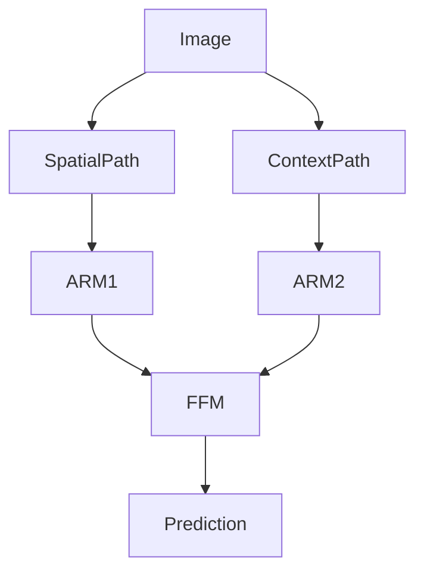

# BiSeNet原理与代码实例讲解

## 1. 背景介绍
近年来,随着深度学习技术的快速发展,语义分割(Semantic Segmentation)已成为计算机视觉领域的一个研究热点。语义分割旨在对图像中的每个像素进行分类,即预测每个像素所属的类别,从而实现对图像的像素级别理解。它在无人驾驶、医学影像分析、虚拟/增强现实等领域有广泛的应用前景。

传统的语义分割方法主要基于全卷积网络(FCN),通过编码器提取特征,解码器恢复空间分辨率,实现端到端的像素分类。但是,这类方法存在两个主要问题:1)编码器降采样导致的空间信息丢失;2)解码器恢复分辨率的计算开销大。为了解决这些问题,学界提出了一系列改进方案,如空洞卷积、多尺度融合、编码器级联等。

在此背景下,北京大学等机构的研究者在ECCV 2018上提出了BiSeNet(Bilateral Segmentation Network)。它采用双路网络结构,分别处理高分辨率的空间细节信息和低分辨率的上下文语义信息,并引入Attention细化模块选择性地融合两路信息,以实现又快又好的语义分割。BiSeNet不仅在准确性上达到业界领先水平,而且推理速度非常快,可满足实时性要求。

## 2. 核心概念与联系
要理解BiSeNet,首先需要了解以下几个核心概念:

- 语义分割(Semantic Segmentation):对图像中每个像素进行类别标注,是像素级别的多分类问题。
- 全卷积网络(FCN):将传统CNN中的全连接层改为卷积层,实现任意尺寸图像的端到端dense prediction。
- 空间路径(Spatial Path):BiSeNet的一个分支,以高分辨率图像作为输入,用于提取空间细节信息。
- 上下文路径(Context Path):BiSeNet的另一个分支,通过下采样获得较大感受野,用于提取上下文语义信息。
- 注意力细化模块(Attention Refinement Module):选择性地从多尺度特征图中提取有效的语义信息。
- 特征融合模块(Feature Fusion Module):融合空间路径和上下文路径的特征,同时恢复空间分辨率。

下图展示了BiSeNet的整体架构和各模块之间的联系:



## 3. 核心算法原理和具体操作步骤
BiSeNet的核心思想是双路并行结构,分别处理空间信息和上下文信息,最后融合两路的特征得到像素级别的预测结果。其主要步骤如下:

1. 空间路径提取:将原始高分辨率图像输入一个浅层的CNN,提取空间细节特征,保留更多的空间信息。

2. 上下文路径提取:将原始图像下采样到较低分辨率,然后输入一个深层的CNN(如ResNet)提取高层语义特征。在网络的不同阶段使用ARM选择性地提炼多尺度的上下文信息。

3. 注意力细化:ARM模块包含两个分支:1)通过全局平均池化和1x1卷积得到Attention向量;2)直接使用原始特征图。将两个分支相乘可选择性地突出重要的通道特征。

4. 特征融合:将空间路径的特征与上下文路径ARM提炼后的特征,通过FFM模块逐点相加实现融合。FFM先对上下文特征进行上采样,再与空间特征concatenate,然后用卷积恢复空间分辨率。

5. 像素分类:将融合后的特征图输入一个简单的卷积层,得到与原图大小一致的预测结果,每个像素的类别概率。

算法的核心在于ARM和FFM模块,它们分别实现了多尺度语义信息的提炼和不同路径特征的融合,使BiSeNet在提高精度的同时也能保持较快的速度。

## 4. 数学模型和公式详细讲解举例说明
BiSeNet中用到的主要数学模型和公式包括:

1. 卷积操作:对特征图进行卷积提取特征。设输入特征图为$X\in R^{C\times H\times W}$,卷积核为$W\in R^{C'\times C\times k\times k}$,卷积步长为$s$,填充为$p$,输出特征图$Y\in R^{C'\times H'\times W'}$,则卷积公式为:

$$Y(c',i,j)=\sum_{c=0}^{C-1}\sum_{u=0}^{k-1}\sum_{v=0}^{k-1}W(c',c,u,v)\cdot X(c,s\cdot i+u-p,s\cdot j+v-p)$$

其中$c',i,j$分别表示输出通道、行、列的索引。

2. 注意力机制:通过Attention向量$A\in R^C$对特征图$X\in R^{C\times H\times W}$进行加权,得到细化后的特征图$\hat{X}\in R^{C\times H\times W}$:

$$\hat{X}(c,i,j)=A(c)\cdot X(c,i,j)$$

其中Attention向量$A$通过全局平均池化和1x1卷积得到:

$$A=\sigma(W_{1\times1}\cdot GAP(X)+b)$$

这里$\sigma$表示Sigmoid激活函数,$W_{1\times1}$是1x1卷积核。

3. 特征融合:将上下文特征$X_{ctx}\in R^{C\times\frac{H}{r}\times\frac{W}{r}}$上采样到与空间特征$X_{sp}\in R^{C'\times H\times W}$相同大小,然后concatenate在通道维度上:

$$X_{fuse}=Conv([Upsample(X_{ctx},r);X_{sp}])$$

其中$[\cdot;\cdot]$表示沿通道维度concatenate,$Conv$表示1x1卷积。

举例说明,假设输入图像大小为512x512,空间路径采用3个3x3卷积层,上下文路径采用ResNet-18,ARM和FFM的reduction ratio $r$=8,最终预测的类别数为19。则BiSeNet的参数量和计算量如下:

- 空间路径:3个3x3卷积,参数量为$3\times(3^2\times3+1)=84$,计算量为$3\times512^2\times3^2=7.08M$
- 上下文路径:ResNet-18,参数量为11.7M,计算量为1.8G
- ARM:2个,每个包含$\frac{512}{r}=64$和$512$个参数,共256个,计算量为$2\times(\frac{512}{r}+\frac{H}{r}\times\frac{W}{r})=0.004M$
- FFM:$2\times512\times\frac{19}{r}=2432$个参数,计算量为$2\times512\times512\times\frac{19}{r}=4.92M$

可见,BiSeNet的大部分计算量集中在上下文路径的骨干网络,而ARM和FFM的开销非常小。通过合理平衡两个路径,BiSeNet在精度和速度之间取得了很好的权衡。

## 5. 项目实践：代码实例和详细解释说明
下面以PyTorch为例,给出BiSeNet的核心模块实现代码。

1. 空间路径 SpatialPath
```python
class SpatialPath(nn.Module):
    def __init__(self, in_channels, out_channels):
        super().__init__()
        self.conv1 = ConvBNReLU(in_channels, 64, 7, 2, 3)
        self.conv2 = ConvBNReLU(64, 64, 3, 2, 1)
        self.conv3 = ConvBNReLU(64, out_channels, 3, 2, 1)
        
    def forward(self, x):
        x = self.conv1(x)
        x = self.conv2(x)
        x = self.conv3(x)
        return x
```
SpatialPath模块包含3个卷积层,先用7x7卷积下采样提取初级特征,再用两个3x3卷积生成高分辨率的空间特征图。

2. 注意力细化模块 ARM
```python
class ARM(nn.Module):
    def __init__(self, in_channels, out_channels):
        super().__init__()
        self.global_pool = nn.AdaptiveAvgPool2d(1)
        self.conv1 = nn.Conv2d(in_channels, out_channels, 1)
        self.conv2 = nn.Conv2d(in_channels, out_channels, 1)
        self.sigmoid = nn.Sigmoid()

    def forward(self, x):
        w = self.global_pool(x)
        w = self.conv1(w)
        w = self.sigmoid(w)
        x = self.conv2(x)
        x = x * w
        return x
```
ARM模块用全局平均池化和1x1卷积生成Attention权重,再用另一个1x1卷积变换输入特征,两者相乘得到细化后的特征图。

3. 特征融合模块 FFM
```python
class FFM(nn.Module):
    def __init__(self, in_channels, out_channels):
        super().__init__()
        self.conv1 = ConvBNReLU(in_channels, out_channels, 3, 1, 1)
        self.conv2 = nn.Conv2d(out_channels, out_channels, 1)

    def forward(self, sp_feat, cp_feat):
        cp_feat = F.interpolate(cp_feat, size=sp_feat.shape[2:], mode='bilinear', align_corners=True)
        feat = torch.cat([sp_feat, cp_feat], dim=1)
        feat = self.conv1(feat)
        feat = self.conv2(feat)
        return feat
```
FFM模块将上下文特征上采样到与空间特征相同大小,沿通道维度拼接,再用3x3和1x1卷积融合生成最终的特征图。

4. BiSeNet网络
```python
class BiSeNet(nn.Module):
    def __init__(self, num_classes):
        super().__init__()
        self.spatial_path = SpatialPath(3, 128)
        self.context_path = resnet18(pretrained=True)
        self.arm1 = ARM(256, 128)
        self.arm2 = ARM(512, 128)
        self.ffm = FFM(256, 256)
        self.head = nn.Conv2d(256, num_classes, 1)

    def forward(self, x):
        H, W = x.shape[2:]
        sp_feat = self.spatial_path(x)
        cp_feat1 = self.context_path.layer2(self.context_path.maxpool(self.context_path.layer1(x)))
        cp_feat2 = self.context_path.layer4(self.context_path.layer3(cp_feat1))
        cp_feat1 = self.arm1(cp_feat1)
        cp_feat2 = self.arm2(cp_feat2)
        feat = self.ffm(sp_feat, cp_feat1+cp_feat2)
        out = self.head(feat)
        out = F.interpolate(out, size=(H,W), mode='bilinear', align_corners=True)
        return out
```
BiSeNet的前向过程如下:
- 空间路径提取高分辨率特征
- 上下文路径提取1/8和1/16尺度的特征,分别用两个ARM细化
- 将空间特征与细化后的两个上下文特征用FFM融合
- 融合特征经过1x1卷积输出分割结果,再上采样到原图尺寸

可见,BiSeNet的实现非常简洁,主要由4个模块组成。通过双路并行和跨层次融合,它在编码高分辨率空间信息和低分辨率语义信息之间取得了平衡。

## 6. 实际应用场景
BiSeNet可以应用于多种需要实时语义分割的场景,例如:

1. 自动驾驶:对道路场景进行分割,区分车道线、车辆、行人等,为决策规划提供环境感知信息。BiSeNet能够在嵌入式设备上以超过30FPS的速度运行,满足自动驾驶的低时延要求。

2. 医学影像分析:对CT、MRI等医学图像进行器官、病变区域的分割,辅助医生进行诊断和手术规划。BiSeNet能快速准确地完成分割任务,有望应用于手术机器人等场景。

3. 虚拟/增强现实:对真实环境视频进行前景背景分割,实现虚拟物体与真实场景的无缝融合。BiSeNet能实时分割出人物等前景目标,提升AR/VR的沉浸感。

4. 遥感图像分析:对卫星或无人机拍摄的遥感影像进行土地利用分类、地物提取等。BiSeNet能高效处理大尺寸图像,生成精细的分割结果,为土地规划、灾害监测等提供决策支持。