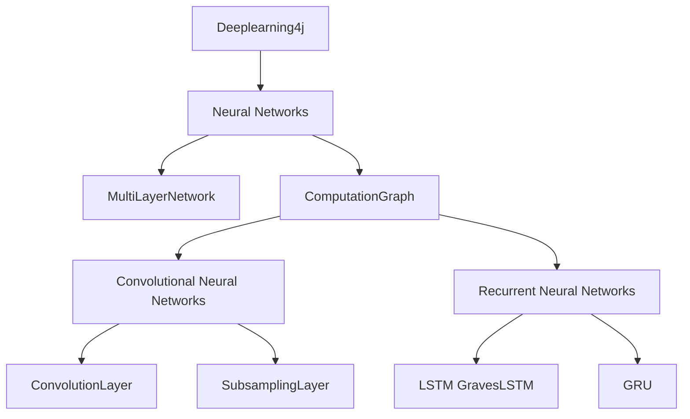

# Deeplearning4j

## 1. 背景介绍
### 1.1 人工智能与深度学习
人工智能(Artificial Intelligence, AI)是计算机科学的一个重要分支,旨在研究如何让计算机模拟甚至超越人类的智能。深度学习(Deep Learning, DL)作为人工智能的一个子领域,近年来取得了突破性的进展,在计算机视觉、自然语言处理、语音识别等领域表现出色,甚至在某些任务上已经超越了人类的表现。

### 1.2 深度学习框架概述
为了方便研究人员和开发者更高效地构建深度学习模型,业界涌现出许多优秀的深度学习框架,如TensorFlow、PyTorch、Caffe、Theano、Keras、MXNet等。这些框架提供了灵活的API和强大的功能,极大地推动了深度学习的发展和应用。

### 1.3 Deeplearning4j的诞生
Deeplearning4j(简称DL4J)是一个基于Java和Scala编写的开源分布式深度学习框架。与上述主流框架不同的是,DL4J是第一个为Java和JVM生态系统设计的商业级、开源、分布式深度学习框架。DL4J的诞生让Java开发者无需切换语言,就能在JVM上构建和训练深度学习模型,极大地降低了深度学习的使用门槛。

## 2. 核心概念与联系
### 2.1 多层感知机(MLP)
多层感知机是最基础的前馈神经网络结构,由输入层、隐藏层和输出层组成。每一层由多个神经元组成,层与层之间通过权重矩阵连接。MLP能够拟合复杂的非线性函数,是许多高级神经网络结构的基础。

### 2.2 卷积神经网络(CNN)
卷积神经网络是一种专门用于处理网格拓扑结构数据(如图像)的神经网络。CNN通过局部连接、权重共享、池化等操作,能够自动提取图像的空间特征,在图像分类、目标检测、语义分割等任务上表现出色。

### 2.3 循环神经网络(RNN)
循环神经网络是一种适合处理序列数据的神经网络。RNN引入了循环连接,使得网络能够捕捉序列数据中的时序依赖关系。常见的RNN变体有LSTM和GRU,能够缓解梯度消失问题,在自然语言处理、时间序列预测等任务上广泛应用。

### 2.4 Deeplearning4j中的实现
Deeplearning4j提供了上述核心概念的Java实现:
- `MultiLayerNetwork`类对应MLP
- `ComputationGraph`类对应更复杂的网络结构,如CNN和RNN
- `ConvolutionLayer`、`SubsamplingLayer`对应CNN中的卷积层和池化层
- `LSTM`、`GravesLSTM`、`GRU`对应RNN的变体实现

下图展示了DL4J中这些核心概念的联系:



## 3. 核心算法原理与操作步骤
### 3.1 前向传播
前向传播是神经网络的基本计算过程,数据从输入层开始,逐层传递到输出层,得到网络的预测输出。以MLP为例,前向传播的步骤如下:

1. 输入层接收输入数据,传递到下一层
2. 隐藏层接收上一层的输出,通过激活函数计算得到本层的输出
3. 重复步骤2,直到数据传递到输出层
4. 输出层通过激活函数计算得到网络的预测输出

### 3.2 反向传播
反向传播是神经网络训练的核心算法,通过计算梯度并更新网络权重,使得网络的预测结果尽可能接近真实标签。以MLP为例,反向传播的步骤如下:

1. 计算网络预测输出与真实标签之间的损失
2. 计算输出层的梯度,即损失对输出层权重的偏导数
3. 逐层向前传递梯度,计算每一层权重的梯度
4. 根据梯度下降算法更新每一层的权重
5. 重复步骤1-4,直到网络收敛或达到预设的迭代次数

### 3.3 DL4J中的实现
在Deeplearning4j中,前向传播和反向传播的过程被封装在`MultiLayerNetwork`和`ComputationGraph`类中。以MLP为例,训练网络的典型步骤如下:

1. 准备数据集,可以使用`DataSetIterator`加载数据
2. 定义网络结构,通过`NeuralNetConfiguration.Builder`配置网络参数
3. 初始化`MultiLayerNetwork`,传入网络配置
4. 调用`fit`方法训练网络,传入数据集和迭代次数
5. 调用`eval`方法评估网络性能,或调用`output`方法获取预测结果

## 4. 数学模型与公式详解
### 4.1 损失函数
损失函数衡量了神经网络的预测输出与真实标签之间的差距。常见的损失函数有均方误差(MSE)和交叉熵(Cross-entropy)。以二分类问题为例,交叉熵损失的定义如下:

$$
L = -\frac{1}{N}\sum_{i=1}^N [y_i \log(\hat{y}_i) + (1-y_i)\log(1-\hat{y}_i)]
$$

其中$N$为样本数,$y_i$为真实标签,$\hat{y}_i$为网络预测输出。

### 4.2 激活函数
激活函数为神经网络引入非线性,增强网络的表达能力。常见的激活函数有Sigmoid、Tanh和ReLU。以Sigmoid函数为例,其定义如下:

$$
\sigma(x) = \frac{1}{1+e^{-x}}
$$

Sigmoid函数将输入映射到(0,1)区间,适合作为二分类问题的输出层激活函数。

### 4.3 优化算法
优化算法用于更新神经网络的权重,使得损失函数最小化。常见的优化算法有随机梯度下降(SGD)、Adam和RMSprop。以SGD为例,权重更新公式如下:

$$
w_{t+1} = w_t - \eta \cdot \nabla L(w_t)
$$

其中$w_t$为当前权重,$\eta$为学习率,$\nabla L(w_t)$为损失函数对当前权重的梯度。

在DL4J中,这些数学模型和公式都有相应的Java实现:
- 损失函数对应`LossFunctions`类,如`LossFunctions.LossFunction.XENT`表示交叉熵损失
- 激活函数对应`Activation`类,如`Activation.SIGMOID`表示Sigmoid激活函数
- 优化算法对应`Updater`类,如`Updater.SGD`表示随机梯度下降优化算法

## 5. 项目实践:代码实例与详解
下面以一个简单的二分类问题为例,演示如何使用DL4J构建和训练MLP。

### 5.1 准备数据集
首先,我们需要准备训练数据集和测试数据集。这里使用DL4J内置的`IrisDataSetIterator`,它封装了著名的Iris鸢尾花数据集。

```java
int batchSize = 150;
DataSetIterator trainIter = new IrisDataSetIterator(batchSize, 150);
DataSetIterator testIter = new IrisDataSetIterator(batchSize, 150);
```

### 5.2 定义网络结构
接下来,我们使用`NeuralNetConfiguration.Builder`定义MLP的结构,包括输入层、隐藏层和输出层的节点数,以及激活函数、损失函数和优化算法等超参数。

```java
MultiLayerConfiguration conf = new NeuralNetConfiguration.Builder()
    .seed(1234)
    .optimizationAlgo(OptimizationAlgorithm.STOCHASTIC_GRADIENT_DESCENT)
    .updater(new Sgd(0.1))
    .list()
    .layer(0, new DenseLayer.Builder()
            .nIn(4).nOut(3)
            .activation(Activation.SIGMOID)
            .build())
    .layer(1, new OutputLayer.Builder(LossFunctions.LossFunction.XENT)
            .nIn(3).nOut(3)
            .activation(Activation.SOFTMAX)
            .build())
    .build();
```

### 5.3 训练网络
定义好网络结构后,我们创建`MultiLayerNetwork`实例,并调用`fit`方法训练网络。这里我们训练100个Epoch,每个Epoch结束后评估网络在测试集上的性能。

```java
MultiLayerNetwork model = new MultiLayerNetwork(conf);
model.init();

for (int epoch = 0; epoch < 100; epoch++) {
    model.fit(trainIter);
    System.out.println("Epoch " + epoch + " complete.");
    
    Evaluation eval = model.evaluate(testIter);
    System.out.println(eval.stats());
    testIter.reset();
}
```

### 5.4 模型评估与预测
训练完成后,我们可以使用训练好的模型对新数据进行预测。这里我们对测试集中的样本进行预测,并打印预测结果。

```java
testIter.reset();
DataSet testData = testIter.next();
INDArray output = model.output(testData.getFeatures());

for (int i = 0; i < output.rows(); i++) {
    System.out.println("Predicted label: " + output.getRow(i).argMax().getInt(0));
    System.out.println("Actual label: " + testData.getLabels().getRow(i).argMax().getInt(0));
}
```

## 6. 实际应用场景
Deeplearning4j在工业界有广泛的应用,下面列举几个典型场景:

### 6.1 金融风控
DL4J可以用于构建金融风险控制模型,通过分析用户的历史交易数据、信用记录等特征,预测用户的违约风险,帮助金融机构做出审批决策。

### 6.2 医疗影像分析
DL4J可以用于医疗影像的分类和识别,如基于CT、MRI等医学扫描图像,训练CNN模型实现肿瘤的自动检测和分割,辅助医生进行诊断。

### 6.3 智能客服
DL4J可以用于构建智能客服系统,通过RNN模型分析用户的问询内容,自动生成相应的回复,提供24小时不间断的客户服务。

### 6.4 工业质检
DL4J可以用于工业产品的质量检测,通过CNN模型分析产品图像,自动识别产品缺陷,提高质检效率和准确率。

## 7. 工具与资源推荐
### 7.1 官方文档
Deeplearning4j的官方文档是学习和使用DL4J的权威资源,包括用户指南、API文档、示例代码等:
- 官网: https://deeplearning4j.org/
- 快速入门: https://deeplearning4j.org/quickstart
- 用户指南: https://deeplearning4j.org/docs/latest/

### 7.2 社区与课程
除了官方文档,DL4J还有活跃的社区和优质的学习课程:
- Gitter社区: https://gitter.im/deeplearning4j/deeplearning4j
- SkymindAcademy免费课程: https://academy.skymind.io/
- Coursera deeplearning.ai专项课程: https://www.coursera.org/specializations/deep-learning

### 7.3 模型库与示例
DL4J提供了一些预训练的模型和示例代码,方便用户快速上手和部署:
- ModelZoo: https://deeplearning4j.org/model-zoo
- 示例代码: https://github.com/eclipse/deeplearning4j-examples

## 8. 总结:未来发展与挑战
### 8.1 DL4J的优势
Deeplearning4j作为首个面向Java和JVM生态的深度学习框架,有如下优势:
- 完全开源,社区活跃,文档丰富
- 支持分布式训练,可扩展性强
- 与Hadoop、Spark等大数据框架无缝集成
- 提供用户友好的API,学习曲线平缓

### 8.2 未来发展方向
未来,DL4J有望在以下方向取得更大的突破:
- 更高效的分布式训练
- 更轻量级的部署方案,如移动端部署
- 自动机器学习(AutoML)功能
- 与云平台的更紧密集成

### 8.3 面临的挑战
同