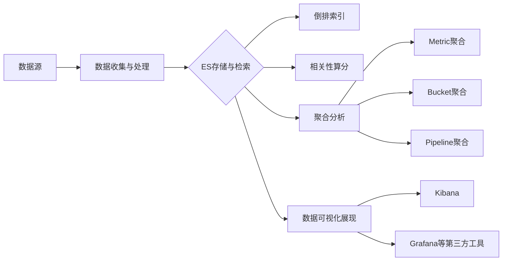

# ES与数据可视化与分析

## 1. 背景介绍
### 1.1 大数据时代的数据分析挑战
### 1.2 ES在数据分析领域的应用现状
### 1.3 数据可视化的重要性

## 2. 核心概念与联系
### 2.1 ES基本概念
#### 2.1.1 ES的架构与组件
#### 2.1.2 ES的分布式特性
#### 2.1.3 ES的近实时搜索与分析能力
### 2.2 数据可视化基本概念  
#### 2.2.1 数据可视化的定义与分类
#### 2.2.2 常见的数据可视化图表类型
#### 2.2.3 数据可视化的设计原则
### 2.3 ES与数据可视化的关系
#### 2.3.1 ES为数据可视化提供数据支持
#### 2.3.2 ES与数据可视化工具的集成方案

## 3. 核心算法原理具体操作步骤
### 3.1 ES的倒排索引
#### 3.1.1 倒排索引的基本原理
#### 3.1.2 ES中倒排索引的实现
#### 3.1.3 倒排索引在数据分析中的应用
### 3.2 ES的相关性算分
#### 3.2.1 TF-IDF算法原理
#### 3.2.2 BM25算法原理 
#### 3.2.3 ES中相关性算分的优化策略
### 3.3 ES的聚合分析
#### 3.3.1 Metric聚合分析
#### 3.3.2 Bucket聚合分析
#### 3.3.3 Pipeline聚合分析

## 4. 数学模型和公式详细讲解举例说明
### 4.1 TF-IDF公式推导与举例
### 4.2 BM25公式推导与举例
### 4.3 聚合分析中的统计学模型

## 5. 项目实践：代码实例和详细解释说明
### 5.1 使用ES进行日志数据分析
#### 5.1.1 日志数据收集与预处理
#### 5.1.2 日志数据导入ES
#### 5.1.3 使用Kibana进行日志分析与可视化
### 5.2 使用ES进行电商数据分析
#### 5.2.1 电商数据建模与索引优化
#### 5.2.2 电商数据聚合分析实战
#### 5.2.3 电商数据可视化Dashboard搭建
### 5.3 使用ES进行社交媒体数据分析
#### 5.3.1 社交数据采集与处理
#### 5.3.2 社交关系图谱构建
#### 5.3.3 社交网络影响力分析

## 6. 实际应用场景
### 6.1 ES在运维监控领域的应用
### 6.2 ES在BI商业智能领域的应用
### 6.3 ES在推荐系统领域的应用

## 7. 工具和资源推荐
### 7.1 ES常用工具
#### 7.1.1 Kibana - ES数据可视化利器
#### 7.1.2 Logstash - 数据收集与处理管道
#### 7.1.3 Beats - 轻量级数据采集器
### 7.2 数据可视化工具推荐
#### 7.2.1 Grafana - 开源数据可视化平台
#### 7.2.2 Tableau - 商业BI数据可视化工具
#### 7.2.3 D3.js - 数据驱动的JavaScript可视化库
### 7.3 ES学习资源推荐
#### 7.3.1 官方文档
#### 7.3.2 ES相关书籍
#### 7.3.3 ES在线课程

## 8. 总结：未来发展趋势与挑战
### 8.1 ES在数据分析领域的发展趋势 
### 8.2 数据可视化技术的未来方向
### 8.3 ES面临的挑战与机遇

## 9. 附录：常见问题与解答
### 9.1 ES与Hadoop生态系统的比较
### 9.2 ES在海量数据场景下的性能优化
### 9.3 数据可视化设计的常见误区



ES作为一款开源的分布式搜索与分析引擎，凭借其强大的近实时全文检索、多维度聚合分析等能力，在大数据分析领域占据了重要地位。而数据可视化技术则是将ES检索分析的结果以直观、易于理解的方式呈现给终端用户，是ES数据分析不可或缺的一环。

ES底层基于Lucene倒排索引库实现，采用了TF-IDF、BM25等经典算法对文档相关性进行评分排序。倒排索引的核心思想是对文档内容进行分词，建立词项到文档的映射关系，从而实现快速的全文检索。以下是倒排索引创建的基本步骤：

1. 将文档内容切分为一系列词项(Term)
2. 对词项进行必要的语言处理，如大小写转换、停用词过滤、词干提取等
3. 记录每个词项在不同文档中的出现频率和位置信息
4. 构建词项到文档列表的倒排映射关系

TF-IDF(Term Frequency-Inverse Document Frequency)是一种用于评估词项与文档相关性的经典算法。其核心思想是，一个词项在一篇文档中出现的频率越高，同时在整个文档集合的其他文档中出现的频率越低，则认为该词项具有很好的代表性，对文档的相关性贡献越大。TF-IDF的数学计算公式如下：

$$ w_{i,j} = tf_{i,j} \times \log(\frac{N}{df_i}) $$

其中，$w_{i,j}$ 表示词项 $i$ 对文档 $j$ 的重要程度，$tf_{i,j}$ 表示词项 $i$ 在文档 $j$ 中的词频，$N$ 为文档集合的总数，$df_i$ 为包含词项 $i$ 的文档数。通过TF-IDF计算，可以有效地过滤掉一些常见但无关紧要的词，提升搜索结果的准确性。

除了全文检索外，ES还提供了强大的聚合分析(Aggregation)功能，可以对搜索结果进行多维度、多层次的统计分析。ES的聚合分析主要分为以下几类：

1. Metric聚合：对文档字段进行统计分析，如计算最大值、最小值、平均值、求和等。
2. Bucket聚合：按照某个字段对文档进行分组，类似于SQL中的GROUP BY操作。常见的Bucket聚合包括Terms聚合、Range聚合、Date Histogram聚合等。
3. Pipeline聚合：在其他聚合的结果之上进一步进行计算，如求导数、求百分比、求累计和等。

下面是一个使用ES进行Bucket聚合分析的代码示例，统计不同品牌手机的销量与均价：

```json
GET /phones/_search
{
  "size": 0, 
  "aggs": {
    "brands": {
      "terms": {
        "field": "brand",
        "size": 10
      },
      "aggs": {
        "avg_price": {
          "avg": {
            "field": "price"
          }
        },
        "sales_count": {
          "sum": {
            "field": "sales"
          }
        }
      }
    }
  }
}
```

以上DSL定义了一个名为"brands"的Terms Bucket聚合，按照"brand"字段对手机文档进行分组，然后在每个品牌Bucket内部定义了"avg_price"和"sales_count"两个Metric子聚合，分别计算该品牌手机的平均售价与销量总和。

聚合分析的结果可以通过Kibana等可视化工具直观地展现出来，帮助用户发现数据背后隐藏的规律和趋势。例如，我们可以创建一个柱状图，X轴为手机品牌，Y轴为销量，直观地比较不同品牌的销售情况。

除了Kibana，还有许多优秀的第三方数据可视化工具可以与ES无缝集成，如Grafana、Tableau等。这些工具提供了丰富的图表类型和自定义选项，能够基于ES的聚合分析结果构建出专业、美观的可视化仪表盘。

总的来说，ES强大的数据分析与可视化能力正在被越来越多的企业和组织所接受和应用。随着数据量的不断增长，实时性和交互性需求的提升，ES在诸如日志分析、指标监控、BI分析等领域将扮演愈发重要的角色。未来ES有望与机器学习、知识图谱等前沿技术进一步结合，为我们呈现出更加智能、立体的数据洞察。

作者：禅与计算机程序设计艺术 / Zen and the Art of Computer Programming