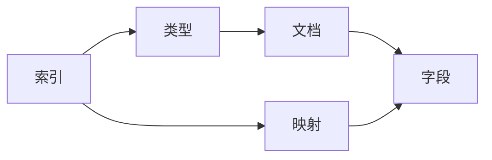

# ES核心概念：文档、字段、映射、类型

## 1.背景介绍
### 1.1 Elasticsearch简介
#### 1.1.1 什么是Elasticsearch  
Elasticsearch(简称ES)是一个基于Lucene的开源分布式搜索和分析引擎。它能够对大量数据进行近实时的存储、搜索和分析操作。ES使用JSON作为文档序列化格式，并通过基于HTTP的RESTful API来操作数据。

#### 1.1.2 Elasticsearch的应用场景
- 全文搜索：ES可以对大规模的文本数据进行全文检索,支持多种查询方式。
- 日志分析：ES可以收集、聚合、分析和可视化日志数据。
- 指标分析：ES可以存储和分析大量的指标数据,如应用程序性能指标、系统指标等。
- 地理空间分析：ES支持地理位置相关的搜索和聚合分析。

### 1.2 文档、字段、映射和类型的重要性
在使用Elasticsearch进行数据存储和检索时,理解文档(Document)、字段(Field)、映射(Mapping)和类型(Type)等核心概念非常重要。这些概念定义了数据在ES中的组织方式和行为。深入理解这些概念,可以帮助我们更好地设计数据模型,优化查询性能,并充分利用ES的功能特性。

## 2.核心概念与联系
### 2.1 文档(Document)
#### 2.1.1 文档的定义
在Elasticsearch中,文档是可以被索引的基本信息单元。通常使用JSON格式表示一个文档,由多个字段组成。每个文档都有一个唯一标识符,称为`_id`。

一个示例文档:
```json
{
  "_id": "1",
  "title": "Elasticsearch Guide",
  "author": "John Doe",
  "content": "This is an introduction to Elasticsearch.",
  "publish_date": "2023-06-01"
}
```

#### 2.1.2 文档的特点
- 文档是自包含的,一个文档包含了所有相关信息。
- 文档是无模式的,不同文档可以有不同的字段集合。
- 文档支持嵌套,一个文档的字段可以包含其他文档。

### 2.2 字段(Field) 
#### 2.2.1 字段的定义
字段是文档的组成部分,用于描述文档的各个方面。每个字段都有一个名称和对应的值,值可以是简单类型(如字符串、数字、布尔值等),也可以是复杂类型(如数组、对象等)。

#### 2.2.2 常见的字段类型
- 字符串类型:text、keyword
- 数值类型:long、integer、short、byte、double、float、half_float、scaled_float 
- 日期类型:date
- 布尔类型:boolean
- 二进制类型:binary
- 范围类型:integer_range、float_range、long_range、double_range、date_range
- 对象类型:object,用于表示嵌套文档
- 数组类型:支持以上所有类型的数组形式

### 2.3 映射(Mapping)
#### 2.3.1 映射的定义 
映射是定义文档及其字段如何存储和索引的过程。它类似于关系型数据库中的表结构定义。映射定义了文档的字段类型、分词方式、索引行为等。

#### 2.3.2 显式映射和动态映射
- 显式映射:预先定义索引的映射,明确指定每个字段的类型和行为。
- 动态映射:当文档写入时,如果索引不存在,ES会根据文档的内容自动推断字段类型并创建映射。

#### 2.3.3 映射的重要性
合理的映射设计对于ES的性能和功能至关重要。映射决定了数据的索引方式、查询行为以及聚合操作的可行性。

### 2.4 类型(Type) 
#### 2.4.1 类型的定义
在ES 7.0之前,一个索引可以包含多个类型,类型是文档的逻辑容器。不同类型的文档可以存储在同一索引中,共享索引的设置,但有自己的映射定义。

#### 2.4.2 类型的弃用
从ES 7.0开始,类型的概念已被弃用。现在建议每个索引只包含一个类型,即将索引视为类型。这种改变简化了数据模型,避免了类型间的映射冲突。

### 2.5 概念之间的关系


- 一个索引包含一个或多个文档。在ES 7.x中,建议一个索引对应一个类型。
- 一个文档由多个字段组成,字段是文档的最小组成单位。
- 映射定义了文档和字段的结构、类型和索引行为,它在索引级别上进行设置。

## 3.核心算法原理具体操作步骤
### 3.1 文档的CRUD操作
#### 3.1.1 创建文档
使用`POST`请求,将文档数据以JSON格式发送到指定的索引和类型。如果文档ID已存在,则更新文档;否则创建新文档。

请求示例:
```
POST /my-index/_doc
{
  "title": "Elasticsearch Guide",
  "author": "John Doe",
  "content": "This is an introduction to Elasticsearch.",
  "publish_date": "2023-06-01"
}
```

#### 3.1.2 检索文档
使用`GET`请求,指定文档的索引、类型和ID,即可检索单个文档。

请求示例:
```
GET /my-index/_doc/1
```

#### 3.1.3 更新文档
使用`POST`请求,指定文档的索引、类型和ID,发送更新后的文档数据。

请求示例:
```
POST /my-index/_doc/1
{
  "title": "Updated Elasticsearch Guide",
  "author": "John Doe",
  "content": "This is an updated introduction to Elasticsearch.",
  "publish_date": "2023-06-02"
}
```

#### 3.1.4 删除文档
使用`DELETE`请求,指定要删除的文档的索引、类型和ID。

请求示例:
```
DELETE /my-index/_doc/1
```

### 3.2 映射的创建和更新
#### 3.2.1 创建显式映射
使用`PUT`请求,在创建索引时指定映射。

请求示例:
```
PUT /my-index
{
  "mappings": {
    "properties": {
      "title": { "type": "text" },
      "author": { "type": "keyword" },
      "content": { "type": "text" },
      "publish_date": { "type": "date" }
    }
  }
}
```

#### 3.2.2 更新映射
ES允许向现有映射添加新字段,但不允许更改现有字段的类型。如需更改字段类型,需要重新索引数据。

请求示例(添加新字段):
```
PUT /my-index/_mapping
{
  "properties": {
    "tags": { "type": "keyword" }
  }
}
```

### 3.3 文档搜索
#### 3.3.1 基本查询
使用`GET`请求,将查询条件以JSON格式发送到`_search`端点。

请求示例:
```
GET /my-index/_search
{
  "query": {
    "match": {
      "title": "Elasticsearch"
    }
  }
}
```

#### 3.3.2 复合查询
可以组合多个查询条件,如布尔查询、范围查询等。

请求示例:
```
GET /my-index/_search
{
  "query": {
    "bool": {
      "must": [
        { "match": { "title": "Elasticsearch" } },
        { "range": { "publish_date": { "gte": "2023-01-01" } } }
      ]
    }
  }
}
```

## 4.数学模型和公式详细讲解举例说明
### 4.1 相关性评分模型
Elasticsearch使用基于TF-IDF的相关性评分模型来计算文档与查询的相关性。

#### 4.1.1 词频(Term Frequency, TF)
词频表示一个词在文档中出现的频率。词频越高,文档与查询的相关性越高。
$$ TF(t,d) = \frac{f_{t,d}}{\sum_{t'\in d} f_{t',d}} $$

其中,$f_{t,d}$表示词$t$在文档$d$中出现的次数,$\sum_{t'\in d} f_{t',d}$表示文档$d$中所有词的出现次数之和。

#### 4.1.2 逆文档频率(Inverse Document Frequency, IDF)
逆文档频率表示一个词在整个文档集合中的稀缺程度。如果一个词在很多文档中出现,其重要性应该降低。
$$ IDF(t) = \log \frac{N}{n_t + 1} $$

其中,$N$表示文档集合中的文档总数,$n_t$表示包含词$t$的文档数。

#### 4.1.3 TF-IDF评分
TF-IDF评分综合考虑了词频和逆文档频率,用于评估一个词对文档的重要性。
$$ TFIDF(t,d) = TF(t,d) \times IDF(t) $$

文档的最终相关性评分是查询中所有词的TF-IDF评分的加权和。

### 4.2 BM25相关性评分
BM25是一种基于概率的相关性评分模型,考虑了文档长度对相关性的影响。

$$ score(q,d) = \sum_{t \in q} IDF(t) \cdot \frac{f(t,d) \cdot (k_1 + 1)}{f(t,d) + k_1 \cdot (1 - b + b \cdot \frac{|d|}{avgdl})} $$

其中:
- $f(t,d)$表示词$t$在文档$d$中的出现频率。
- $|d|$表示文档$d$的长度。
- $avgdl$表示文档集合中的平均文档长度。
- $k_1$和$b$是调节参数,控制词频和文档长度对评分的影响。

## 5.项目实践：代码实例和详细解释说明
下面是一个使用Python客户端与Elasticsearch交互的代码示例:

```python
from elasticsearch import Elasticsearch

# 连接Elasticsearch
es = Elasticsearch(["http://localhost:9200"])

# 创建索引
index_name = "my-index"
if not es.indices.exists(index=index_name):
    es.indices.create(index=index_name, body={
        "mappings": {
            "properties": {
                "title": {"type": "text"},
                "author": {"type": "keyword"},
                "content": {"type": "text"},
                "publish_date": {"type": "date"}
            }
        }
    })

# 插入文档
doc = {
    "title": "Elasticsearch Guide",
    "author": "John Doe",
    "content": "This is an introduction to Elasticsearch.",
    "publish_date": "2023-06-01"
}
es.index(index=index_name, body=doc)

# 搜索文档
query = {
    "query": {
        "match": {
            "title": "Elasticsearch"
        }
    }
}
result = es.search(index=index_name, body=query)

# 输出搜索结果
print(result["hits"]["hits"])
```

代码解释:
1. 导入`Elasticsearch`类,用于与ES进行交互。
2. 创建`Elasticsearch`对象,指定ES服务的地址。
3. 定义索引名称,检查索引是否存在。如果不存在,则创建索引并设置映射。
4. 定义一个文档,包含标题、作者、内容和发布日期字段。
5. 使用`index`方法将文档插入索引。
6. 定义一个查询,使用`match`查询在标题字段中搜索"Elasticsearch"。
7. 使用`search`方法执行查询,将查询条件作为请求体发送。
8. 输出搜索结果,结果包含匹配查询的文档。

## 6.实际应用场景
### 6.1 电商搜索
在电商平台中,Elasticsearch可以用于实现商品搜索和过滤功能。通过合理设计文档结构和映射,可以支持多字段搜索、分类筛选、价格范围过滤等功能,提供快速、准确的搜索体验。

### 6.2 日志分析
Elasticsearch可以用于收集和分析各种日志数据,如应用程序日志、访问日志、错误日志等。通过将日志数据索引到ES中,可以方便地进行搜索、聚合和可视化分析,快速定位问题、发现异常模式和趋势。

### 6.3 指标监控
Elasticsearch可以存储和分析时间序列指标数据,如系统指标、应用程序性能指标等。通过将指标数据索引到ES中,可以实现实时监控、告警和趋势分析,帮助运维人员及时发现和解决问题。

## 7.工具和资源推荐
### 7.1 Kibana