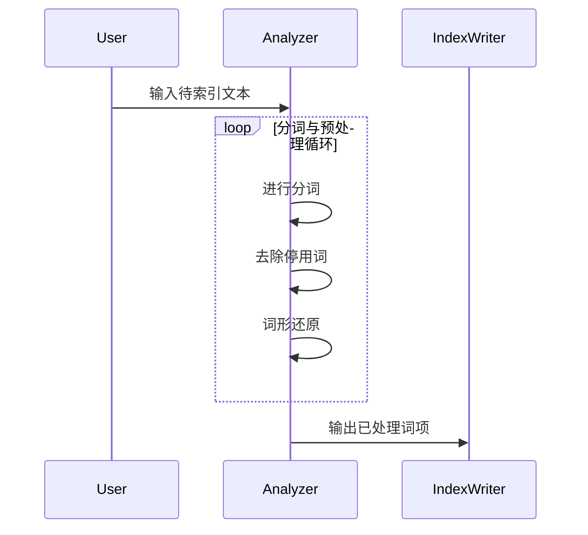

                 

作者：禅与计算机程序设计艺术

Elasticsearch 是一个基于 Lucene 的开源搜索和分析引擎，用于实时存储、检索以及分析大量数据。它被广泛应用于各种场景，如日志分析、全文检索、实时监控、搜索引擎等。本篇文章将从基础知识、核心组件、算法实现、应用案例、工具选型等方面全面解析 Elasticsearch 的工作原理及其实现细节，并通过代码实例加深理解。

## 背景介绍
随着大数据时代的到来，如何快速有效地处理海量数据成为了各大企业面临的巨大挑战。Elasticsearch 应运而生，旨在解决大规模数据的查询性能问题。它的设计初衷是提供高性能、分布式、可扩展的数据存储解决方案，同时支持全文检索、聚合分析等功能。由于其优秀的性能和丰富的功能集，Elasticsearch 成为了大数据领域不可或缺的一部分。

## 核心概念与联系
### 集群管理
- **Node**：集群中的单个实体，负责执行特定的工作，如索引文档、搜索请求处理等。
- **Shard**：索引的分片，每个 shard 可以独立运行在不同的 Node 上，实现了水平扩展的能力。
- **Replica**：shard 的副本，用于提高容错性和读取性能。

### 查询流程
- **Query**：用户提交的搜索请求，包括查询语句、过滤条件等。
- **Routing**：决定请求应由哪个 shard 处理的过程。
- **Aggregation**：对搜索结果进行统计和聚合的操作，如计数、求平均值等。

### 存储与搜索优化
- **Mapping**：描述文档字段类型、索引设置等信息，影响搜索效率和内存占用。
- **Analyzer**：文本处理过程，如词干提取、停用词过滤等，直接影响搜索精度和召回率。

## 核心算法原理具体操作步骤
### 分析器 (Analyzer)
文本通常需要经过预处理才能进行搜索。分析器对输入文本进行分词、去除停用词、词形还原等操作，生成可用于搜索的词项。



### 索引构建
- **Document Mapping**：定义文档结构，包括字段名称、类型（字符串、数字、日期等）和是否参与搜索/聚合。
- **Document Indexing**：根据映射规则将文档转换为二进制表示并存储。

### 查询处理
- **Query Parsing**：解析查询语句，构建内部表示形式（如布尔表达式树）。
- **Query Execution**：根据查询树结构，利用倒排索引进行搜索。

## 数学模型和公式详细讲解举例说明
### TF-IDF 加权法
TF-IDF 是衡量词语重要程度的一种常用方法，在 Elasticsearch 中用于计算单词的相关度。其公式为：
$$ IDF = \log\left(\frac{N}{n_i}\right) $$
$$ TF = \frac{\text{Term Frequency}}{\text{Document Length}} $$
$$ TF-IDF = TF * IDF $$
其中，\( N \) 是文档总数，\( n_i \) 是包含当前词的文档数量，\( TF \) 表示词频，即某个词在文档中出现的次数。

### BM25 相似度计算
BM25 模型更准确地考虑了单词在文档中的位置信息，公式如下：
$$ score = \sum_{t \in query} (k_1 + 1) \cdot \frac{tf(t, doc)}{(k_1 \cdot \frac{L}{avgdl} + tf(t, doc))} \cdot (\sum_{w \in Q} (k_2 + 1) \cdot \frac{tf(w, doc)}{(k_2 \cdot \frac{L}{avgdl} + tf(w, doc))}) $$
其中，\( k_1 \) 和 \( k_2 \) 是参数调整系数，\( L \) 是文档长度，\( avgdl \) 是所有文档的平均长度。

## 项目实践：代码实例和详细解释说明
### 创建索引
```java
PUT /my_index
{
  "settings": {
    "number_of_shards": 3,
    "number_of_replicas": 1
  },
  "mappings": {
    "properties": {
      "title": { "type": "text", "analyzer": "standard" }
    }
  }
}
```
### 添加文档
```json
POST /my_index/_doc
{
  "title": "Example Document"
}
```
### 执行查询
```json
GET /my_index/_search
{
  "query": {
    "match": {
      "title": "Example"
    }
  }
}
```

## 实际应用场景
Elasticsearch 在各种场景下有着广泛的应用，例如日志分析、实时监控、搜索引擎、推荐系统等。通过分析用户行为数据、实时响应查询需求，它能够帮助企业提升运营效率、改善用户体验。

## 工具和资源推荐
- **官方文档**：提供详细的 API 文档和教程，帮助开发者快速上手。
- **社区论坛**：Stack Overflow、GitHub issues 等平台，解决开发过程中遇到的问题。
- **培训课程**：线上课程如 Pluralsight、Udemy 提供深入的学习资料。

## 总结：未来发展趋势与挑战
随着大数据技术的不断演进，Elasticsearch 面临着如何更好地应对超大规模数据集、提高分布式系统的可管理性、以及增强人工智能集成等问题。未来的 Elasticsearch 将继续在性能优化、功能扩展及易用性改进方面寻求突破，以满足更加复杂多变的数据处理需求。

## 附录：常见问题与解答
- **Q:** 如何选择合适的索引分片和副本数量？
   - **A:** 应根据实际负载、读写比例、故障恢复要求等因素综合考量。一般原则是增加分片数以提高水平扩展能力，增加副本数以提高容错性。
- **Q:** Elasticsearch 如何处理大量并发请求？
   - **A:** Elasticsearch 内置了高效的线程池和缓存机制，支持高并发下的高效处理。合理配置相关参数可以进一步优化性能。

---

文章至此结束，感谢您的阅读！希望本文能为您深入了解 Elasticsearch 的工作原理及其应用带来帮助。如果您有任何疑问或需要进一步探讨的话题，请随时提问！

---

作者：禅与计算机程序设计艺术 / Zen and the Art of Computer Programming

