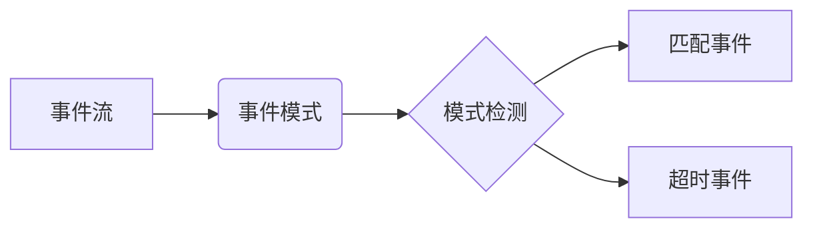

# Flink CEP原理与代码实例讲解

## 1. 背景介绍
### 1.1 复杂事件处理(CEP)概述
复杂事件处理(Complex Event Processing, CEP)是一种用于实时分析事件流的技术。它可以从大量的事件流中识别出有意义的事件模式，并及时做出响应。CEP在金融、物联网、安防等领域有广泛应用。

### 1.2 Flink CEP简介
Apache Flink是一个开源的分布式流处理和批处理框架。Flink提供了专门的CEP库FlinkCEP，用于在Flink上进行复杂事件处理。FlinkCEP可以在事件流上进行模式匹配，检测复杂的事件模式，实现实时的数据分析。

### 1.3 FlinkCEP的优势
- 高吞吐和低延迟：基于Flink的流处理能力，FlinkCEP可以实现高吞吐和低延迟的事件处理。
- 丰富的模式定义：FlinkCEP提供了丰富的模式API，可以灵活地定义各种复杂事件模式。
- 良好的容错性：FlinkCEP基于Flink的checkpoint机制，具有良好的容错性和一致性保证。
- 易用性：FlinkCEP提供了直观的API和丰富的示例，使用门槛较低。

## 2. 核心概念与联系
### 2.1 事件(Event)
事件是CEP中的基本概念，代表发生的一个事实。例如，传感器数据、用户行为等都可以看作事件。在FlinkCEP中，事件通常以Flink的DataStream形式输入。

### 2.2 事件属性(Event Properties)
每个事件都有一些属性，如事件的时间戳、事件类型、事件携带的数据等。这些属性可以在模式匹配中使用。

### 2.3 事件模式(Event Pattern)
事件模式定义了我们感兴趣的事件序列。它由一些单个事件模式通过一定的关系组合而成。FlinkCEP中的模式可以包括：
- 单例模式(Single Event Pattern)：匹配单个事件，如"EventA"。
- 组合模式(Combining Patterns)：将多个模式组合，如"EventA followed by EventB"。
- 模式组(Pattern Group)：将模式进行逻辑分组，如"(EventA or EventB) followed by EventC"。

### 2.4 模式检测(Pattern Detection)
模式检测就是根据预先定义的事件模式，在输入的事件流上进行匹配，识别出符合模式的事件序列。

### 2.5 匹配事件(Matched Events)
匹配事件是指在事件流中成功匹配到事件模式的事件序列。

### 2.6 超时事件(Timed Out Events)
如果在定义的时间范围内没有找到匹配的事件序列，则称为超时事件。

下面是FlinkCEP核心概念的Mermaid流程图：



## 3. 核心算法原理具体操作步骤
FlinkCEP的核心算法是非确定性有限自动机(NFA)。它的主要步骤如下：

### 3.1 定义事件模式
首先需要使用Pattern API定义感兴趣的事件模式。例如：
```scala
val pattern = Pattern.begin[Event]("start")
  .where(_.getName == "EventA")
  .next("middle")
  .where(_.getName == "EventB")
  .followedBy("end")
  .where(_.getName == "EventC")
```
这个模式定义了"EventA followed by EventB followed by EventC"的事件序列。

### 3.2 创建NFA
根据定义的事件模式，FlinkCEP会自动构建一个NFA。NFA中的每个状态对应一个事件模式，状态之间的转换对应事件的先后关系。

### 3.3 事件流上的模式匹配
对于输入的每个事件，FlinkCEP会将其输入到NFA中，尝试触发状态转换。如果能够从初始状态转换到终止状态，则说明找到了一个匹配的事件序列。

### 3.4 输出匹配结果
找到匹配的事件序列后，FlinkCEP会将其输出到下游算子进行进一步处理。

### 3.5 超时事件处理
对于未匹配到的事件序列，如果超过了定义的时间限制，FlinkCEP会输出一个超时事件，可以进行相应的处理。

## 4. 数学模型和公式详细讲解举例说明
FlinkCEP的数学模型可以用一个五元组$(S, \Sigma, \delta, s_0, F)$来表示：
- $S$：有限状态集合，每个状态对应一个事件模式
- $\Sigma$：有限字母表，对应输入的事件
- $\delta$：转移函数，$\delta: S \times \Sigma \rightarrow 2^S$，定义了状态之间的转换关系
- $s_0$：初始状态，$s_0 \in S$
- $F$：终止状态集合，$F \subseteq S$

例如，对于模式"EventA followed by EventB followed by EventC"，可以定义如下的NFA：
- $S = \{s_0, s_1, s_2, s_3\}$
- $\Sigma = \{EventA, EventB, EventC\}$
- $\delta(s_0, EventA) = \{s_1\}, \delta(s_1, EventB) = \{s_2\}, \delta(s_2, EventC) = \{s_3\}$
- $s_0$：初始状态
- $F = \{s_3\}$

当一个事件序列$EventA, EventB, EventC$输入到这个NFA时，会依次触发状态转换：
$s_0 \stackrel{EventA}{\longrightarrow} s_1 \stackrel{EventB}{\longrightarrow} s_2 \stackrel{EventC}{\longrightarrow} s_3$

最终到达终止状态$s_3$，说明匹配成功。

## 5. 项目实践：代码实例和详细解释说明
下面是一个使用FlinkCEP进行模式匹配的Scala代码示例：

```scala
// 定义事件类
case class Event(id: String, name: String, timestamp: Long)

// 定义事件流
val events: DataStream[Event] = ...

// 定义模式
val pattern = Pattern.begin[Event]("start")
  .where(_.name == "EventA")
  .next("middle")
  .where(_.name == "EventB")
  .followedBy("end")
  .where(_.name == "EventC")

// 在事件流上应用模式
val patternStream = CEP.pattern(events, pattern)

// 处理匹配到的事件序列
val matches = patternStream.process(new PatternProcessFunction[Event, String] {
  override def processMatch(
      `match`: util.Map[String, util.List[Event]],
      ctx: PatternProcessFunction.Context,
      out: Collector[String]): Unit = {
    val startEvent = `match`.get("start").get(0)
    val middleEvent = `match`.get("middle").get(0)
    val endEvent = `match`.get("end").get(0)
    out.collect(s"匹配到事件序列：${startEvent.id}, ${middleEvent.id}, ${endEvent.id}")
  }
})

// 打印匹配结果
matches.print()
```

这个例子中，我们首先定义了一个`Event`类表示事件，包含事件ID、名称和时间戳。然后定义了一个事件流`events`。

接下来，我们使用`Pattern`API定义了一个事件模式：以`EventA`开始，接着是`EventB`，最后是`EventC`。

然后，我们使用`CEP.pattern`方法将事件模式应用到事件流上，得到一个`PatternStream`。

对于匹配到的事件序列，我们使用`process`方法进行处理。在`processMatch`函数中，我们可以获取匹配到的事件序列，并进行相应的处理，这里我们简单地将匹配到的事件ID收集并打印出来。

最后，将处理后的匹配结果使用`print`方法打印输出。

通过这个示例，我们可以看到使用FlinkCEP进行复杂事件处理的基本流程：定义事件模式、在事件流上应用模式、处理匹配结果。

## 6. 实际应用场景
FlinkCEP可以应用于各种实时事件处理场景，例如：

### 6.1 实时欺诈检测
在金融交易场景中，FlinkCEP可以用于实时检测欺诈行为。例如，定义一个模式来捕获在短时间内频繁发生的小额交易，这可能表示信用卡盗刷等欺诈行为。

### 6.2 实时故障检测
在工业生产中，FlinkCEP可以用于设备的实时故障检测。通过分析传感器数据流，定义故障模式，如设备温度持续升高、振动幅度突变等，及时发现设备故障并预警。

### 6.3 实时用户行为分析
在电商、社交等场景中，FlinkCEP可以对用户行为事件流进行实时分析。例如，定义"浏览->加购物车->下单"的购买行为模式，分析用户的购买路径和转化情况。

### 6.4 实时物流跟踪
在物流领域，FlinkCEP可以对货物运输事件进行实时跟踪。定义诸如"出库->运输->签收"的物流环节模式，实时监控货物的运输状态。

## 7. 工具和资源推荐
- [Flink官网](https://flink.apache.org/)：Flink的官方网站，提供了完整的文档和教程。
- [FlinkCEP文档](https://nightlies.apache.org/flink/flink-docs-release-1.14/docs/libs/cep/)：Flink官方的CEP库文档，详细介绍了FlinkCEP的使用方法。
- [Flink CEP Patterns](https://flink.apache.org/news/2016/04/06/cep-monitoring.html)：Flink官方博客，介绍了CEP常见的模式用法。
- [Complex Event Processing with Flink](https://www.oreilly.com/library/view/complex-event-processing/9781492044437/)：O'Reilly的FlinkCEP教程，深入讲解了FlinkCEP的原理和实践。
- [Flink CEP Playground](https://github.com/streaming-with-flink/flink-cep-playground)：一个FlinkCEP的练习项目，包含多个示例程序。

## 8. 总结：未来发展趋势与挑战
FlinkCEP作为一个强大的复杂事件处理引擎，未来还有很大的发展空间：
- 模式的扩展性：支持更加丰富和灵活的事件模式定义，如基于统计信息的模式、基于机器学习的模式等。
- 性能优化：在海量事件流的处理中，如何进一步提升FlinkCEP的吞吐量和降低延迟，是一个持续的优化方向。
- 与其他系统的集成：FlinkCEP可以与实时数仓、告警系统等进行深度集成，构建端到端的实时事件处理平台。

同时，FlinkCEP也面临一些挑战：
- 模式的定义和优化：如何帮助用户更加便捷地定义事件模式，并自动优化模式的执行效率，是一个值得探索的问题。
- 跨事件源的关联分析：在分布式场景下，如何实现跨不同事件源的关联分析，是FlinkCEP需要解决的难题之一。
- 与机器学习的结合：如何将机器学习算法与CEP相结合，实现更加智能化的复杂事件检测，也是未来的一个重要方向。

总之，FlinkCEP为复杂事件处理提供了一个强大的工具，在实时数据分析领域有广阔的应用前景。未来还需要在性能、易用性、智能化等方面不断探索和优化。

## 9. 附录：常见问题与解答
### Q1: FlinkCEP支持哪些类型的事件模式？
A1: FlinkCEP支持单例模式、组合模式、模式组等多种类型的事件模式，可以通过API灵活定义。

### Q2: FlinkCEP的时间语义是什么？
A2: FlinkCEP支持事件时间(Event Time)和处理时间(Processing Time)两种时间语义。事件时间指事件实际发生的时间，处理时间指事件被处理的时间。

### Q3: FlinkCEP如何处理乱序事件？
A3: FlinkCEP支持使用Watermark机制处理乱序事件。通过定义Watermark，可以容忍一定程度的事件延迟，同时保证事件处理的正确性。

### Q4: FlinkCEP的容错机制是什么？
A4: FlinkCEP基于Flink