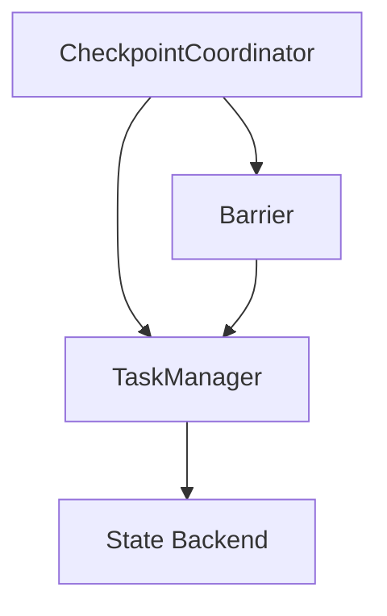
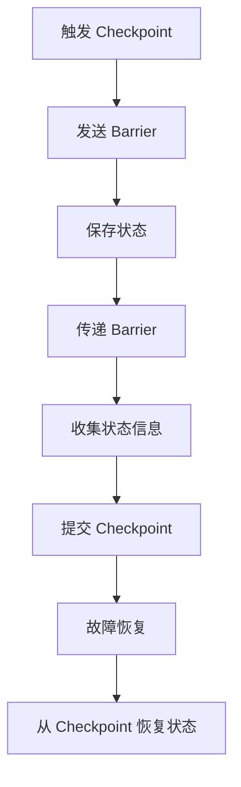

# Flink CheckpointCoordinator原理与代码实例讲解

## 1.背景介绍

Apache Flink 是一个分布式流处理框架，广泛应用于实时数据处理和大数据分析领域。为了保证数据处理的准确性和一致性，Flink 提供了强大的状态管理和容错机制，其中 Checkpoint 是关键技术之一。CheckpointCoordinator 是 Flink 中负责管理 Checkpoint 的核心组件。本文将深入探讨 CheckpointCoordinator 的原理、算法、实现细节，并通过代码实例帮助读者更好地理解其工作机制。

## 2.核心概念与联系

### 2.1 Checkpoint

Checkpoint 是 Flink 用于保存作业状态的快照，确保在故障发生时可以从最近的 Checkpoint 恢复，保证数据处理的准确性和一致性。

### 2.2 CheckpointCoordinator

CheckpointCoordinator 是 Flink 中负责协调和管理 Checkpoint 的组件。它负责触发 Checkpoint、协调各个 Task 的状态保存、以及在故障发生时从 Checkpoint 恢复状态。

### 2.3 State Backend

State Backend 是 Flink 用于存储状态的后端，可以是内存、文件系统或分布式存储系统。CheckpointCoordinator 与 State Backend 紧密配合，共同完成状态的保存和恢复。

### 2.4 Barrier

Barrier 是 Flink 用于标识 Checkpoint 边界的特殊记录，确保在流处理过程中各个 Task 的状态一致性。

### 2.5 关系图



## 3.核心算法原理具体操作步骤

### 3.1 Checkpoint 触发

CheckpointCoordinator 定期触发 Checkpoint，向所有 Task 发送 Barrier，标识 Checkpoint 的开始。

### 3.2 状态保存

各个 Task 收到 Barrier 后，保存当前状态到 State Backend，并将 Barrier 传递给下游 Task。

### 3.3 状态提交

所有 Task 完成状态保存后，CheckpointCoordinator 收集各个 Task 的状态信息，完成 Checkpoint 的提交。

### 3.4 状态恢复

在故障发生时，CheckpointCoordinator 从最近的 Checkpoint 恢复各个 Task 的状态，确保作业继续执行。

### 3.5 算法流程图



## 4.数学模型和公式详细讲解举例说明

### 4.1 状态一致性

Flink 保证状态的一致性，即在 Checkpoint 过程中，各个 Task 的状态在同一时间点上是一致的。设 $S_i$ 为第 $i$ 个 Task 的状态，$C_k$ 为第 $k$ 个 Checkpoint，则有：

$$
C_k = \{S_1, S_2, \ldots, S_n\}
$$

其中，$n$ 为 Task 的数量。

### 4.2 状态保存时间

设 $T_i$ 为第 $i$ 个 Task 保存状态的时间，$T_{max}$ 为最大保存时间，则有：

$$
T_{max} = \max(T_1, T_2, \ldots, T_n)
$$

### 4.3 状态恢复时间

设 $R_i$ 为第 $i$ 个 Task 恢复状态的时间，$R_{max}$ 为最大恢复时间，则有：

$$
R_{max} = \max(R_1, R_2, \ldots, R_n)
$$

## 5.项目实践：代码实例和详细解释说明

### 5.1 Checkpoint 配置

在 Flink 作业中配置 Checkpoint：

```java
StreamExecutionEnvironment env = StreamExecutionEnvironment.getExecutionEnvironment();
env.enableCheckpointing(10000); // 每 10 秒触发一次 Checkpoint
```

### 5.2 自定义 State Backend

使用 RocksDB 作为 State Backend：

```java
StateBackend stateBackend = new RocksDBStateBackend("hdfs://namenode:40010/flink/checkpoints");
env.setStateBackend(stateBackend);
```

### 5.3 CheckpointListener 接口

实现 CheckpointListener 接口，处理 Checkpoint 事件：

```java
public class MyCheckpointedFunction implements CheckpointedFunction, CheckpointListener {
    @Override
    public void snapshotState(FunctionSnapshotContext context) throws Exception {
        // 保存状态
    }

    @Override
    public void initializeState(FunctionInitializationContext context) throws Exception {
        // 初始化状态
    }

    @Override
    public void notifyCheckpointComplete(long checkpointId) throws Exception {
        // Checkpoint 完成通知
    }
}
```

### 5.4 完整代码示例

```java
public class CheckpointExample {
    public static void main(String[] args) throws Exception {
        StreamExecutionEnvironment env = StreamExecutionEnvironment.getExecutionEnvironment();
        env.enableCheckpointing(10000);

        StateBackend stateBackend = new RocksDBStateBackend("hdfs://namenode:40010/flink/checkpoints");
        env.setStateBackend(stateBackend);

        DataStream<String> stream = env.socketTextStream("localhost", 9999);
        stream.map(new MyCheckpointedFunction())
              .print();

        env.execute("Checkpoint Example");
    }
}
```

## 6.实际应用场景

### 6.1 实时数据处理

在金融、物流等领域，实时数据处理需要保证数据的准确性和一致性，CheckpointCoordinator 提供了强大的容错机制。

### 6.2 大数据分析

在大数据分析中，数据量巨大且处理复杂，CheckpointCoordinator 确保在故障发生时可以快速恢复，保证分析结果的准确性。

### 6.3 机器学习

在机器学习模型训练中，CheckpointCoordinator 可以保存训练过程中的状态，确保在中断后可以继续训练，节省时间和资源。

## 7.工具和资源推荐

### 7.1 Flink 官方文档

Flink 官方文档提供了详细的 Checkpoint 机制介绍和使用指南，是学习和参考的最佳资源。

### 7.2 Flink 社区

Flink 社区活跃，提供了丰富的讨论和问题解答，可以在社区中获取帮助和支持。

### 7.3 开源项目

可以参考一些开源项目，了解 Checkpoint 在实际项目中的应用和实现。

## 8.总结：未来发展趋势与挑战

### 8.1 发展趋势

随着实时数据处理需求的增加，Flink 的 Checkpoint 机制将不断优化和完善，提供更高效、更可靠的状态管理和容错机制。

### 8.2 挑战

在大规模分布式系统中，Checkpoint 的性能和效率是一个重要挑战，需要不断优化算法和实现，提升系统的整体性能。

## 9.附录：常见问题与解答

### 9.1 Checkpoint 失败怎么办？

当 Checkpoint 失败时，Flink 会自动重试，可以通过配置重试次数和间隔来调整重试策略。

### 9.2 如何优化 Checkpoint 性能？

可以通过调整 Checkpoint 的间隔、并行度、State Backend 等参数来优化 Checkpoint 的性能。

### 9.3 Checkpoint 与 Savepoint 的区别？

Checkpoint 是自动触发的状态保存机制，而 Savepoint 是手动触发的状态保存机制，通常用于作业升级和迁移。

---

作者：禅与计算机程序设计艺术 / Zen and the Art of Computer Programming