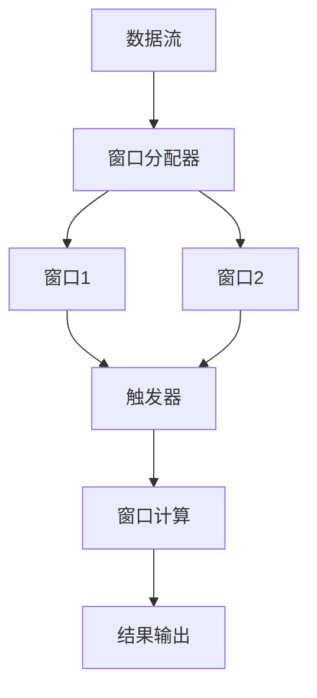

# Flink Window原理与代码实例讲解

## 1.背景介绍

Apache Flink 是一个开源的流处理框架，广泛应用于实时数据处理和大数据分析领域。Flink 的核心特性之一是其强大的窗口（Window）机制，它允许开发者在流数据上定义时间窗口，以便进行聚合、过滤和其他操作。窗口机制是流处理的关键，因为它能够将无限的数据流划分为有限的、可管理的块，从而实现实时分析和处理。

## 2.核心概念与联系

### 2.1 窗口类型

Flink 提供了多种窗口类型，每种类型适用于不同的应用场景：

- **滚动窗口（Tumbling Window）**：固定大小的窗口，不重叠。例如，每5分钟一个窗口。
- **滑动窗口（Sliding Window）**：固定大小的窗口，允许重叠。例如，每5分钟一个窗口，每1分钟滑动一次。
- **会话窗口（Session Window）**：基于不活动时间间隔的窗口。例如，当用户不活动超过30分钟时，窗口结束。

### 2.2 时间语义

Flink 支持三种时间语义：

- **事件时间（Event Time）**：基于事件生成的时间戳。
- **处理时间（Processing Time）**：基于事件到达Flink系统的时间。
- **摄取时间（Ingestion Time）**：基于事件进入Flink系统的时间。

### 2.3 窗口分配器与触发器

- **窗口分配器（Window Assigner）**：定义如何将数据分配到窗口中。
- **触发器（Trigger）**：定义何时对窗口中的数据进行计算。

## 3.核心算法原理具体操作步骤

### 3.1 窗口分配

窗口分配器负责将流数据分配到不同的窗口中。以滚动窗口为例，窗口分配器会根据时间戳将数据分配到固定大小的窗口中。

### 3.2 窗口触发

触发器决定何时对窗口中的数据进行计算。默认情况下，滚动窗口在窗口结束时触发计算。触发器可以自定义，例如在窗口中数据达到一定数量时触发。

### 3.3 窗口计算

窗口计算是对窗口中的数据进行聚合、过滤等操作。例如，计算窗口内的平均值、最大值等。

### 3.4 窗口合并

对于会话窗口，窗口合并是一个重要步骤。当两个会话窗口之间的间隔小于指定的会话间隔时，这两个窗口会被合并为一个。



## 4.数学模型和公式详细讲解举例说明

### 4.1 滚动窗口

滚动窗口的数学模型可以表示为：

$$
W_i = [T_0 + i \cdot \Delta T, T_0 + (i+1) \cdot \Delta T)
$$

其中，$W_i$ 表示第 $i$ 个窗口，$T_0$ 是起始时间，$\Delta T$ 是窗口大小。

### 4.2 滑动窗口

滑动窗口的数学模型可以表示为：

$$
W_{i,j} = [T_0 + i \cdot \Delta T, T_0 + i \cdot \Delta T + W)
$$

其中，$W_{i,j}$ 表示第 $i$ 个窗口的第 $j$ 次滑动，$T_0$ 是起始时间，$\Delta T$ 是滑动间隔，$W$ 是窗口大小。

### 4.3 会话窗口

会话窗口的数学模型可以表示为：

$$
W_i = [T_{start}, T_{end})
$$

其中，$T_{start}$ 是会话开始时间，$T_{end}$ 是会话结束时间，取决于不活动间隔。

## 5.项目实践：代码实例和详细解释说明

### 5.1 环境准备

首先，确保你已经安装了 Apache Flink 和 Java 开发环境。

### 5.2 代码实例

以下是一个简单的 Flink 滚动窗口示例：

```java
import org.apache.flink.api.common.eventtime.WatermarkStrategy;
import org.apache.flink.api.common.functions.AggregateFunction;
import org.apache.flink.streaming.api.datastream.DataStream;
import org.apache.flink.streaming.api.environment.StreamExecutionEnvironment;
import org.apache.flink.streaming.api.windowing.time.Time;
import org.apache.flink.streaming.api.windowing.windows.TimeWindow;
import org.apache.flink.streaming.api.windowing.assigners.TumblingEventTimeWindows;

public class FlinkWindowExample {
    public static void main(String[] args) throws Exception {
        // 创建执行环境
        final StreamExecutionEnvironment env = StreamExecutionEnvironment.getExecutionEnvironment();

        // 创建数据流
        DataStream<String> text = env.socketTextStream("localhost", 9999);

        // 解析数据并分配时间戳
        DataStream<Tuple2<String, Integer>> parsed = text
            .map(value -> {
                String[] parts = value.split(",");
                return new Tuple2<>(parts[0], Integer.parseInt(parts[1]));
            })
            .assignTimestampsAndWatermarks(WatermarkStrategy.forMonotonousTimestamps());

        // 应用滚动窗口
        DataStream<Tuple2<String, Integer>> windowed = parsed
            .keyBy(value -> value.f0)
            .window(TumblingEventTimeWindows.of(Time.seconds(10)))
            .aggregate(new AggregateFunction<Tuple2<String, Integer>, Tuple2<String, Integer>, Tuple2<String, Integer>>() {
                @Override
                public Tuple2<String, Integer> createAccumulator() {
                    return new Tuple2<>("", 0);
                }

                @Override
                public Tuple2<String, Integer> add(Tuple2<String, Integer> value, Tuple2<String, Integer> accumulator) {
                    return new Tuple2<>(value.f0, value.f1 + accumulator.f1);
                }

                @Override
                public Tuple2<String, Integer> getResult(Tuple2<String, Integer> accumulator) {
                    return accumulator;
                }

                @Override
                public Tuple2<String, Integer> merge(Tuple2<String, Integer> a, Tuple2<String, Integer> b) {
                    return new Tuple2<>(a.f0, a.f1 + b.f1);
                }
            });

        // 打印结果
        windowed.print();

        // 执行程序
        env.execute("Flink Window Example");
    }
}
```

### 5.3 详细解释

1. **创建执行环境**：`StreamExecutionEnvironment` 是 Flink 程序的入口。
2. **创建数据流**：从 socket 读取数据流。
3. **解析数据并分配时间戳**：将数据解析为二元组，并分配时间戳。
4. **应用滚动窗口**：对数据流应用滚动窗口，并定义聚合函数。
5. **打印结果**：将窗口计算结果打印到控制台。
6. **执行程序**：启动 Flink 程序。

## 6.实际应用场景

### 6.1 实时数据分析

Flink 窗口机制广泛应用于实时数据分析，例如实时监控、实时推荐系统等。通过定义合适的窗口，可以对实时数据进行聚合、过滤等操作，从而实现实时分析。

### 6.2 物联网数据处理

在物联网（IoT）领域，设备生成的数据通常是连续的、无界的。Flink 窗口机制可以将这些数据划分为有限的窗口，从而实现对物联网数据的实时处理和分析。

### 6.3 金融交易监控

在金融领域，实时监控交易数据是非常重要的。通过 Flink 窗口机制，可以对交易数据进行实时聚合和分析，从而及时发现异常交易行为。

## 7.工具和资源推荐

### 7.1 开发工具

- **IntelliJ IDEA**：强大的 Java 开发工具，支持 Flink 开发。
- **Apache Flink**：流处理框架，官方网站提供了详细的文档和示例。

### 7.2 学习资源

- **Flink 官方文档**：详细介绍了 Flink 的各个功能和使用方法。
- **Flink 社区**：活跃的社区，提供了丰富的学习资源和交流平台。
- **技术博客和书籍**：例如《Stream Processing with Apache Flink》。

## 8.总结：未来发展趋势与挑战

### 8.1 未来发展趋势

随着大数据和实时处理需求的不断增长，Flink 的应用场景将越来越广泛。未来，Flink 可能会在以下几个方面有所发展：

- **更高的性能**：通过优化算法和架构，提高 Flink 的处理性能。
- **更好的易用性**：简化开发流程，提供更友好的开发工具和接口。
- **更多的应用场景**：扩展到更多的领域，例如边缘计算、5G 网络等。

### 8.2 挑战

尽管 Flink 具有强大的功能，但在实际应用中仍然面临一些挑战：

- **复杂性**：Flink 的学习曲线较陡峭，需要开发者具备较高的技术水平。
- **资源消耗**：Flink 的高性能处理需要消耗大量的计算资源。
- **数据一致性**：在分布式环境中，保证数据一致性是一个难题。

## 9.附录：常见问题与解答

### 9.1 如何选择合适的窗口类型？

选择窗口类型取决于具体的应用场景。例如，如果需要对固定时间段的数据进行聚合，可以选择滚动窗口；如果需要对滑动时间段的数据进行分析，可以选择滑动窗口；如果需要根据不活动时间间隔划分窗口，可以选择会话窗口。

### 9.2 如何处理延迟数据？

Flink 提供了 Watermark 机制来处理延迟数据。通过设置合适的 Watermark，可以确保延迟数据在窗口计算中得到正确处理。

### 9.3 如何优化窗口计算性能？

可以通过以下几种方法优化窗口计算性能：

- **使用合适的窗口大小**：根据数据量和计算需求选择合适的窗口大小。
- **优化聚合函数**：确保聚合函数的实现高效。
- **调整并行度**：根据计算资源和数据量调整 Flink 程序的并行度。

---

作者：禅与计算机程序设计艺术 / Zen and the Art of Computer Programming