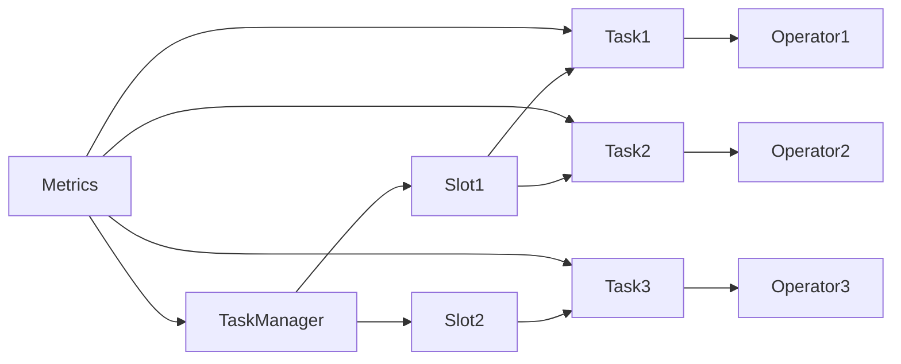

# FlinkTaskManager的性能指标与故障诊断

## 1.背景介绍
### 1.1 Flink简介
Apache Flink是一个开源的分布式流处理和批处理框架,由Apache软件基金会开发。Flink以数据并行和流水线方式执行任意流数据程序,Flink的流水线运行时系统可以执行批处理和流处理程序。Flink致力于在所有常见的集群环境中运行,并以内存速度和任意规模执行计算。

### 1.2 TaskManager在Flink中的作用
在Flink架构中,TaskManager是实际执行计算任务的工作节点。TaskManager从JobManager处接收需要部署的任务,部署启动后与上游TaskManager获取数据并计算,然后将计算结果发送给下游TaskManager或持久化存储。TaskManager启动后向ResourceManager注册slots信息,并与JobManager建立连接,它们之间通过Actor System进行通信。

### 1.3 TaskManager性能与故障对Flink作业的影响
TaskManager是Flink分布式计算的基石,其性能和稳定性直接决定了Flink作业的执行效率和运行状况。TaskManager负载过高、处理数据速度慢、频繁发生Full GC等性能问题会降低整个Flink作业的吞吐和延迟。而TaskManager宕机、任务异常失败等故障问题则会导致Flink作业中断,影响线上服务的连续性。因此深入研究TaskManager的性能指标与故障诊断,对Flink平台的稳定运行至关重要。

## 2.核心概念与联系
### 2.1 TaskManager
TaskManager是Flink集群的工作节点,负责执行Flink算子任务,与其他组件交互获取数据、上报状态。一个Flink集群通常由多个TaskManager节点组成,每个节点可以启动一个或多个TaskManager实例。

### 2.2 Slot
Slot是TaskManager的资源分配单元,代表TaskManager的一个固定资源子集,如固定大小的CPU和内存。TaskManager通过Slot来调度执行算子任务,每个Slot只能启动一个Task。Flink没有线程级别的任务调度,而是以Slot为单位调度任务。

### 2.3 Task
Task是Flink任务执行的最小单元,每个算子任务会被分割成多个Task在TaskManager的Slot中并行执行。Task包含算子的逻辑代码,在独立的线程中执行。

### 2.4 Operator
Operator代表Flink程序中的一个算子,如map、keyBy、reduce等。Flink程序由多个Operator顺序组成,每个Operator会被转换为一个或多个Task在TaskManager中执行。

### 2.5 Metrics
Flink提供了一个Metrics系统用于采集和报告Flink作业各个组件的性能指标,如TaskManager、Job、Task的CPU、内存、网络、吞吐、延迟等。这些Metrics指标可用于监控Flink作业运行状态,进行故障诊断与性能调优。

### 2.6 核心概念之间的关系
下面是一个Mermaid流程图,展示了TaskManager、Slot、Task、Operator、Metrics这些核心概念之间的关系:



TaskManager中包含多个Slot,每个Slot运行多个Task,每个Task执行一个Operator的逻辑。Metrics系统采集TaskManager、Slot、Task的性能指标。

## 3.核心算法原理具体操作步骤
TaskManager主要负责部署和执行Flink算子任务,其核心工作原理可以分为以下几个步骤:

### 3.1 注册Slot资源
TaskManager启动后,会向ResourceManager注册自己的Slot资源信息。Slot是TaskManager的资源调度单位,代表TaskManager的部分CPU和内存资源。ResourceManager会将TaskManager的Slot信息提供给JobManager,用于任务调度。

### 3.2 接收部署任务
JobManager根据Job的执行计划,将算子任务分配到各个TaskManager的Slot中执行。TaskManager接收到部署请求后,会在指定的Slot中启动Task线程来执行任务。

### 3.3 获取输入数据
Task启动后,会通过Flink的网络栈从上游TaskManager或数据源获取输入数据。数据通过网络传输到TaskManager后,会进行反序列化,转换为Java对象。

### 3.4 执行算子逻辑
Task拿到输入数据后,会执行算子的逻辑代码,如map、filter、keyBy、window等。执行过程中,Task会维护必要的状态,如窗口状态、聚合状态等。

### 3.5 发送计算结果
Task计算完成后,会将计算结果序列化后通过网络发送给下游TaskManager的Task。如果下游是Sink算子,则将数据写入外部存储系统。

### 3.6 记录Metrics指标
在整个任务执行过程中,TaskManager会持续采集各项性能指标数据,如接收记录数、发送记录数、CPU利用率、内存使用量、网络流量等。这些Metrics指标会定期上报给JobManager,用于监控和分析。

### 3.7 容错恢复
如果Task执行过程中发生异常失败,TaskManager会捕获异常并上报给JobManager。JobManager根据Flink的容错机制(如Checkpoint、Savepoint),从最近的一致状态中恢复Task,并重新调度执行。

## 4.数学模型和公式详细讲解举例说明
Flink中有一些核心的数学模型和公式,用于描述流处理过程中的各种行为。下面举例说明几个常见的数学模型:

### 4.1 滑动窗口模型
Flink支持在数据流上定义滑动窗口,对窗口内的数据进行聚合计算。滑动窗口可以用数学公式表示如下:

$window(i) = [i \times slide, i \times slide + size)$

其中,$i$代表窗口的索引,$slide$是窗口滑动步长,$size$是窗口大小。例如,定义一个大小为10分钟、滑动步长为5分钟的时间窗口,则窗口可以表示为:

$window(0) = [0, 10)$
$window(1) = [5, 15)$ 
$window(2) = [10, 20)$

### 4.2 水位线模型
Flink使用水位线(Watermark)机制来处理乱序事件流,水位线是一种时间戳,代表数据流中的进度。Watermark公式定义如下:

$watermark(t) = max(t_i - lateness | t_i \leq t)$

其中,$t$是当前时间戳,$t_i$是数据流中每个事件的时间戳,$lateness$代表允许事件延迟的最大时间。例如,如果数据流中观察到的最大事件时间戳是10:00,允许1分钟延迟,则此刻的Watermark为:

$watermark(now) = 10:00 - 00:01 = 09:59$

### 4.3 反压模型
Flink采用反压(Backpressure)机制来控制算子之间的数据流速,防止下游算子被上游数据流淹没。反压通过计算下游算子消费数据的速率与上游算子生产数据的速率之比来实现,公式如下:

$backpressure = \frac{下游消费速率}{上游生产速率}$

其中,消费速率和生产速率可以用单位时间内处理的记录数来衡量。例如,如果上游算子每秒产生1000条记录,而下游算子每秒只能处理500条,则反压值为:

$backpressure = \frac{500}{1000} = 0.5$

这意味着上游算子需要降低50%的发送速率,以匹配下游算子的处理能力。Flink会根据反压值动态调整算子之间的缓冲区大小和数据传输速率。

## 5.项目实践：代码实例和详细解释说明
下面通过一个简单的Flink代码实例,说明如何监控TaskManager的性能指标。

```scala
object TaskManagerMetricsExample {
  def main(args: Array[String]): Unit = {
    // 创建执行环境
    val env = StreamExecutionEnvironment.getExecutionEnvironment
    
    // 设置并行度
    env.setParallelism(4)
    
    // 监控TaskManager指标
    val tmMetrics = getRuntimeContext.getMetricGroup.addGroup("taskmanager")
    tmMetrics.gauge[Long, Gauge[Long]]("usedMemory", new Gauge[Long] {
      override def getValue: Long = {
        val mem = ManagementFactory.getMemoryMXBean.getHeapMemoryUsage
        mem.getUsed
      }
    })
    tmMetrics.gauge[Double, Gauge[Double]]("cpuLoad", new Gauge[Double] {
      override def getValue: Double = ManagementFactory.getOperatingSystemMXBean.getSystemLoadAverage
    })

    // 注册数据源
    val source = env.socketTextStream("localhost", 9999)
    
    // 注册Sink
    source.print()
    
    // 提交执行
    env.execute("TaskManager Metrics Example")
  }
}
```

代码解释:
1. 首先创建Flink流处理执行环境,并设置作业的并行度为4。
2. 调用getRuntimeContext.getMetricGroup获取Metric组,并定义一个名为"taskmanager"的子组。
3. 在"taskmanager"组下注册两个Gauge类型的Metric:
   - usedMemory:用于采集TaskManager的堆内存使用量。通过ManagementFactory获取JVM的MemoryMXBean,调用getHeapMemoryUsage().getUsed()获取当前堆内存使用量。
   - cpuLoad:用于采集TaskManager所在机器的CPU负载。通过ManagementFactory获取OperatingSystemMXBean,调用getSystemLoadAverage()获取最近1分钟的系统平均负载。
4. 注册一个Socket数据源,监听本地9999端口,并将接收到的数据通过print()算子输出。
5. 启动作业执行。

运行该示例程序后,Flink UI上可以看到名为taskmanager.usedMemory和taskmanager.cpuLoad的Metric指标,它们分别反映了TaskManager的内存和CPU使用情况。这些指标可以用于监控TaskManager的负载,进行故障诊断与性能调优。

## 6.实际应用场景
TaskManager的性能指标和故障诊断在实际的Flink应用中有广泛的应用场景,下面列举几个常见的场景:

### 6.1 流处理作业的监控与告警
在实时流处理场景下,需要对Flink作业的运行状态进行实时监控,及时发现和解决故障。我们可以采集TaskManager的各项性能指标(如CPU、内存、网络、GC等),设置合理的阈值,当指标超过阈值时触发告警,通知运维人员介入处理。例如,当TaskManager的内存使用率持续超过90%,或者出现频繁的Full GC时,就可能意味着发生了内存泄漏,需要排查原因并调优程序。

### 6.2 实时数仓的ETL优化
在实时数仓场景下,Flink常用于ETL数据的清洗、转换和加工。ETL作业通常具有较大的数据量和复杂的计算逻辑,对TaskManager的性能要求较高。我们可以通过分析TaskManager的Metrics指标,发现ETL作业的性能瓶颈,如数据倾斜、反压等问题。然后针对性地调整并行度、内存大小、State Backend等配置参数,优化作业的吞吐量和延迟。

### 6.3 机器学习模型的流式训练
Flink也可以用于机器学习模型的流式训练,支持在线学习算法如SGD、Kmeans等。在模型训练过程中,需要对训练速度、收敛情况、资源利用率等指标进行监控和优化。通过采集TaskManager的CPU利用率、读写流量等指标,可以分析模型训练的进度和效率。如果发现训练速度慢、资源利用率低,就需要调整并行度、批次大小、学习率等超参数,提高训练效率。

### 6.4 金融风控的实时计算
在金融风控领域,Flink被用于实时欺诈检测、反洗钱等场景。风控系统对实时性和准确性要求非常高,需要在毫秒级延迟内完成计算和预测。通过监控TaskManager的处理延迟、吞吐量、反压等指标,可以评估风控系统的实时性能。如果发现某些算子的延迟较高,就需要优化算法逻辑,消除性能瓶颈。同时还要监控TaskManager的故障情况,确保风