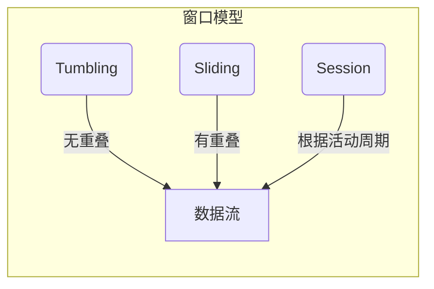
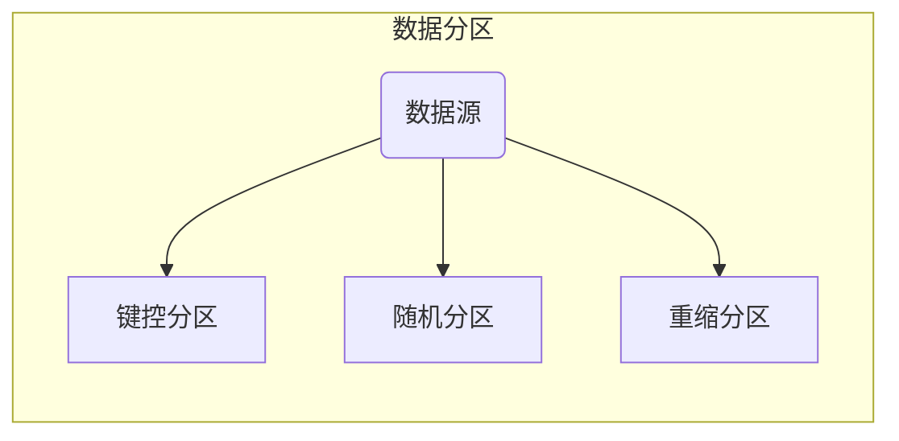
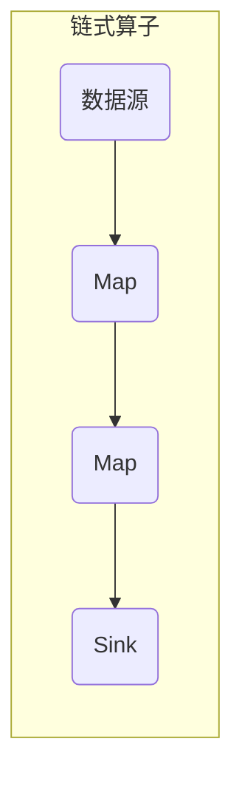
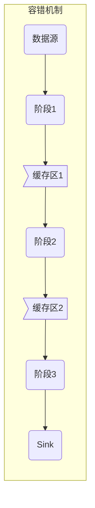

# Flink与其他大数据框架的比较

## 1. 背景介绍

随着大数据时代的到来,越来越多的企业和组织需要处理海量的数据流。传统的批处理系统已经无法满足实时数据处理的需求,因此出现了一系列新兴的流式数据处理框架,如Apache Spark Streaming、Apache Storm、Apache Flink等。在这些框架中,Apache Flink凭借其低延迟、高吞吐量、精确一次语义(Exactly-once)等优势,备受关注。

本文将对比分析Flink与其他流式计算框架(如Spark Streaming和Storm)的异同,深入探讨Flink的核心概念、架构设计和算法原理,并介绍其在实际应用场景中的实践。通过全面剖析,读者能够全面了解Flink的优缺点,把握其适用场景,为大数据实时计算的选型和实施提供参考。

## 2. 核心概念与联系

在对比Flink与其它框架之前,有必要先理解Flink的几个核心概念:

### 2.1 流处理与批处理

批处理(Batch Processing)是传统的大数据处理模式,它将有限的一批静态数据当做一个整体进行处理。而流处理(Stream Processing)则是持续不断地处理从数据源实时推送过来的动态数据流。

### 2.2 窗口(Window)

由于数据流是无限的,因此需要基于窗口模型对这些无限流进行切分,从而在有限的数据集上执行计算操作。Flink支持多种窗口模型,如滚动窗口(Tumbling)、滑动窗口(Sliding)、会话窗口(Session)等。



### 2.3 有状态计算

对于流式计算,由于输入是无限的数据流,因此需要维护状态(State)来保存中间计算结果。Flink支持各种状态,如键控状态(Keyed State)、广播状态(Broadcast State)等,并提供精确一次(Exactly-once)语义保证状态的一致性。

## 3. 核心算法原理具体操作步骤  

### 3.1 数据分区(Data Partitioning)

Flink采用分区(Partition)的方式将数据流分发到不同的并行实例上进行处理。常见的分区策略有:

- 键控分区(Key Partitioning):根据键值将相同键值的数据分发到同一个分区
- 随机分区(Random Partitioning):随机将数据分发到上游分区
- 重缩分区(Rebalance Partitioning):将上游分区数据平均分发到下游分区



### 3.2 链式算子(Chaining)

为了减少数据在算子之间的传输,Flink支持将多个算子链接在一起形成一个新的算子,从而避免不必要的序列化/反序列化操作和数据传输。



### 3.3 容错机制

Flink的容错机制基于流水线执行模型(Pipelined Execution Model)和轻量级快照(Lightweight Snapshot),能够在出现故障时快速恢复并保证精确一次(Exactly-once)语义。

1. 流水线执行模型:Flink将作业分解为多个阶段(Stage),每个阶段包含一个或多个算子,数据在阶段间传输。
2. 轻量级快照:Flink会定期为每个阶段做状态快照并持久化,出错时可以从最近的一次快照恢复。



## 4. 数学模型和公式详细讲解举例说明

在流式计算中,窗口(Window)是一个重要的概念,用于在无限的数据流上执行有限的计算操作。Flink支持多种窗口模型,如滚动窗口、滑动窗口和会话窗口等。下面将详细介绍滚动窗口和滑动窗口的数学模型。

### 4.1 滚动窗口(Tumbling Window)

滚动窗口将数据流划分为一个个不重叠的窗口,每个窗口内的数据都会被一次性计算。

给定一个事件流 $S = \{e_1, e_2, e_3, \ldots\}$,其中 $e_i$ 表示第 $i$ 个事件,我们定义一个基于时间的滚动窗口 $TW(size, offset)$,其中:

- $size$ 表示窗口的长度
- $offset$ 表示窗口的滑动步长,对于滚动窗口,它等于窗口长度 $size$

那么第 $i$ 个滚动窗口 $W_i$ 的范围为:

$$W_i = \{e_j | (i-1) \times offset \leq t(e_j) < i \times offset + size\}$$

其中 $t(e_j)$ 表示事件 $e_j$ 的时间戳。

例如,对于一个长度为5分钟的滚动窗口 $TW(5min, 5min)$,前两个窗口的范围为:

$$
\begin{aligned}
W_1 &= \{e_j | 0min \leq t(e_j) < 5min\} \\
W_2 &= \{e_j | 5min \leq t(e_j) < 10min\}
\end{aligned}
$$

### 4.2 滑动窗口(Sliding Window)

与滚动窗口不同,滑动窗口是可以重叠的。给定一个事件流 $S$,一个基于时间的滑动窗口 $SW(size, slide)$,其中:

- $size$ 表示窗口长度  
- $slide$ 表示窗口滑动步长,通常小于窗口长度 $size$

那么第 $i$ 个滑动窗口 $W_i$ 的范围为:  

$$W_i = \{e_j | (i-1) \times slide \leq t(e_j) < i \times slide + size\}$$

例如,对于一个长度为10分钟,步长为5分钟的滑动窗口 $SW(10min, 5min)$,前三个窗口的范围为:

$$
\begin{aligned}
W_1 &= \{e_j | 0min \leq t(e_j) < 10min\} \\  
W_2 &= \{e_j | 5min \leq t(e_j) < 15min\} \\
W_3 &= \{e_j | 10min \leq t(e_j) < 20min\}
\end{aligned}
$$

可以看到,第二个窗口 $W_2$ 与第一个窗口 $W_1$ 有5分钟的重叠,第三个窗口 $W_3$ 与第二个窗口 $W_2$ 也有5分钟的重叠。

通过上述公式,我们可以清晰地定义窗口的范围,从而在窗口上执行计算操作,如统计每个窗口的点击次数、计算窗口内的最大值等。

## 5. 项目实践:代码实例和详细解释说明

为了更好地理解Flink的使用,我们通过一个简单的实例来演示如何使用Flink进行流式单词计数(Word Count)。

### 5.1 环境准备

首先,我们需要从官网下载Flink的发行版,并解压到本地目录。这里我们使用Flink 1.14.4版本。

```bash
# 下载并解压Flink发行版
$ wget https://archive.apache.org/dist/flink/flink-1.14.4/flink-1.14.4-bin-scala_2.12.tgz
$ tar -xzf flink-1.14.4-bin-scala_2.12.tgz
```

### 5.2 编写Flink作业

接下来,我们使用Java编写一个Flink作业来实现单词计数。创建一个Maven项目,添加Flink依赖:

```xml
<dependency>
    <groupId>org.apache.flink</groupId>
    <artifactId>flink-java</artifactId>
    <version>1.14.4</version>
</dependency>
<dependency>
    <groupId>org.apache.flink</groupId>
    <artifactId>flink-streaming-java</artifactId>
    <version>1.14.4</version>
</dependency>
```

编写`WordCount`类:

```java
import org.apache.flink.api.java.utils.ParameterTool;
import org.apache.flink.streaming.api.datastream.DataStream;
import org.apache.flink.streaming.api.environment.StreamExecutionEnvironment;

public class WordCount {

    public static void main(String[] args) throws Exception {
        // 创建执行环境
        StreamExecutionEnvironment env = StreamExecutionEnvironment.getExecutionEnvironment();
        
        // 从命令行参数中获取输入文件路径
        ParameterTool params = ParameterTool.fromArgs(args);
        String inputPath = params.getRequired("input");
        
        // 从输入文件读取数据
        DataStream<String> text = env.readTextFile(inputPath);
        
        // 对数据执行Transformation操作
        DataStream<WordCount.WordWithCount> wordCounts = text
                .flatMap(new WordCount.TokenizerBolt())
                .keyBy(value -> value.word)
                .sum("count");
        
        // 输出结果
        wordCounts.print();
        
        // 执行作业
        env.execute("Word Count Example");
    }
    
    // 自定义的TokenizerBolt,用于将一行文本拆分为单词
    public static class TokenizerBolt implements FlatMapFunction<String, WordWithCount> { ... }
    
    // 存储单词和计数的POJO类
    public static class WordWithCount {
        public String word;
        public long count;
        ...
    }
}
```

上述代码实现了一个基本的单词计数功能:

1. 从命令行参数中获取输入文件路径
2. 从输入文件读取数据,将每行文本拆分为单词
3. 按单词进行分组,统计每个单词出现的次数
4. 将结果输出到控制台

### 5.3 运行Flink作业

接下来,我们将使用`./bin/flink run`命令在本地运行这个作业。首先,将代码打包为JAR文件:

```bash
# 打包代码
$ mvn clean package
```

然后,运行Flink作业,指定输入文件路径:

```bash
# 运行Flink作业
$ ./bin/flink run ./target/wordcount-1.0-SNAPSHOT.jar --input /path/to/input/file
```

作业运行后,将在控制台输出每个单词及其出现次数。

通过这个简单的实例,我们了解了如何使用Flink进行流式数据处理。Flink不仅支持核心的DataStream API,还提供了SQL和Python等多种编程模型,能够满足不同场景的需求。

## 6. 实际应用场景

Flink作为一款高性能的分布式流处理引擎,已经被众多公司和组织应用于生产环境中,涉及多个领域,如:

### 6.1 实时数据分析

- 电商网站:实时分析用户行为数据,为个性化推荐和动态定价提供支持
- 金融行业:对交易数据进行实时监控和分析,发现欺诈行为
- 物联网:分析实时传感器数据,实现预测性维护

### 6.2 实时数据处理

- 电信运营商:实时处理网络流量和计费数据
- 在线视频:实时处理视频数据,进行转码、剪辑等操作
- 实时广告投放:根据用户实时行为数据,精准投放广告

### 6.3 流式机器学习

- 实时推荐系统:基于用户实时行为,持续训练和更新推荐模型
- 实时欺诈检测:对金融交易数据进行实时建模,发现欺诈行为
- 实时预测分析:对工业设备、天气等数据进行实时预测

总的来说,Flink非常适合需要低延迟、高吞吐、精确一次语义的实时数据处理场景。

## 7. 工具和资源推荐

对于想要学习和使用Flink的开发者,这里推荐一些有用的工具和资源:

### 7.1 集成开发环境

- IntelliJ IDEA:支持Flink开发的