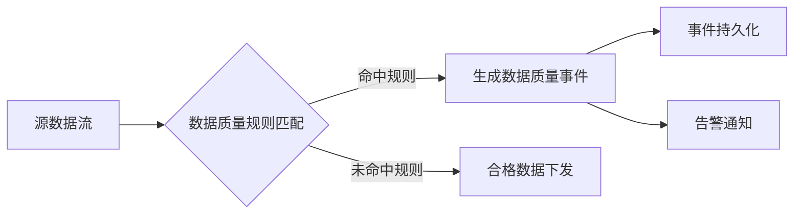

# Flink有状态流处理的数据质量事件处理

## 1.背景介绍
### 1.1 数据质量的重要性
在大数据时代,数据已经成为企业的重要资产。高质量的数据对于企业决策、业务运营、客户服务等方方面面都至关重要。然而,随着数据量的爆发式增长,数据源的多样化,以及数据处理流程的复杂化,数据质量问题日益突出,成为大数据应用面临的主要挑战之一。
### 1.2 实时数据质量监控的必要性
传统的数据质量管理主要针对离线数据,通过定期的数据分析和清洗来发现和解决质量问题。但在实时数据流场景下,这种事后的被动式管理方式已经无法满足需求。我们需要在数据流入的第一时间,就对数据质量进行实时监控,在问题发生的时候第一时间感知并处理,将质量问题对后续数据处理和业务的影响降到最低。
### 1.3 Flink在数据质量监控中的优势
Apache Flink是当前流行的分布式流处理引擎,具有低延迟、高吞吐、结果准确性高等优点。Flink提供了丰富的状态管理和时间语义机制,非常适合用于实时数据质量的监控。利用Flink,我们可以在数据的生命周期的每个阶段对其质量进行实时追踪和管理,实现数据质量闭环。

## 2.核心概念与联系
### 2.1 数据质量维度
数据质量通常从以下几个维度进行考量:
- 完整性:数据记录是否完整,是否存在缺失字段
- 准确性:数据内容是否准确,是否与真实世界一致 
- 一致性:数据在不同系统间是否保持一致
- 及时性:数据到达的时效性,是否存在延迟
- 唯一性:数据记录是否存在重复
### 2.2 数据质量规则 
数据质量规则是对数据的约束条件,用于判断数据是否"合格"。常见的质量规则包括:
- 字段非空约束
- 字段取值范围约束
- 字段唯一性约束
- 跨字段的关联性约束
- ......
### 2.3 数据质量事件
当数据违反了预设的质量规则时,就会产生相应的数据质量事件。数据质量事件记录了违规数据的详细信息,如发生时间、违反的规则、数据内容等,可用于数据修复和问题追溯。
### 2.4 Flink状态与数据质量 
Flink提供了强大的状态管理机制。我们可以利用Flink的状态来存储数据质量相关的信息,例如用于检测数据重复的布隆过滤器、用于统计数据延迟的状态等。Flink的状态是容错的,可以在故障恢复后自动恢复,保证了数据质量监控的连续性。

## 3.核心算法原理具体操作步骤
对于实时数据质量的监控,我们可以采用以下处理流程:



1. 数据源接入:将要监控的实时数据流接入到Flink系统。
2. 数据质量规则匹配:对每条数据进行质量规则的匹配校验。这一步可以利用Flink的CEP库(复杂事件处理)或者自定义的PatternStream实现。
3. 生成数据质量事件:对于未通过质量规则校验的数据,生成相应的数据质量事件。事件中要包含数据的详细信息以及所违反的质量规则等。
4. 事件持久化:将生成的数据质量事件持久化存储,如写入到Kafka、Elasticsearch等,用于后续的分析和处理。
5. 告警通知:对于严重的数据质量问题,可以发送告警通知,如邮件、短信、电话等,通知相关人员及时处理。
6. 合格数据下发:对于通过质量检测的合格数据,将其下发到后续的数据处理流程,如写入数据库、发送到下游的Kafka等。

## 4.数学模型和公式详细讲解举例说明
在数据质量监控中,我们常常需要用到一些概率统计模型。例如:
### 4.1 布隆过滤器(Bloom Filter)
布隆过滤器是一种概率型数据结构,用于快速判断一个元素是否在一个集合中。其原理是利用多个哈希函数将元素映射到一个位数组,并设置对应的位为1。当查询一个元素是否存在时,如果对应位都为1,则元素可能存在;如果有任意一位为0,则元素一定不存在。
布隆过滤器的数学模型如下:
假设布隆过滤器的位数组大小为 $m$,哈希函数个数为 $k$,要插入的元素个数为 $n$。
则某一个特定位在插入元素后仍为0的概率为:
$$ P_0 = (1 - \frac{1}{m})^{kn} \approx e^{-\frac{kn}{m}}$$
因此,布隆过滤器的误判率(将不存在的元素判断为存在)为:
$$ \epsilon = (1 - P_0)^k = (1 - e^{-\frac{kn}{m}})^k $$
我们可以利用布隆过滤器来实现数据重复性的检测。将数据ID插入到布隆过滤器,在新数据到来时,先判断其是否在布隆过滤器中,从而快速判断数据的重复性。
### 4.2 基数估计(Cardinality Estimation)
在数据质量监控中,我们有时需要统计数据集的基数,即不重复元素的个数。但对于大规模的数据集,精确统计基数代价很高。这时可以利用概率算法来进行基数估计。
常用的基数估计算法有Linear Counting、LogLog Counting等。以LogLog Counting为例,其数学原理如下:
设哈希函数 $h(x)$ 将元素 $x$ 映射到 $[0,1)$ 区间内的一个实数,且服从均匀分布。
定义 $ρ(x)$ 为 $h(x)$ 二进制表示中前导零的个数,则可以证明 $ρ(x)$ 近似服从参数为 $2^{ρ(x)}$ 的几何分布。
我们用 $m$ 个哈希函数对元素进行计算,得到 $m$ 个几何分布的样本 $ρ_1, ρ_2, ..., ρ_m$。
则数据集的基数可以估计为:
$$N_{est} = \alpha_m m^2 2^{\frac{1}{m}\sum_{j=1}^{m}ρ_j}$$
其中 $\alpha_m$ 为可计算的修正因子。
通过基数估计,我们可以在不存储完整数据的情况下,估算数据集的去重数量,从而判断数据重复的严重程度。

## 5.项目实践：代码实例和详细解释说明
下面给出利用Flink CEP实现数据质量监控的简要代码示例:

```scala
// 定义数据质量规则
val nonNullRule = Pattern.define[MyEvent]("nonNull")
  .where(_.getId != null)

val uniqueRule = Pattern.define[MyEvent]("unique")
  .where(_.getId != null)
  .within(Time.seconds(10))
  
// 将规则应用到数据流上  
val alerts: DataStream[String] = events
  .keyBy(_.getKey)
  .connect(nonNullRule)
  .process(new NonNullValidator)
  .keyBy(_.getId)
  .connect(uniqueRule)
  .process(new UniqueValidator)
  .flatMap(_.toString)

// 定义规则校验函数  
class NonNullValidator extends PatternProcessFunction[MyEvent, String] {
  override def processMatch(
      `match`: util.Map[String, util.List[MyEvent]],
      ctx: PatternProcessFunction.Context,
      out: Collector[String]): Unit = {
    val event = `match`.get("nonNull").get(0)
    if (event.getId == null) {
      out.collect(s"非空校验失败: ${event.toString}")
    }
  }
}

class UniqueValidator extends PatternProcessFunction[MyEvent, String] {
  lazy val bloom = new Bloom(1 << 20)
  
  override def processMatch(
      `match`: util.Map[String, util.List[MyEvent]],
      ctx: PatternProcessFunction.Context,
      out: Collector[String]): Unit = {
    val event = `match`.get("unique").get(0)
    if (bloom.mightContain(event.getId)) {
      out.collect(s"唯一性校验失败: ${event.toString}")  
    } else {
      bloom.put(event.getId)
    }
  }
}
```

以上代码中,我们首先定义了两个数据质量规则:非空规则和唯一性规则,分别用于校验数据的完整性和唯一性。然后将规则应用到数据流上,得到校验结果流。
在规则校验函数中,我们可以访问匹配到的事件,进行具体的校验逻辑。如果校验失败,就收集相应的信息并发送到下游。
其中唯一性校验利用了布隆过滤器。我们将数据ID插入布隆过滤器,如果新到的数据ID被判断为已存在,则认为违反了唯一性约束。

## 6.实际应用场景
数据质量监控在各个行业都有广泛的应用,例如:
- 电商实时订单数据的质量监控,如订单金额为负、收货地址为空等。
- 物联网设备数据的质量监控,如传感器数据超出正常范围、数据上报延迟等。
- 金融交易数据的质量监控,如交易金额异常、交易对手信息缺失等。
- 电信用户数据的质量监控,如用户资料不完整、用户行为异常等。

通过实时数据质量的监控,我们可以第一时间发现数据问题,避免问题数据流入下游,影响业务决策和系统运行。同时质量事件的统计分析也为数据治理提供了重要的依据。

## 7.工具和资源推荐
- Flink官网:https://flink.apache.org/
- Flink中文社区:https://flink-learning.org.cn/
- Flink CEP文档:https://nightlies.apache.org/flink/flink-docs-release-1.14/docs/libs/cep/
- 《Streaming Systems》 一书:系统讲解流处理的书籍,对Flink有较多介绍
- Flink Forward大会:Flink领域最高规格的会议,分享很多一线实践经验

## 8.总结：未来发展趋势与挑战
随着数字化转型的深入,实时数据质量监控将成为大数据平台不可或缺的一部分。未来这一领域的发展趋势和面临的挑战主要有:
- 质量规则的自动化挖掘:目前质量规则多依赖于人工设置,如何利用数据挖掘、机器学习等技术自动发现数据特征和规律,自动生成和优化质量规则,是一个有待探索的方向。
- 数据质量与业务语义的结合:除了通用的质量规则外,如何结合具体业务场景,挖掘和设置更有针对性、更精细化的质量规则,是提升监控效果的关键。
- 数据质量问题的自动化处理:监控发现质量问题后,如何尽可能自动化地进行数据修复、流程处理等,减少人工介入,也是一个有待攻克的难题。
- 多源异构数据的质量监控:随着数据源的多样化,如何实现对不同源、不同类型数据的统一质量监控,并处理好数据间的关联和一致性,也是一个复杂的挑战。

## 9.附录：常见问题与解答
### 9.1 Flink状态的选择?
Flink提供了多种状态存储的选择,如内存状态、RocksDB状态、数据库状态等。不同的状态后端适用于不同的场景:
- 内存状态的读写速度最快,但受内存容量限制,适合状态量不大的场景。
- RocksDB状态使用嵌入式的RocksDB作为KV存储,可以存储超大量级的状态,但读写性能不如内存,适合超大状态量的场景。
- 数据库状态可以利用外部数据库存储状态,具有持久性和可扩展性的优势,但依赖外部系统,增加了复杂度。
### 9.2 数据质量事件