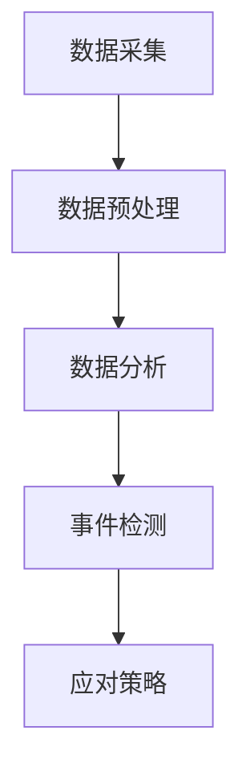

## 1.背景介绍

在当今这个数据驱动的时代，实时数据处理和分析成为了企业运营的重要支撑。Apache Flink，作为一个大数据处理框架，以其强大的实时处理能力，赢得了众多企业的青睐。然而，如何利用Flink进行实时安全事件检测与应对，却是一个令人头疼的问题。本文将深入探讨这个问题，并提供一种可能的解决方案。

## 2.核心概念与联系

在进行深入讨论之前，我们首先需要了解几个核心概念：

- Apache Flink：一种大数据处理框架，能够处理大量的流数据和批数据。

- 实时安全事件检测：通过分析实时数据，识别出可能存在的安全威胁。

- 应对策略：在检测到安全事件后，采取的应对措施。

这三个概念之间的联系是：我们使用Apache Flink进行实时安全事件检测，一旦检测到安全事件，就会启动应对策略。

## 3.核心算法原理具体操作步骤

接下来，我们来看一下如何使用Flink进行实时安全事件检测的具体步骤：

1. 数据采集：首先，我们需要收集实时的数据，这些数据可能来自于各种不同的源，如日志文件、网络流量、用户行为等。

2. 数据预处理：对收集到的数据进行预处理，如清洗、格式化等。

3. 数据分析：使用Flink对预处理后的数据进行实时分析，识别出可能存在的安全威胁。

4. 事件检测：如果在数据分析过程中，发现了可能的安全威胁，那么就会触发安全事件的检测。

5. 应对策略：一旦检测到安全事件，就会启动应对策略，如发送警报、阻止威胁行为等。

这个过程可以用以下的Mermaid流程图进行表示：



## 4.数学模型和公式详细讲解举例说明

在进行安全事件检测时，我们通常会使用一种叫做异常检测的方法。这种方法的基本思想是：如果一个数据点与大多数数据点的行为不一致，那么就认为这个数据点是异常的。

在实际应用中，我们通常会使用一种叫做Z-score的方法来进行异常检测。Z-score的计算公式为：

$$ Z = \frac{X - \mu}{\sigma} $$

其中，$X$是我们要检测的数据点，$\mu$是数据的平均值，$\sigma$是数据的标准差。如果一个数据点的Z-score大于某个阈值（如3），那么就认为这个数据点是异常的。

## 5.项目实践：代码实例和详细解释说明

下面，我们来看一个使用Flink进行实时安全事件检测的简单示例。在这个示例中，我们将使用Flink的DataStream API来处理数据。

```java
// 创建执行环境
StreamExecutionEnvironment env = StreamExecutionEnvironment.getExecutionEnvironment();

// 读取数据
DataStream<String> input = env.readTextFile("path/to/input");

// 数据预处理
DataStream<Event> events = input.map(new MapFunction<String, Event>() {
    @Override
    public Event map(String value) throws Exception {
        return Event.parse(value);
    }
});

// 数据分析和事件检测
DataStream<Event> alerts = events.keyBy("type")
    .timeWindow(Time.minutes(1))
    .apply(new WindowFunction<Event, Event, Tuple, TimeWindow>() {
        @Override
        public void apply(Tuple key, TimeWindow window, Iterable<Event> input, Collector<Event> out) throws Exception {
            int count = 0;
            for (Event event : input) {
                if (event.isSuspicious()) {
                    count++;
                }
            }
            if (count > THRESHOLD) {
                out.collect(new Event("ALERT", "Suspicious activity detected"));
            }
        }
    });

// 应对策略
alerts.addSink(new AlertSink());

// 启动任务
env.execute("Security Event Detection");
```

在这个示例中，我们首先创建了一个执行环境，然后读取了输入数据。接着，我们对数据进行了预处理，将原始的字符串数据转换为Event对象。然后，我们对数据进行了分析和事件检测，如果在一分钟内，同一类型的事件的数量超过了某个阈值，那么就会产生一个警报。最后，我们将警报发送到了一个Sink，这个Sink可以进行进一步的处理，如发送邮件或短信。

## 6.实际应用场景

Flink的实时安全事件检测与应对可以应用于很多场景，如：

- 网络安全：通过分析网络流量，可以检测到DDoS攻击、端口扫描等安全威胁。

- 系统安全：通过分析系统日志，可以检测到未授权的登录、异常的系统行为等安全威胁。

- 业务安全：通过分析用户行为，可以检测到欺诈、滥用等安全威胁。

## 7.工具和资源推荐

如果你想要进一步学习和使用Flink，以下是一些有用的资源：

- Apache Flink官方网站：https://flink.apache.org/
- Apache Flink GitHub仓库：https://github.com/apache/flink
- Apache Flink用户邮件列表：https://flink.apache.org/community.html#mailing-lists
- Apache Flink文档：https://flink.apache.org/documentation.html

## 8.总结：未来发展趋势与挑战

随着数据的增长和安全威胁的日益严重，Flink的实时安全事件检测与应对将会有更大的发展空间。然而，也存在一些挑战，如如何处理海量的数据、如何提高检测的准确性、如何减少误报等。

## 9.附录：常见问题与解答

1. Q: Flink适合处理哪些类型的数据？
   A: Flink可以处理各种类型的数据，包括日志文件、网络流量、用户行为等。

2. Q: Flink的实时处理能力如何？
   A: Flink的实时处理能力非常强大，可以处理每秒数百万条的数据。

3. Q: 如何降低Flink的误报率？
   A: 降低误报率的方法有很多，如调整阈值、使用更复杂的检测算法等。

作者：禅与计算机程序设计艺术 / Zen and the Art of Computer Programming