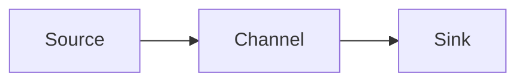

# Flume原理与代码实例讲解

## 1. 背景介绍
在大数据时代,海量数据的实时采集与传输是一个巨大的挑战。Apache Flume应运而生,成为了可靠、分布式、高可用的海量日志采集、聚合和传输的系统。本文将深入探讨Flume的原理,并结合代码实例进行讲解,帮助读者全面掌握Flume的使用。

### 1.1 Flume概述
#### 1.1.1 Flume定义
#### 1.1.2 Flume发展历程
#### 1.1.3 Flume在大数据生态中的地位

### 1.2 Flume的应用场景
#### 1.2.1 日志收集 
#### 1.2.2 数据采集
#### 1.2.3 数据传输

## 2. 核心概念与联系
要掌握Flume,首先需要理解其核心概念,包括Agent、Source、Channel、Sink等,以及它们之间的关系。

### 2.1 Agent
#### 2.1.1 Agent的定义
#### 2.1.2 Agent的组成

### 2.2 Source  
#### 2.2.1 Source的定义
#### 2.2.2 常见Source类型
##### 2.2.2.1 Avro Source
##### 2.2.2.2 Exec Source 
##### 2.2.2.3 Spooling Directory Source
##### 2.2.2.4 Kafka Source

### 2.3 Channel
#### 2.3.1 Channel的定义  
#### 2.3.2 常见Channel类型
##### 2.3.2.1 Memory Channel
##### 2.3.2.2 File Channel
##### 2.3.2.3 Kafka Channel

### 2.4 Sink
#### 2.4.1 Sink的定义
#### 2.4.2 常见Sink类型  
##### 2.4.2.1 HDFS Sink
##### 2.4.2.2 Hive Sink
##### 2.4.2.3 Logger Sink
##### 2.4.2.4 Avro Sink
##### 2.4.2.5 Kafka Sink

### 2.5 Flume架构与数据流
#### 2.5.1 单节点Agent架构
#### 2.5.2 多节点Agent架构
#### 2.5.3 Flume数据流向



## 3. 核心算法原理具体操作步骤
Flume的核心是事务性的数据传输,保证了端到端的数据可靠性。这依赖于两个核心算法:

### 3.1 Flume事务模型
#### 3.1.1 Put事务
#### 3.1.2 Take事务
#### 3.1.3 事务模型图解

### 3.2 Flume可靠性算法
#### 3.2.1 Push-Pull模型
#### 3.2.2 ACK机制
#### 3.2.3 失败重传

## 4. 数学模型和公式详细讲解举例说明
Flume的性能调优涉及队列理论和概率论模型,通过合理设置参数,可以在保证可靠性的同时提高吞吐量。

### 4.1 Little定律
$$L=\lambda W$$
其中,$L$表示队列长度,$\lambda$表示到达率,$W$表示等待时间。

### 4.2 指数分布与泊松分布
到达时间间隔服从指数分布:
$$P(X>t)=e^{-\lambda t}, t>0$$
到达数量服从泊松分布:  
$$P(N(t)=n)=\frac{(\lambda t)^n}{n!}e^{-\lambda t}, n=0,1,2,...$$

### 4.3 性能调优实例
假设到达率为1000条/s,处理时间为0.1s,计算所需Channel容量:
$$L=\lambda W=1000*0.1=100$$
因此,Channel容量应设置为大于100。

## 5. 项目实践：代码实例和详细解释说明
下面通过一个实际的代码实例,演示Flume的配置和使用。

### 5.1 需求描述
实时收集服务器日志到HDFS,日志格式为:
```
192.168.1.1 - - [01/Jul/2023:9:00:00 +0800] "GET /index.html HTTP/1.1" 200 1024
```

### 5.2 Flume配置
```properties
# Name the components on this agent
a1.sources = r1
a1.sinks = k1
a1.channels = c1

# Describe/configure the source
a1.sources.r1.type = exec
a1.sources.r1.command = tail -F /var/log/httpd/access_log

# Describe the sink
a1.sinks.k1.type = hdfs
a1.sinks.k1.hdfs.path = /flume/events/%y-%m-%d/%H%M/
a1.sinks.k1.hdfs.filePrefix = events-
a1.sinks.k1.hdfs.round = true
a1.sinks.k1.hdfs.roundValue = 10
a1.sinks.k1.hdfs.roundUnit = minute

# Use a channel which buffers events in memory
a1.channels.c1.type = memory
a1.channels.c1.capacity = 1000
a1.channels.c1.transactionCapacity = 100

# Bind the source and sink to the channel
a1.sources.r1.channels = c1
a1.sinks.k1.channel = c1
```

### 5.3 代码解释
- 定义了一个名为a1的Agent,包含Source、Channel、Sink三个组件
- Source为exec类型,通过tail命令实时读取日志文件
- Channel为memory类型,内存队列容量为1000,事务容量为100
- Sink为hdfs类型,将数据写入HDFS,并按时间分目录,每10分钟滚动一次

### 5.4 启动命令
```bash
bin/flume-ng agent --conf conf --conf-file conf/flume-conf.properties --name a1 -Dflume.root.logger=INFO,console
```

## 6. 实际应用场景
Flume在实际生产环境中有广泛的应用,下面列举几个典型场景。

### 6.1 日志收集
将分布式服务器上的日志统一收集到HDFS,便于后续的分析和处理。

### 6.2 数据采集
通过Flume接入各种数据源,如HTTP、TCP、Kafka等,实现数据的实时采集。

### 6.3 多级流动 
Flume支持多级Agent级联,将数据分层收集,减轻单点压力。

## 7. 工具和资源推荐
### 7.1 Flume官网
https://flume.apache.org/

### 7.2 Flume Github
https://github.com/apache/flume

### 7.3 Flume User Guide 
https://flume.apache.org/FlumeUserGuide.html

### 7.4 Flume Plugins
https://github.com/keedio/flume-plugins

## 8. 总结：未来发展趋势与挑战
Flume作为一个成熟的分布式日志收集框架,经历了多年的发展和完善,被广泛应用于各种实际场景中。未来Flume将向以下方向发展:

### 8.1 云原生支持
适配Kubernetes,提供更灵活的部署和扩缩容能力。

### 8.2 数据源扩展  
集成更多的数据源,如Flink、Pulsar等,丰富数据接入渠道。

### 8.3 智能化运维
引入AI算法,实现故障自动诊断和调优,提高系统可靠性。

同时,Flume也面临一些挑战:

### 8.4 性能瓶颈
单个Agent能力有限,大规模场景下需要复杂的多级部署。  

### 8.5 功能单一
Flume主要聚焦在数据传输,缺乏数据转换和处理能力。

### 8.6 替代方案
Kafka Connect、Logstash等新兴工具对Flume形成了冲击。

## 9. 附录：常见问题与解答
### 9.1 Flume与Kafka的区别是什么？
Flume侧重数据传输,Kafka侧重数据存储。Flume适合轻量级的数据收集,Kafka适合海量数据积累。

### 9.2 Flume的可靠性如何保证？ 
Flume基于事务机制,保证每个事件都被可靠传输。同时通过ACK机制和重传,保证端到端的数据一致性。

### 9.3 Flume的性能如何优化？
可以从以下几个方面优化Flume性能:
- 增大Channel容量
- 采用File Channel 替代 Memory Channel
- 并行部署多个Agent
- 调整Source和Sink的Batch Size

### 9.4 Flume如何实现断点续传？
Flume本身不支持断点续传。可以通过定制Source,记录读取文件的偏移量,再重启时恢复上次位置。

### 9.5 Flume有哪些常见故障,如何排查？
- Source读取阻塞:检查数据源是否正常,增加Source线程数
- Channel堆积:增大Channel容量,优化Sink写入速度
- Sink写入失败:检查下游存储是否可用,调整重试策略

作者：禅与计算机程序设计艺术 / Zen and the Art of Computer Programming