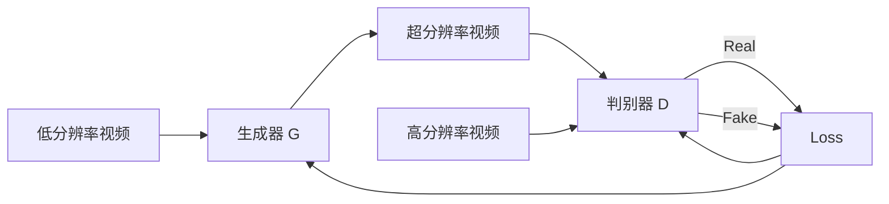

# GANs for Video Super-Resolution

## 1. 背景介绍

近年来,随着高清电视、智能手机等电子设备的普及,人们对视频质量的要求越来越高。然而,由于硬件设备、网络带宽等限制,很多视频内容的分辨率和清晰度都不尽如人意。为了提高视频质量,一种有效的方法是使用超分辨率(Super-Resolution, SR)技术对低分辨率视频进行重建,生成高分辨率视频。

传统的超分辨率方法主要基于插值、重建等传统图像处理技术,但效果有限。近年来,随着深度学习的发展,特别是生成对抗网络(Generative Adversarial Networks, GANs)的出现,视频超分辨率技术取得了突破性进展。本文将重点介绍视频超分辨率中的 GAN 方法,探讨其原理、模型、应用和挑战。

## 2. 核心概念与联系

在介绍 GANs 在视频超分辨率中的应用之前,我们先来了解一下几个核心概念:

### 2.1 超分辨率

超分辨率是指从低分辨率图像或视频重建高分辨率图像或视频的技术。其目标是恢复图像中丢失的高频细节,提高图像质量。传统 SR 方法主要有插值法、重建法等,但效果有限。

### 2.2 生成对抗网络

生成对抗网络(GANs)由 Ian Goodfellow 等人于2014年提出,是一种深度学习模型,由生成器(Generator)和判别器(Discriminator)组成。生成器试图生成以假乱真的样本,判别器则试图判断样本是真是假,两者互相博弈,最终使生成器能生成逼真的样本。

### 2.3 视频超分辨率

视频超分辨率是指利用一段低分辨率视频序列,重建对应的高分辨率视频序列。与图像超分辨率相比,视频超分辨率需要考虑时间维度上的连续性,避免帧与帧之间的闪烁、抖动等问题。

下图展示了视频超分辨率中 GANs 的基本原理:



## 3. 核心算法原理具体操作步骤

GAN 在视频超分辨率中的应用主要分为两个阶段:训练阶段和测试阶段。

### 3.1 训练阶段

1. 准备成对的低分辨率和高分辨率视频片段作为训练数据
2. 初始化生成器 G 和判别器 D 的参数
3. 循环执行以下步骤,直到模型收敛:
   - 从训练集中采样一批低分辨率视频片段输入 G,生成超分辨率视频
   - 将生成的超分辨率视频和真实高分辨率视频输入 D 
   - 计算 G 和 D 的损失函数,并执行梯度下降更新参数
4. 保存训练好的 G 和 D 模型参数

### 3.2 测试阶段 

1. 加载训练好的生成器 G 
2. 将待超分的低分辨率视频输入 G,生成超分辨率视频输出

## 4. 数学模型和公式详细讲解举例说明

GAN 的目标函数可以表示为一个二人零和博弈:

$$\min_G \max_D V(D,G) = \mathbb{E}_{x \sim p_{data}(x)}[\log D(x)] + \mathbb{E}_{z \sim p_z(z)}[\log (1-D(G(z)))]$$

其中,$x$表示真实样本,$z$表示随机噪声,$G(z)$表示生成器生成的样本,$D(x)$表示判别器输出的概率。

生成器 G 试图最小化目标函数,即:

$$\min_G \mathbb{E}_{z \sim p_z(z)}[\log (1-D(G(z)))]$$

判别器 D 试图最大化目标函数,即:

$$\max_D \mathbb{E}_{x \sim p_{data}(x)}[\log D(x)] + \mathbb{E}_{z \sim p_z(z)}[\log (1-D(G(z)))]$$

在视频超分辨率中,低分辨率视频 $x$ 通过生成器 $G$ 转换为超分辨率视频 $\hat{y}=G(x)$,然后送入判别器 $D$。判别器 $D$ 的目标是将 $\hat{y}$ 与真实高分辨率视频 $y$ 进行比较。

常用的生成器损失函数包括对抗损失、内容损失、感知损失等,例如:

$$L_G = \lambda L_{adv} + \alpha L_{content} + \beta L_{perceptual}$$

其中,$L_{adv}$是对抗损失,$L_{content}$是内容损失,$L_{perceptual}$是感知损失。$\lambda$,$\alpha$,$\beta$为平衡因子。

判别器损失函数一般是二分类交叉熵损失:

$$L_D = -\mathbb{E}_{y \sim p_{data}(y)}[\log D(y)] - \mathbb{E}_{x \sim p_{data}(x)}[\log (1-D(G(x)))]$$

## 5. 项目实践：代码实例和详细解释说明

下面是一个简单的 PyTorch 代码示例,展示如何训练一个用于视频超分辨率的 GAN 模型:

```python
import torch
import torch.nn as nn
import torch.optim as optim

# 定义生成器
class Generator(nn.Module):
    def __init__(self):
        super(Generator, self).__init__()
        # 生成器网络结构
        self.main = nn.Sequential(
            nn.Conv2d(3, 64, 3, 1, 1),
            nn.ReLU(True),
            # ... 
            nn.Conv2d(64, 3, 3, 1, 1),
            nn.Tanh()
        )
        
    def forward(self, x):
        return self.main(x)

# 定义判别器  
class Discriminator(nn.Module):
    def __init__(self):
        super(Discriminator, self).__init__()
        # 判别器网络结构
        self.main = nn.Sequential(
            nn.Conv2d(3, 64, 3, 1, 1), 
            nn.LeakyReLU(0.2, inplace=True),
            # ...
            nn.Conv2d(64, 1, 3, 1, 1),
            nn.Sigmoid()
        )
        
    def forward(self, x):
        return self.main(x)

# 初始化模型
generator = Generator()
discriminator = Discriminator()

# 定义损失函数和优化器
criterion = nn.BCELoss()
optimizer_G = optim.Adam(generator.parameters(), lr=0.0002, betas=(0.5, 0.999)) 
optimizer_D = optim.Adam(discriminator.parameters(), lr=0.0002, betas=(0.5, 0.999))

# 训练循环
for epoch in range(num_epochs):
    for i, (lr_videos, hr_videos) in enumerate(dataloader):
        
        # 训练判别器
        optimizer_D.zero_grad()
        real_output = discriminator(hr_videos)
        real_loss = criterion(real_output, torch.ones_like(real_output))
        
        fake_videos = generator(lr_videos)
        fake_output = discriminator(fake_videos.detach())
        fake_loss = criterion(fake_output, torch.zeros_like(fake_output))
        
        d_loss = real_loss + fake_loss
        d_loss.backward()
        optimizer_D.step()
        
        # 训练生成器
        optimizer_G.zero_grad()
        fake_videos = generator(lr_videos)
        fake_output = discriminator(fake_videos)
        g_loss = criterion(fake_output, torch.ones_like(fake_output))
        g_loss.backward()
        optimizer_G.step()
```

以上代码定义了一个简单的生成器和判别器网络结构,并展示了 GAN 的训练过程。实际应用中,还需要考虑更复杂的网络结构设计、损失函数选择、训练技巧等。

## 6. 实际应用场景

视频超分辨率技术在很多领域有广泛应用,例如:

- 视频流媒体:降低传输带宽,在用户端恢复高清画质 
- 视频监控:提高低分辨率监控视频的识别效果
- 医学影像:超分辨率重建医学视频图像,辅助诊断
- 电影修复:修复老旧电影胶片,提高分辨率和画质
- 虚拟现实:渲染高分辨率VR视频,提升沉浸感

## 7. 工具和资源推荐

- 深度学习框架:PyTorch, TensorFlow, Keras 等
- 视频超分辨率数据集:Vimeo-90K, Vid4, REDS 等  
- 经典 GAN 模型:SRGAN, ESRGAN, TecoGAN 等
- 相关学习资源:
  - 斯坦福 CS231N 课程
  - GAN 原论文:Generative Adversarial Networks
  - 书籍:Generative Deep Learning(David Foster)

## 8. 总结：未来发展趋势与挑战

GANs 给视频超分辨率技术带来了革命性进展,生成的超分辨率视频在视觉质量上已经接近真实高清视频。未来,视频超分辨率技术还有以下几个发展方向:

- 更大尺度的超分辨率重建,如 4K 到 8K
- 结合 Transformer 等其他先进模型,提高时空建模能力
- 提高模型的泛化性和鲁棒性,适应更多场景
- 降低模型计算量,实现实时超分辨率
- 探索 GAN 的可解释性和可控性

同时,视频超分辨率也面临一些挑战:

- 缺乏大规模高质量的视频超分辨率数据集
- 评价指标有待完善,难以全面衡量超分辨率视频的质量
- GAN 训练不稳定,容易出现模式崩溃问题
- 推理速度慢,难以实时处理超高分辨率视频

## 9. 附录：常见问题与解答

### 问题1:GAN 和传统 SR 方法相比有什么优势?

GAN 可以学习数据分布,生成更加逼真、细节丰富的超分辨率结果,弥补了传统方法在高频细节恢复上的不足。

### 问题2:视频超分辨率需要考虑时间信息吗?

需要。相邻帧之间存在时间冗余,考虑时间信息有助于提高超分辨率视频的时空一致性,避免闪烁、抖动等问题。

### 问题3:GAN 训练不稳定怎么办?

可以采用一些 GAN 改进技术,如 WGAN, SNGAN, Progressive Growing 等,提高训练稳定性。

### 问题4:超分辨率视频质量如何评价?

常用的评价指标有 PSNR, SSIM 等,但它们难以完全反映视觉质量。还可以考虑主观评价或任务驱动评价。

### 问题5:视频超分辨率的未来研究方向有哪些?

多尺度、高效、鲁棒、可控的视频超分辨率模型,以及 GAN 与其他先进模型的结合,是未来的重要研究方向。

作者：禅与计算机程序设计艺术 / Zen and the Art of Computer Programming