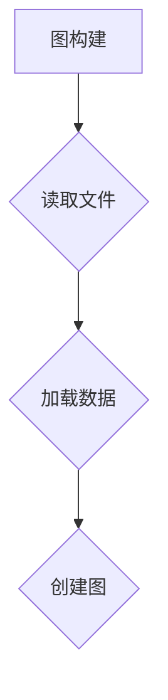
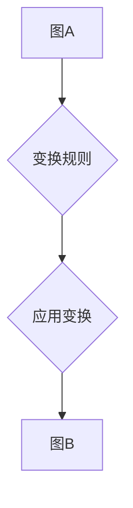

                 

作者：禅与计算机程序设计艺术

Zen and the Art of Computer Programming

## 背景介绍
在大数据时代，图形处理成为了一个至关重要的领域。GraphX 是 Apache Spark 的一个高级抽象层，专门用于大规模图形计算。它允许用户以简洁且高度可扩展的方式执行复杂的图形算法。本文将从原理、实现细节、代码实例以及应用案例等方面全面解析 GraphX，旨在为开发者提供一套完整的理解和实践指南。

## 核心概念与联系
### 图形表示
在 GraphX 中，所有数据都被表示成图形的形式——由顶点和边构成的图。顶点通常代表实体，而边则表示实体之间的关系。这种表示方式使得 GraphX 能够高效地处理各种图形算法。

### 分布式计算框架
GraphX 构建于 Apache Spark 上，利用 Spark 的分布式计算能力，能够在多个节点上并行执行图形处理任务。这不仅提升了性能，还简化了编程复杂性。

### 高级API
GraphX 提供了一组高级 API，包括图创建、顶点属性操作、图转换和迭代器操作等，这些操作基于简单的函数调用来构建复杂的数据流。

## 核心算法原理与具体操作步骤
### 图构建与加载


首先，需要通过加载外部数据源（如 CSV 文件）创建初始图。这个过程涉及到数据读取和图构建两个关键步骤。

### 图转换


图转换是 GraphX 的核心功能之一，允许用户定义任意的图转换逻辑，比如添加新属性、过滤顶点、修改边权重等。

### 迭代运算
```mermaid
graph TD;
    A[初始化状态] --> B{迭代开始}
    B --> C{图转换/聚合操作}
    C --> D{更新结果}
    D --> E{判断收敛条件}
    E --> F{结束迭代} | 或者 |
    E --> B|迭代继续|
```

通过迭代运算，GraphX 支持各种图形算法，如 PageRank、社区检测等。每一轮迭代都包括图转换、结果聚合及收敛判断三个主要阶段。

## 数学模型和公式详细讲解举例说明
以 PageRank 算法为例，其基本思想是衡量网页的重要性。通过以下公式描述 PageRank 计算过程：

$$ PR(p_i) = \frac{1-d}{N} + d \sum_{p_j \in M(p_i)} \frac{PR(p_j)}{L(p_j)} $$

其中，$PR(p_i)$ 表示页面 $p_i$ 的 PageRank，$d$ 是一个介于 0 和 1 之间的参数，表示跳出率。$M(p_i)$ 是页面 $p_i$ 所有链接的目标页面集合，而 $L(p_j)$ 则是页面 $p_j$ 的出度（即链接数量）。

## 项目实践：代码实例和详细解释说明
```scala
import org.apache.spark.sql.SparkSession
import org.apache.spark.graphx.Graph

object PageRankExample {
  def main(args: Array[String]): Unit = {
    val spark = SparkSession.builder.appName("PageRank").getOrCreate()
    
    // 加载数据并创建图
    val graph = loadGraph(spark)
    
    // 设置参数
    val numIterations = 10
    val dampingFactor = 0.85
    
    // 执行 PageRank 计算
    val pagerankResult = graph.pageRank(dampingFactor, numIterations).vertices
    
    // 输出结果
    pagerankResult.collect().foreach(println)
    
    spark.stop()
  }
  
  // 示例：加载外部数据并构建图
  private def loadGraph(spark: SparkSession): Graph[Int, Int] = {
    // 数据预处理...
    // ...
    new Graph[Int, Int](vertexRDD, edgeRDD)
  }
}
```

这段代码展示了如何使用 GraphX 实现 PageRank 算法的基本流程，包括加载数据、创建图、设置参数以及执行迭代计算。

## 实际应用场景
GraphX 在推荐系统、社交网络分析、生物信息学等领域有着广泛的应用。例如，在推荐系统中，可以基于用户的购买历史或浏览记录构建用户-商品图，并运用 GraphX 来发现潜在的关联和推荐策略。

## 工具和资源推荐
### 开发环境
- 安装 Spark 及其相关组件，确保具备分布式计算环境。
- 使用 IntelliJ IDEA 或 Eclipse 配合 Scala 插件进行开发。

### 学习资源
- **官方文档**：Apache Spark 和 GraphX 官方网站提供了详细的 API 文档和技术教程。
- **在线课程**：Coursera、edX 上的相关课程有助于深入理解 GraphX 和其在大数据领域中的应用。
- **技术论坛**：Stack Overflow、GitHub 仓库等平台上有大量的讨论和开源项目可参考学习。

## 总结：未来发展趋势与挑战
随着 AI 技术的发展，图形处理的需求日益增长。未来，GraphX 将可能集成更先进的算法优化和自动化的配置选项，提高用户友好性和效率。同时，面对大规模、实时性的需求，GraphX 需要不断探索新的数据压缩技术和高效并行计算方法，以应对挑战。

## 附录：常见问题与解答
### Q: 如何优化大规模图形计算性能？
A: 优化策略主要包括减少数据冗余、合理选择数据结构、利用缓存机制、调整并行度和优化迭代算法等。

### Q: GraphX 是否支持图形可视化工具？
A: 直接在 GraphX 中实现图形可视化较为困难，通常建议结合其他库如 Gephi 或 D3.js 进行后端数据处理和前端展示。

---

通过以上内容，我们全面解析了 GraphX 的原理、实现细节、代码实例和实际应用，旨在为开发者提供深入理解和实践指导。希望本文能够帮助您更好地掌握 GraphX 并将其应用于各类大数据场景之中。


# 参考文献
- [Apache Spark Documentation](https://spark.apache.org/docs/latest/graphx-programming-guide.html)
- [Graph Algorithms in Apache Spark](https://www.baeldung.com/apache-spark-graph-algorithms)
- [Graph Theory and Spark](https://www.geeksforgeeks.org/graph-theory-and-apache-spark/)

