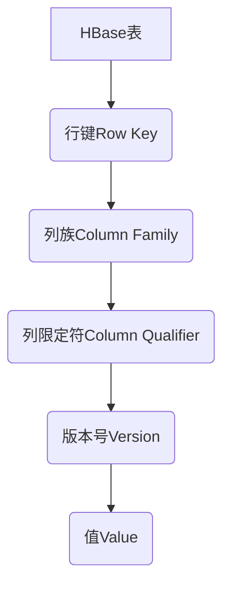
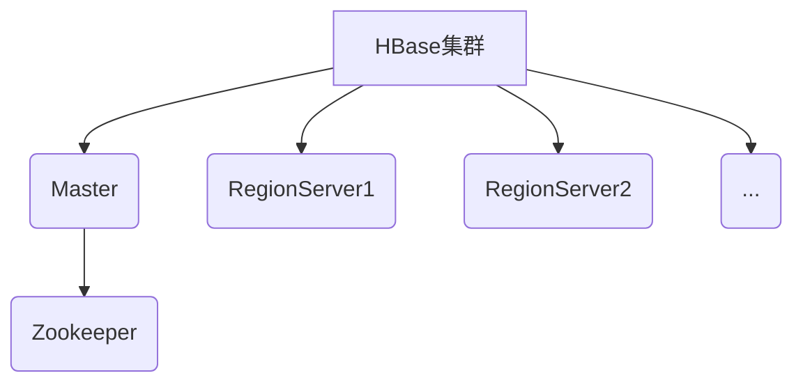
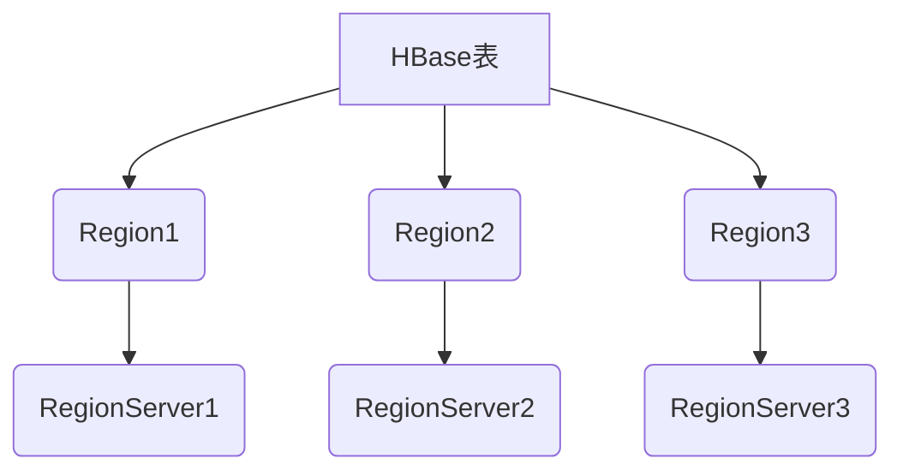
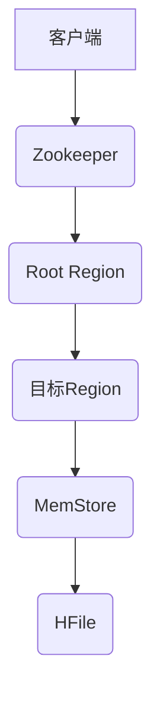
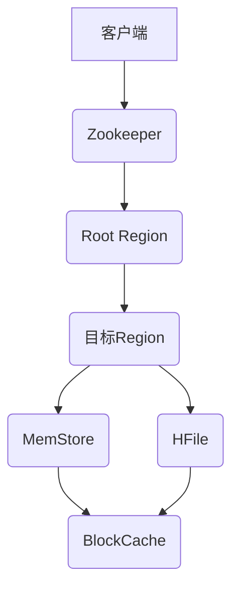
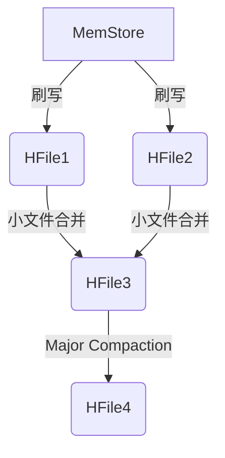
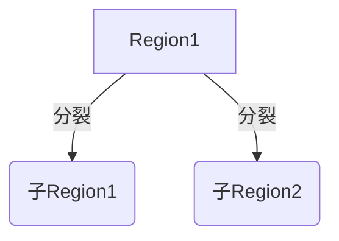

好的,我会严格遵守您提出的约束条件,以专业的技术语言写一篇关于HBase原理与代码实例的博客文章。

# HBase原理与代码实例讲解

## 1.背景介绍

### 1.1 大数据时代的到来

当今世界,数据的产生和积累速度前所未有。来自互联网、物联网、社交媒体等各个领域的海量数据不断涌现,给传统的数据存储和处理系统带来了巨大挑战。为了应对这一挑战,大数据技术应运而生。

### 1.2 大数据技术概述 

大数据技术主要包括数据采集、存储、处理和分析四个环节。其中,分布式文件系统(如HDFS)和NoSQL数据库(如HBase)是存储海量数据的重要组成部分。

### 1.3 HBase简介

Apache HBase是一个分布式、可伸缩的大数据存储系统,建立在Hadoop文件系统之上。它支持海量结构化数据的随机实时读写访问,可用于存储包括网络数据在内的各种数据类型。HBase具有高可靠性、高性能、可伸缩性和易用性等优点,被广泛应用于Facebook、Salesforce等知名公司。

## 2.核心概念与联系

### 2.1 HBase数据模型

HBase采用了BigTable的数据模型,将数据存储在一个三维的稀疏、分布式、持久化的多维映射表中。



- **行键(Row Key)**：用来检索记录的主键,按字典序存储在表中。
- **列族(Column Family)** ：在创建表时就必须确定列族,是列的逻辑分组。
- **列限定符(Column Qualifier)** ：列的名称。
- **版本号(Version)** ：每个单元格中的数据都保存了多个版本,版本号由时间戳来区分。
- **值(Value)** ：单元格中的数据内容。

### 2.2 HBase逻辑架构

HBase逻辑架构主要由Master、RegionServer和Zookeeper三部分组成。



- **Master**：负责监控整个集群状态,均衡Region分布。
- **RegionServer**：存储和处理HBase的实际数据,由多个Region组成。
- **Zookeeper**：用于存储集群元数据和协调集群状态。

### 2.3 Region划分机制

HBase自动将数据按行键范围划分为多个Region,并将Region均匀分布在各个RegionServer上。



当单个Region过大时,会自动分裂为两个子Region,以保持负载均衡。这种自动分区和负载均衡机制使HBase能够无限水平扩展。

## 3.核心算法原理具体操作步骤  

### 3.1 写数据流程

1. 客户端向Zookeeper获取Root Region位置。
2. 通过Root Region定位到存储目标数据的Region。
3. 将数据写入对应的Region内存缓存(MemStore)。
4. 定期将MemStore中的数据刷写到HFile磁盘文件。



### 3.2 读数据流程 

1. 客户端向Zookeeper获取Root Region位置。  
2. 通过Root Region定位到存储目标数据的Region。
3. 先从MemStore查找,如果不存在则从HFile磁盘文件中读取。
4. 将数据块缓存在BlockCache中,提高下次读取效率。



### 3.3 MemStore刷写与合并

1. 当MemStore达到设定阈值时,就会创建一个新的MemStore文件并刷写为HFile。
2. 定期合并小HFile为大HFile,减少文件个数。
3. 当一个Region的所有HFile超过一定阈值时,会触发Major Compaction,将所有HFile合并成一个文件。



### 3.4 Region分裂

1. 当单个Region达到设定的最大值时,会将其分裂为两个子Region。
2. 分裂键的选择很重要,应尽量保证数据热点不会集中在单个Region。



## 4.数学模型和公式详细讲解举例说明

### 4.1 LSM树数据结构

HBase底层使用了LSM(Log-Structured Merge-Tree)树这种数据结构来高效管理海量数据。LSM树将内存数据(MemStore)和磁盘数据(HFile)分开组织,充分利用了内存和磁盘的不同优势。

LSM树的写入过程非常高效,只需在内存中追加写操作,周期性地将数据刷写到磁盘文件即可。读取时,需要从内存和磁盘中查找并合并数据。

LSM树的写入复杂度为$O(1)$,读取复杂度为$O(log_BN)$,其中B为每层节点的大小,N为总数据量。

### 4.2 Bloom Filter算法

Bloom Filter是一种高效的概率数据结构,用于快速判断某个元素是否存在于集合中。HBase利用Bloom Filter来减少磁盘查找次数,从而提高读取效率。

Bloom Filter由一个长度为m的位向量和k个哈希函数组成。插入元素时,将其哈希值对应的k个位置置为1;查询元素时,如果对应的k个位置有一个为0,则该元素一定不存在,否则可能存在。

Bloom Filter存在一定的错误率,当插入的元素越多,错误率就越高。错误率可由公式计算:

$$
p = (1 - e^{-kn/m})^k
$$

其中,n为插入元素个数,m为位向量长度,k为哈希函数个数。

### 4.3 Region负载均衡算法

为了保证HBase集群的高可用性和负载均衡,需要将Region尽量均匀地分布在各个RegionServer上。HBase采用了基于Stochastic Weight的Region负载均衡算法。

该算法会定期计算每个RegionServer的负载,并将高负载的Region移动到低负载的RegionServer上。计算RegionServer负载的公式为:

$$
L = \sum_{i=1}^{n}(s_i + r_i \times w_r + x_i \times w_x + e_i \times w_e)
$$

其中:
- $s_i$为使用存储的量
- $r_i$为使用内存的量,权重$w_r$
- $x_i$为数据入口数量,权重$w_x$  
- $e_i$为Region个数,权重$w_e$
- $w_r$、$w_x$、$w_e$为可配置权重

## 5.项目实践：代码实例和详细解释说明

### 5.1 创建表

```java
// 创建表描述符
HTableDescriptor tableDescriptor = new HTableDescriptor(TableName.valueOf("my_table"));

// 创建列族描述符
HColumnDescriptor family1 = new HColumnDescriptor("family1");
HColumnDescriptor family2 = new HColumnDescriptor("family2");

// 设置列族属性
family1.setMaxVersions(5); // 最多保留5个版本
family2.setCompressionType(Compression.Algorithm.SNAPPY); // 使用Snappy压缩

// 将列族添加到表中 
tableDescriptor.addFamily(family1);
tableDescriptor.addFamily(family2);

// 创建表
admin.createTable(tableDescriptor);
```

上述代码创建了一个名为"my_table"的表,包含两个列族"family1"和"family2"。"family1"最多保留5个版本,"family2"使用Snappy压缩算法。

### 5.2 写入数据

```java
// 获取表
Table table = connection.getTable(TableName.valueOf("my_table"));

// 创建Put实例
Put put = new Put(Bytes.toBytes("row1"));
put.addColumn(Bytes.toBytes("family1"), Bytes.toBytes("col1"), Bytes.toBytes("value1"));
put.addColumn(Bytes.toBytes("family2"), Bytes.toBytes("col2"), Bytes.toBytes("value2"));

// 写入数据
table.put(put);
table.close();
```

上述代码向"my_table"表的"row1"行插入了两个值,分别位于"family1:col1"和"family2:col2"列。

### 5.3 扫描数据

```java
// 获取表
Table table = connection.getTable(TableName.valueOf("my_table"));

// 创建Scan实例
Scan scan = new Scan();
scan.addFamily(Bytes.toBytes("family1")); // 只扫描family1列族

// 创建Filter过滤器
FilterList filterList = new FilterList();
filterList.addFilter(new PrefixFilter(Bytes.toBytes("row"))); // 只扫描行键前缀为"row"的行
filterList.addFilter(new QualifierFilter(CompareOp.EQUAL, new BinaryComparator(Bytes.toBytes("col1")))); // 只扫描列限定符为"col1"的列

scan.setFilter(filterList);

// 执行扫描
ResultScanner scanner = table.getScanner(scan);
for (Result result : scanner) {
    // 处理扫描结果
}
scanner.close();
table.close();
```

上述代码对"my_table"表执行了扫描操作,只扫描了"family1"列族中行键前缀为"row",列限定符为"col1"的列。通过设置合适的过滤器,可以有效减少数据传输量,提高扫描效率。

## 6.实际应用场景

### 6.1 物联网数据存储

在物联网领域,海量传感器会不断产生大量结构化数据,这些数据需要高效地存储和访问。HBase凭借其高性能的随机读写能力和线性扩展性,非常适合存储物联网数据。

### 6.2 内容存储

内容分发网络(CDN)、社交网络等需要存储大量多媒体内容,如图片、视频等。HBase能够高效地存储这些非结构化数据,并支持快速的随机访问。

### 6.3 时序数据存储

监控系统、金融交易系统等需要存储大量按时间戳排列的时序数据。HBase天然支持版本控制,可以将数据的不同版本按时间戳存储,并高效地查询特定时间段的数据。

### 6.4 地理数据存储

HBase也可以用于存储地理位置数据,如基站信息、地图数据等。通过将地理坐标编码为行键,就可以高效地查询特定区域范围内的数据。

## 7.工具和资源推荐

### 7.1 HBase Shell

HBase Shell是HBase自带的命令行工具,支持通过简单命令管理HBase集群、执行DDL和DML操作。对于学习和管理HBase都很有帮助。

### 7.2 HBase Web UI

HBase提供了基于Web的监控和管理界面,可以直观地查看集群状态、Region分布、读写统计等信息。

### 7.3 Hue

Hue是一个开源的Hadoop UI系统,提供了对HBase的可视化管理和查询功能,操作更加友好。

### 7.4 云服务

除了自建HBase集群,也可以使用云服务提供商(如AWS、阿里云)提供的托管HBase服务,省去了部署和运维的麻烦。

### 7.5 开源项目

GitHub上有许多优秀的HBase相关开源项目,如HBase Book、HBase Coprocessor等,可以作为学习资源。

## 8.总结:未来发展趋势与挑战

### 8.1 云原生化

未来HBase将继续向云原生化方向发展,支持在Kubernetes等云原生环境中运行,并与其他云原生组件(如Prometheus)更好