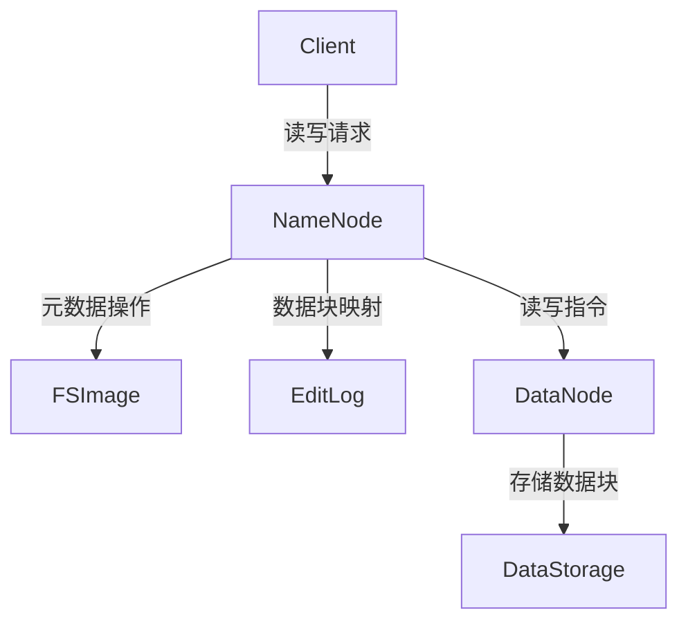
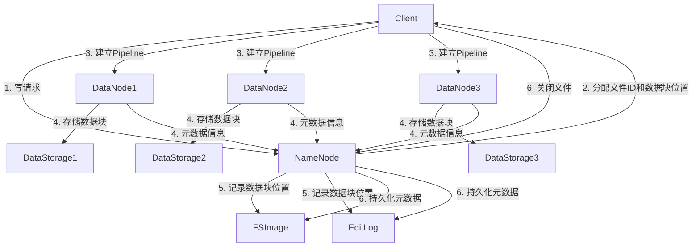
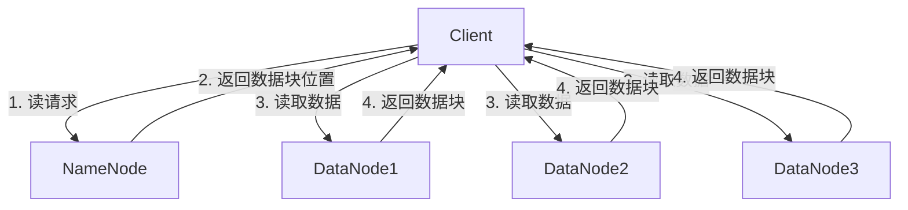
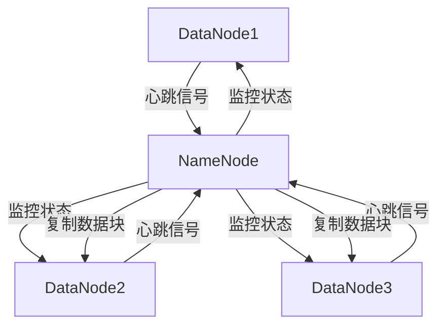

# HDFS 原理与代码实例讲解

## 1. 背景介绍

### 1.1 大数据时代的到来

随着互联网、移动互联网和物联网的快速发展,数据呈现出爆炸式增长。根据IDC(国际数据公司)的预测,到2025年,全球数据总量将达到175ZB(1ZB=1万亿GB)。传统的数据存储和处理方式已经无法满足日益增长的大数据需求,因此分布式文件系统(Distributed File System)应运而生。

### 1.2 HDFS的重要性

Apache Hadoop分布式文件系统(HDFS)是Apache Hadoop项目的核心组件之一,它是一个高度容错的分布式文件系统,旨在存储大型数据集并支持大型数据集的分析应用。HDFS被设计用于跨计算机集群部署,可以提供高吞吐量的数据访问。它具有高容错性、可伸缩性和高度可用性等特点,非常适合存储和处理大数据。

## 2. 核心概念与联系

### 2.1 HDFS架构

HDFS遵循主从架构,主要由以下几个组件组成:

- **NameNode(NN)**: 管理文件系统的命名空间和客户端对文件的访问。它是HDFS集群的主服务器,负责维护文件系统的目录树和文件与数据块的映射信息。
- **DataNode(DN)**: 存储实际数据块并执行数据块的读写操作。集群中的每个节点都运行一个DataNode守护进程。
- **客户端(Client)**: 向HDFS发送读写请求,与NameNode和DataNode通信。



### 2.2 HDFS文件块

HDFS将文件划分为一个或多个数据块(Block),并将这些块存储在一组DataNode上。默认情况下,每个块的大小为128MB,可以根据需要进行配置。

### 2.3 复制策略

为了提高容错性和可用性,HDFS采用数据块复制策略。每个数据块都会复制多个副本(默认为3个副本),分布存储在不同的DataNode上。如果某个DataNode发生故障,NameNode可以从其他DataNode获取数据块的副本,从而确保数据的可用性。

## 3. 核心算法原理具体操作步骤

### 3.1 写数据流程

1. 客户端向NameNode发送写请求,获取文件的元数据信息。
2. NameNode为文件分配一个唯一的文件ID,并确定数据块的存储位置(DataNode)。
3. 客户端与指定的DataNode建立管道(Pipeline),开始向DataNode传输数据。
4. DataNode在本地磁盘上存储数据块,并将数据块的元数据信息(块ID、长度等)发送给NameNode。
5. NameNode记录数据块的位置信息,以便后续读取。
6. 客户端关闭文件后,NameNode将元数据信息持久化到磁盘上。



### 3.2 读数据流程

1. 客户端向NameNode发送读请求,获取文件的元数据信息。
2. NameNode返回文件的数据块位置信息(DataNode列表)。
3. 客户端与DataNode建立连接,并从最近的DataNode读取数据。
4. 如果某个DataNode发生故障,客户端会从其他DataNode获取数据块副本。



### 3.3 心跳机制和故障处理

1. 每个DataNode会周期性地向NameNode发送心跳信号,报告自身状态。
2. NameNode通过心跳信号监控DataNode的健康状态。
3. 如果NameNode在一定时间内未收到DataNode的心跳信号,则认为该DataNode已经失效。
4. NameNode会根据复制策略,在其他DataNode上复制新的数据块副本,以维护数据的可用性。



## 4. 数学模型和公式详细讲解举例说明

### 4.1 数据块放置策略

HDFS采用了一种智能的数据块放置策略,以提高数据可靠性和读写性能。该策略遵循以下原则:

1. **数据块副本放置**: 第一个副本放置在上传文件的DataNode上(如果可能),第二个副本放置在与第一个副本不同的机架上的随机DataNode上,第三个副本放置在与前两个副本不同的机架上的随机DataNode上。这种策略可以最大限度地减少单点故障的影响。

2. **机架感知**: HDFS将集群中的DataNode划分为不同的机架(rack),以减少单个机架故障导致的数据丢失。

3. **带宽利用率**: 在选择DataNode存储数据块副本时,HDFS会考虑网络拓扑结构,尽量将副本分布在不同的机架上,以提高数据传输的带宽利用率。

假设集群中有N个DataNode,分布在R个机架上,每个数据块有X个副本。我们可以使用以下公式计算数据块副本的最佳分布:

$$
\begin{aligned}
& \text{每个机架上的DataNode数量: } n_r = \lfloor \frac{N}{R} \rfloor \\
& \text{每个机架上的副本数量: } x_r = \min\left(x, \lfloor \frac{N}{R} \rfloor + 1\right) \\
& \text{剩余副本数量: } x_{\text{remaining}} = x - \sum_{r=1}^{R} x_r
\end{aligned}
$$

其中:
- $n_r$ 表示每个机架上的DataNode数量
- $x_r$ 表示每个机架上的副本数量
- $x_{\text{remaining}}$ 表示剩余的副本数量,需要分配到其他机架上

通过这种策略,HDFS可以最大限度地减少单点故障的影响,同时提高数据传输的带宽利用率。

### 4.2 数据块大小选择

HDFS中数据块的大小对系统性能有重大影响。块大小的选择需要权衡以下几个因素:

1. **磁盘传输效率**: 较大的块大小可以减少磁盘寻道次数,提高磁盘传输效率。
2. **数据传输开销**: 较小的块大小可以减少数据传输开销,提高网络利用率。
3. **并行处理能力**: 较小的块大小可以提高并行处理能力,更好地利用集群资源。
4. **元数据开销**: 较大的块大小可以减少元数据的存储开销。

HDFS默认的块大小为128MB,这是一个折中的选择,可以在磁盘传输效率、网络利用率和并行处理能力之间取得平衡。

我们可以使用以下公式估计合适的块大小:

$$
\text{块大小} = \min\left(\sqrt{\frac{\text{总磁盘带宽}}{\text{总网络带宽}}}, \text{最大块大小}\right)
$$

其中:
- 总磁盘带宽是集群中所有磁盘的总带宽
- 总网络带宽是集群中所有网络链路的总带宽
- 最大块大小是一个预设的上限值,通常为128MB或256MB

通过这种方式,HDFS可以根据集群的硬件配置动态调整块大小,以获得最佳性能。

## 5. 项目实践: 代码实例和详细解释说明

在本节中,我们将通过一个简单的Java示例程序,演示如何使用HDFS API进行文件的读写操作。

### 5.1 环境准备

1. 安装Apache Hadoop,并正确配置HDFS。
2. 确保HDFS集群已启动并运行。
3. 在开发环境中添加Hadoop相关的JAR包依赖。

### 5.2 写入文件

以下代码示例演示了如何将本地文件上传到HDFS:

```java
import org.apache.hadoop.conf.Configuration;
import org.apache.hadoop.fs.FileSystem;
import org.apache.hadoop.fs.Path;

public class HDFSWriter {
    public static void main(String[] args) throws Exception {
        // 创建HDFS配置对象
        Configuration conf = new Configuration();

        // 获取HDFS文件系统实例
        FileSystem fs = FileSystem.get(conf);

        // 本地文件路径
        Path localPath = new Path("/path/to/local/file.txt");

        // HDFS目标路径
        Path hdfsPath = new Path("/path/in/hdfs/file.txt");

        // 将本地文件复制到HDFS
        fs.copyFromLocalFile(localPath, hdfsPath);

        // 关闭文件系统
        fs.close();
    }
}
```

代码解释:

1. 创建`Configuration`对象,用于配置HDFS相关参数。
2. 通过`FileSystem.get(conf)`获取HDFS文件系统实例。
3. 创建本地文件路径`localPath`和HDFS目标路径`hdfsPath`。
4. 调用`fs.copyFromLocalFile(localPath, hdfsPath)`将本地文件复制到HDFS。
5. 最后关闭文件系统实例。

### 5.3 读取文件

以下代码示例演示了如何从HDFS读取文件:

```java
import org.apache.hadoop.conf.Configuration;
import org.apache.hadoop.fs.FileSystem;
import org.apache.hadoop.fs.Path;
import org.apache.hadoop.io.IOUtils;

import java.io.InputStream;
import java.io.OutputStream;

public class HDFSReader {
    public static void main(String[] args) throws Exception {
        // 创建HDFS配置对象
        Configuration conf = new Configuration();

        // 获取HDFS文件系统实例
        FileSystem fs = FileSystem.get(conf);

        // HDFS文件路径
        Path hdfsPath = new Path("/path/in/hdfs/file.txt");

        // 打开HDFS文件输入流
        InputStream in = fs.open(hdfsPath);

        // 将HDFS文件内容输出到控制台
        IOUtils.copyBytes(in, System.out, 4096, false);

        // 关闭输入流和文件系统
        in.close();
        fs.close();
    }
}
```

代码解释:

1. 创建`Configuration`对象,用于配置HDFS相关参数。
2. 通过`FileSystem.get(conf)`获取HDFS文件系统实例。
3. 创建HDFS文件路径`hdfsPath`。
4. 调用`fs.open(hdfsPath)`打开HDFS文件输入流。
5. 使用`IOUtils.copyBytes(in, System.out, 4096, false)`将文件内容输出到控制台。
6. 最后关闭输入流和文件系统实例。

通过这些示例,您可以了解如何使用HDFS Java API进行基本的文件读写操作。在实际项目中,您可以根据需求进一步扩展和定制代码。

## 6. 实际应用场景

HDFS广泛应用于以下场景:

1. **大数据分析**: HDFS是Apache Hadoop生态系统的核心组件,与MapRe