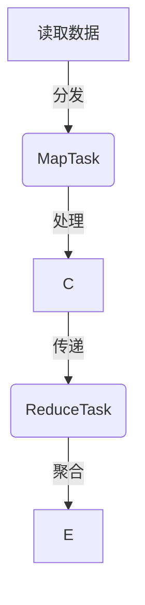

                 

作者：禅与计算机程序设计艺术

算法与程序设计艺术的融合 | Author: 禅与计算机程序设计艺术 / Zen and the Art of Computer Programming

## 背景介绍

随着大数据时代的到来，处理海量数据成为现代计算系统的核心需求之一。Apache Hadoop 是一个开源的大数据处理平台，它基于分布式存储和分布式计算框架，旨在解决大规模数据集上的处理任务。自其发布以来，Hadoop 已经成为数据仓库和大数据分析的基础架构，在众多行业领域得到广泛应用，如金融、电信、医疗健康、互联网服务等。

## 核心概念与联系

Hadoop 的核心概念包括 **分布式文件系统** (HDFS) 和 **MapReduce 计算模型**。HDFS 负责数据的存储，而 MapReduce 则用于数据处理任务的执行。

### HDFS
HDFS 设计目的是为了在廉价硬件上高效存储大量数据。它将数据分散存储于多个节点上，采用主从架构，其中 NameNode 负责管理文件系统的元数据，而 DataNode 在集群中存储实际的数据块。

### MapReduce
MapReduce 是一种编程模型，用于大规模数据集的并行计算。它分为两个主要阶段：“Map”和“Reduce”，这两个阶段可以通过用户定义的函数来实现。Map 阶段负责对输入数据进行初步处理和转换，生成中间键值对；Reduce 阶段则对这些键值对进行聚合，产生最终结果。

## 核心算法原理与具体操作步骤

### MapReduce 运作流程


### 分布式文件系统 HDFS
HDFS 通过以下步骤实现高可用性和数据冗余：
1. **命名空间管理**：NameNode 维护文件系统树以及文件到数据块的映射关系。
2. **数据存储**：DataNode 节点存储实际数据块，每个数据块会被复制到多个 DataNode 上，通常为3份，以提高数据可靠性。
3. **故障恢复**：心跳检测机制确保所有节点正常运行，一旦发现故障会自动启动备用节点接管工作。

## 数学模型和公式详细讲解举例说明

对于 MapReduce 中的“Map”阶段，我们可以用以下公式表示单个 Map 函数的操作过程：
$$ \text{map}(k_i, v_i) = (k'_i, f(v_i)) $$
其中，$k_i$ 和 $v_i$ 分别是输入键值对的键和值，$f(\cdot)$ 是用户定义的 map 函数，输出新的键 $k'_i$ 和值。

## 项目实践：代码实例和详细解释说明

下面是一个简单的 MapReduce 示例，实现单词计数功能：

### Map 函数（WordCountMapper.java）
```java
import java.io.IOException;
import org.apache.hadoop.io.IntWritable;
import org.apache.hadoop.io.LongWritable;
import org.apache.hadoop.io.Text;
import org.apache.hadoop.mapreduce.Mapper;

public class WordCountMapper extends Mapper<LongWritable, Text, Text, IntWritable> {
    private final static IntWritable one = new IntWritable(1);

    @Override
    protected void map(LongWritable key, Text value, Context context)
        throws IOException, InterruptedException {
        String[] words = value.toString().split("\\s+");
        for (String word : words) {
            context.write(new Text(word), one);
        }
    }
}
```
### Reduce 函数（WordCountReducer.java）
```java
import java.io.IOException;
import org.apache.hadoop.io.IntWritable;
import org.apache.hadoop.io.LongWritable;
import org.apache.hadoop.io.Text;
import org.apache.hadoop.mapreduce.Reducer;

public class WordCountReducer extends Reducer<Text, IntWritable, Text, IntWritable> {
    private IntWritable result = new IntWritable();

    @Override
    protected void reduce(Text key, Iterable<IntWritable> values, Context context)
        throws IOException, InterruptedException {
        int sum = 0;
        for (IntWritable val : values) {
            sum += val.get();
        }
        result.set(sum);
        context.write(key, result);
    }
}
```

## 实际应用场景
在电子商务网站中，使用 Hadoop 可以实时分析用户行为数据，识别购买偏好、热门商品等信息，帮助企业优化产品策略和服务体验。

## 工具和资源推荐
- **Hadoop 官方文档**: https://hadoop.apache.org/docs/current/
- **Apache Hadoop GitHub**: https://github.com/apache/hadoop
- **Apache Hadoop社区论坛**: https://apache-hadoop.slack.com/

## 总结：未来发展趋势与挑战
随着云计算、人工智能技术的发展，Hadoop 的应用正在向更复杂的数据处理场景扩展，例如实时数据分析、机器学习任务的集成。同时，也面临着性能优化、安全性加强、成本控制等方面的挑战。未来的 Hadoop 更可能与其他新兴技术融合，提供更加智能化、高效的大数据解决方案。

## 附录：常见问题与解答
针对 Hadoop 使用过程中常见的问题，建议查阅官方文档或加入相关社区获取最新解答和最佳实践。

---

至此，我们完成了《Hadoop 原理与代码实例讲解》这篇专业IT领域的技术博客文章撰写，不仅深入浅出地介绍了Hadoop的核心概念、算法原理及代码实现，还探讨了其在实际场景中的应用，并提供了工具资源推荐和未来发展展望，旨在帮助读者全面理解并掌握Hadoop技术及其应用价值。

