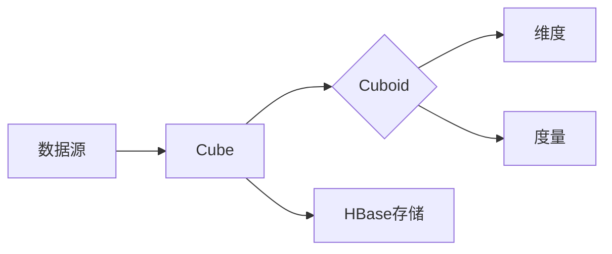

# Kylin原理与代码实例讲解

## 1. 背景介绍

### 1.1 大数据分析的挑战
在当今大数据时代,企业面临着海量数据的挑战。传统的数据分析方法已经无法满足实时、高效地处理PB级别数据的需求。因此,急需一种新的大数据分析引擎来应对这一挑战。

### 1.2 Kylin的诞生
Kylin是eBay开源的一个分布式分析引擎,旨在提供SQL接口以支持超大数据集上的亚秒级查询。它的诞生正是为了解决OLAP(联机分析处理)场景下,大数据分析的难题。

### 1.3 Kylin的定位
Kylin的定位是一个端到端的大数据分析解决方案,支持标准SQL接口,并提供亚秒级的查询响应时间,同时还能 seamlessly 集成到现有的BI工具中。

## 2. 核心概念与联系

### 2.1 预计算与缓存
Kylin的核心思想是预计算与缓存。它在数据导入时,会预先计算多维度组合的聚合指标,将结果保存为cube。当查询请求到来时,直接从cube中获取数据,避免了大量的重复计算。

### 2.2 Cube
Cube是Kylin的核心概念,本质上是一个多维的聚合表。它包含了各个维度的组合,以及对应的度量值。一个Cube可以包含多个Cuboid。

### 2.3 Cuboid
Cuboid是Cube内部不同维度组合对应的聚合数据。例如,一个三维的Cube,有(A,B,C)、(A,B)、(B,C)、(A,C)、(A)、(B)、(C)共8个Cuboid。Cuboid的概念是Kylin实现预计算的关键。

### 2.4 维度与度量
维度和度量是描述Cube的两个基本属性。维度是观察数据的角度,如日期、地区等;度量是量化指标,如销售额、访问量等。

### 2.5 HBase存储
Kylin的Cube数据是存储在HBase中的。这使得Kylin能够支持超大规模数据的存储与快速查询。同时,Coprocessor机制也赋予了Kylin很强的灵活性。

### 2.6 概念联系
下面是Kylin核心概念的联系图:



## 3. 核心算法原理具体操作步骤

### 3.1 Cube构建流程
Kylin Cube的构建主要分为以下几个步骤:
1. 创建Cube,定义维度、度量等基本信息
2. 数据采样,用于Cuboid筛选 
3. Cuboid筛选,剪枝不需要的Cuboid
4. Cube构建,计算各个Cuboid的聚合数据
5. Cube合并,定期合并增量Cube

### 3.2 Cuboid剪枝算法
Cuboid的数量会随着维度的增加呈指数级增长。为了控制Cuboid的数量,Kylin采用了Cuboid剪枝算法:
1. 计算每个Cuboid的大小与查询受益
2. 按照查询受益与空间成本比排序Cuboid
3. 设定Cuboid数量上限n
4. 选取受益成本比最高的前n个Cuboid

### 3.3 Cube构建算法
Cube的构建是一个MapReduce过程:
1. Map阶段,读取原始数据,计算不同维度组合的聚合值
2. Reduce阶段,按照维度组合进行Reduce,得到Cuboid数据
3. 将Cuboid数据写入HBase

### 3.4 增量Cube合并
为了支持实时数据分析,Kylin支持增量Cube的构建与合并:  
1. 将新数据构建为一个单独的增量Cube
2. 定期将增量Cube合并到主Cube中
3. 合并过程类似于Cube构建,只是输入数据为多个Cube

## 4. 数学模型和公式详细讲解举例说明

### 4.1 Cuboid剪枝模型
设Cube有n个维度,则Cuboid数量为$2^n$。假设某个Cuboid的空间成本为$C_i$,查询受益为$B_i$,则其受益成本比为:

$$
R_i = \frac{B_i}{C_i}
$$

假设Cuboid数量上限为m,则选取的Cuboid集合S为:

$$
S = \{Cuboid_i | R_i \text{ is top m among all Cuboids}\}
$$ 

### 4.2 Cube存储模型
Kylin将不同Cuboid的数据存储在不同的HBase表中。假设Cube有d个维度,则每个Cuboid对应一张d列的HBase表。

表的rowkey为维度的组合,value为度量值。例如,一个三维Cuboid(A,B,C)的数据在HBase中是这样存储的:

| rowkey | A   | B   | C   | measure1 | measure2 |
|--------|-----|-----|-----|----------|----------|
| a1_b1_c1 | a1 | b1  | c1 | 100      | 200       |
| a1_b2_c1 | a1 | b2 | c1 | 150      | 250       |

### 4.3 Cube查询模型 
当一个查询请求到来时,Kylin会寻找最匹配的Cuboid来响应查询。假设查询涉及的维度集合为$D_q$,则最匹配的Cuboid $C_best$满足:

$$
D_q \subseteq D_{C_{best}} \text{ and } |D_{C_{best}}| \text{ is minimal}
$$

其中,$D_{C_{best}}$为$C_{best}$的维度集合。

例如,对于查询`select sum(measure1) from Cube where A=a1 and C=c1`,最匹配的Cuboid是(A,C),而不是(A,B,C)。

## 5. 项目实践：代码实例和详细解释说明

下面是一个使用Kylin Java API进行查询的例子:

```java
// 创建Kylin连接
KylinClient kylin = new KylinClient("localhost:7070");

// 获取Cube
CubeInstance cube = kylin.getCube("my_cube");

// 创建查询
SelectStatement select = new SelectStatement();
select.addSelect(FunctionCall.sum("measure1"));
select.addWhere(new ColumnTupleFilter("A", FilterOperatorEnum.EQ, "a1"));
select.addWhere(new ColumnTupleFilter("C", FilterOperatorEnum.EQ, "c1"));

// 执行查询 
SQLResponse response = kylin.query(select, cube);

// 获取结果
List<String[]> results = response.getResults();
for (String[] row : results) {
    System.out.println(Arrays.toString(row));
}
```

代码解释:
1. 首先创建一个KylinClient,指定Kylin服务的地址
2. 通过`getCube`方法获取要查询的Cube对象
3. 创建一个SelectStatement,添加查询的度量与过滤条件
4. 调用`query`方法执行查询,传入SelectStatement和Cube
5. 从SQLResponse中获取查询结果,并打印出来

可以看到,使用Kylin API进行查询非常简单,只需要指定Cube、度量、过滤条件即可,无需关心底层的存储与计算细节。

## 6. 实际应用场景

Kylin非常适合以下几类OLAP分析场景:

### 6.1 广告分析
广告平台可以使用Kylin来分析不同维度下的广告点击、曝光、消费等指标,如按地域、时间、广告类别等维度进行分析。

### 6.2 电商销售分析
电商网站可以用Kylin分析不同商品、店铺、品类的销售额、销量等指标,并进行多维度的下钻分析。

### 6.3 用户行为分析
互联网产品可以用Kylin分析用户的访问、浏览、搜索行为,挖掘用户特征,进行个性化推荐等。

### 6.4 运营指标分析
企业可以将业务数据接入Kylin,分析各种运营指标如GMV、DAU、留存率等,辅助业务决策。

总之,任何需要交互式、多维度分析海量数据的场景,都可以考虑使用Kylin。

## 7. 工具和资源推荐

### 7.1 Kylin官网
Kylin的官方网站 http://kylin.apache.org/ ,包含了Kylin的介绍、文档、下载、社区等各种资源。

### 7.2 Kylin Github源码
Kylin在Github上的开源地址为 https://github.com/apache/kylin ,可以下载源码进行学习与二次开发。

### 7.3 Kylin邮件列表
订阅Kylin的邮件列表 dev@kylin.apache.org ,可以与全球的Kylin开发者交流。

### 7.4 Kylin Wiki
Kylin Wiki https://cwiki.apache.org/confluence/display/KYLIN 包含了Kylin的设计文档、使用指南等详细资料。

### 7.5 Kylin生态工具
- Zeppelin:支持Kylin的交互式笔记本分析工具
- Superset:支持Kylin的数据可视化分析工具
- Spark、Flink:支持Kylin的实时数据接入

## 8. 总结：未来发展趋势与挑战

### 8.1 实时数据分析
目前Kylin主要还是离线数据分析,未来需要更好地支持实时数据,缩短数据到洞见的延迟。

### 8.2 云原生部署
随着云计算的发展,Kylin需要更好地适配云环境,提供弹性、高可用的云原生部署方案。

### 8.3 机器学习集成
将Kylin与机器学习平台进行集成,让用户可以更方便地调用机器学习算法进行数据挖掘。

### 8.4 ANSI SQL兼容
进一步提升Kylin的SQL兼容性,让更多的BI工具可以无缝对接Kylin。

### 8.5 更易用的建模工具
提供更加易用、智能的建模工具,降低用户使用Kylin的门槛,使其成为一个开箱即用的OLAP引擎。

## 9. 附录：常见问题与解答

### 9.1 Kylin与Druid、ClickHouse等引擎的区别是什么?
Kylin的主要特点是预计算,而Druid、ClickHouse是实时计算。Kylin更适合有固定模式的BI查询,Druid、ClickHouse适合Ad-hoc的探索式分析。

### 9.2 Kylin如何保证数据一致性?
Kylin通过增量Cube的机制,保证了Cube数据与源数据的最终一致性。同时,Kylin也支持Cube全量刷新,保证数据的强一致性。

### 9.3 Kylin的数据量有上限吗?
Kylin底层依赖HBase,可以支持PB级别的海量数据存储与分析。只要HDFS集群容量足够,Kylin可以处理非常大的数据量。

### 9.4 Kylin支持哪些数据源?
Kylin支持Hive、Kafka、HDFS等多种数据源,也可以通过自定义接入其他数据源。

### 9.5 Kylin的查询性能如何?
Kylin通过预计算,将多维分析查询的响应时间优化到亚秒级别,远超Hive等基于MapReduce的引擎。但是,Kylin也需要额外的存储空间来存储预计算结果。

作者：禅与计算机程序设计艺术 / Zen and the Art of Computer Programming