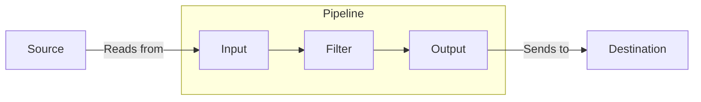

# Logstash原理与代码实例讲解

## 1.背景介绍

在当今数据爆炸的时代,海量的数据被不断产生和传输。无论是来自服务器日志、网络数据流、安全监控还是物联网设备,这些数据都需要被高效收集、处理和存储,以便进行后续的分析和利用。然而,由于数据源的多样性和复杂性,单一系统难以胜任这一艰巨任务。这就是Logstash应运而生的原因。

Logstash是一款开源的数据收集、处理和传输引擎,最初由Jordan Sissel开发,后被Elastic公司收购并持续维护和升级。它是Elastic Stack(前称ELK Stack)的重要组成部分,与Elasticsearch、Kibana紧密集成,构建了一个强大的日志管理和数据分析平台。

Logstash的核心理念是将多种异构数据源统一收集,并通过过滤器进行数据转换和enrichment,最终将结构化的数据发送到各种目的地存储。它支持多种输入源(如文件、syslog、Redis等)、多种过滤器(如grok、mutate、ruby等)和多种输出目标(如Elasticsearch、Kafka、文件等),可以灵活组合满足不同场景的需求。

## 2.核心概念与联系

在了解Logstash的原理之前,我们需要先掌握几个核心概念:

1. **Event(事件)**: Logstash中的基本数据单元,由一个或多个键值对组成,用于表示一条日志或消息。
2. **Input(输入)**: 从各种数据源读取Events的组件,如文件、syslog、beats等。
3. **Filter(过滤器)**: 对Events执行数据转换、enrichment和删减操作的组件。
4. **Output(输出)**: 将Events发送到目的地的组件,如Elasticsearch、Kafka、文件等。
5. **Pipeline(管道)**: 由Input -> Filter -> Output组成的数据处理流程。

这些概念之间的关系如下所示:



Logstash通过管道的方式将数据从源头读取、经过处理后发送到目的地。在这个过程中,Input负责读取原始数据,Filter负责数据转换和enrichment,Output负责将处理后的数据发送到目的地存储。

## 3.核心算法原理具体操作步骤

Logstash的核心算法原理可以概括为以下几个步骤:

1. **读取数据**

   Logstash从配置的Input源读取原始数据,并将其封装为Event对象。每个Event都包含一个或多个键值对,用于存储日志或消息的相关信息。

2. **数据处理**

   读取的Event对象被传递到Filter阶段进行处理。在这个阶段,Logstash支持多种过滤器插件,用于执行不同的数据转换和enrichment操作,如:

   - **Grok**: 使用正则表达式从非结构化数据中提取结构化字段。
   - **Mutate**: 对Event执行rename、remove、replace等操作。
   - **Ruby**: 使用Ruby代码对Event进行自定义处理。
   - **Geoip**: 根据IP地址添加地理位置信息。

   这些过滤器可以单独使用,也可以组合使用,形成复杂的数据处理逻辑。

3. **发送数据**

   经过Filter处理后的Event对象被传递到Output阶段,Logstash将其发送到配置的目的地存储,如Elasticsearch、Kafka、文件等。在发送之前,Output插件还可以对Event执行最后的处理,如编码、压缩等。

这个算法原理的伪代码可以表示为:

```
for each input source:
    read raw data
    create event object
    
    for each filter:
        apply filter to event
        
    for each output:
        send event to output destination
```

## 4.数学模型和公式详细讲解举例说明

虽然Logstash主要是基于插件和配置文件进行数据处理,但在某些场景下,我们仍需要使用数学模型和公式来描述和优化其处理逻辑。

### 4.1 Grok过滤器正则匹配

Grok过滤器是Logstash中最常用的过滤器之一,它使用正则表达式从非结构化数据中提取结构化字段。假设我们有一条Apache访问日志:

```
127.0.0.1 - frank [10/Oct/2000:13:55:36 -0700] "GET /apache_pb.gif HTTP/1.0" 200 2326
```

我们可以使用以下Grok模式来解析它:

```
%{COMBINEDAPACHELOG}
```

其中,`%{COMBINEDAPACHELOG}`是Logstash内置的一种Grok模式,它包含了多个子模式,用于匹配不同部分的日志内容。

这个过程可以用正则表达式和字符串匹配算法来描述。假设我们有一个正则表达式`r`和一个字符串`s`,我们需要找到`s`中所有与`r`匹配的子串。这个问题可以用动态规划算法来解决,时间复杂度为$O(mn)$,其中`m`是正则表达式的长度,`n`是字符串的长度。

### 4.2 基于时间序列的数据平滑

在某些场景下,我们需要对数据进行平滑处理,以减少噪声和异常值的影响。一种常见的平滑方法是基于时间序列的移动平均(Moving Average)。

假设我们有一个时间序列数据$\{x_t\}$,我们希望计算其移动平均序列$\{y_t\}$,公式如下:

$$
y_t = \frac{1}{n}\sum_{i=0}^{n-1}x_{t-i}
$$

其中,`n`是平滑窗口的大小。这个公式实际上是计算最近`n`个数据点的算术平均值。

在Logstash中,我们可以使用Ruby过滤器来实现这个算法。假设我们有一个Event序列,每个Event都包含一个时间戳`@timestamp`和一个数值`value`,我们希望对`value`字段进行移动平均平滑。Ruby代码如下:

```ruby
require 'circular_buffer'

# 创建一个循环缓冲区,用于存储最近n个数据点
buffer = CircularBuffer.new(n)

# 遍历每个Event
filter {
  ruby {
    code => "
      # 将当前数据点加入缓冲区
      buffer.push(event.get('value'))
      
      # 计算移动平均值
      sum = buffer.sum
      avg = sum / buffer.size
      
      # 将平均值设置为新的value字段
      event.set('value', avg)
    "
  }
}
```

在这个例子中,我们使用了一个`CircularBuffer`类来存储最近`n`个数据点。对于每个Event,我们将其`value`字段加入缓冲区,然后计算缓冲区中所有数据点的算术平均值,并将这个平均值设置为新的`value`字段。

这种基于时间序列的平滑算法可以有效减少数据中的噪声和异常值,使得后续的数据分析更加准确和可靠。

## 5.项目实践:代码实例和详细解释说明

为了更好地理解Logstash的工作原理,我们来看一个实际的项目示例。假设我们需要从一个Web服务器收集访问日志,并将其发送到Elasticsearch进行存储和分析。

### 5.1 配置文件

首先,我们需要创建一个Logstash配置文件,定义数据的输入源、过滤器和输出目标。以下是一个示例配置文件:

```ruby
# 输入源为Web服务器的访问日志文件
input {
  file {
    path => "/var/log/apache/access.log"
    start_position => "beginning"
  }
}

# 使用Grok过滤器解析Apache访问日志
filter {
  grok {
    match => { "message" => "%{COMBINEDAPACHELOG}" }
  }
  date {
    match => [ "timestamp" , "dd/MMM/yyyy:HH:mm:ss Z" ]
  }
}

# 输出到Elasticsearch
output {
  elasticsearch {
    hosts => ["http://elasticsearch:9200"]
    index => "logstash-%{+YYYY.MM.dd}"
  }
}
```

在这个配置文件中,我们定义了:

1. **输入源(Input)**: 从Apache Web服务器的访问日志文件`/var/log/apache/access.log`读取数据。
2. **过滤器(Filter)**: 使用Grok过滤器解析Apache访问日志,并使用date过滤器将时间戳字段转换为Logstash可识别的日期格式。
3. **输出目标(Output)**: 将解析后的日志数据发送到Elasticsearch,并根据日期动态创建索引。

### 5.2 运行Logstash

配置文件准备就绪后,我们可以启动Logstash并指定配置文件路径:

```bash
bin/logstash -f /path/to/logstash.conf
```

Logstash将开始从Apache访问日志文件读取数据,并按照配置的过滤器和输出目标进行处理。我们可以在Logstash的控制台输出中查看处理过程和状态。

### 5.3 数据查询和可视化

最后,我们可以使用Kibana来查询和可视化存储在Elasticsearch中的日志数据。以下是一个示例查询,用于统计每个IP地址的访问次数:

```json
GET /logstash-*/_search
{
  "size": 0,
  "aggs": {
    "ip_counts": {
      "terms": {
        "field": "clientip.keyword"
      }
    }
  }
}
```

在Kibana的可视化界面中,我们可以将这个查询结果渲染为一个柱状图或饼图,直观地展示不同IP地址的访问分布情况。

通过这个实际项目示例,我们可以更好地理解Logstash的工作流程,以及如何将其与Elasticsearch和Kibana集成,构建一个完整的日志管理和数据分析平台。

## 6.实际应用场景

Logstash作为一款强大的数据收集和处理引擎,在各种领域都有广泛的应用场景,包括但不限于:

1. **日志管理**

   Logstash可以高效地收集来自不同源头的日志数据,如服务器日志、应用程序日志、安全日志等。通过过滤器的处理,可以对日志进行解析、enrichment和标准化,方便后续的存储、搜索和分析。

2. **网络数据分析**

   Logstash可以从网络流量中提取有价值的信息,如IP地址、请求头、响应码等。这些数据可用于网络监控、安全分析和用户行为分析等场景。

3. **物联网数据处理**

   随着物联网设备的快速增长,产生了大量的传感器数据、设备日志等。Logstash可以从各种物联网协议(如MQTT、CoAP等)中收集这些数据,并进行实时处理和分析。

4. **安全信息和事件管理(SIEM)**

   在安全领域,Logstash可以集中收集各种安全相关的日志和事件数据,如防火墙日志、入侵检测系统日志等。通过过滤器的处理,可以对这些数据进行相关性分析和威胁检测。

5. **数据集成**

   Logstash可以作为数据管道,将来自不同源头的数据收集、转换并发送到各种目的地存储,实现数据的集成和统一。

6. **实时数据处理**

   Logstash支持从Kafka、RabbitMQ等消息队列中读取数据,并进行实时处理和分析。这种架构可以支持大规模的数据流处理场景。

无论是日志管理、网络分析还是物联网数据处理,Logstash都可以发挥重要作用,帮助企业从海量异构数据中提取有价值的信息,支持各种数据驱动的应用和决策。

## 7.工具和资源推荐

在使用Logstash进行数据收集和处理时,我们可以借助一些有用的工具和资源来提高效率和质量。

1. **Logstash插件**

   Logstash拥有丰富的插件生态系统,包括各种输入源、过滤器和输出目标。官方插件库提供了常见的插件,同时也有许多第三方插件可供选择。在处理特定类型的数据时,选择合适的插件非常重要。

2. **Grok调试工具**

   Grok过滤器是Logstash中最常用的过滤器之一,但编写正确的Grok模式并不容易。一些在线Grok调试工具可以帮助我们测试和优化Grok模式,如[Grok Debugger](https://grokdebug.herokuapp.com/)和[Grok Constructor](https://gro