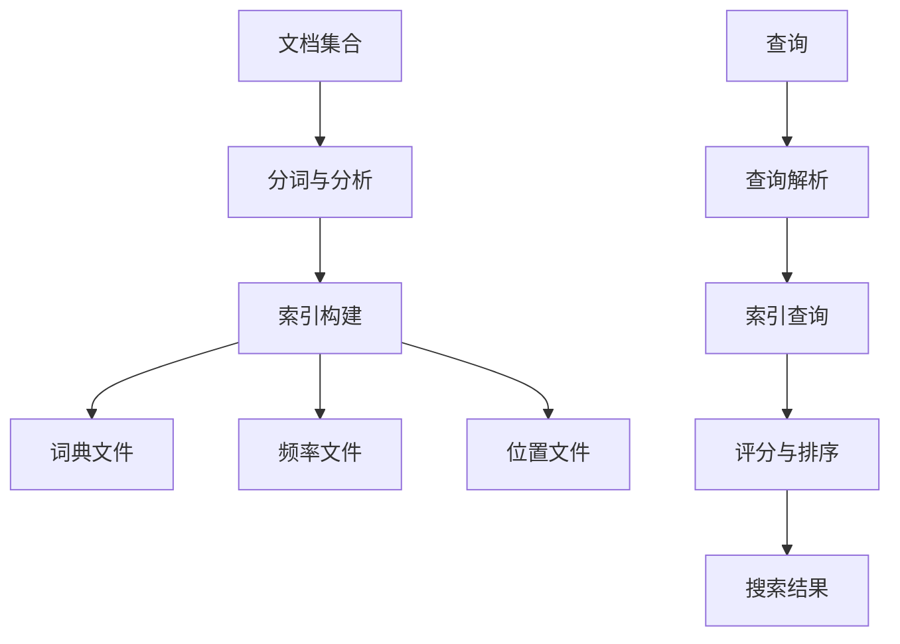

# Lucene原理与代码实例讲解

## 1.背景介绍

在当今信息时代,数据量呈现爆炸式增长,如何高效地检索和管理海量数据成为了一个巨大挑战。Apache Lucene作为一个高性能、全功能的搜索引擎库,凭借其优秀的索引和查询能力,成为了广受欢迎的解决方案之一。无论是构建网站搜索、电子商务平台、文档管理系统还是大数据分析,Lucene都扮演着重要角色。

Lucene最初由Doug Cutting于1997年开发,后捐赠给Apache软件基金会,成为Apache旗下的顶级项目。作为一个成熟的开源项目,Lucene拥有活跃的社区,源代码托管在Github上,任何人都可以贡献代码或提出建议。目前,Lucene以Java语言编写,支持跨平台运行,并提供了多种语言的客户端API。

## 2.核心概念与联系

### 2.1 倒排索引

Lucene的核心是基于倒排索引(Inverted Index)的全文搜索功能。与其他基于数据库的搜索方式不同,倒排索引通过维护一个由单词到文档的映射表,使得查询效率大幅提高。

传统的数据库搜索需要顺序扫描每个文档,查找匹配查询条件的记录,效率随着数据量的增长而急剧下降。而倒排索引则将文档集合中的所有单词构建一个索引,每个单词与包含它的文档列表相关联,查询时只需要获取相应单词的文档列表,并计算交集或并集,就能快速定位结果文档,大大提高了查询效率。

### 2.2 分词与分析

在构建倒排索引之前,需要先对文档进行分词和分析处理。分词器(Tokenizer)负责将文本拆分为单词(Token),而分析器(Analyzer)则进一步对单词进行标准化处理,如去除标点符号、转为小写、过滤停用词等。

Lucene提供了多种内置分词器和分析器,如标准分析器(StandardAnalyzer)、简单分析器(SimpleAnalyzer)、空格分析器(WhitespaceAnalyzer)等,同时也支持用户自定义分析器以满足特殊需求。选择合适的分析器对索引质量和搜索准确性至关重要。

### 2.3 索引结构

Lucene将索引分为若干个段(Segment),每个段包含部分文档的倒排索引。新增或更新文档时,Lucene会在新段中构建相应的索引,而不是直接修改旧段,从而保证了索引的不可变性和实时更新能力。

索引文件主要包括三个核心数据结构:词典文件(Terminfos)、频率文件(Freqs)和位置文件(Prx)。词典文件记录了所有唯一单词及其统计信息,频率文件存储了单词在每个文档中的出现频率,位置文件则记录了单词在文档中的精确位置。通过这些数据结构,Lucene可以高效地进行索引构建、查询解析和评分排序。



## 3.核心算法原理具体操作步骤

### 3.1 索引构建过程

Lucene的索引构建过程可以概括为以下几个主要步骤:

1. **获取文档集合**: 首先需要指定待索引的文档集合,可以是本地文件系统中的文件、数据库记录或其他数据源。

2. **文档预处理**: 对原始文档进行分词和分析,将文本拆分为单词序列,并进行标准化处理,如去除标点、转小写等。

3. **创建内存索引**: 将分析后的单词与文档信息组织成内存索引结构,主要包括词典(TermInfos)、频率(Freqs)和位置(Prx)等数据。

4. **索引合并**: 内存索引达到一定阈值后,将其写入磁盘,形成一个新的索引段(Segment)。

5. **索引合并优化**: 定期合并小索引段,减少索引文件数量,提高查询效率。

整个过程中,Lucene会自动处理文档的增量更新,通过创建新段、合并段的方式,实现索引的不可变性和实时更新能力。

### 3.2 查询执行过程

当用户提交查询请求时,Lucene会执行以下步骤:

1. **查询解析**: 将查询字符串解析为查询树(Query Tree),每个节点代表不同的查询条件,如词条查询(TermQuery)、短语查询(PhraseQuery)、布尔查询(BooleanQuery)等。

2. **索引查找**: 根据查询树,在倒排索引中查找匹配的文档列表。

3. **评分与排序**: 对匹配文档进行相关性评分,Lucene默认使用复合评分公式TF-IDF,将词频(Term Frequency)和逆文档频率(Inverse Document Frequency)相结合。

4. **结果输出**: 按评分结果对文档进行排序,返回最相关的文档列表。

在查询过程中,Lucene会自动缓存热门词条的索引数据,并采用各种优化策略,如索引压缩、跳跃查询等,从而提高查询性能。

## 4.数学模型和公式详细讲解举例说明

### 4.1 TF-IDF模型

TF-IDF(Term Frequency-Inverse Document Frequency)是Lucene中使用的一种常见相关性评分模型。该模型将词频(TF)和逆文档频率(IDF)相结合,用于计算查询词条在文档中的重要程度。

词频TF(Term Frequency)表示一个词条在文档中出现的次数,可以用以下公式计算:

$$
TF(t,d) = \frac{freq(t,d)}{max\,freq(d)}
$$

其中,$$freq(t,d)$$表示词条$$t$$在文档$$d$$中出现的原始频率,$$max\,freq(d)$$是文档$$d$$中出现频率最高的词条的频率。

逆文档频率IDF(Inverse Document Frequency)则用于衡量一个词条在整个文档集合中的稀有程度,其计算公式为:

$$
IDF(t) = 1 + log\frac{N}{n_t}
$$

其中,$$N$$是文档集合的总文档数,$$n_t$$是包含词条$$t$$的文档数。

将TF和IDF相乘,即可得到该词条在文档中的TF-IDF权重:

$$
TFIDF(t,d) = TF(t,d) \times IDF(t)
$$

对于一个查询,Lucene会计算每个查询词条在文档中的TF-IDF权重,然后将它们综合起来得到文档的最终评分。常见的综合方式有向量空间模型(Vector Space Model)和BM25算法等。

### 4.2 BM25算法

BM25是一种在信息检索领域广泛使用的概率模型,Lucene也采用了该算法进行相关性评分。相比TF-IDF模型,BM25考虑了更多因素,如文档长度、查询词条频率等,从而提高了评分的准确性。

BM25的评分公式如下:

$$
Score(D,Q) = \sum_{q \in Q} IDF(q) \cdot \frac{freq(q,D) \cdot (k_1 + 1)}{freq(q,D) + k_1 \cdot (1 - b + b \cdot \frac{|D|}{avgdl})}
$$

其中:

- $$Q$$是查询词条集合
- $$D$$是待评分的文档
- $$freq(q,D)$$是词条$$q$$在文档$$D$$中出现的频率
- $$|D|$$是文档$$D$$的长度(词条数)
- $$avgdl$$是文档集合的平均文档长度
- $$k_1$$和$$b$$是调节因子,用于控制词频和文档长度的影响程度

通过对比可以发现,BM25不仅考虑了TF-IDF模型中的词频和逆文档频率,还引入了文档长度归一化因子,使得长文档相对于短文档在相同词频时得分会略低。同时,$$k_1$$和$$b$$可以根据具体场景进行调优,以获得最佳的评分效果。

在实际应用中,Lucene默认采用BM25算法进行评分排序,但也支持用户自定义评分公式,以满足特殊需求。

## 5.项目实践:代码实例和详细解释说明

为了更好地理解Lucene的使用方式,我们来看一个基于Java的简单示例。本示例将演示如何创建一个索引,并对其执行搜索查询。

### 5.1 创建索引

首先,我们需要准备一些待索引的文档数据,这里以一些书籍信息为例:

```java
String[] docs = {
    "Lucene in Action: Lucene是一个基于Java的全文搜索引擎库,提供了索引和搜索功能。",
    "Lucene实战手册: 本书全面介绍了Lucene的核心概念和使用方法,适合初学者阅读。",
    "Elasticsearch实战: Elasticsearch是基于Lucene构建的分布式搜索引擎,具有高可扩展性。"
};
```

接下来,创建一个IndexWriter对象,并将文档数据添加到索引中:

```java
// 创建索引目录
Directory indexDir = FSDirectory.open(Paths.get("index"));

// 创建IndexWriterConfig
IndexWriterConfig config = new IndexWriterConfig(new StandardAnalyzer());

// 创建IndexWriter
IndexWriter writer = new IndexWriter(indexDir, config);

// 添加文档到索引
for (int i = 0; i < docs.length; i++) {
    Document doc = new Document();
    doc.add(new TextField("content", docs[i], Field.Store.YES));
    writer.addDocument(doc);
}

// 关闭IndexWriter
writer.close();
```

在上面的代码中,我们首先创建了一个索引目录,用于存储索引文件。然后配置了一个StandardAnalyzer作为分析器,并使用它创建了IndexWriterConfig。

接下来,通过IndexWriter对象将文档数据添加到索引中。每个文档都是一个Document对象,我们将文档内容作为一个TextField字段添加到Document中。最后,调用writer.close()方法关闭IndexWriter。

### 5.2 执行搜索

现在,我们已经创建了一个包含三个文档的索引,接下来可以对它执行搜索查询:

```java
// 创建IndexReader
Directory indexDir = FSDirectory.open(Paths.get("index"));
IndexReader reader = DirectoryReader.open(indexDir);

// 创建IndexSearcher
IndexSearcher searcher = new IndexSearcher(reader);

// 创建查询
QueryParser parser = new QueryParser("content", new StandardAnalyzer());
Query query = parser.parse("Lucene");

// 执行搜索
TopDocs topDocs = searcher.search(query, 10);
ScoreDoc[] scoreDocs = topDocs.scoreDocs;

// 输出结果
for (ScoreDoc scoreDoc : scoreDocs) {
    Document doc = searcher.doc(scoreDoc.doc);
    System.out.println(doc.get("content"));
}

// 关闭IndexReader
reader.close();
```

首先,我们创建了一个IndexReader对象,用于读取之前创建的索引。然后,使用IndexSearcher对象执行实际的搜索操作。

在创建查询时,我们使用QueryParser解析查询字符串"Lucene",并指定了要搜索的字段"content"和分析器StandardAnalyzer。

执行searcher.search(query, 10)方法,将返回最多10个匹配的文档,结果存储在TopDocs对象中。我们遍历TopDocs中的ScoreDoc对象,获取每个匹配文档的内容并输出。

最后,调用reader.close()方法关闭IndexReader。

运行上述代码,你将看到如下输出:

```
Lucene in Action: Lucene是一个基于Java的全文搜索引擎库,提供了索引和搜索功能。
Lucene实战手册: 本书全面介绍了Lucene的核心概念和使用方法,适合初学者阅读。
Elasticsearch实战: Elasticsearch是基于Lucene构建的分布式搜索引擎,具有高可扩展性。
```

这个简单的示例展示了如何使用Lucene进行索引创建和搜索查询操作。在实际应用中,你可以根据需求进行更多自定义配置,如使用不同的分析器、评分算法、查询类型等,以满足特定的搜索需求。

## 6.实际应用场景

Lucene作为一个功能强大的搜索引