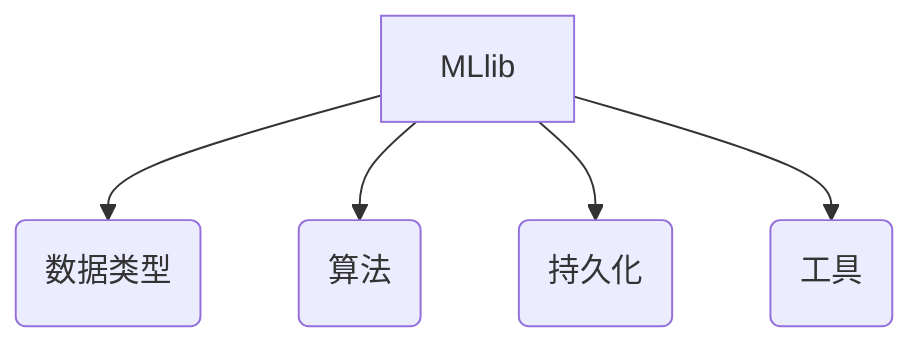

# MLlib 原理与代码实例讲解

## 1.背景介绍

在当今大数据时代,机器学习(Machine Learning)已经成为各行各业的核心技术之一。Apache Spark作为一个统一的大数据处理引擎,提供了MLlib作为其机器学习算法库,支持多种常见的机器学习算法。MLlib不仅能够高效处理大规模数据,还提供了简洁的API,方便用户使用。本文将深入探讨MLlib的核心原理,并结合实际代码示例,帮助读者全面掌握MLlib的使用方法。

## 2.核心概念与联系

### 2.1 机器学习概述

机器学习是一门人工智能的研究领域,它赋予计算机系统具有学习和改进自身性能的能力,而无需显式编程。机器学习算法通过构建数学模型,利用样本数据"学习"模型参数,从而对新数据进行预测或决策。

### 2.2 MLlib架构

MLlib作为Spark的机器学习库,主要由以下几个部分组成:

- **数据类型(Data Types)**: MLlib提供了统一的数据抽象,如LabeledPoint、Vector等,用于表示机器学习算法的输入数据。
- **算法(Algorithms)**: MLlib实现了多种常见的机器学习算法,包括分类、回归、聚类、协同过滤等。
- **持久化(Persistence)**: 训练好的模型可以保存到磁盘,以备后续使用。
- **工具(Utilities)**: MLlib提供了一些实用工具,如特征提取、评估指标等。



## 3.核心算法原理具体操作步骤

MLlib实现了多种经典的机器学习算法,本节将介绍其中几种核心算法的原理和使用方法。

### 3.1 线性回归

线性回归是一种常用的监督学习算法,旨在找到自变量和因变量之间的线性关系。MLlib提供了用于线性回归的API,包括:

1. `LinearRegression`: 利用最小二乘法训练线性回归模型。
2. `LinearRegressionWithSGD`: 使用随机梯度下降法训练线性回归模型。

以`LinearRegression`为例,其主要使用步骤如下:

1. 加载并转换数据为`LabeledPoint`格式。
2. 使用`LinearRegression.train()`方法训练模型。
3. 使用`model.predict()`方法对新数据进行预测。

### 3.2 逻辑回归

逻辑回归是一种常用的分类算法,用于预测二元变量。MLlib提供了`LogisticRegression`类,支持多种优化方法和正则化选项。其使用步骤与线性回归类似:

1. 加载并转换数据为`LabeledPoint`格式。
2. 使用`LogisticRegression.train()`方法训练模型。
3. 使用`model.predict()`方法对新数据进行分类预测。

### 3.3 K-means聚类

K-means是一种无监督学习算法,用于将数据划分为K个簇。MLlib提供了`KMeans`类,支持多种初始化方式和并行计算。其使用步骤如下:

1. 加载并转换数据为`Vector`格式。
2. 使用`KMeans.train()`方法训练模型,指定K值和其他参数。
3. 使用`model.predict()`方法对新数据进行簇分配。

## 4.数学模型和公式详细讲解举例说明

机器学习算法通常基于数学模型,本节将介绍几种常见算法的数学模型及公式推导。

### 4.1 线性回归

线性回归试图找到自变量$X$和因变量$Y$之间的线性关系,即:

$$Y = X\beta + \epsilon$$

其中$\beta$为模型参数,需要通过训练数据估计;$\epsilon$为误差项。

利用最小二乘法,可以得到$\beta$的解析解:

$$\hat{\beta} = (X^TX)^{-1}X^TY$$

这就是线性回归的数学模型和解析解。

### 4.2 逻辑回归

逻辑回归用于二元分类问题。给定输入$X$,我们希望预测$Y$为0或1的概率。逻辑回归模型如下:

$$P(Y=1|X) = \frac{1}{1+e^{-X\beta}}$$

通过极大似然估计,可以得到$\beta$的估计值。

### 4.3 K-means聚类

K-means聚类的目标是最小化所有点到其所属簇中心的距离平方和:

$$\sum_{i=1}^{n}\sum_{j=1}^{K}r_{ij}||x_i - \mu_j||^2$$

其中$r_{ij}$为0-1指示变量,表示$x_i$是否属于第$j$个簇;$\mu_j$为第$j$个簇的中心。

K-means算法通过迭代优化上述目标函数,直至收敛。

## 5.项目实践:代码实例和详细解释说明

本节将通过实际代码示例,演示如何使用MLlib进行机器学习建模。我们将基于一个经典的机器学习数据集"鸢尾花数据集"(Iris dataset)进行线性回归、逻辑回归和K-means聚类的实践。

### 5.1 环境准备

首先,我们需要准备Spark环境。可以使用Spark的交互式Shell或在集群上提交作业。此处我们使用PySpark作为示例:

```python
from pyspark.sql import SparkSession

# 创建SparkSession
spark = SparkSession.builder \
                    .appName("MLlib Examples") \
                    .getOrCreate()

# 导入MLlib
from pyspark.ml.regression import LinearRegression
from pyspark.ml.classification import LogisticRegression
from pyspark.ml.clustering import KMeans
from pyspark.ml.linalg import Vectors
```

### 5.2 线性回归示例

```python
# 加载数据
data = spark.read.csv("iris.csv", header=True, inferSchema=True)

# 选择特征和标签
featureCols = ["sepal_length", "sepal_width", "petal_length", "petal_width"]
featuresData = data.select(featureCols).toPandas()
labelsData = data.select("species").toPandas()

# 转换为MLlib格式
gdf = spark.createDataFrame(featuresData)
assembler = VectorAssembler(inputCols=featureCols, outputCol="features")
featureVector = assembler.transform(gdf)

# 训练线性回归模型
lr = LinearRegression(featuresCol="features", labelCol="species")
lrModel = lr.fit(featureVector)

# 预测
predictions = lrModel.transform(featureVector)
predictions.select("prediction", "species", "features").show(5)
```

上述代码首先加载鸢尾花数据集,选择特征列和标签列。然后使用`VectorAssembler`将特征列合并为一个向量列,并训练线性回归模型。最后,我们可以使用训练好的模型对新数据进行预测。

### 5.3 逻辑回归示例  

```python
# 加载数据
data = spark.read.csv("iris.csv", header=True, inferSchema=True)

# 选择特征和标签
featureCols = ["sepal_length", "sepal_width", "petal_length", "petal_width"]
assembler = VectorAssembler(inputCols=featureCols, outputCol="features")
featureVector = assembler.transform(data)

# 转换标签为0/1
label_stringIdx = StringIndexer(inputCol="species", outputCol="label")
featureVector = label_stringIdx.fit(featureVector).transform(featureVector)

# 训练逻辑回归模型
lr = LogisticRegression(featuresCol="features", labelCol="label", maxIter=10)
lrModel = lr.fit(featureVector)

# 预测
predictions = lrModel.transform(featureVector)
predictions.select("prediction", "label", "features").show(5)
```

上述代码首先加载鸢尾花数据集,选择特征列。然后使用`StringIndexer`将标签转换为0/1编码。接着,我们训练逻辑回归模型,并使用该模型对新数据进行分类预测。

### 5.4 K-means聚类示例

```python
# 加载数据
data = spark.read.csv("iris.csv", header=True, inferSchema=True)

# 选择特征列
featureCols = ["sepal_length", "sepal_width", "petal_length", "petal_width"]
assembler = VectorAssembler(inputCols=featureCols, outputCol="features")
featureVector = assembler.transform(data)

# 训练K-means模型
kmeans = KMeans(featuresCol="features", k=3)
kmodel = kmeans.fit(featureVector)

# 预测
predictions = kmodel.transform(featureVector)
predictions.select("prediction", "features").show(5)
```

上述代码首先加载鸢尾花数据集,选择特征列并将其转换为向量。然后,我们使用`KMeans`训练聚类模型,指定聚类数为3。最后,使用该模型对新数据进行簇分配预测。

通过这些示例,我们可以看到MLlib提供了简洁的API,方便用户快速上手各种机器学习算法。

## 6.实际应用场景

MLlib作为Apache Spark的机器学习库,可以广泛应用于各种场景,包括但不限于:

- **推荐系统**: 利用协同过滤算法为用户推荐感兴趣的商品或内容。
- **金融风控**: 使用分类算法对交易行为进行欺诈检测。
- **广告投放**: 基于用户特征进行个性化广告推送。
- **自然语言处理**: 利用主题模型等算法对文本数据进行主题提取和分类。
- **计算机视觉**: 使用聚类算法对图像进行分割和识别。

总的来说,MLlib可以为各个领域的大数据分析提供强大的机器学习能力。

## 7.工具和资源推荐  

在使用MLlib进行机器学习建模时,以下工具和资源或许会对您有所帮助:

- **Apache Spark官方文档**: https://spark.apache.org/docs/latest/ml-guide.html
- **MLlib编程指南**: https://spark.apache.org/docs/latest/ml-programming-guide.html
- **Spark机器学习实战教程**: https://www.datacamp.com/community/tutorials/machine-learning-python
- **Spark MLlib源代码**: https://github.com/apache/spark/tree/master/mllib
- **MLflow**: 一个开源的机器学习生命周期管理平台,可与MLlib无缝集成。
- **Spark机器学习在线课程**: https://www.edx.org/course/machine-learning-with-apache-spark

利用这些资源,您可以更好地掌握MLlib的使用技巧,提高机器学习建模效率。

## 8.总结:未来发展趋势与挑战

MLlib作为Apache Spark的核心组件之一,其未来的发展趋势和挑战主要包括:

1. **算法优化和扩展**:持续优化现有算法的性能和准确性,同时引入更多前沿的机器学习算法。
2. **自动机器学习(AutoML)**:减少手动调参的工作量,提供自动化的模型选择和超参数优化。
3. **模型解释性**:提高机器学习模型的可解释性,使其决策过程更加透明。
4. **分布式深度学习**:支持大规模分布式深度学习,满足复杂AI模型的计算需求。
5. **在线学习和迁移学习**:支持在线增量学习和跨领域知识迁移,提高模型的适应性。
6. **隐私保护机器学习**:确保机器学习过程中数据隐私的安全性。

总的来说,MLlib需要与时俱进,不断拥抱新技术,以满足未来机器学习的多样化需求。

## 9.附录:常见问题与解答

1. **MLlib与Spark ML的区别是什么?**

MLlib是Spark较早期的机器学习库,提供了RDD风格的API。而Spark ML是较新的机器学习库,基于DataFrame API,提供了Pipeline等功能,使机器学习工作流程更加流畅。两者在底层实现上有一些差异,但大多数算法在两个库中都有对应的实现。

2. **如何在MLlib中处理缺失值?**

MLlib提供了`Imputer`转换器,可以根据不同的策略(如均值插补、常量插补等)来填充缺失值。您也可以在数据预处理阶段自行处理缺失值。

3. **MLlib是否支持在线学习?**

目前MLlib主要支持批量离线学习,但是对于一些算法(如逻辑回归),您可以使用增量式训练的方式来模拟在线学习。未来MLlib可能会加入在线学习的支持。

4. **如何在MLlib中进行特征选择?**

MLlib提