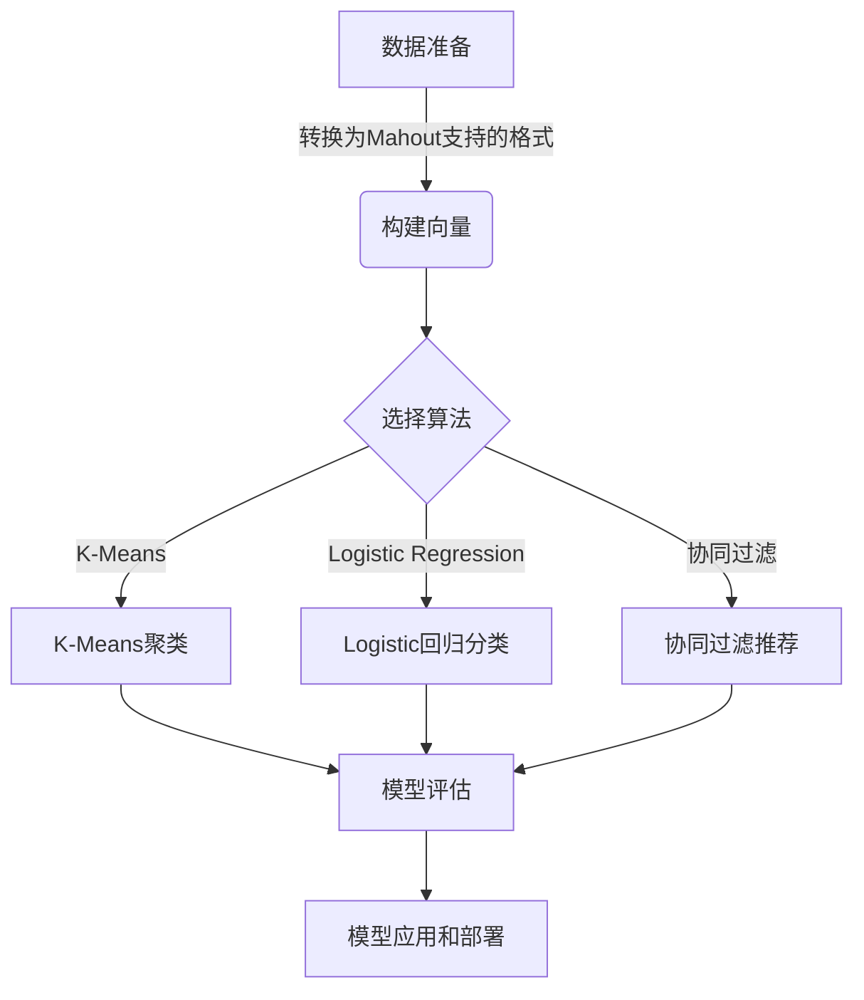

# Mahout原理与代码实例讲解

## 1.背景介绍

在当今大数据时代,海量数据的存在为数据挖掘和机器学习算法的应用提供了广阔的空间。Apache Mahout是一个可扩展的机器学习和数据挖掘库,旨在帮助开发人员更轻松地构建智能应用程序。它是一个基于Apache Hadoop的分布式线性代数框架,支持多种机器学习技术,如聚类、分类、协同过滤和频繁模式挖掘等。

Mahout项目最初于2008年启动,由Apache软件基金会的开源社区驱动。它的目标是通过利用Hadoop的分布式计算能力,为数据科学家和开发人员提供可扩展的机器学习算法实现。凭借其强大的并行处理能力,Mahout可以高效地处理大规模数据集,使其成为大数据环境下进行数据挖掘和机器学习的理想选择。

## 2.核心概念与联系

Mahout的核心概念包括以下几个方面:

### 2.1 分布式线性代数运算

Mahout利用Hadoop的MapReduce框架实现了分布式线性代数运算,如矩阵和向量的基本运算。这为高效的分布式机器学习算法奠定了基础。

### 2.2 机器学习算法库

Mahout提供了多种机器学习算法的实现,包括:

- 聚类算法:K-Means、Fuzzy K-Means、Canopy等。
- 分类算法:Naive Bayes、Logistic Regression、随机森林等。
- 协同过滤算法:基于用户的协同过滤、基于物品的协同过滤等。
- 频繁模式挖掘:FP-Growth算法。
- dimensionality reduction算法:Singular Value Decomposition(SVD)。

### 2.3 数据抽象层

Mahout定义了一组通用的数据结构和接口,如向量、矩阵、元数据等,为机器学习算法提供了统一的数据抽象层。这些数据结构可以方便地在内存和持久化存储之间转换,支持分布式计算。

### 2.4 评估指标

Mahout提供了多种评估指标,用于评估机器学习模型的性能,如准确率、召回率、F1分数、均方根误差等。这些指标有助于选择最优模型并调整算法参数。

## 3.核心算法原理具体操作步骤

Mahout中的机器学习算法通常遵循以下步骤:



1. **数据准备**:从各种数据源收集数据,并将其转换为Mahout支持的格式(如序列文件或向量)。

2. **构建向量**:将数据转换为Mahout可以处理的向量形式,通常使用`VectorWritable`或`SparseVector`等数据结构。

3. **选择算法**:根据问题的性质选择合适的机器学习算法,如聚类、分类或协同过滤等。

4. **算法执行**:使用Mahout提供的算法实现,在分布式环境下训练模型。例如,K-Means聚类、Logistic回归分类或基于物品的协同过滤推荐等。

5. **模型评估**:使用Mahout提供的评估指标,评估模型的性能,如聚类的质量或分类的准确率等。

6. **模型应用和部署**:将训练好的模型应用于实际问题,或者将其部署到生产环境中。

以K-Means聚类算法为例,具体步骤如下:

1. 加载数据,构建向量。
2. 创建`KMeansClusterer`对象,设置参数(如聚类数量、向量权重等)。
3. 运行聚类过程,得到`Cluster`对象。
4. 遍历`Cluster`对象,获取每个聚类的中心点和相关数据点。
5. 可选:使用评估指标(如Silhouette系数)评估聚类质量。
6. 将聚类结果应用于实际问题或可视化展示。

## 4.数学模型和公式详细讲解举例说明

Mahout中的许多算法都基于数学模型和公式。以下是一些常见算法的数学模型和公式:

### 4.1 K-Means聚类

K-Means是一种常用的聚类算法,其目标是将$n$个数据点划分为$k$个聚类,使得每个数据点都属于离它最近的聚类中心。算法通过迭代优化聚类中心,最小化所有数据点到其所属聚类中心的距离之和。

对于数据点$x_i$和聚类中心$c_j$,目标函数为:

$$J = \sum_{i=1}^{n}\sum_{j=1}^{k}r_{ij}||x_i - c_j||^2$$

其中,$r_{ij}$是指示函数,当$x_i$属于聚类$j$时,值为1,否则为0。算法迭代执行以下两个步骤:

1. **分配步骤**:对于每个数据点$x_i$,计算其与所有聚类中心的距离,将其分配到最近的聚类中心。
2. **更新步骤**:对于每个聚类$j$,重新计算聚类中心$c_j$,使其成为该聚类中所有数据点的均值。

重复上述步骤,直到聚类中心不再发生变化或达到最大迭代次数。

### 4.2 Logistic回归

Logistic回归是一种常用的分类算法,它通过对数据进行拟合,得到一个Logistic函数,从而预测数据的类别。对于二分类问题,Logistic函数的形式为:

$$P(y=1|x) = \frac{1}{1 + e^{-(\beta_0 + \beta_1x_1 + \beta_2x_2 + ... + \beta_nx_n)}}$$

其中,$y$是二值目标变量(0或1),$x_i$是特征变量,$\beta_i$是待估计的系数。算法的目标是找到最佳的系数$\beta$,使得对数似然函数$L(\beta)$最大化:

$$L(\beta) = \sum_{i=1}^{n}[y_i\log P(y_i=1|x_i) + (1-y_i)\log(1-P(y_i=1|x_i))]$$

通常使用梯度下降或拟牛顿法等优化算法来求解$\beta$。

### 4.3 协同过滤

协同过滤是一种常用的推荐系统算法,它基于用户对物品的评分,预测用户对未评分物品的偏好。Mahout实现了基于用户和基于物品的协同过滤算法。

以基于用户的协同过滤为例,算法的核心思想是找到与目标用户$u$有相似兴趣的其他用户,并基于这些用户对物品$i$的评分,预测$u$对$i$的评分。具体公式如下:

$$r_{u,i} = \bar{r}_u + \frac{\sum_{v \in S(u,i)}(r_{v,i} - \bar{r}_v)w_{u,v}}{\sum_{v \in S(u,i)}|w_{u,v}|}$$

其中,$r_{u,i}$是对用户$u$对物品$i$的预测评分,$\bar{r}_u$是用户$u$的平均评分,$S(u,i)$是对物品$i$有评分的用户集合,$r_{v,i}$是用户$v$对物品$i$的评分,$\bar{r}_v$是用户$v$的平均评分,$w_{u,v}$是用户$u$和$v$之间的相似度权重。

相似度权重$w_{u,v}$通常使用皮尔逊相关系数或余弦相似度等度量来计算。

## 5.项目实践:代码实例和详细解释说明

以下是一个使用Mahout进行K-Means聚类的Java代码示例:

```java
// 加载数据
String path = "data/reuters.csv";
FileDataModel dataModel = new FileDataModel(new File(path));

// 创建向量
DrmLfHashVectorMapper vectorMapper = new DrmLfHashVectorMapper();
vectorMapper.configure(new Configuration());
List<Vector> vectors = dataModel.getDataVectors(vectorMapper);

// 创建K-Means聚类器
int numClusters = 20;
KMeansClusterer clusterer = new KMeansClusterer(vectors, numClusters);

// 运行聚类
List<List<Vector>> clusters = clusterer.cluster(numClusters);

// 输出聚类结果
for (int i = 0; i < clusters.size(); i++) {
    List<Vector> cluster = clusters.get(i);
    System.out.println("Cluster " + i + " has " + cluster.size() + " points:");
    for (Vector vector : cluster) {
        System.out.println(vector);
    }
}
```

代码解释:

1. 加载数据集,这里使用Reuters新闻数据集。
2. 使用`DrmLfHashVectorMapper`将数据转换为Mahout支持的向量形式。
3. 创建`KMeansClusterer`对象,设置聚类数量为20。
4. 调用`cluster()`方法执行K-Means聚类算法。
5. 遍历聚类结果,输出每个聚类的数据点。

## 6.实际应用场景

Mahout在多个领域都有广泛的应用,以下是一些典型的应用场景:

### 6.1 推荐系统

Mahout中的协同过滤算法可以用于构建推荐系统,为用户推荐感兴趣的物品。例如,亚马逊的"买过这个商品的用户还买过..."功能,就是基于协同过滤算法实现的。

### 6.2 文本挖掘

利用Mahout的聚类和分类算法,可以对大量文本数据进行主题分类、情感分析等文本挖掘任务。例如,新闻网站可以自动将新闻文章分类到不同的主题板块。

### 6.3 网络广告投放

基于用户的浏览历史和兴趣爱好,使用Mahout的协同过滤和分类算法,可以为用户推荐个性化的广告。这种方式比传统的基于关键词匹配的广告投放更加精准。

### 6.4 金融风险评估

在金融领域,可以使用Mahout的聚类算法对客户进行分组,识别潜在的高风险客户群体。同时,也可以使用分类算法预测客户的违约风险。

### 6.5 社交网络分析

对于社交网络数据,可以使用Mahout的聚类算法发现用户社区,或者使用协同过滤算法为用户推荐新的社交关系。

## 7.工具和资源推荐

在使用Mahout进行机器学习和数据挖掘时,以下工具和资源可能会有所帮助:

### 7.1 Apache Hadoop

Mahout建立在Apache Hadoop之上,因此需要先安装和配置Hadoop环境。Hadoop提供了分布式存储(HDFS)和计算(MapReduce)框架,支持Mahout的分布式计算。

### 7.2 Apache Spark

虽然Mahout最初是基于MapReduce的,但也可以与Apache Spark集成,利用Spark的内存计算优势提高性能。Mahout提供了Spark实现的部分算法。

### 7.3 Mahout Shell

Mahout Shell是一个交互式命令行工具,可以方便地执行Mahout算法,而无需编写Java代码。它适合快速原型设计和算法探索。

### 7.4 Mahout在线文档

Apache Mahout官方网站提供了详细的在线文档,包括入门指南、API参考、算法说明等,是学习Mahout的重要资源。

### 7.5 Mahout邮件列表和社区

Mahout拥有活跃的开发者社区和邮件列表,可以在这里提出问题、分享经验或参与贡献代码。

### 7.6 机器学习和数据挖掘书籍

一些优秀的机器学习和数据挖掘书籍,如《机器学习实战》、《数据挖掘:概念与技术》等,可以帮助深入理解算法原理。

## 8.总结:未来发展趋势与挑战

随着大数据时代的到来,机器学习和数据挖掘技术正在快速发展,Mahout作为一个开源的分布式机器学习库,也面临着新的机遇和挑战。

### 8.1 深度学习支持

深度学习是当前机器学习