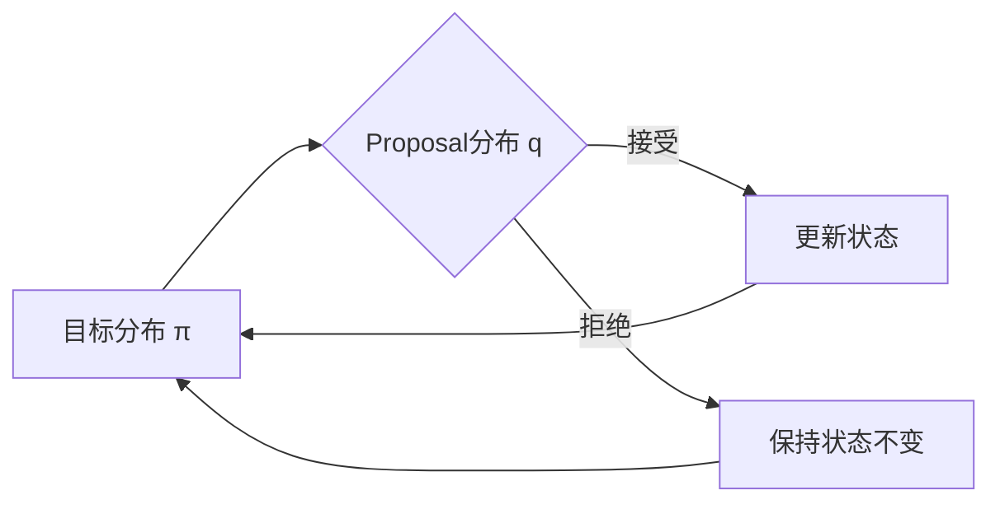

# Metropolis-Hastings算法原理与代码实战案例讲解

## 1. 背景介绍
### 1.1 蒙特卡洛方法概述
### 1.2 马尔可夫链蒙特卡洛(MCMC)方法
### 1.3 Metropolis-Hastings算法的由来

## 2. 核心概念与联系
### 2.1 马尔可夫链
#### 2.1.1 马尔可夫性
#### 2.1.2 平稳分布
#### 2.1.3 细致平稳条件
### 2.2 接受-拒绝采样
### 2.3 Metropolis-Hastings算法原理
#### 2.3.1 目标分布与proposal分布
#### 2.3.2 接受率的计算
#### 2.3.3 算法流程

## 3. 核心算法原理具体操作步骤
### 3.1 目标分布的选取
### 3.2 Proposal分布的选取
### 3.3 接受率的计算
### 3.4 采样过程
### 3.5 收敛性诊断

## 4. 数学模型和公式详细讲解举例说明 
### 4.1 目标分布的数学表示
### 4.2 Proposal分布的数学表示
### 4.3 接受率的数学推导
### 4.4 收敛性证明

## 5. 项目实践：代码实例和详细解释说明
### 5.1 简单一维分布的MH采样
#### 5.1.1 代码实现
#### 5.1.2 结果分析
### 5.2 高斯混合模型的MH采样
#### 5.2.1 代码实现  
#### 5.2.2 结果分析
### 5.3 贝叶斯逻辑回归的MH采样
#### 5.3.1 代码实现
#### 5.3.2 结果分析

## 6. 实际应用场景
### 6.1 贝叶斯参数估计
### 6.2 隐马尔可夫模型的参数学习
### 6.3 主题模型参数推断
### 6.4 深度学习中的应用

## 7. 工具和资源推荐
### 7.1 编程语言和库
### 7.2 可视化工具
### 7.3 相关书籍和教程
### 7.4 开源项目

## 8. 总结：未来发展趋势与挑战
### 8.1 MH算法的优缺点总结
### 8.2 MH算法的改进与拓展
#### 8.2.1 自适应MH算法
#### 8.2.2 Hamiltonian Monte Carlo
#### 8.2.3 可逆跳跃MCMC
### 8.3 MH算法未来的研究方向

## 9. 附录：常见问题与解答
### 9.1 如何判断马尔可夫链是否收敛？
### 9.2 如何选取合适的proposal分布？
### 9.3 MH算法能否用于求解优化问题？
### 9.4 MCMC与变分推断的异同点是什么？



Metropolis-Hastings算法是一种用于从复杂概率分布中抽样的马尔可夫链蒙特卡洛(MCMC)方法。它由Metropolis等人于1953年提出,后由Hastings在1970年进行了推广。该算法通过构造一个马尔可夫链,使其平稳分布收敛到目标分布,从而实现对目标分布的采样。

MH算法的核心思想是:对于当前状态$x_t$,根据某个proposal分布$q(x|x_t)$提议一个候选状态$x^*$,然后以一定的概率$\alpha$接受该候选状态作为下一时刻的状态$x_{t+1}$。接受概率$\alpha$的计算公式为:

$$
\alpha(x_t,x^*) = \min\left(1, \frac{\pi(x^*)q(x_t|x^*)}{\pi(x_t)q(x^*|x_t)}\right)
$$

其中$\pi(x)$为目标分布。可以证明,通过这种方式构造的马尔可夫链的平稳分布就是$\pi(x)$。

MH算法的一般流程如下:

1. 随机初始化初始状态$x_0$
2. 对$t=0,1,2,...$循环执行以下步骤:
   1. 从proposal分布$q(x|x_t)$中采样候选状态$x^*$
   2. 计算接受概率$\alpha(x_t,x^*)$
   3. 从均匀分布$U(0,1)$中采样$u$
   4. 如果$u \leq \alpha(x_t,x^*)$,则接受候选状态,令$x_{t+1}=x^*$;否则保持状态不变,令$x_{t+1}=x_t$
3. 得到样本序列${x_0,x_1,x_2,...}$

在实际应用中,MH算法的性能很大程度上取决于proposal分布的选择。常见的proposal分布有:

1. 对称随机游走:$q(x|x_t)$关于$x_t$对称,如正态分布$N(x_t,\sigma^2)$
2. 独立proposal:$q(x|x_t)$与$x_t$无关,如$q(x)$为$\pi(x)$的一个近似分布
3. Langevin proposal:基于梯度信息构造proposal,如$N(x_t+\frac{\epsilon}{2}\nabla \log \pi(x_t), \epsilon)$

下面以一个简单的一维双峰分布为例,演示MH算法的应用。目标分布为:

$$
\pi(x) = 0.3N(x|-2,1) + 0.7N(x|4,1)
$$

我们使用对称随机游走proposal $q(x|x_t)=N(x_t,1)$进行采样,代码实现如下:

```python
import numpy as np
import matplotlib.pyplot as plt

def target_dist(x):
    return 0.3*np.exp(-0.5*(x+2)**2) + 0.7*np.exp(-0.5*(x-4)**2)

def proposal(x):
    return np.random.normal(x,1)

def accept_prob(x,y):
    return min(1, target_dist(y)/target_dist(x))

def metropolis_hastings(n_samples):
    samples = np.zeros(n_samples)
    x = 0 
    for i in range(n_samples):
        y = proposal(x)
        u = np.random.rand()
        if u < accept_prob(x,y):
            x = y
        samples[i] = x
    return samples

samples = metropolis_hastings(10000)
x = np.linspace(-6,8,200)
plt.hist(samples, bins=50, density=True)
plt.plot(x, target_dist(x))
plt.show()
```

运行结果如下图所示,可以看到MH算法很好地采样了目标分布。


MH算法在贝叶斯推断、机器学习等领域有广泛应用,如贝叶斯参数估计、LDA主题模型推断等。但是MH算法也存在一些局限性,如:

1. 收敛速度慢,需要较长的burn-in时间
2. 容易被局部最值困住,难以跨越低概率区域
3. 采样效率低,有较高的自相关

为了克服这些问题,研究者提出了一些MH算法的改进方法,如自适应MH、Hamiltonian Monte Carlo、可逆跳跃MCMC等。此外,如何诊断MCMC是否收敛,如何选取合适的proposal分布,也是MH算法实践中需要考虑的问题。

总的来说,Metropolis-Hastings算法是一个简单而强大的采样算法,在现代统计建模和机器学习中扮演着重要角色。深入理解其原理,并掌握其使用技巧,将有助于我们更好地运用概率模型解决实际问题。未来MH算法在可扩展性、收敛速度等方面还有很大的改进空间,也是研究的重要方向。

作者：禅与计算机程序设计艺术 / Zen and the Art of Computer Programming