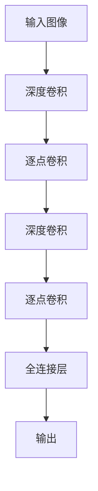

# MobileNet原理与代码实例讲解

## 1.背景介绍

在深度学习领域，卷积神经网络（CNN）已经成为图像识别和分类任务的主力军。然而，传统的CNN模型如VGG和ResNet虽然在准确性上表现优异，但其庞大的参数量和计算量使得在资源受限的设备上（如移动设备）部署变得困难。为了解决这一问题，Google提出了MobileNet，它是一种轻量级的深度神经网络，专为移动和嵌入式视觉应用设计。

MobileNet的核心思想是通过深度可分离卷积（Depthwise Separable Convolution）来减少模型的参数量和计算量，从而在保持较高准确率的同时，大幅度提升模型的效率。

## 2.核心概念与联系

### 2.1 深度可分离卷积

深度可分离卷积是MobileNet的核心技术，它将标准卷积分解为两个更简单的操作：深度卷积（Depthwise Convolution）和逐点卷积（Pointwise Convolution）。

- **深度卷积**：对每个输入通道分别进行卷积操作。
- **逐点卷积**：使用 $1 \times 1$ 卷积将深度卷积的输出进行线性组合。

这种分解方式大大减少了计算量和参数量。

### 2.2 宽度乘子（Width Multiplier）

宽度乘子是一个超参数，用于控制网络的宽度。通过调整宽度乘子，可以在准确性和计算量之间进行权衡。

### 2.3 分辨率乘子（Resolution Multiplier）

分辨率乘子用于调整输入图像的分辨率，从而进一步减少计算量。

## 3.核心算法原理具体操作步骤

### 3.1 标准卷积

标准卷积的计算量为：

$$
D_k \times D_k \times M \times N \times D_f \times D_f
$$

其中，$D_k$ 是卷积核的尺寸，$M$ 是输入通道数，$N$ 是输出通道数，$D_f$ 是特征图的尺寸。

### 3.2 深度可分离卷积

深度可分离卷积的计算量为：

$$
D_k \times D_k \times M \times D_f \times D_f + M \times N \times D_f \times D_f
$$

通过这种分解，计算量减少了约 $1/N$。

### 3.3 MobileNet的构建

MobileNet的构建步骤如下：

1. **输入层**：输入图像。
2. **深度卷积层**：对每个输入通道分别进行卷积。
3. **逐点卷积层**：使用 $1 \times 1$ 卷积将深度卷积的输出进行线性组合。
4. **重复步骤2和3**：构建多个深度可分离卷积层。
5. **全连接层**：用于分类任务。

以下是MobileNet的Mermaid流程图：



## 4.数学模型和公式详细讲解举例说明

### 4.1 深度卷积

深度卷积的计算公式为：

$$
Y_{i,j,k} = \sum_{m=0}^{D_k-1} \sum_{n=0}^{D_k-1} X_{i+m,j+n,k} \cdot W_{m,n,k}
$$

其中，$X$ 是输入特征图，$W$ 是卷积核，$Y$ 是输出特征图。

### 4.2 逐点卷积

逐点卷积的计算公式为：

$$
Y_{i,j,k} = \sum_{c=0}^{M-1} X_{i,j,c} \cdot W_{1,1,c,k}
$$

其中，$M$ 是输入通道数，$W$ 是 $1 \times 1$ 卷积核。

### 4.3 计算量对比

标准卷积的计算量为：

$$
D_k \times D_k \times M \times N \times D_f \times D_f
$$

深度可分离卷积的计算量为：

$$
D_k \times D_k \times M \times D_f \times D_f + M \times N \times D_f \times D_f
$$

通过这种分解，计算量减少了约 $1/N$。

## 5.项目实践：代码实例和详细解释说明

### 5.1 安装依赖

首先，确保你已经安装了TensorFlow和Keras。可以使用以下命令进行安装：

```bash
pip install tensorflow keras
```

### 5.2 MobileNet模型的实现

以下是一个简单的MobileNet实现示例：

```python
import tensorflow as tf
from tensorflow.keras.models import Model
from tensorflow.keras.layers import Input, Conv2D, DepthwiseConv2D, BatchNormalization, ReLU, GlobalAveragePooling2D, Dense

def MobileNet(input_shape=(224, 224, 3), num_classes=1000):
    inputs = Input(shape=input_shape)
    
    # Initial Conv layer
    x = Conv2D(32, (3, 3), strides=(2, 2), padding='same')(inputs)
    x = BatchNormalization()(x)
    x = ReLU()(x)
    
    # Depthwise Separable Convolution blocks
    def depthwise_separable_conv(x, filters, strides):
        x = DepthwiseConv2D((3, 3), strides=strides, padding='same')(x)
        x = BatchNormalization()(x)
        x = ReLU()(x)
        x = Conv2D(filters, (1, 1), padding='same')(x)
        x = BatchNormalization()(x)
        x = ReLU()(x)
        return x
    
    x = depthwise_separable_conv(x, 64, (1, 1))
    x = depthwise_separable_conv(x, 128, (2, 2))
    x = depthwise_separable_conv(x, 128, (1, 1))
    x = depthwise_separable_conv(x, 256, (2, 2))
    x = depthwise_separable_conv(x, 256, (1, 1))
    x = depthwise_separable_conv(x, 512, (2, 2))
    
    for _ in range(5):
        x = depthwise_separable_conv(x, 512, (1, 1))
    
    x = depthwise_separable_conv(x, 1024, (2, 2))
    x = depthwise_separable_conv(x, 1024, (1, 1))
    
    # Global Average Pooling and Output
    x = GlobalAveragePooling2D()(x)
    outputs = Dense(num_classes, activation='softmax')(x)
    
    model = Model(inputs, outputs)
    return model

# Create the model
model = MobileNet()
model.summary()
```

### 5.3 代码解释

1. **输入层**：定义输入图像的形状。
2. **初始卷积层**：使用标准卷积进行初始特征提取。
3. **深度可分离卷积块**：定义一个函数来实现深度可分离卷积，并在网络中多次调用。
4. **全局平均池化和输出层**：使用全局平均池化层和全连接层进行分类。

## 6.实际应用场景

MobileNet由于其高效性和轻量级特性，广泛应用于各种实际场景中：

### 6.1 移动设备上的图像分类

MobileNet可以在智能手机等移动设备上进行实时图像分类，应用于相册管理、增强现实等领域。

### 6.2 嵌入式设备上的物体检测

在嵌入式设备上，MobileNet可以用于物体检测，如智能家居中的安防监控、无人机的目标识别等。

### 6.3 自动驾驶

MobileNet可以集成到自动驾驶系统中，用于实时识别道路标志、行人和其他车辆。

## 7.工具和资源推荐

### 7.1 开发工具

- **TensorFlow**：一个开源的深度学习框架，支持MobileNet的实现和训练。
- **Keras**：一个高层神经网络API，简化了MobileNet的构建和训练过程。

### 7.2 数据集

- **ImageNet**：一个大型图像数据集，常用于训练和评估图像分类模型。
- **COCO**：一个常用于物体检测的数据集。

### 7.3 资源

- [MobileNet论文](https://arxiv.org/abs/1704.04861)：详细介绍了MobileNet的设计和实现。
- [TensorFlow官方文档](https://www.tensorflow.org/)：提供了丰富的教程和API文档。

## 8.总结：未来发展趋势与挑战

### 8.1 未来发展趋势

随着移动设备和嵌入式设备的普及，轻量级神经网络的需求将持续增长。MobileNet作为其中的代表，将在以下几个方面继续发展：

- **更高效的模型**：通过改进深度可分离卷积和其他技术，进一步减少计算量和参数量。
- **更广泛的应用**：MobileNet将应用于更多领域，如医疗影像分析、智能家居等。

### 8.2 挑战

- **准确性与效率的平衡**：在减少计算量的同时，如何保持甚至提高模型的准确性是一个重要挑战。
- **硬件限制**：移动设备和嵌入式设备的硬件限制仍然是一个瓶颈，需要进一步优化模型以适应这些设备。

## 9.附录：常见问题与解答

### 9.1 MobileNet与其他轻量级模型的对比

**问题**：MobileNet与其他轻量级模型（如SqueezeNet、ShuffleNet）相比有什么优势？

**解答**：MobileNet通过深度可分离卷积大幅减少了计算量和参数量，同时在准确性上表现优异。相比之下，SqueezeNet和ShuffleNet虽然也有类似的目标，但在某些任务上可能不如MobileNet高效。

### 9.2 如何选择宽度乘子和分辨率乘子？

**问题**：如何选择合适的宽度乘子和分辨率乘子？

**解答**：宽度乘子和分辨率乘子是用于控制模型复杂度的超参数。一般来说，可以通过实验来选择合适的值，以在准确性和计算量之间找到最佳平衡。

### 9.3 MobileNet的训练技巧

**问题**：在训练MobileNet时，有哪些技巧可以提高模型的性能？

**解答**：一些常见的训练技巧包括使用数据增强、学习率调度、正则化等。此外，可以尝试使用预训练模型进行微调，以加速训练过程并提高准确性。

---

作者：禅与计算机程序设计艺术 / Zen and the Art of Computer Programming