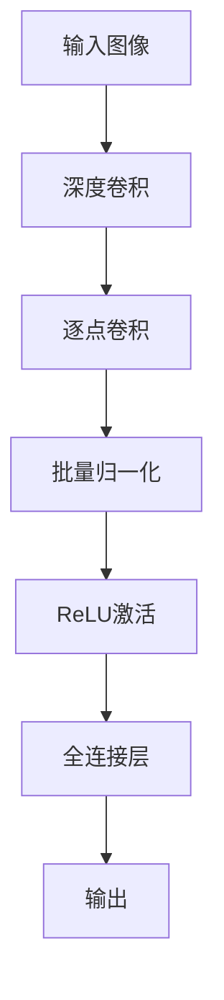

# MobileNet原理与代码实例讲解

## 1.背景介绍

在深度学习领域，卷积神经网络（CNN）已经成为图像识别和分类任务的主流方法。然而，传统的卷积神经网络通常需要大量的计算资源和存储空间，这使得它们在移动设备和嵌入式系统上的应用受到了限制。为了解决这一问题，Google提出了MobileNet，这是一种轻量级的深度神经网络架构，专为移动和嵌入式设备设计。

MobileNet的核心思想是通过引入深度可分离卷积（Depthwise Separable Convolution）来减少计算量和模型参数，从而在保证精度的前提下大幅提升计算效率。本文将详细介绍MobileNet的原理、核心算法、数学模型，并通过代码实例展示其实际应用。

## 2.核心概念与联系

### 2.1 深度可分离卷积

深度可分离卷积是MobileNet的核心创新点。传统的卷积操作将输入特征图与卷积核进行全连接操作，而深度可分离卷积将这一过程分解为两个独立的步骤：深度卷积（Depthwise Convolution）和逐点卷积（Pointwise Convolution）。

- **深度卷积**：对每个输入通道分别进行卷积操作，不进行通道间的混合。
- **逐点卷积**：使用 $1 \times 1$ 卷积核对深度卷积的输出进行通道间的线性组合。

这种分解方式大大减少了计算量和参数量。

### 2.2 宽度乘子和分辨率乘子

MobileNet引入了两个重要的超参数：宽度乘子（Width Multiplier）和分辨率乘子（Resolution Multiplier），用于进一步控制模型的复杂度和计算量。

- **宽度乘子**：通过缩减每一层的通道数来减少计算量。
- **分辨率乘子**：通过缩减输入图像的分辨率来减少计算量。

### 2.3 结构概览

MobileNet的基本结构由多个深度可分离卷积层和全连接层组成。每个深度可分离卷积层包括一个深度卷积和一个逐点卷积，后接批量归一化和ReLU激活函数。



## 3.核心算法原理具体操作步骤

### 3.1 深度卷积

深度卷积的操作步骤如下：

1. 对每个输入通道分别进行卷积操作。
2. 使用 $k \times k$ 的卷积核，输出特征图的通道数与输入特征图的通道数相同。

### 3.2 逐点卷积

逐点卷积的操作步骤如下：

1. 使用 $1 \times 1$ 的卷积核，对深度卷积的输出进行通道间的线性组合。
2. 输出特征图的通道数可以通过调整卷积核的数量来控制。

### 3.3 组合操作

将深度卷积和逐点卷积组合起来，形成一个完整的深度可分离卷积层。每个深度可分离卷积层后接批量归一化和ReLU激活函数。

## 4.数学模型和公式详细讲解举例说明

### 4.1 传统卷积计算量

传统卷积的计算量为：

$$
D_k \times D_k \times M \times N \times D_f \times D_f
$$

其中，$D_k$ 是卷积核的大小，$M$ 是输入通道数，$N$ 是输出通道数，$D_f$ 是特征图的大小。

### 4.2 深度可分离卷积计算量

深度可分离卷积的计算量为：

$$
D_k \times D_k \times M \times D_f \times D_f + M \times N \times D_f \times D_f
$$

通过这种分解，计算量减少了：

$$
\frac{D_k \times D_k \times M \times N \times D_f \times D_f}{D_k \times D_k \times M \times D_f \times D_f + M \times N \times D_f \times D_f}
$$

### 4.3 举例说明

假设输入特征图大小为 $32 \times 32 \times 3$，卷积核大小为 $3 \times 3$，输出通道数为 64。

- 传统卷积计算量：$3 \times 3 \times 3 \times 64 \times 32 \times 32 = 552,960$
- 深度可分离卷积计算量：$3 \times 3 \times 3 \times 32 \times 32 + 3 \times 64 \times 32 \times 32 = 27,648 + 196,608 = 224,256$

可以看到，深度可分离卷积的计算量大大减少。

## 5.项目实践：代码实例和详细解释说明

### 5.1 环境准备

首先，确保你已经安装了必要的库：

```bash
pip install tensorflow keras
```

### 5.2 MobileNet模型定义

以下是使用Keras定义MobileNet模型的代码：

```python
import tensorflow as tf
from tensorflow.keras.models import Model
from tensorflow.keras.layers import Input, Conv2D, DepthwiseConv2D, BatchNormalization, ReLU, GlobalAveragePooling2D, Dense

def depthwise_separable_conv_block(inputs, pointwise_filters, strides=(1, 1)):
    x = DepthwiseConv2D(kernel_size=(3, 3), strides=strides, padding='same')(inputs)
    x = BatchNormalization()(x)
    x = ReLU()(x)
    x = Conv2D(pointwise_filters, kernel_size=(1, 1), padding='same')(x)
    x = BatchNormalization()(x)
    x = ReLU()(x)
    return x

def MobileNet(input_shape=(224, 224, 3), num_classes=1000):
    inputs = Input(shape=input_shape)
    x = Conv2D(32, kernel_size=(3, 3), strides=(2, 2), padding='same')(inputs)
    x = BatchNormalization()(x)
    x = ReLU()(x)
    
    x = depthwise_separable_conv_block(x, 64)
    x = depthwise_separable_conv_block(x, 128, strides=(2, 2))
    x = depthwise_separable_conv_block(x, 128)
    x = depthwise_separable_conv_block(x, 256, strides=(2, 2))
    x = depthwise_separable_conv_block(x, 256)
    x = depthwise_separable_conv_block(x, 512, strides=(2, 2))
    
    for _ in range(5):
        x = depthwise_separable_conv_block(x, 512)
    
    x = depthwise_separable_conv_block(x, 1024, strides=(2, 2))
    x = depthwise_separable_conv_block(x, 1024)
    
    x = GlobalAveragePooling2D()(x)
    outputs = Dense(num_classes, activation='softmax')(x)
    
    model = Model(inputs, outputs)
    return model

model = MobileNet()
model.summary()
```

### 5.3 代码解释

- **depthwise_separable_conv_block**：定义了一个深度可分离卷积块，包括深度卷积、批量归一化、ReLU激活和逐点卷积。
- **MobileNet**：定义了MobileNet模型结构，包括输入层、初始卷积层、多个深度可分离卷积块、全局平均池化层和输出层。

### 5.4 模型训练

使用CIFAR-10数据集进行模型训练：

```python
from tensorflow.keras.datasets import cifar10
from tensorflow.keras.optimizers import Adam
from tensorflow.keras.losses import SparseCategoricalCrossentropy

(x_train, y_train), (x_test, y_test) = cifar10.load_data()

model.compile(optimizer=Adam(),
              loss=SparseCategoricalCrossentropy(),
              metrics=['accuracy'])

model.fit(x_train, y_train, epochs=10, batch_size=32, validation_data=(x_test, y_test))
```

## 6.实际应用场景

### 6.1 移动设备

MobileNet在移动设备上的应用非常广泛，如智能手机中的图像识别、增强现实（AR）应用等。其轻量级的特性使得它能够在计算资源有限的设备上高效运行。

### 6.2 嵌入式系统

在嵌入式系统中，MobileNet可以用于实时图像处理和物体检测，如无人机、机器人和智能家居设备等。

### 6.3 云端服务

尽管MobileNet主要针对移动和嵌入式设备设计，但它也可以在云端服务中使用，以提供高效的图像处理和分类服务。

## 7.工具和资源推荐

### 7.1 开发工具

- **TensorFlow**：一个开源的深度学习框架，支持MobileNet的实现和训练。
- **Keras**：一个高层神经网络API，简化了MobileNet的定义和训练过程。

### 7.2 数据集

- **ImageNet**：一个大型图像数据集，常用于训练和评估图像分类模型。
- **CIFAR-10**：一个小型图像数据集，适合初学者进行模型训练和测试。

### 7.3 参考文献

- Howard, A. G., et al. "MobileNets: Efficient Convolutional Neural Networks for Mobile Vision Applications." arXiv preprint arXiv:1704.04861 (2017).

## 8.总结：未来发展趋势与挑战

MobileNet的提出为轻量级神经网络的设计提供了新的思路。未来，随着移动设备和嵌入式系统的不断发展，轻量级模型的需求将会越来越大。MobileNet的成功也激发了更多研究者在这一领域进行探索，如MobileNetV2、MobileNetV3等。

然而，轻量级模型在追求高效的同时，也面临着一些挑战，如如何在进一步减少计算量的同时保持模型的精度，以及如何在不同应用场景中进行优化和调整。

## 9.附录：常见问题与解答

### 9.1 MobileNet与传统卷积神经网络的主要区别是什么？

MobileNet通过引入深度可分离卷积来减少计算量和参数量，而传统卷积神经网络使用全连接的卷积操作。

### 9.2 如何选择宽度乘子和分辨率乘子？

宽度乘子和分辨率乘子的选择取决于具体应用场景和计算资源。一般来说，可以通过实验调整这两个超参数，以找到性能和效率的最佳平衡点。

### 9.3 MobileNet适合哪些应用场景？

MobileNet适合计算资源有限的应用场景，如移动设备、嵌入式系统和实时图像处理任务。

### 9.4 如何在实际项目中应用MobileNet？

可以使用TensorFlow和Keras等深度学习框架来实现和训练MobileNet模型，并将其部署到移动设备或嵌入式系统中。

### 9.5 MobileNet的未来发展方向是什么？

未来，MobileNet的研究将继续围绕如何进一步减少计算量和参数量，同时提高模型的精度和适应性。

---

作者：禅与计算机程序设计艺术 / Zen and the Art of Computer Programming