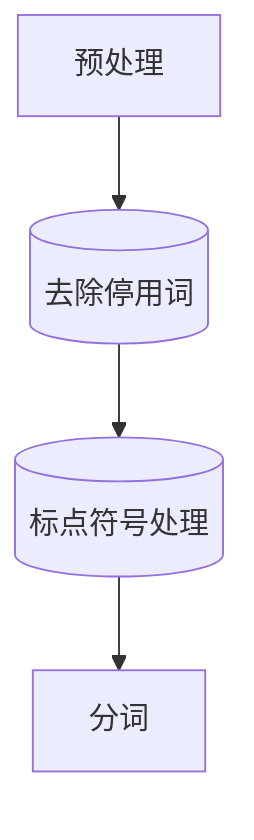

                 

作者：禅与计算机程序设计艺术

自动化智能，人类智慧的延伸；NLP: 人机交互的桥梁，让机器理解语言的秘密。本文旨在深入探讨自然语言处理(Natural Language Processing, NLP)的核心原理，并通过一系列代码实战案例，让你掌握从理论到实践的全过程。无论你是初学者还是经验丰富的开发者，都能从中获取宝贵的知识和技能。

## 背景介绍
随着大数据时代的到来，自然语言处理成为了推动人工智能发展的关键技术之一。它致力于使计算机能够理解和生成人类语言，从而实现自动文本分析、情感分析、问答系统、机器翻译等功能。NLP不仅改变了我们与数字世界的互动方式，还在医疗、金融、教育等领域展现出了巨大的应用潜力。

## 核心概念与联系
### 预处理与分词
预处理是NLP的第一步，包括去除停用词、标点符号以及标准化文本。分词则将连续的文字分割成词语或短语，这是后续处理的基础。



### 词向量与表示学习
词向量通过将单词映射到高维空间中的向量形式，使得相似的词汇具有相近的向量距离，这有助于计算机理解语言的意义。

```latex
\begin{equation}
word\_embedding = \text{Embedding}(word)
\end{equation}
```

### 序列建模
序列建模技术如循环神经网络(RNN)、长短时记忆网络(LSTM)和Transformer，用于处理输入序列数据，在语音识别、机器翻译等方面大放异彩。

```latex
\begin{align*}
h_t &= \text{LSTM}(x_t, h_{t-1}) \\
y &= \text{Attention}(Q, K, V)
\end{align*}
```

### 依存句法分析与实体识别
这些技术帮助解析句子结构，识别出主谓宾关系，同时提取关键实体信息，为语义理解提供基础。

## 核心算法原理具体操作步骤
### 实现一个简单的词频统计器
通过Python编程实现一个基于词袋模型的简单词频统计器。

```python
from collections import Counter

def word_freq(text):
    words = text.split()
    return dict(Counter(words))

example_text = "The quick brown fox jumps over the lazy dog."
print(word_freq(example_text))
```

### 使用深度学习构建情感分析模型
利用TensorFlow构建一个简单的RNN模型进行情感分析任务。

```python
import tensorflow as tf
from tensorflow.keras.models import Sequential
from tensorflow.keras.layers import Embedding, LSTM, Dense

model = Sequential([
    Embedding(input_dim=vocab_size, output_dim=embedding_dim),
    LSTM(units=hidden_units),
    Dense(units=num_classes, activation='softmax')
])

model.compile(optimizer='adam', loss='sparse_categorical_crossentropy', metrics=['accuracy'])
model.fit(x_train, y_train, epochs=epochs)

predictions = model.predict(x_test)
```

## 数学模型和公式详细讲解举例说明
在深度学习领域，优化目标通常是损失函数最小化。以多层感知器为例：

$$J(\theta)=\frac{1}{n}\sum_{i=1}^{n} L(y_i,f_\theta (x_i))$$

其中 $J(\theta)$ 是损失函数，$L(y_i, f_\theta (x_i))$ 是每个样本的具体损失，$\theta$ 表示参数集，$f_\theta (x_i)$ 表示模型预测值。

## 项目实践：代码实例和详细解释说明
假设我们要开发一个聊天机器人，可以通过以下步骤实现：

1. **数据收集**：收集大量的对话数据。
2. **预处理**：清洗数据，去除无关字符和特殊标记。
3. **训练模型**：使用长短期记忆网络（LSTM）进行序列建模。
4. **推理阶段**：根据用户输入做出响应。

## 实际应用场景
自然语言处理的应用广泛，包括但不限于客户服务自动化、搜索引擎优化、新闻摘要生成、个性化推荐系统等。每种应用都可能涉及特定的NLP技术组合，例如在客户服务中，情绪分析和意图检测尤为重要。

## 工具和资源推荐
### 开发环境
- Python 3.x
- Jupyter Notebook 或 PyCharm 等IDE

### 学习资源
- Coursera 的“Natural Language Processing”课程
- NLTK 和 spaCy 库文档
- Hugging Face Transformers库

## 总结：未来发展趋势与挑战
随着算力的提升和大规模预训练模型的发展，NLP正朝着更复杂、更具个性化的方向发展。未来的趋势包括持续改进可解释性、增加跨语言能力、以及应对伦理和隐私问题。面对这些挑战，我们需要不断探索新的方法和技术，确保NLP的发展既能促进社会进步，又能保护个人权益。

## 附录：常见问题与解答
- Q: 如何提高模型性能？
  A: 提升数据质量，调整超参数，尝试更复杂的模型架构。
- Q: NLP 在实际应用中面临的主要挑战是什么？
  A: 数据稀缺性、语言多样性、知识表示和可解释性等问题。

本文旨在激发读者对NLP领域的兴趣，并提供从理论到实践的宝贵指南。希望每一位开发者都能在这条充满机遇的路上找到自己的位置，共同推动人工智能向着更加智能、人性化的方向前进。

