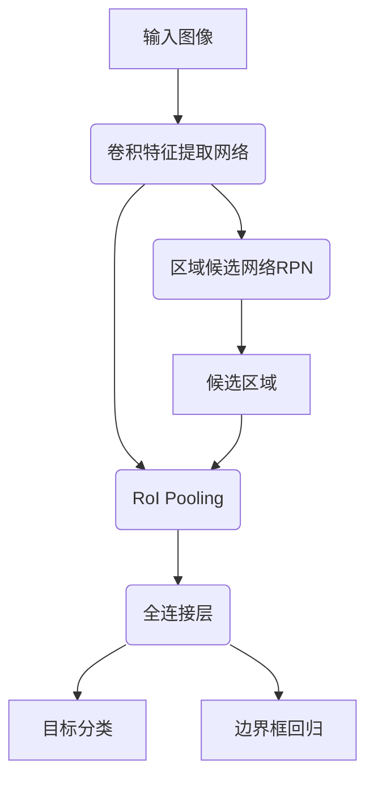

# Object Detection 原理与代码实战案例讲解

## 1. 背景介绍

在计算机视觉领域中,对象检测(Object Detection)是一项极具挑战的基础任务,旨在自动定位和识别图像或视频中的目标对象。随着深度学习技术的飞速发展,对象检测算法取得了长足进步,并在诸多领域得到广泛应用,如自动驾驶、安防监控、机器人视觉等。

对象检测不仅需要识别出图像中存在哪些目标对象,还需要精确定位每个目标的位置和大小。与图像分类任务相比,对象检测问题更加复杂,需要同时解决目标分类和目标定位两个子任务。

## 2. 核心概念与联系

对象检测算法通常可分为两个阶段:

1. **候选区域生成(Region Proposal Generation)**
2. **目标分类和位置精修(Classification and Bounding Box Regression)**

### 2.1 候选区域生成

候选区域生成阶段的目标是从输入图像中提取出可能包含目标对象的区域,这些区域被称为候选区域(Region Proposals)。常用的候选区域生成算法有选择性搜索(Selective Search)、EdgeBoxes等传统方法,以及基于深度学习的区域候选网络(Region Proposal Network, RPN)。

### 2.2 目标分类和位置精修

在获取候选区域后,下一步是对每个候选区域进行目标分类和边界框回归,以确定该区域是否包含目标对象,如果包含,则需要精确定位目标的位置和大小。这一阶段通常由卷积神经网络(CNN)完成。

## 3. 核心算法原理具体操作步骤  

### 3.1 基于传统方法的对象检测算法

早期的对象检测算法主要基于传统的计算机视觉技术,如滑动窗口(Sliding Window)、级联分类器(Cascade Classifier)、形状模型(Shape Model)等。这些算法通常依赖手工设计的特征提取器,如HOG(Histogram of Oriented Gradients)、SIFT(Scale-Invariant Feature Transform)等,再结合机器学习分类器(如SVM、AdaBoost等)进行目标检测。

这类算法的主要缺点是:

1. 特征提取和分类两个阶段相互独立,无法进行端到端的优化。
2. 手工设计的特征往往难以捕捉目标对象的高层语义信息。
3. 对于复杂场景和变形目标,检测性能较差。

### 3.2 基于深度学习的对象检测算法

近年来,基于深度学习的对象检测算法取得了突破性进展,主要分为两大类:

1. **基于区域的对象检测算法(Region-based Object Detection)**
2. **基于密集预测的对象检测算法(Dense Prediction Object Detection)**

#### 3.2.1 基于区域的对象检测算法

基于区域的对象检测算法遵循"候选区域生成 + 目标分类和位置精修"的典型流程。代表性算法有R-CNN系列算法(R-CNN、Fast R-CNN、Faster R-CNN等)。

**R-CNN(Region-based Convolutional Neural Networks)**

R-CNN算法首先使用选择性搜索算法生成约2000个候选区域,然后将每个候选区域缩放到固定尺寸,并通过预训练的CNN(如AlexNet)提取特征,最后使用SVM分类器进行目标分类和边界框回归。R-CNN虽然取得了当时最好的检测性能,但由于需要大量冗余计算,速度极其缓慢。

**Fast R-CNN**

为了加速R-CNN,Fast R-CNN算法将整个图像输入到CNN中提取特征,然后在CNN特征图上利用区域池化层(RoI Pooling Layer)提取候选区域的特征,最后通过全连接层进行分类和回归。Fast R-CNN将特征提取和分类回归两个步骤合并,大大提高了计算效率。

**Faster R-CNN**

Faster R-CNN在Fast R-CNN的基础上,引入了区域候选网络(RPN),用于端到端地生成候选区域和预测目标位置,进一步提升了检测速度和精度。

Faster R-CNN的工作流程如下所示:



#### 3.2.2 基于密集预测的对象检测算法

与基于区域的算法不同,基于密集预测的对象检测算法直接对输入图像的每个位置进行目标分类和边界框回归,无需先生成候选区域。这类算法的优点是计算更简单高效,缺点是对小目标和密集目标的检测性能相对较差。代表性算法有YOLO(You Only Look Once)、SSD(Single Shot MultiBox Detector)等。

**YOLO(You Only Look Once)**

YOLO算法将输入图像划分为SxS个网格,对于每个网格,算法会预测B个边界框以及每个边界框内包含目标的置信度。同时,对于每个边界框,算法还会预测C个类别概率。YOLO的优点是速度极快,缺点是对小目标的检测精度较低。

**SSD(Single Shot MultiBox Detector)**

SSD算法在不同尺度的特征图上预测边界框和类别概率,从而能够检测不同大小的目标。SSD的基本思路是:

1. 利用卷积特征图金字塔获取多尺度特征
2. 在每个特征图上密集采样一组默认边界框
3. 对每个默认边界框,预测其包含目标的置信度以及目标类别概率

SSD算法的检测精度较高,但速度较YOLO稍慢。

## 4. 数学模型和公式详细讲解举例说明

对象检测算法中涉及到多个关键的数学模型和公式,包括:

### 4.1 IoU(Intersection over Union)

IoU是评估边界框预测精度的重要指标,定义为预测边界框与真实边界框的交集与并集之比:

$$
\text{IoU} = \frac{\text{Area of Overlap}}{\text{Area of Union}}
$$

在对象检测任务中,通常将IoU大于某个阈值(如0.5)的预测框视为正样本。

### 4.2 边界框回归(Bounding Box Regression)

边界框回归是对象检测算法中的一个关键步骤,旨在精修候选区域的位置和大小。常用的边界框回归方法是预测四个参数 $(t_x, t_y, t_w, t_h)$,分别表示中心坐标的偏移量和宽高的缩放量:

$$
\begin{aligned}
t_x &= (x - x_a) / w_a \\
t_y &= (y - y_a) / h_a \\
t_w &= \log(w / w_a) \\
t_h &= \log(h / h_a)
\end{aligned}
$$

其中 $(x, y, w, h)$ 表示预测边界框的中心坐标、宽度和高度, $(x_a, y_a, w_a, h_a)$ 表示候选区域的相应参数。

### 4.3 非极大值抑制(Non-Maximum Suppression, NMS)

对象检测算法往往会对同一目标产生多个重叠的预测框,非极大值抑制是一种去除这些冗余预测框的技术。NMS的基本思路是:

1. 按照预测框的置信度从高到低排序
2. 从置信度最高的预测框开始,移除所有与之重叠程度较高(IoU大于阈值)的其他预测框
3. 重复上述过程,直到所有预测框被处理

通过NMS,我们可以保留置信度最高的一些预测框,从而获得最终的检测结果。

### 4.4 锚框(Anchor Box)

锚框是区域候选网络(RPN)和一些密集预测算法(如SSD)中的一个关键概念。锚框是一组预定义的边界框,具有不同的尺度和长宽比,用于匹配不同形状和大小的目标对象。

在RPN中,锚框被分配到特征图的每个位置,并通过边界框回归和二值分类(前景或背景)来预测包含目标的区域。在SSD中,锚框被用于直接预测目标类别和边界框偏移量。

合理设置锚框的尺度和长宽比,对于提高对象检测算法的性能至关重要。

## 5. 项目实践:代码实例和详细解释说明

为了帮助读者更好地理解对象检测算法的实现细节,我们将使用PyTorch框架,基于开源的Faster R-CNN模型,构建一个对象检测项目。

### 5.1 环境配置

首先,我们需要安装所需的Python包,包括PyTorch、Torchvision、Pillow等:

```bash
pip install torch torchvision pillow
```

### 5.2 数据准备

我们将使用广为人知的COCO(Common Objects in Context)数据集进行训练和测试。COCO数据集包含80个常见对象类别,如人、车辆、动物等,图像场景多样,对象形态和大小变化较大。

我们可以使用Torchvision中内置的COCO数据集加载器,简化数据加载过程:

```python
from torchvision.datasets import CocoDetection
import torchvision.transforms as transforms

# 定义数据预处理
data_transform = transforms.Compose([
    transforms.ToTensor()
])

# 加载COCO数据集
train_dataset = CocoDetection(root='data/train', annFile='data/annotations/instances_train2017.json', transform=data_transform)
val_dataset = CocoDetection(root='data/val', annFile='data/annotations/instances_val2017.json', transform=data_transform)
```

### 5.3 模型构建

接下来,我们将构建Faster R-CNN模型。PyTorch提供了预训练的Faster R-CNN模型,我们可以直接加载并进行微调:

```python
from torchvision.models.detection import fasterrcnn_resnet50_fpn

# 加载预训练模型
model = fasterrcnn_resnet50_fpn(pretrained=True)

# 替换分类头,使其适配COCO数据集的80个类别
num_classes = 80  # COCO有80个类别
in_features = model.roi_heads.box_predictor.cls_score.in_features
model.roi_heads.box_predictor = FastRCNNPredictor(in_features, num_classes)
```

### 5.4 模型训练

定义训练和验证函数:

```python
import torch
from engine import train_one_epoch, evaluate

def train(model, data_loaders, optimizer, scheduler, num_epochs):
    for epoch in range(num_epochs):
        # 训练一个epoch
        train_one_epoch(model, optimizer, data_loaders['train'], device, epoch, print_freq=10)
        
        # 在验证集上评估
        evaluate(model, data_loaders['val'], device=device)
        
        # 更新学习率
        scheduler.step()

# 设置训练参数
device = torch.device('cuda') if torch.cuda.is_available() else torch.device('cpu')
num_epochs = 10
params = [p for p in model.parameters() if p.requires_grad]
optimizer = torch.optim.SGD(params, lr=0.005, momentum=0.9, weight_decay=0.0005)
lr_scheduler = torch.optim.lr_scheduler.StepLR(optimizer, step_size=3, gamma=0.1)

# 构建数据加载器
data_loaders = {
    'train': torch.utils.data.DataLoader(train_dataset, batch_size=2, shuffle=True, num_workers=4, collate_fn=utils.collate_fn),
    'val': torch.utils.data.DataLoader(val_dataset, batch_size=2, shuffle=False, num_workers=4, collate_fn=utils.collate_fn)
}

# 训练模型
train(model, data_loaders, optimizer, lr_scheduler, num_epochs)
```

在`train_one_epoch`函数中,我们将执行以下主要步骤:

1. 前向传播,获取预测结果
2. 计算损失函数
3. 反向传播,更新模型参数

`evaluate`函数则用于在验证集上评估模型的性能,包括mAP(平均精度)等指标。

### 5.5 结果可视化

最后,我们可以在测试图像上可视化模型的检测结果:

```python
from PIL import Image
import matplotlib.pyplot as plt

# 加载测试图像
img = Image.open('test_image.jpg')

# 预测并可视化结果
model.eval()
with torch.no_grad():
    prediction = model([img_tensor])[0]

plt.figure(figsize=(10,10))
plt.imshow(img)
plt.axis('off')
plt.show()
```

## 6. 实际应用场景

对象检测技术在现实世界中有着广泛的应用,包括但不