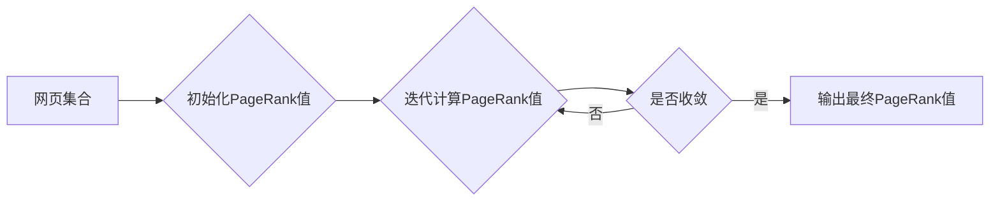

# PageRank 原理与代码实例讲解

## 1. 背景介绍
### 1.1 搜索引擎的发展历程
### 1.2 早期搜索引擎存在的问题
### 1.3 Google的崛起与PageRank算法

## 2. 核心概念与联系
### 2.1 PageRank的基本思想
#### 2.1.1 网页重要性的衡量标准
#### 2.1.2 链接投票机制
#### 2.1.3 随机游走模型
### 2.2 PageRank与其他排名算法的区别
#### 2.2.1 基于内容的排名算法
#### 2.2.2 基于链接分析的排名算法
#### 2.2.3 PageRank的独特之处
### 2.3 PageRank算法的数学基础
#### 2.3.1 马尔可夫链
#### 2.3.2 特征向量与特征值
#### 2.3.3 幂法迭代

## 3. 核心算法原理与具体操作步骤
### 3.1 PageRank算法的基本公式
### 3.2 计算PageRank值的迭代过程
#### 3.2.1 初始化PageRank值
#### 3.2.2 迭代计算PageRank值
#### 3.2.3 收敛条件与阈值设定
### 3.3 算法优化与改进
#### 3.3.1 阻尼因子的引入
#### 3.3.2 处理悬挂页面(Dangling Pages)
#### 3.3.3 减少计算复杂度的方法

## 4. 数学模型和公式详细讲解举例说明
### 4.1 PageRank的数学定义
### 4.2 PageRank计算公式的推导过程
#### 4.2.1 基于随机游走模型的推导
#### 4.2.2 引入阻尼因子后的推导
### 4.3 计算实例演示
#### 4.3.1 简单网络结构下的PageRank计算
#### 4.3.2 复杂网络结构下的PageRank计算

## 5. 项目实践：代码实例和详细解释说明 
### 5.1 使用Python实现PageRank算法
#### 5.1.1 数据准备与预处理
#### 5.1.2 构建邻接矩阵
#### 5.1.3 迭代计算PageRank值
#### 5.1.4 结果输出与可视化
### 5.2 使用Spark实现分布式PageRank计算
#### 5.2.1 Spark GraphX简介
#### 5.2.2 数据准备与图的构建
#### 5.2.3 使用Pregel API实现PageRank
#### 5.2.4 性能优化与参数调优

## 6. 实际应用场景
### 6.1 搜索引擎排名
### 6.2 社交网络影响力分析
### 6.3 推荐系统中的应用
### 6.4 网络异常检测

## 7. 工具和资源推荐
### 7.1 开源PageRank实现库
### 7.2 大规模图计算框架
### 7.3 相关论文与学习资源

## 8. 总结：未来发展趋势与挑战
### 8.1 PageRank算法的局限性
### 8.2 结合机器学习的排名算法
### 8.3 图神经网络在排名问题中的应用
### 8.4 隐私保护与公平性问题

## 9. 附录：常见问题与解答
### 9.1 PageRank收敛速度慢的问题
### 9.2 如何处理网页更新频率高的情况
### 9.3 PageRank在移动搜索中的应用
### 9.4 PageRank与SEO的关系

### PageRank核心概念与原理 Mermaid 流程图


PageRank算法是Google创始人Larry Page和Sergey Brin在斯坦福大学攻读博士学位时提出的一种用于评估网页重要性的算法。它的基本思想是，一个网页的重要性由所有指向它的网页的重要性决定。如果一个网页被许多其他重要网页链接，那么这个网页也应该是重要的。PageRank算法利用了网页之间的链接关系，通过链接投票的方式，计算每个网页的重要性得分，即PageRank值。

PageRank算法可以看作是一个随机游走模型。想象一个随机浏览网页的用户，他从一个网页开始，随机选择一个链接进入下一个网页，如此反复。在这个过程中，用户访问每个网页的频率就反映了这个网页的重要性。PageRank值就是用户访问一个网页的概率。

为了计算PageRank值，我们可以使用如下的迭代公式：

$$
PR(p_i) = \frac{1-d}{N} + d \sum_{p_j \in M(p_i)} \frac{PR(p_j)}{L(p_j)}
$$

其中，$PR(p_i)$表示网页$p_i$的PageRank值，$N$是网页总数，$d$是阻尼因子（一般取0.85），$M(p_i)$是指向网页$p_i$的网页集合，$L(p_j)$是网页$p_j$的出链数。

PageRank算法的计算过程如下：
1. 初始化每个网页的PageRank值为$\frac{1}{N}$。
2. 使用上述迭代公式，计算每个网页的新PageRank值。
3. 重复步骤2，直到PageRank值收敛，即前后两次迭代的PageRank值差值小于某个阈值。

下面是使用Python实现PageRank算法的代码示例：

```python
import numpy as np

def pagerank(M, num_iterations=100, d=0.85):
    N = M.shape[1]
    v = np.random.rand(N, 1)
    v = v / np.linalg.norm(v, 1)
    
    for i in range(num_iterations):
        v_new = (1 - d) / N * np.ones((N, 1)) + d * M.T.dot(v)
        delta = np.linalg.norm(v_new - v, 1)
        v = v_new
        if delta < 1e-6:
            break
    
    return v

# 示例网络邻接矩阵
M = np.array([[0, 1, 0, 0], 
              [0, 0, 1, 0],
              [0, 0, 0, 1],
              [1, 0, 1, 0]])

# 计算PageRank值
pr = pagerank(M, 100, 0.85)

print(pr)
```

在实际应用中，我们经常需要处理大规模的网页集合，这时可以使用分布式计算框架如Spark来加速PageRank的计算。Spark提供了GraphX库，使得在分布式环境下进行图计算变得更加简单。下面是使用Spark GraphX实现PageRank的示例代码：

```scala
import org.apache.spark.graphx._

// 从边列表构建图
val edges = sc.parallelize(Array(
  (1L, 2L), (1L, 3L), (2L, 4L), (3L, 4L), (4L, 1L), (4L, 3L)
))
val graph = Graph.fromEdges(edges, 1.0)

// 运行PageRank
val ranks = graph.pageRank(0.0001).vertices

// 输出结果
ranks.collect().foreach(println(_))
```

PageRank算法在搜索引擎、社交网络、推荐系统等领域都有广泛应用。但它也存在一些局限性，例如对新网页的排名效果不佳，容易受到链接作弊的影响等。为了克服这些问题，研究者们提出了许多改进和扩展算法，如TrustRank、Topic-Sensitive PageRank等。

此外，随着机器学习技术的发展，一些结合了机器学习的排名算法也受到关注，如RankNet、LambdaRank等。这些算法可以从数据中学习排名模型，并考虑更多的特征信息。近年来，图神经网络在图表示学习方面取得了很大进展，它们也开始被用于解决排名问题，为网页排名和推荐系统带来了新的可能性。

总的来说，PageRank算法是搜索引擎和推荐系统领域的重要基石，它启发了大量后续的研究工作。尽管存在一些局限性，但PageRank的基本思想仍然具有重要的参考价值。未来，结合机器学习和图神经网络等新技术，有望进一步提升网页排名和推荐的效果。同时，我们也需要关注算法的公平性和隐私保护等问题，确保这些技术能够更好地服务于用户和社会。

作者：禅与计算机程序设计艺术 / Zen and the Art of Computer Programming