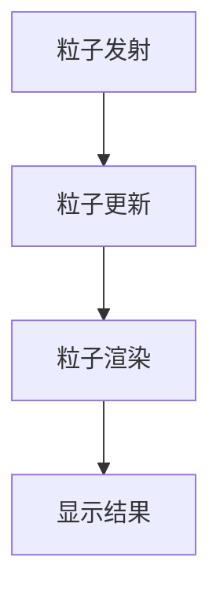

# Parti在虚拟现实领域的应用

## 1.背景介绍

虚拟现实(VR)技术正在快速发展,并被广泛应用于各个领域。Parti(Particle Integration)作为一种先进的粒子系统,在虚拟现实中发挥着重要作用。粒子系统能够模拟各种自然现象,如火焰、烟雾、水流等,为虚拟场景增添真实感。Parti作为新一代粒子系统,提供了更高效、更灵活的粒子模拟能力,在虚拟现实应用中大显身手。

## 2.核心概念与联系

### 2.1 粒子系统概述

粒子系统由大量微小的粒子组成,每个粒子都有自己的属性,如位置、速度、加速度、颜色、寿命等。通过设置粒子发射器、粒子更新规则和渲染方式,可以模拟出逼真的视觉效果。

### 2.2 Parti特点

Parti是一种基于GPU的高性能粒子系统,具有以下特点:

- 支持大规模粒子数量
- 硬件加速,充分利用GPU计算能力
- 提供丰富的粒子模拟效果
- 与游戏引擎无缝集成

### 2.3 Parti在虚拟现实中的作用

在虚拟现实应用中,Parti可以用于:

- 模拟自然现象,增强场景真实感
- 制作特效,如火焰、烟雾、爆炸等
- 模拟物理现象,如流体、刚体等
- 制作粒子装饰元素,美化虚拟场景

## 3.核心算法原理具体操作步骤  

Parti的核心算法包括以下几个步骤:



### 3.1 粒子发射

1) 设置粒子发射器的属性,如发射位置、发射速率、发射方向等
2) 根据发射器属性,生成新的粒子
3) 为新粒子初始化属性,如位置、速度、颜色、寿命等

### 3.2 粒子更新

1) 对每个活跃粒子,根据更新规则计算新的属性值
2) 更新规则可包括受力模型、碰撞检测、年龄衰减等
3) 标记超过寿命的粒子,以备后续删除

### 3.3 粒子渲染

1) 收集所有活跃粒子的属性数据
2) 将粒子数据传输到GPU
3) 在GPU上执行粒子渲染着色器程序
4) 将渲染结果输出到屏幕

## 4.数学模型和公式详细讲解举例说明

粒子系统中涉及到多种数学模型,下面将详细讲解其中的一些核心模型。

### 4.1 粒子运动模型

粒子的运动遵循经典的牛顿运动方程:

$$
\vec{a} = \frac{1}{m}\vec{F}
$$
$$
\vec{v}(t+\Delta t) = \vec{v}(t) + \vec{a}(t)\Delta t  
$$
$$
\vec{x}(t+\Delta t) = \vec{x}(t) + \vec{v}(t)\Delta t + \frac{1}{2}\vec{a}(t)\Delta t^2
$$

其中$\vec{a}$为加速度,$\vec{v}$为速度,$\vec{x}$为位置,$\vec{F}$为作用力,$m$为粒子质量。通过计算每个时间步的加速度、速度和位置,即可更新粒子的运动状态。

### 4.2 粒子发射模型

发射器决定了粒子的初始状态,常用的发射模型有:

- 点源发射器(Point Emitter)

$$
\vec{x}_0 = \vec{x}_e \\
\vec{v}_0 = \vec{v}_e + \vec{v}_r
$$

- 球面发射器(Sphere Emitter)  

$$
\vec{x}_0 = \vec{x}_e + r\vec{n} \\
\vec{v}_0 = \vec{v}_e + \vec{v}_r + \omega \times r\vec{n}
$$

- 盒状发射器(Box Emitter)

$$
\vec{x}_0 = \vec{x}_e + (x, y, z)^T\\
\vec{v}_0 = \vec{v}_e + \vec{v}_r
$$

其中$\vec{x}_0$、$\vec{v}_0$为粒子初始位置和速度,$\vec{x}_e$、$\vec{v}_e$为发射器位置和速度,$\vec{v}_r$为随机速度分量,$r$为球面半径,$\vec{n}$为单位法向量,$\omega$为角速度。

### 4.3 粒子年龄模型

粒子具有一定的生命周期,其属性会随年龄的增长而发生变化。常用的年龄模型有线性插值、曲线插值等。以颜色属性为例:

$$
\vec{c}(t) = (1-\alpha(t))\vec{c}_b + \alpha(t)\vec{c}_e
$$

其中$\vec{c}(t)$为当前颜色,$\vec{c}_b$、$\vec{c}_e$分别为起始和终止颜色,$\alpha(t)$为年龄函数,可由线性、曲线等方式插值得到。

## 5.项目实践：代码实例和详细解释说明

下面给出一个基于WebGL的Parti实现示例,模拟火焰效果。

```javascript
// 顶点着色器
const vsSource = `
  attribute vec4 aVertexPosition;

  uniform mat4 uModelViewMatrix;
  uniform mat4 uProjectionMatrix;

  void main() {
    gl_Position = uProjectionMatrix * uModelViewMatrix * aVertexPosition;
  }
`;

// 几何着色器,将点扩展为粒子
const gsSource = `
  layout(points) in;
  layout(triangle_strip, max_vertices=4) out;

  uniform mat4 uViewMatrix;
  uniform float uPointSize;

  out vec4 vColor;

  void main() {
    vColor = vec4(1.0, 0.5, 0.0, 1.0); // 粒子颜色

    vec4 position = gl_in[0].gl_Position;
    vec4 viewPosition = uViewMatrix * position;
    float sizeFactor = 1.0 / viewPosition.w;

    // 发射4个顶点,构成一个粒子
    gl_Position = position + vec4(-uPointSize * sizeFactor, -uPointSize * sizeFactor, 0, 0);
    EmitVertex();

    gl_Position = position + vec4(uPointSize * sizeFactor, -uPointSize * sizeFactor, 0, 0);
    EmitVertex();

    gl_Position = position + vec4(-uPointSize * sizeFactor, uPointSize * sizeFactor, 0, 0);
    EmitVertex();

    gl_Position = position + vec4(uPointSize * sizeFactor, uPointSize * sizeFactor, 0, 0);
    EmitVertex();

    EndPrimitive();
  }
`;

// 片元着色器
const fsSource = `
  precision highp float;

  in vec4 vColor;
  out vec4 fragColor;

  void main() {
    fragColor = vColor;
  }
`;

// 初始化着色器程序
const program = initShaderProgram(gl, vsSource, gsSource, fsSource);

// 设置粒子发射器
const emitter = {
  position: [0, 0, 0],
  velocity: [0, 1, 0],
  spread: Math.PI / 4
};

// 更新粒子
function updateParticles(deltaTime) {
  // 计算新的粒子位置和速度
  for(let i=0; i<numParticles; ++i) {
    // 应用重力加速度
    velocities[i][1] += gravity * deltaTime;

    // 更新位置
    positions[i][0] += velocities[i][0] * deltaTime;
    positions[i][1] += velocities[i][1] * deltaTime;
    positions[i][2] += velocities[i][2] * deltaTime;

    // 年龄增加
    ages[i] += deltaTime;
  }
}

// 渲染粒子
function renderParticles() {
  gl.useProgram(program);

  // 设置uniform变量
  const modelViewMatrix = lookAt(...);
  const viewMatrix = lookAt(...);
  gl.uniformMatrix4fv(uModelViewMatrix, false, modelViewMatrix);
  gl.uniformMatrix4fv(uViewMatrix, false, viewMatrix);

  // 传输粒子数据
  gl.bindBuffer(gl.ARRAY_BUFFER, particleBuffer);
  gl.bufferData(gl.ARRAY_BUFFER, new Float32Array(positions), gl.STREAM_DRAW);
  gl.vertexAttribPointer(aVertexPosition, 3, gl.FLOAT, false, 0, 0);

  // 渲染粒子
  gl.drawArrays(gl.POINTS, 0, numParticles);
}
```

上述代码实现了一个简单的粒子系统,可在WebGL中渲染出火焰效果。主要步骤包括:

1. 初始化着色器程序,包括顶点着色器、几何着色器和片元着色器
2. 设置粒子发射器属性
3. 每帧更新粒子位置、速度和年龄
4. 将粒子数据传输到GPU
5. 调用`gl.drawArrays`在GPU上渲染粒子

需要注意的是,上述代码只是一个简化的示例,实际的Parti实现会更加复杂,包括更多的粒子属性、更新规则、渲染优化等。

## 6.实际应用场景

Parti在虚拟现实领域有着广泛的应用,下面列举一些典型场景:

### 6.1 游戏特效

游戏中的各种特效,如火焰、烟雾、爆炸等,都可以使用Parti来模拟实现,提升画面质量和真实感。

### 6.2 虚拟现实体验

在虚拟现实体验中,Parti可以模拟自然景观,如瀑布、雨雪、火山喷发等,为用户带来身临其境的体验。

### 6.3 科学可视化

借助Parti,可以直观地模拟和可视化各种物理现象,如流体运动、粒子扩散等,为科研工作者提供有力的分析工具。

### 6.4 虚拟现实培训

在虚拟现实培训系统中,Parti可以模拟危险环境,如火灾、爆炸等,为受训者提供安全的模拟训练场景。

## 7.工具和资源推荐

以下是一些流行的Parti工具和学习资源:

- Unity Particle System: Unity游戏引擎内置的粒子系统,功能强大,文档资料丰富。
- Blender Particles: Blender 3D建模软件中的粒子系统,可用于制作各种特效。
- Houdini: 侧重于特效制作的三维软件,粒子系统功能非常强大。
- Nvidia FleX: Nvidia推出的基于位置的动力学引擎,支持粒子、刚体、布料等多种模拟。
- GPU Gems 3: GPU编程的经典书籍,其中第25章专门介绍了GPU粒子系统。
- Particle Illusion: 独立的粒子特效制作软件,拥有大量预设效果。

## 8.总结:未来发展趋势与挑战

### 8.1 发展趋势

- 粒子系统性能将进一步提升,支持更大规模、更复杂的模拟
- 借助机器学习技术,实现更自然、更真实的粒子效果
- 与物理引擎深度集成,模拟更多物理现象
- 在虚拟现实、增强现实等新兴领域发挥更大作用

### 8.2 挑战

- 提高大规模粒子系统的计算效率
- 设计更加通用、可控的粒子模拟模型
- 与其他系统(如渲染管线)的高效集成
- 简化粒子系统的使用和控制

## 9.附录:常见问题与解答

1. **粒子系统对硬件要求高吗?**

粒子系统对GPU的计算能力要求较高,尤其是大规模、高复杂度的粒子系统。因此,在低端硬件上,可能需要降低粒子数量和效果质量。

2. **如何控制粒子的生命周期?**

可以为每个粒子设置一个寿命值,当粒子年龄超过寿命时,将其从系统中移除。粒子的属性也可以根据年龄进行插值计算。

3. **粒子系统适合模拟哪些现象?**

粒子系统擅长模拟由大量微小粒子组成的现象,如火焰、烟雾、流体、砂石等。对于刚体物理,可能需要结合其他技术。

4. **如何避免粒子之间的穿透?**

可以通过粒子-粒子碰撞检测来解决这个问题,但计算代价较高。另一种方法是对粒子进行适当的推离,使它们看起来不会相互穿透。

5. **如