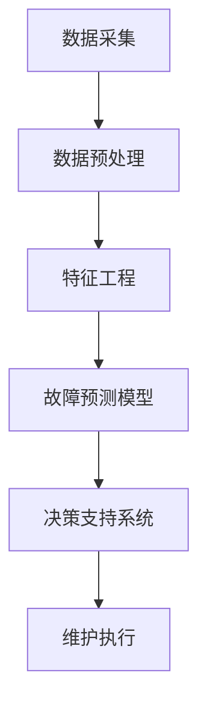
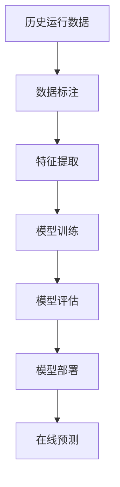

# PredictiveMaintenance技术在太空探索领域的应用

## 1.背景介绍

随着人类探索宇宙的脚步不断向前，太空探索任务变得越来越复杂和长期。在这种情况下，确保航天器系统的可靠性和安全性就显得尤为重要。传统的维护方式主要依赖于预定的维护计划和故障发生后的维修,这种被动的维护模式已经无法满足现代航天器的需求。

预测性维护(Predictive Maintenance,PM)技术应运而生,它利用各种传感器收集的数据,通过机器学习和数据分析算法对系统的健康状态进行实时监控和预测,从而在故障发生前主动采取维护措施。PM技术在航空航天、制造业等领域已经得到广泛应用,但是将其应用于太空探索领域还面临着诸多挑战。

## 2.核心概念与联系

### 2.1 预测性维护(PM)

预测性维护是一种通过持续监控设备的实际运行状态,结合历史故障数据和维护记录,利用数据建模算法对设备未来故障风险进行预测,从而优化维护决策的过程。

PM技术的核心是基于数据的故障预测模型,它通过分析设备的运行数据,识别故障模式和潜在故障的前兆,从而实现对设备健康状态的实时评估和未来故障风险的预测。

### 2.2 机器学习在PM中的应用

机器学习算法在PM中扮演着关键角色,常用的算法包括:

- 监督学习算法(如逻辑回归、决策树、支持向量机等)用于建立故障预测模型
- 无监督学习算法(如聚类分析)用于发现数据中的异常模式
- 深度学习算法(如卷积神经网络、递归神经网络)用于从复杂的时序数据中提取特征

### 2.3 PM系统架构

一个典型的PM系统架构包括以下几个主要模块:



1. **数据采集**模块负责从各种传感器收集设备运行数据
2. **数据预处理**模块对原始数据进行清洗、转换和集成
3. **特征工程**模块从预处理数据中提取有意义的特征
4. **故障预测模型**利用机器学习算法对设备故障风险进行预测
5. **决策支持系统**根据预测结果制定维护策略和计划
6. **维护执行**模块执行实际的维护操作

## 3.核心算法原理具体操作步骤

PM系统的核心是故障预测模型,下面以一种基于监督学习的算法流程为例进行说明:



1. **历史运行数据收集**:收集设备在正常和故障状态下的运行数据,包括各种传感器数据、维护记录等
2. **数据标注**:对历史数据进行标注,将数据标记为正常或故障状态
3. **特征提取**:从原始数据中提取有意义的特征,如统计特征、时频域特征等
4. **模型训练**:使用标注数据训练监督学习模型,如逻辑回归、决策树等
5. **模型评估**:在测试数据集上评估模型性能,根据指标(如准确率、召回率等)选择最优模型
6. **模型部署**:将训练好的模型部署到生产环境中
7. **在线预测**:利用模型对新的运行数据进行故障风险评估,输出预测结果

在实际应用中,算法流程可能会根据具体场景和数据特点进行调整和优化。

## 4.数学模型和公式详细讲解举例说明

在PM系统中,常用的数学模型有逻辑回归、决策树、支持向量机等。以逻辑回归为例:

逻辑回归是一种广泛应用的监督学习算法,它可以用于二分类问题,即根据输入特征$\boldsymbol{x}$预测输出标签$y$属于0或1两个类别中的一个。

### 4.1 逻辑回归模型

对于给定的输入特征向量$\boldsymbol{x}=(x_1,x_2,\dots,x_n)$,逻辑回归模型定义了如下概率模型:

$$P(y=1|\boldsymbol{x})=\frac{1}{1+e^{-(\boldsymbol{w}^T\boldsymbol{x}+b)}}$$

其中,$\boldsymbol{w}$是模型权重向量,$b$是偏置项。

模型的目标是通过训练数据估计最优参数$\boldsymbol{w}$和$b$,使得在新的输入$\boldsymbol{x}$上,模型可以很好地预测$y$的类别。

### 4.2 模型训练

通常使用最大似然估计的方法来训练逻辑回归模型的参数。具体来说,我们最大化训练数据的对数似然函数:

$$\begin{aligned}
\ell(\boldsymbol{w},b)&=\sum_{i=1}^N\Big[y^{(i)}\log\left(P(y^{(i)}=1|\boldsymbol{x}^{(i)})\right)\\
&\quad\quad\quad\quad+(1-y^{(i)})\log\left(1-P(y^{(i)}=1|\boldsymbol{x}^{(i)})\right)\Big]
\end{aligned}$$

其中,$N$是训练样本数量。

通过梯度上升等优化算法,可以找到使对数似然函数最大化的参数$\boldsymbol{w}$和$b$。

### 4.3 故障预测

对于新的输入特征向量$\boldsymbol{x}_{new}$,我们可以使用训练好的逻辑回归模型计算故障发生的概率:

$$P(y=1|\boldsymbol{x}_{new})=\frac{1}{1+e^{-(\boldsymbol{w}^T\boldsymbol{x}_{new}+b)}}$$

如果该概率大于某个阈值(如0.5),我们就预测该样本为故障状态,否则为正常状态。

以上是逻辑回归模型在PM系统中应用的一个简单示例,在实际中我们还可以使用更复杂的模型(如深度神经网络)来提高预测性能。

## 5.项目实践:代码实例和详细解释说明

下面是一个使用Python语言和scikit-learn库实现逻辑回归故障预测的代码示例:

```python
from sklearn.linear_model import LogisticRegression
from sklearn.model_selection import train_test_split
from sklearn.metrics import accuracy_score, recall_score

# 加载数据
X, y = load_data()

# 拆分训练集和测试集
X_train, X_test, y_train, y_test = train_test_split(X, y, test_size=0.2, random_state=42)

# 创建逻辑回归模型
model = LogisticRegression()

# 训练模型
model.fit(X_train, y_train)

# 在测试集上评估模型
y_pred = model.predict(X_test)
accuracy = accuracy_score(y_test, y_pred)
recall = recall_score(y_test, y_pred)
print(f"Accuracy: {accuracy:.2f}, Recall: {recall:.2f}")

# 使用模型进行故障预测
new_data = load_new_data()
failure_probs = model.predict_proba(new_data)[:, 1]
```

代码解释:

1. 首先从某个数据源加载特征数据`X`和标签数据`y`。
2. 使用`train_test_split`函数将数据拆分为训练集和测试集。
3. 创建一个`LogisticRegression`对象作为逻辑回归模型。
4. 在训练集上使用`fit`方法训练模型。
5. 在测试集上评估模型的性能,计算准确率(`accuracy_score`)和召回率(`recall_score`)。
6. 加载新的数据`new_data`,使用训练好的模型对其进行故障概率预测(`predict_proba`)。

以上代码只是一个简单示例,在实际应用中需要进行更多的数据预处理、特征工程和模型优化工作。

## 6.实际应用场景

PM技术在太空探索领域有着广阔的应用前景,主要包括以下几个方面:

1. **航天器系统健康监控**:对航天器的关键子系统(如推进系统、能源系统、热控系统等)进行实时健康监控,提前发现潜在故障,确保任务安全。

2. **智能自主维护**:为未来的深空探测任务开发自主维护能力,减少对地面控制的依赖,提高任务的灵活性和自主性。

3. **长期载人航天任务**:对于未来的月球基地、火星探索等长期载人航天任务,PM技术可以确保生命保障系统的可靠运行。

4. **航天器再利用**:通过PM技术对航天器进行状态评估,可以延长其使用寿命,降低航天器的更换成本。

5. **航天器设计优化**:利用PM技术收集的故障数据,可以优化航天器的设计,提高其可靠性和可维护性。

## 7.工具和资源推荐

在实现PM系统时,可以利用各种开源工具和资源,包括:

1. **Python生态系统**:Python语言及其丰富的科学计算库(如NumPy、SciPy、Pandas等)和机器学习库(如scikit-learn、TensorFlow、PyTorch等)。

2. **大数据处理工具**:用于处理海量传感器数据的大数据平台,如Apache Hadoop、Apache Spark等。

3. **时序数据库**:专门存储时序数据的数据库,如InfluxDB、OpenTSDB等。

4. **可视化工具**:用于展示PM系统运行状态和预测结果的可视化工具,如Grafana、Matplotlib等。

5. **开源PM框架**:一些专门用于PM的开源框架,如PredictiveMaintenanceAI、Prognostics Model Library等。

6. **在线学习资源**:如Coursera、edX等在线课程平台上的相关课程,以及一些优秀的书籍和博客。

选择合适的工具和资源可以极大地提高PM系统的开发和部署效率。

## 8.总结:未来发展趋势与挑战

预测性维护技术在太空探索领域具有巨大的应用潜力,它可以显著提高航天器系统的可靠性和安全性,降低维护成本,支持更加复杂和长期的太空任务。

未来,PM技术在太空领域的发展趋势包括:

1. **更智能的故障预测模型**:利用深度学习等先进技术,提高故障预测的准确性和鲁棒性。
2. **自主维护能力的增强**:赋予航天器更强的自主维护能力,减少对地面控制的依赖。
3. **数字孪生技术的融合**:将PM技术与数字孪生技术相结合,构建航天器的虚拟副本,提高维护决策的准确性。
4. **预测性设计**:在设计阶段就考虑PM技术的应用,提高航天器的可维护性。

然而,PM技术在太空探索领域的应用也面临一些挑战,包括:

1. **极端环境的影响**:太空极端环境(如辐射、温度等)对传感器和电子设备的影响,增加了数据采集和处理的难度。
2. **数据质量和可获取性**:航天器运行数据的质量和可获取性往往受到限制,影响模型的训练和性能。
3. **实时计算能力的限制**:航天器的计算资源有限,实时执行复杂的PM算法存在一定挑战。
4. **人工智能算法的可靠性**:人工智能算法的可解释性和鲁棒性仍需进一步提高,以确保其在关键任务中的可靠应用。

未来,通过持续的研究和创新,PM技术必将在太空探索领域发挥越来越重要的作用,助力人类向着更加广阔的宇宙进军。

## 9.附录:常见问题与解答

1. **什么是预测性维护(PM)?**

预测性维护是一种通过持续监控设备的实际运行状态,结合历史故障数据和维护记录,利用数据建模算法对设备未来故障风险进行预测,从而优化维护