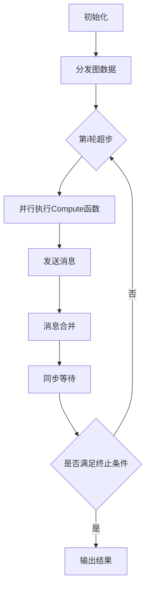

# Pregel原理与代码实例讲解

## 1. 背景介绍
### 1.1 图计算的重要性
在当今大数据时代,图计算在许多领域扮演着至关重要的角色。从社交网络分析、推荐系统、交通路径规划到生物信息学,图计算无处不在。然而,随着图规模的不断增大,传统的单机算法已经无法满足实际应用的需求。因此,开发高效的分布式图计算框架成为了研究的热点。

### 1.2 Pregel的诞生
2010年,Google发表了一篇名为《Pregel: A System for Large-Scale Graph Processing》的论文,提出了一种大规模图计算的编程模型——Pregel。Pregel的设计理念源自Valiant提出的Bulk Synchronous Parallel(BSP)模型,旨在提供一个易用、高效的分布式图计算框架。

### 1.3 Pregel的影响力
Pregel的提出引发了学术界和工业界对大规模图计算的广泛关注。诸如Apache Giraph、GPS、Mizan等众多开源和商业项目都是基于Pregel模型实现的。Pregel及其衍生系统已经成为了图计算领域的重要工具。

## 2. 核心概念与联系
### 2.1 图的表示
在Pregel中,图被表示为由顶点(Vertex)和边(Edge)组成的集合。每个顶点都有一个唯一的标识符和与之关联的值。边则表示顶点之间的关系,可以是有向的或无向的。

### 2.2 计算的基本单元
Pregel将计算分解为一系列的超步(Superstep)。在每个超步中,所有的顶点都并行地执行一个用户定义的函数(Compute函数)。顶点可以修改自己的状态,向其他顶点发送消息,也可以接收来自其他顶点的消息。

### 2.3 消息传递机制
顶点之间通过消息进行通信。在一个超步内,每个顶点可以向其他顶点发送任意数量的消息。这些消息会在下一个超步的开始时被接收和处理。Pregel采用了一种特殊的消息合并机制,可以自动地将发送给同一顶点的消息进行合并,减少了网络开销。

### 2.4 同步和容错
Pregel采用了同步的计算模型。在每个超步结束时,所有的顶点都会进入一个全局的同步点,等待所有顶点完成计算。这种同步机制虽然牺牲了一定的并行度,但是大大简化了编程,使得开发者可以专注于算法本身。同时,Pregel还提供了容错机制,可以在发生故障时恢复计算状态。

## 3. 核心算法原理具体操作步骤
### 3.1 顶点状态的初始化
在计算开始前,每个顶点的状态需要被初始化。通常,用户会为每个顶点指定一个初始值,例如顶点的度、PageRank值等。这个初始化过程是通过实现一个InitValue函数来完成的。

### 3.2 Compute函数的执行
Compute函数是Pregel计算模型的核心。在每个超步中,所有的顶点都会调用这个函数。在函数内部,顶点可以读取上一轮超步中收到的消息,更新自己的状态,向其他顶点发送消息,或者决定是否要停止计算(称为投票停止)。

### 3.3 消息的发送与接收
在Compute函数内,顶点可以使用SendMessageTo函数向其他顶点发送消息。消息包含了接收顶点的标识符和消息内容。在下一个超步开始时,每个顶点会收到上一轮发给它的所有消息。Pregel会自动将发送给同一顶点的消息进行合并,减少了网络传输的开销。

### 3.4 计算的终止条件
Pregel的计算会一直进行下去,直到满足终止条件为止。常见的终止条件有两种:一是所有的顶点都投票停止;二是达到了最大迭代次数。当满足终止条件时,计算就会停止,最终结果会被输出。

## 4. 数学模型和公式详细讲解举例说明
### 4.1 BSP模型
Pregel的计算模型基于BSP(Bulk Synchronous Parallel)模型。在BSP模型中,计算被分为一系列的超步。每个超步包括三个阶段:并行计算、通信和屏障同步。用公式表示如下:

$Superstep = Computation + Communication + Barrier Synchronization$

其中,Computation表示并行计算阶段,每个进程独立执行计算任务;Communication表示通信阶段,进程之间交换数据;Barrier Synchronization表示同步阶段,所有进程等待,直到所有进程都完成了当前超步。

### 4.2 顶点状态更新
在Pregel中,每个顶点的状态可以用一个状态方程来表示:

$State_{i+1}(v) = Compute(State_i(v), Messages_i(v))$

其中,$State_i(v)$表示顶点$v$在第$i$轮超步的状态,$Messages_i(v)$表示顶点$v$在第$i$轮超步收到的消息集合。$Compute$函数根据当前状态和收到的消息,计算出顶点在下一轮超步的状态$State_{i+1}(v)$。

举个例子,对于单源最短路径问题,顶点的状态可以表示为到源点的距离。初始时,源点的距离为0,其他顶点的距离为无穷大。在每一轮超步中,顶点从它的邻居那里收到距离信息,并更新自己的距离值。用公式表示如下:

$Distance_{i+1}(v) = min(Distance_i(v), min_{u \in Neighbors(v)}(Distance_i(u) + EdgeWeight(u,v)))$

### 4.3 消息合并
Pregel采用了消息合并的优化策略。如果有多条消息发送给同一个顶点,Pregel会自动将这些消息合并成一条,减少了网络传输的开销。消息合并的过程可以用下面的公式来表示:

$CombinedMessage(v) = Combine(Messages(v))$

其中,$Messages(v)$表示发送给顶点$v$的所有消息,$Combine$函数将这些消息合并成一条消息$CombinedMessage(v)$。

例如,在计算单源最短路径时,每个顶点会向它的邻居发送自己的距离值。如果有多个顶点向同一个顶点发送距离,Pregel会自动选择其中最小的距离作为合并后的消息。

## 5. 项目实践：代码实例和详细解释说明
下面我们以单源最短路径问题为例,给出Pregel的代码实现。

```cpp
#include "pregel.h"

class ShortestPathVertex : public Vertex<int, int, int> {
public:
    void Compute(MessageIterator* messages) {
        if (superstep() == 0) {
            set_value(IsSource() ? 0 : INF);
        } else {
            int mindist = get_value();
            for (; !messages->Done(); messages->Next()) {
                mindist = min(mindist, messages->Value());
            }
            if (mindist < get_value()) {
                set_value(mindist);
                for (EdgeIterator it = edges(); !it.Done(); it.Next()) {
                    SendMessageTo(it.Target(), mindist + it.GetValue());
                }
            }
        }
        VoteToHalt();
    }
};

int main() {
    pregel::Initialize(0, NULL);
    GraphLoader loader;
    Graph graph;
    loader.Load(&graph, "graph.txt");
    graph.SetVertexClass("ShortestPathVertex");
    pregel::Run(&graph);
    return 0;
}
```

这段代码定义了一个`ShortestPathVertex`类,继承自Pregel的`Vertex`类。`Vertex`类有三个模板参数,分别表示顶点id的类型、顶点值的类型和消息的类型。

在`Compute`函数中,我们首先判断当前是否是第一轮超步。如果是,则将源点的距离设置为0,其他顶点的距离设置为无穷大。否则,我们从收到的消息中选择最小的距离值,更新自己的距离。如果距离值发生了变化,我们还要将新的距离值发送给所有的邻居。

在`main`函数中,我们首先初始化Pregel框架,然后加载图数据。接着,我们设置图的顶点类型为`ShortestPathVertex`,最后启动Pregel计算。

## 6. 实际应用场景
Pregel模型可以应用于许多实际的图计算场景,包括:

- 社交网络分析:利用Pregel可以高效地计算社交网络中的影响力、社区结构等指标。
- 推荐系统:Pregel可以用于计算用户之间的相似度,为用户推荐感兴趣的内容。
- 网页排名:Pregel可以实现PageRank、HITS等经典的网页排名算法。
- 最短路径:Pregel可以解决单源最短路径、全源最短路径等图论问题。
- 生物信息学:Pregel可以用于分析蛋白质互作网络、基因调控网络等生物网络。

## 7. 工具和资源推荐
- Apache Giraph:一个基于Hadoop的开源Pregel实现,在工业界得到了广泛应用。
- GPS:由斯坦福大学开发的Pregel实现,支持更加灵活的计算模型。
- Pregel+:由香港科技大学开发,在Pregel的基础上进行了改进,支持动态图计算。
- Green-Marl:一种用于图分析的高级领域特定语言,可以编译为Pregel等框架的代码。

## 8. 总结：未来发展趋势与挑战
Pregel模型为大规模图计算提供了一种简洁、高效的编程范式。但同时,Pregel也面临着一些挑战:

- 计算的同步开销:Pregel采用了同步的计算模型,在每轮迭代结束时需要进行全局同步。当图规模很大时,同步开销会成为性能瓶颈。
- 内存占用:Pregel需要将图数据全部加载到内存中,对于超大规模的图,单机内存可能无法满足需求。
- 动态图的处理:很多实际应用中的图是动态变化的,如何在Pregel中高效地支持动态图计算,还有待进一步研究。

未来,Pregel及其衍生系统在以下方面值得期待:

- 异步计算:通过引入异步计算,可以减少同步开销,提高系统性能。
- 外存计算:利用外存(如SSD)扩展Pregel的存储能力,支持更大规模的图计算。
- 动态图计算:针对动态图的特点,设计新的编程模型和计算框架。
- 领域特定语言:开发面向图计算的高级语言,提高开发效率。

## 9. 附录：常见问题与解答
Q: Pregel与MapReduce有何区别?
A: Pregel是一种专门为图计算设计的计算模型,而MapReduce是一种更加通用的计算模型。Pregel采用了"思维同步,状态分布"的方式,更适合于迭代式的图算法。相比于MapReduce,Pregel提供了更加方便的编程接口和更好的性能。

Q: Pregel是否支持图的分割和分布?
A: 是的,Pregel会自动将图数据分割成多个分区,分布到不同的机器上进行计算。分割和分布对用户是透明的,用户只需要关注单个顶点的计算逻辑即可。

Q: Pregel能否处理大于单机内存的图?
A: Pregel的原始设计假设图数据可以全部放入内存,因此它并不直接支持大于单机内存的图。但是,可以通过一些扩展和改进,如利用外存、图分割等技术,来支持超大规模图的处理。

Q: Pregel的容错机制是如何实现的?
A: Pregel通过checkpoint机制实现容错。在计算过程中,Pregel会定期将图的状态保存到持久化存储中。如果某个节点发生故障,Pregel可以从最近的checkpoint恢复计算状态,避免重新计算。

作者：禅与计算机程序设计艺术 / Zen and the Art of Computer Programming

## Pregel原理流程图
