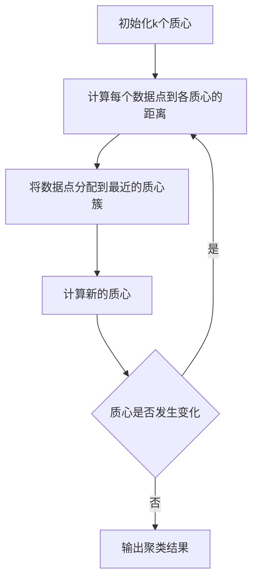

# Python机器学习实战：K均值聚类算法及其在Python中的实战

## 1.背景介绍

### 1.1 什么是聚类

聚类是一种无监督学习技术,旨在将未标记的数据对象划分为多个组(簇),使得同一簇内的对象相似度较高,而不同簇之间的对象相似度较低。聚类分析广泛应用于数据挖掘、图像分割、模式识别、计算机视觉等领域。

### 1.2 聚类算法分类

常见的聚类算法有:

- **分区聚类算法**: K-Means、K-Medoids
- **层次聚类算法**: BIRCH、CURE
- **密度聚类算法**: DBSCAN、OPTICS  
- **基于网格的算法**: STING
- **基于模型的算法**: EM算法

其中,K-Means是最经典和广泛使用的聚类算法之一。

## 2.核心概念与联系

### 2.1 K-Means聚类算法原理

K-Means算法将n个对象划分为k个簇,使得每个对象都属于离它最近的均值向量(质心)的簇。算法思想:

1. 随机选取k个初始质心
2. 将每个数据点分配到最近的质心簇
3. 重新计算每个簇的质心
4. 重复步骤2-3,直至质心不再发生变化

### 2.2 相关概念

- **质心(Centroid)**: 簇中所有数据点的平均值向量
- **欧几里得距离(Euclidean Distance)**: 衡量数据点与质心距离的常用方法
- **簇内平方和(Intra-Cluster Distance)**: 所有数据点到其所属簇质心的距离平方和
- **轮廓系数(Silhouette Coefficient)**: 评估聚类效果的指标,范围[-1,1],值越大聚类效果越好

### 2.3 算法流程图



## 3.核心算法原理具体操作步骤

K-Means算法的关键步骤如下:

### 3.1 初始化质心

常用的初始化方法有:

- 随机选取k个数据点作为初始质心
- K-Means++:根据概率选取远离已选质心的数据点,避免陷入局部最优

### 3.2 计算数据点到各质心的距离

通常使用欧几里得距离度量:

$$dist(x,c) = \sqrt{\sum_{i=1}^{n}(x_i - c_i)^2}$$

其中$x$为数据点,$c$为质心,$n$为数据维度。

### 3.3 将数据点分配到最近簇

对每个数据点$x$:
$$cluster(x) = \underset{c}{\arg\min}\ dist(x,c)$$

即将$x$分配到距离最近的质心$c$所对应的簇。

### 3.4 更新质心

对每个簇$C_i$,新质心为该簇所有数据点的均值向量:

$$c_i = \frac{1}{|C_i|}\sum_{x\in C_i}x$$

### 3.5 重复迭代

重复3.2-3.4步骤,直至簇分配不再发生变化或达到最大迭代次数。

### 3.6 评估聚类效果

可使用簇内平方和或轮廓系数等指标评估聚类质量。

## 4.数学模型和公式详细讲解举例说明

### 4.1 簇内平方和(Intra-Cluster Distance)

簇内平方和衡量簇内数据点与质心的紧密程度,定义为:

$$\sum_{i=1}^{k}\sum_{x\in C_i}dist(x,c_i)^2$$

其中$k$为簇数,$C_i$为第$i$个簇,$c_i$为$C_i$的质心。

簇内平方和越小,说明数据点越紧密地围绕质心分布。

### 4.2 轮廓系数(Silhouette Coefficient)

轮廓系数用于评估聚类的质量,结合了聚类的紧密程度和分离程度。定义为:

$$s(i) = \frac{b(i) - a(i)}{\max(a(i),b(i))}$$

其中:
- $a(i)$是数据点$i$与同簇其他数据点的平均距离
- $b(i)$是数据点$i$与最近簇的平均距离

$s(i)$的取值范围为[-1,1]:
- $s(i)$接近1,表示数据点$i$被正确聚类
- $s(i)$接近0,表示数据点$i$在两个簇之间
- $s(i)$接近-1,表示数据点$i$被错误聚类

整个数据集的轮廓系数为所有数据点$s(i)$的平均值。

### 4.3 举例说明

假设有如下二维数据集:

```python
X = [[1, 2], [1, 4], [1, 0], 
     [10, 2], [9, 1], [11, 3]]
```

对其进行K-Means聚类,取$k=2$:

1. 初始化两个质心,如$c_1=[1,2],c_2=[10,2]$
2. 计算每个数据点到两个质心的欧几里得距离
3. 将数据点分配到最近簇:
   - $C_1=\{[1,2],[1,4],[1,0]\}$
   - $C_2=\{[10,2],[9,1],[11,3]\}$
4. 更新质心为每簇的均值向量:
   - $c_1=[1,2]$
   - $c_2=[10,2]$
5. 重复2-4步骤,直至质心不再变化
6. 计算簇内平方和和轮廓系数评估聚类效果

通过上述步骤,可以较好地将数据集划分为两个簇。

## 5.项目实践：代码实例和详细解释说明

下面使用Python中的scikit-learn库实现K-Means聚类:

```python
from sklearn.datasets import make_blobs
from sklearn.cluster import KMeans
import matplotlib.pyplot as plt

# 生成示例数据集
X, y = make_blobs(n_samples=500, centers=4, n_features=2, random_state=0)

# 构建并拟合K-Means模型
kmeans = KMeans(n_clusters=4, random_state=0).fit(X)

# 可视化聚类结果
plt.scatter(X[:, 0], X[:, 1], c=kmeans.labels_)
plt.scatter(kmeans.cluster_centers_[:, 0], kmeans.cluster_centers_[:, 1], s=300, c='r')
plt.show()
```

代码解释:

1. 使用`make_blobs`函数生成一个包含4个簇的示例数据集`X`。
2. 构建`KMeans`模型对象,并指定簇数为4。
3. 在`X`上拟合`KMeans`模型。
4. 使用`kmeans.labels_`获取每个数据点的簇标签。
5. 使用`kmeans.cluster_centers_`获取每个簇的质心坐标。
6. 使用`matplotlib`可视化聚类结果,不同颜色表示不同簇,红色点为簇质心。

运行结果:

```
>>> kmeans.inertia_
97.82629807723637
>>> kmeans.n_iter_
6
```

- `inertia_`是簇内平方和,值越小聚类效果越好
- `n_iter_`是算法收敛所需的迭代次数

可视化结果显示,K-Means成功将数据集划分为4个簇。

## 6.实际应用场景

K-Means聚类算法广泛应用于以下场景:

1. **客户细分**: 根据客户特征(如年龄、收入等)对客户进行分组,为不同客户群体制定差异化营销策略。

2. **图像分割**: 将图像像素点根据颜色或纹理特征聚类,实现图像分割。

3. **基因聚类分析**: 根据基因表达数据对基因进行聚类,发现具有相似表达模式的基因组。

4. **推荐系统**: 将用户或商品聚类,为用户推荐相似兴趣爱好的商品。

5. **异常检测**: 将正常数据聚为一个簇,离群数据被识别为异常。

6. **文本挖掘**: 将文本文档聚类,发现主题相关的文档簇。

## 7.工具和资源推荐

- **scikit-learn**: Python中流行的机器学习库,提供了`KMeans`聚类算法的实现。
- **Pandas**: 用于数据预处理和特征工程。
- **Matplotlib/Seaborn**: 数据可视化工具。
- **K-Means++算法论文**:"K-Means++: The Advantages of Careful Seeding" by David Arthur and Sergei Vassilvitskii.
- **Pattern Classification书籍**:介绍了K-Means及其他聚类算法原理。
- **Coursera/edX在线课程**: 提供机器学习/数据挖掘相关课程。

## 8.总结：未来发展趋势与挑战

### 8.1 优化算法

传统K-Means算法存在一些缺陷:

- 对初始质心选择敏感,可能陷入局部最优
- 对异常值敏感
- 难以处理非凸形状的簇
- 需要事先指定簇数k

因此,研究人员提出了许多改进算法,如:

- **K-Means++**: 改进了初始质心选择
- **K-Medoids**: 使用实际数据点作为质心,对异常值更加鲁棒
- **K-Means聚类约束算法**: 引入must-link和cannot-link约束
- **自动确定k值的算法**: 如X-Means、G-Means等

### 8.2 大数据场景下的聚类

随着大数据时代的到来,传统聚类算法在可扩展性、内存消耗等方面面临新的挑战。一些解决方案包括:

- **并行化算法**: 如MapReduce框架下的并行K-Means
- **流式聚类算法**: 能够高效处理数据流
- **基于采样的算法**: 在大数据上进行采样,再在采样数据上聚类

### 8.3 其他挑战

- **高维数据聚类**: 由于"维数灾难",高维空间下的距离计算存在困难
- **异构数据聚类**: 如何聚类包含不同数据类型(数值、类别等)的异构数据
- **数据可解释性**: 如何提高聚类结果的可解释性,让人类能够理解聚类的语义

## 9.附录：常见问题与解答

1. **K-Means如何选择合适的k值?**

没有放之四射的方法来确定最优k值。常用的方法包括:
- 基于领域知识选择合理的k范围
- 构建"簇内平方和"或"轮廓系数"等评估指标与k值的曲线图,从拐点处确定k
- 使用自动确定k值的算法,如X-Means等

2. **K-Means如何处理异常值?**

由于K-Means使用均值作为质心,因此对异常值很敏感。可以采取以下措施:
- 数据预处理时去除异常值
- 使用K-Medoids等基于实际数据点的算法
- 使用鲁棒性更好的距离度量,如曼哈顿距离等

3. **K-Means如何处理非凸形状的簇?**

K-Means假设簇呈球形或超球形,难以发现任意形状的簇。可以尝试以下方法:
- 使用DBSCAN等密度聚类算法
- 使用谱聚类等基于图论的算法
- 对数据进行适当的变换,使簇呈现凸形状

4. **K-Means收敛速度慢怎么办?**

K-Means收敛速度较慢,可以采取以下优化:
- 使用K-Means++初始化质心
- 使用小批量数据或小核心集数据进行初始聚类
- 使用三角不等式剪枝等启发式优化
- 并行化算法实现

总之,K-Means是一种简单高效的聚类算法,在实践中需要根据具体数据和场景选择合适的变体和优化方法。