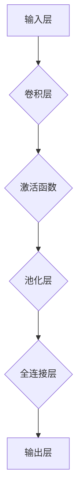
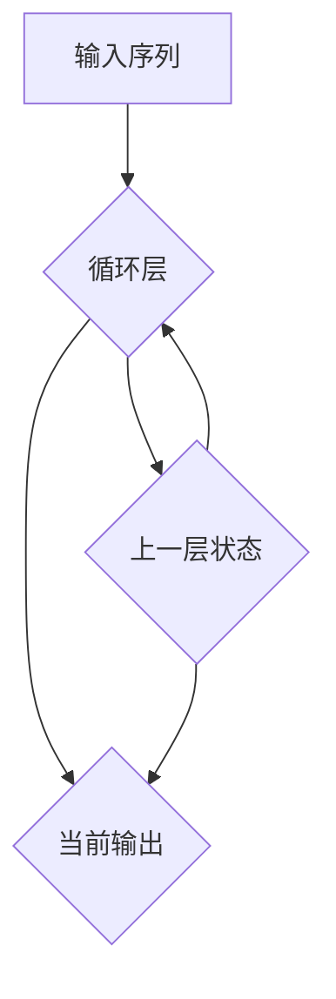
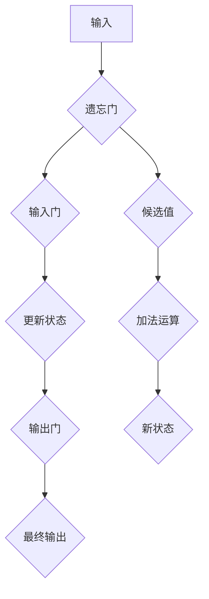

                 

作者：禅与计算机程序设计艺术

简单、智能、高效！

## 1. 背景介绍

随着大数据时代的到来，**机器学习**已成为推动科技发展的重要力量。Python，作为一种简洁、易于学习且功能强大的编程语言，在数据科学和机器学习领域占据了主导地位。它以其丰富的库支持和社区活跃性，使得开发者能轻松构建复杂的算法模型。本篇将聚焦于Python在机器学习领域的应用，特别是深度学习的核心技术——TensorFlow的实践探索。

## 2. 核心概念与联系

### **2.1 数据预处理**
数据是机器学习的基础。有效的数据预处理包括清洗、转换和归一化，这一步骤对于提高模型性能至关重要。在Python中，我们可以利用pandas、numpy等库进行数据管理和初步分析。

```python
import pandas as pd
import numpy as np

# 加载数据集
data = pd.read_csv('dataset.csv')
# 处理缺失值
data.fillna(data.mean(), inplace=True)
```

### **2.2 特征工程**
特征工程涉及从原始数据中提取有价值的新特征。这可以通过创建交互项、应用统计方法、或使用高级技术如PCA（主成分分析）实现。

```python
from sklearn.decomposition import PCA

# 应用PCA降维
pca = PCA(n_components=5)
X_pca = pca.fit_transform(X)
```

### **2.3 模型选择与训练**
选择合适的机器学习模型对于预测性能至关重要。在深度学习领域，**神经网络**是最具潜力的模型之一。通过TensorFlow，我们能方便地定义、训练和优化这些模型。

```python
import tensorflow as tf

model = tf.keras.models.Sequential([
    tf.keras.layers.Dense(128, activation='relu', input_shape=(input_dim,)),
    tf.keras.layers.Dropout(0.2),
    tf.keras.layers.Dense(output_dim, activation='softmax')
])

model.compile(optimizer='adam', loss='sparse_categorical_crossentropy', metrics=['accuracy'])
model.fit(X_train, y_train, epochs=10, validation_data=(X_test, y_test))
```

### **2.4 模型评估与调优**
模型的准确性和泛化能力需要通过多种指标进行评估。交叉验证、网格搜索等技术可以帮助我们找到最佳参数组合。

## 3. 核心算法原理具体操作步骤

### **3.1 卷积神经网络(CNN)**
CNN是深度学习中用于图像识别的关键技术。其核心在于卷积层，通过滑动窗口计算局部特征。



### **3.2 循环神经网络(RNN)** 
RNN适用于序列数据，如自然语言处理任务。关键在于记忆机制，允许模型考虑时间顺序上的依赖关系。



### **3.3 长短时记忆网络(LSTM)**
LSTM是RNN的一种变体，通过门控机制有效解决长期依赖问题。



## 4. 数学模型和公式详细讲解举例说明

### **4.1 损失函数**
损失函数衡量模型预测结果与真实值之间的差距。

$$ L(y, \hat{y}) = \frac{1}{N} \sum_{i=1}^{N} (y_i - \hat{y}_i)^2 $$

其中$y_i$为实际标签，$\hat{y}_i$为预测值。

### **4.2 正则化**
正则化防止过拟合，通过添加惩罚项到损失函数。

$$ L_{\text{total}} = L + \lambda R(w) $$

其中$L$是原始损失，$\lambda$是超参数控制惩罚程度，$R(w)$是对权重向量$w$的某种度量，如$L_2$范数。

## 5. 项目实践：代码实例和详细解释说明

为了加深理解，我们将构建一个简单的文本分类器使用TensorFlow：

```python
import tensorflow_datasets as tfds
from tensorflow.keras.preprocessing.text import Tokenizer
from tensorflow.keras.utils import to_categorical
from tensorflow.keras.models import Sequential
from tensorflow.keras.layers import Embedding, LSTM, Dense

dataset, info = tfds.load('imdb_reviews', split=tfds.Split.TRAIN, with_info=True)

tokenizer = Tokenizer()
tokenizer.fit_on_texts(dataset['text'])

vocab_size = len(tokenizer.word_index) + 1
max_length = 100

train_sequences = tokenizer.texts_to_sequences(dataset['text'])
train_sequences = pad_sequences(train_sequences, maxlen=max_length)

y_train = dataset['label']
y_train = to_categorical(y_train)

model = Sequential([
    Embedding(vocab_size, 64, input_length=max_length),
    LSTM(64),
    Dense(2, activation='softmax')
])

model.compile(optimizer='adam', loss='categorical_crossentropy', metrics=['accuracy'])
history = model.fit(train_sequences, y_train, batch_size=64, epochs=5, validation_split=0.2)
```

## 6. 实际应用场景

Python结合TensorFlow在诸多场景展现威力：
- **医疗影像诊断**：辅助医生检测肿瘤、疾病。
- **语音识别**：智能助手、自动驾驶中的声音指令处理。
- **自然语言处理**：聊天机器人、情感分析、自动文摘系统。

## 7. 工具和资源推荐

### **7.1 开发环境**
安装必要的库，如NumPy、Pandas、TensorFlow、Scikit-Learn等。

```bash
pip install numpy pandas tensorflow scikit-learn
```

### **7.2 在线教程**
访问TensorFlow官方文档、GitHub教程、Kaggle竞赛等平台获取深入学习资源。

## 8. 总结：未来发展趋势与挑战

随着硬件加速技术和数据集规模的增长，深度学习将更加普及且复杂度进一步提升。未来趋势包括：
- **迁移学习**的应用更加广泛，快速适应新任务。
- **可解释性**增强，AI决策更透明。
- **联邦学习**保护隐私的同时实现模型协作。

面对这些挑战，持续的学习和实践是关键。人工智能领域的发展速度令人惊叹，保持好奇心并不断探索新技术将引领你走向前沿。

## 9. 附录：常见问题与解答

Q: 如何优化模型性能？
A: 可以尝试调整模型结构、增加更多数据、使用更复杂的正则化策略或进行微调（fine-tuning）现有预训练模型。

Q: 怎样选择合适的算法？
A: 考虑任务特性、数据大小、计算资源以及对模型可解释性的需求来决定。

---

通过本文，我们深入了解了如何利用Python和TensorFlow构建和部署机器学习模型，从理论基础到实战应用，一步步解锁深度学习的魅力。希望读者能从中汲取灵感，激发创新思维，并在实践中不断成长。

作者：禅与计算机程序设计艺术 / Zen and the Art of Computer Programming

