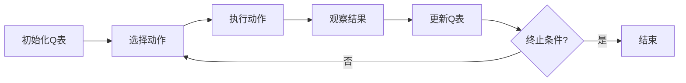

# Q-Learning原理与代码实例讲解

## 1. 背景介绍

在人工智能的领域中，强化学习（Reinforcement Learning, RL）是一种重要的机器学习方法，它使得智能体（agent）能够在与环境交互的过程中学习如何在特定的情境下做出最优的决策。Q-Learning是强化学习中的一种价值迭代算法，它通过学习一个动作价值函数（action-value function），来估计在给定状态下采取某个动作的期望回报。本文将深入探讨Q-Learning的原理，并通过代码实例进行讲解。

## 2. 核心概念与联系

### 2.1 强化学习基础
- **智能体（Agent）**：在环境中进行决策的实体。
- **环境（Environment）**：智能体所处的外部世界，可以是实际的或模拟的。
- **状态（State）**：环境在某一时刻的具体情况。
- **动作（Action）**：智能体在某状态下可以采取的行为。
- **奖励（Reward）**：智能体采取动作后，环境给予的反馈信号。
- **策略（Policy）**：智能体决策的规则，即在某状态下选择动作的概率分布。

### 2.2 Q-Learning核心概念
- **Q值（Q-Value）**：表示在特定状态下采取特定动作的期望回报。
- **Q表（Q-Table）**：存储所有状态-动作对应的Q值的表格。
- **贝尔曼方程（Bellman Equation）**：用于递归计算Q值的公式。

## 3. 核心算法原理具体操作步骤

Q-Learning的核心算法原理可以分为以下步骤：

1. **初始化Q表**：为所有可能的状态-动作对分配初始值。
2. **选择动作**：根据当前状态和Q表，选择一个动作（通常使用ε-贪婪策略）。
3. **执行动作**：智能体执行选择的动作，并观察结果。
4. **更新Q表**：根据观察到的奖励和下一个状态，使用贝尔曼方程更新Q表。
5. **重复过程**：直到满足某个终止条件（如达到最大迭代次数或Q表收敛）。



## 4. 数学模型和公式详细讲解举例说明

Q-Learning的核心是贝尔曼方程，它的数学表达式如下：

$$ Q(s_t, a_t) \leftarrow Q(s_t, a_t) + \alpha [r_{t+1} + \gamma \max_{a} Q(s_{t+1}, a) - Q(s_t, a_t)] $$

其中：
- $Q(s_t, a_t)$ 是当前状态-动作对的Q值。
- $\alpha$ 是学习率，决定了新信息覆盖旧信息的速度。
- $r_{t+1}$ 是智能体在状态 $s_t$ 采取动作 $a_t$ 后获得的即时奖励。
- $\gamma$ 是折扣因子，用于平衡即时奖励和未来奖励的重要性。
- $\max_{a} Q(s_{t+1}, a)$ 是下一个状态所有可能动作的最大Q值。

通过这个公式，智能体能够迭代更新Q表，逐渐学习到每个状态-动作对的价值。

## 5. 项目实践：代码实例和详细解释说明

在本节中，我们将通过一个简单的迷宫游戏来演示Q-Learning的代码实现。假设我们有一个4x4的网格，智能体的目标是从起点移动到终点。

```python
import numpy as np

# 初始化参数
learning_rate = 0.1
discount_factor = 0.9
epsilon = 0.1
state_space_size = 16
action_space_size = 4  # 上下左右
q_table = np.zeros((state_space_size, action_space_size))

# 定义ε-贪婪策略
def choose_action(state, q_table):
    if np.random.uniform(0, 1) < epsilon:
        return np.random.choice(action_space_size)  # 探索
    else:
        return np.argmax(q_table[state])  # 利用

# Q-Learning训练过程
for episode in range(1000):
    state = np.random.randint(0, state_space_size)  # 随机初始状态
    done = False
    
    while not done:
        action = choose_action(state, q_table)
        next_state, reward, done = env.step(action)  # 假设env.step()是环境反馈
        old_value = q_table[state, action]
        next_max = np.max(q_table[next_state])
        
        # 更新Q值
        new_value = (1 - learning_rate) * old_value + learning_rate * (reward + discount_factor * next_max)
        q_table[state, action] = new_value
        
        state = next_state
```

在这个代码示例中，我们首先初始化了Q表和相关参数。然后定义了一个ε-贪婪策略函数`choose_action`，用于在探索和利用之间做出决策。接着，我们通过多次迭代来训练智能体，每次迭代中智能体会根据当前状态选择动作，执行动作并接收环境的反馈，然后根据贝尔曼方程更新Q表。

## 6. 实际应用场景

Q-Learning算法在许多领域都有应用，例如：

- **游戏AI**：在棋类游戏、视频游戏中训练AI玩家。
- **机器人导航**：帮助机器人学习如何在复杂环境中导航。
- **资源管理**：在云计算和网络中优化资源分配。
- **金融交易**：自动化交易策略的开发。

## 7. 工具和资源推荐

- **OpenAI Gym**：一个用于开发和比较强化学习算法的工具包。
- **TensorFlow Agents**：一个基于TensorFlow的强化学习库。
- **PyTorch**：一个开源的机器学习库，适用于深度强化学习研究。

## 8. 总结：未来发展趋势与挑战

Q-Learning作为一种经典的强化学习算法，已经在多个领域证明了其有效性。然而，随着问题规模的增加，Q-Learning面临着状态空间爆炸和样本效率低下的挑战。未来的发展趋势包括结合深度学习技术（如深度Q网络，DQN），以及探索更高效的样本利用方法，如优先经验回放。

## 9. 附录：常见问题与解答

- **Q: Q-Learning如何选择动作？**
  A: 通常使用ε-贪婪策略，在探索和利用之间做出平衡。

- **Q: Q-Learning和DQN有什么区别？**
  A: DQN是Q-Learning的扩展，它使用深度神经网络来近似Q值函数，特别适用于高维状态空间。

- **Q: 如何判断Q-Learning是否收敛？**
  A: 通常观察Q值的变化，如果在连续多个迭代中变化很小，则可以认为算法已经收敛。

作者：禅与计算机程序设计艺术 / Zen and the Art of Computer Programming