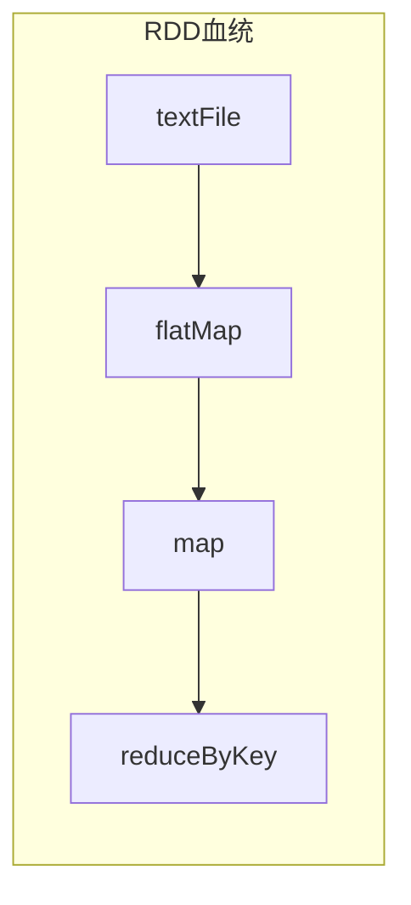

# RDD 原理与代码实例讲解

## 1. 背景介绍

在大数据时代，数据的规模和复杂性不断增长,传统的数据处理方式已经无法满足需求。Apache Spark 作为一种快速、通用的大数据处理引擎,凭借其高效的内存计算模型和容错机制,成为了大数据处理的重要工具之一。Spark 的核心抽象 —— RDD(Resilient Distributed Dataset,弹性分布式数据集)是整个系统的基础,理解 RDD 的原理对于高效使用 Spark 至关重要。

## 2. 核心概念与联系

### 2.1 RDD 定义

RDD 是一个不可变、分区的记录集合,可以并行操作。RDD 由一组分区组成,每个分区包含一组记录。RDD 支持两种类型的操作:转换(Transformation)和动作(Action)。

### 2.2 RDD 特性

- 不可变性(Immutable)
- 分区(Partitioned)
- 有血统(Lineage)
- 容错(Fault-tolerant)
- 可并行计算(Parallel Computation)

### 2.3 RDD 与其他数据结构的关系

RDD 可以从文件系统、数据库或现有的 RDD 中创建。它类似于共享内存的分布式集合,但具有更强的容错性和可伸缩性。RDD 与传统数据结构(如列表、数组等)的主要区别在于它是分布式的,可以在多个节点上进行并行计算。

## 3. 核心算法原理具体操作步骤

### 3.1 RDD 创建

RDD 可以通过以下方式创建:

1. 从文件系统(如HDFS、S3等)创建
2. 从现有 RDD 进行转换
3. 通过并行化驱动程序中的集合创建

```scala
// 从文件系统创建
val textFile = sc.textFile("hdfs://...")

// 从现有 RDD 进行转换
val lineLengths = textFile.map(s => s.length)

// 并行化驱动程序中的集合
val parallelizedArray = sc.parallelize(List(1,2,3,4,5))
```

### 3.2 RDD 转换操作

转换操作会从现有的 RDD 创建一个新的 RDD,常用的转换操作包括:

- `map`、`flatMap`、`filter`、`distinct`、`sample`等
- `union`、`intersection`、`subtract`、`cartesian`等
- `coalesce`、`repartition`等重新分区操作

```scala
val words = textFile.flatMap(line => line.split(" "))
val capitals = words.filter(word => word.capitalize() == word)
```

### 3.3 RDD 动作操作

动作操作会从 RDD 中获取数据,并对其执行计算。常用的动作操作包括:

- `reduce`、`fold`、`aggregate`等聚合操作
- `collect`、`count`、`take`、`foreach`等获取数据操作
- `saveAsTextFile`、`saveAsSequenceFile`等持久化操作

```scala
val wordCounts = words.map(word => (word, 1)).reduceByKey((a, b) => a + b)
wordCounts.saveAsTextFile("hdfs://...")
```

### 3.4 RDD 血统(Lineage)

RDD 的血统记录了 RDD 的构建过程,用于容错恢复。当某个分区数据丢失时,Spark 可以根据血统重新计算该分区的数据。

### 3.5 RDD 持久化

为了提高效率,可以将 RDD 持久化到内存或磁盘中。持久化后,Spark 可以在后续的操作中重用该 RDD,而无需重新计算。

```scala
val persistedRDD = words.persist(StorageLevel.MEMORY_ONLY)
```

## 4. 数学模型和公式详细讲解举例说明

在 Spark 中,RDD 的分区策略和任务调度是基于数学模型和算法的。以下是一些重要的公式和模型:

### 4.1 数据分区

Spark 采用基于范围或哈希的分区策略,将数据划分为多个分区。对于基于范围的分区,数据按照键的范围进行划分,常用于排序数据。对于基于哈希的分区,数据根据键的哈希值进行划分,常用于无序数据。

假设有 $N$ 个键值对 $(k_i, v_i)$,需要划分为 $M$ 个分区,基于范围的分区函数为:

$$
\operatorname{partition}(k_i) = \left\lfloor\frac{M \times k_i}{\operatorname{max}(k)}\right\rfloor
$$

基于哈希的分区函数为:

$$
\operatorname{partition}(k_i) = \operatorname{hash}(k_i) \bmod M
$$

### 4.2 任务调度

Spark 采用延迟调度策略,在执行动作操作时,才根据 RDD 的血统构建出有向无环图(DAG),并将任务分发到各个执行器上运行。

假设有 $N$ 个分区,每个分区的计算时间为 $t_i$,则完成所有分区的计算所需时间为:

$$
T = \max\limits_{1 \leq i \leq N} t_i
$$

为了提高并行度,Spark 会尽量将任务均匀地分发到各个执行器上,使得每个执行器的计算时间接近 $T$。

### 4.3 容错恢复

当某个分区的数据丢失时,Spark 会根据 RDD 的血统重新计算该分区的数据。假设重新计算某个分区的代价为 $C$,则总的恢复代价为:

$$
C_{\text{total}} = \sum\limits_{i \in \text{lost partitions}} C_i
$$

Spark 会尽量将重新计算的代价最小化,以提高容错恢复的效率。

## 5. 项目实践:代码实例和详细解释说明

下面是一个使用 Spark 进行单词计数的实例,展示了 RDD 的创建、转换和动作操作。

### 5.1 创建 RDD

```scala
// 创建 SparkContext
val conf = new SparkConf().setAppName("WordCount")
val sc = new SparkContext(conf)

// 从文件系统创建 RDD
val textFile = sc.textFile("data/README.md")
```

我们首先创建 `SparkContext` 对象,它是 Spark 程序的入口点。然后使用 `textFile` 方法从文件系统中读取数据,创建一个 RDD。

### 5.2 转换操作

```scala
// 将每行拆分为单词
val words = textFile.flatMap(line => line.split(" "))

// 将每个单词映射为元组 (word, 1)
val pairs = words.map(word => (word, 1))
```

我们使用 `flatMap` 操作将每行文本拆分为单词,得到一个新的 RDD `words`。然后使用 `map` 操作将每个单词映射为元组 `(word, 1)`。

### 5.3 动作操作

```scala
// 统计每个单词出现的次数
val wordCounts = pairs.reduceByKey((a, b) => a + b)

// 收集结果并打印
wordCounts.foreach(println)
```

我们使用 `reduceByKey` 操作统计每个单词出现的次数,得到一个新的 RDD `wordCounts`。最后,使用 `foreach` 动作操作将结果收集并打印出来。

### 5.4 可视化 RDD 血统

Spark Web UI 提供了可视化 RDD 血统的功能,方便我们理解和调试程序。下图展示了上述单词计数程序的 RDD 血统:



可以看到,`textFile` 是初始 RDD,经过 `flatMap`、`map` 和 `reduceByKey` 三个转换操作,最终得到 `wordCounts` RDD。

## 6. 实际应用场景

RDD 作为 Spark 的核心抽象,在许多大数据处理场景中发挥着重要作用,包括但不限于:

- **日志分析**: 从海量日志数据中提取有价值的信息,如用户行为分析、系统异常检测等。
- **推荐系统**: 基于用户的历史行为数据,为用户推荐感兴趣的商品或内容。
- **机器学习**: Spark MLlib 库提供了基于 RDD 的分布式机器学习算法,如逻辑回归、决策树等。
- **图计算**: Spark GraphX 库支持基于 RDD 的图计算,可用于社交网络分析、网页排名等场景。
- **流式计算**: Spark Streaming 可以实时处理来自 Kafka、Flume 等数据源的流数据。

## 7. 工具和资源推荐

- **Spark Web UI**: 提供了监控 Spark 作业的界面,可以查看 RDD 血统、任务执行情况等信息。
- **Spark UI Accessibility Program**: 一个开源项目,旨在改善 Spark Web UI 的可访问性。
- **Apache Spark 官方文档**: 包含了 Spark 的概念、API 和最佳实践等内容。
- **Spark 相关书籍**:如《Learning Spark》、《Spark: The Definitive Guide》等。
- **Spark 社区**:包括 Spark 邮件列表、Stack Overflow 等,可以获取最新动态和解决疑难问题。

## 8. 总结:未来发展趋势与挑战

### 8.1 未来发展趋势

- **AI 和机器学习的集成**: Spark 将进一步加强与 AI 和机器学习框架的集成,提供更高效的分布式机器学习能力。
- **流式处理的优化**: Spark Streaming 将继续优化,提高实时数据处理的性能和可靠性。
- **云原生支持**: Spark 将更好地支持云原生环境,如 Kubernetes 等,提高资源利用率和弹性伸缩能力。
- **统一数据访问层**: Spark 将提供统一的数据访问层,支持各种数据源和格式,简化数据处理流程。

### 8.2 挑战

- **资源管理和调度**: 随着集群规模和工作负载的增加,资源管理和任务调度将变得更加复杂,需要更智能的算法和策略。
- **数据安全和隐私**: 在处理敏感数据时,需要采取有效的安全和隐私保护措施,确保数据的安全性。
- **故障诊断和调试**: 大规模分布式系统的故障诊断和调试是一个巨大的挑战,需要更好的工具和方法来简化这一过程。
- **社区发展**: 保持 Spark 社区的活跃和多样性,吸引更多的贡献者和用户,是 Spark 持续发展的关键。

## 9. 附录:常见问题与解答

### 9.1 什么是 RDD?

RDD 是 Spark 的核心抽象,代表一个不可变、分区的记录集合,可以并行操作。它是 Spark 进行分布式计算的基础。

### 9.2 RDD 和传统数据结构有什么区别?

RDD 是分布式的,可以在多个节点上进行并行计算,而传统数据结构通常只存在于单个节点上。此外,RDD 具有容错性和可伸缩性,可以处理大规模数据。

### 9.3 如何创建 RDD?

RDD 可以通过以下方式创建:

1. 从文件系统(如 HDFS、S3 等)创建
2. 从现有 RDD 进行转换
3. 通过并行化驱动程序中的集合创建

### 9.4 什么是 RDD 的转换操作和动作操作?

转换操作会从现有的 RDD 创建一个新的 RDD,如 `map`、`filter`、`flatMap` 等。动作操作会从 RDD 中获取数据,并对其执行计算,如 `reduce`、`collect`、`saveAsTextFile` 等。

### 9.5 什么是 RDD 的血统?

RDD 的血统记录了 RDD 的构建过程,用于容错恢复。当某个分区数据丢失时,Spark 可以根据血统重新计算该分区的数据。

### 9.6 如何提高 RDD 的计算效率?

可以采取以下措施提高 RDD 的计算效率:

1. 适当使用持久化,避免重复计算
2. 优化数据分区策略,提高任务并行度
3. 使用高效的数据格式,减少序列化和反序列化的开销
4. 合理利用内存和CPU资源,避免资源浪费

作者:禅与计算机程序设计艺术 / Zen and the Art of Computer Programming