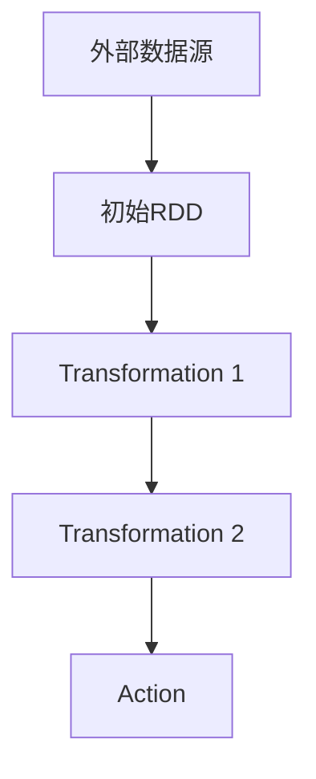

# RDD原理与代码实例讲解

## 1.背景介绍

在大数据处理领域，Apache Spark 是一个广受欢迎的分布式计算框架。其核心组件之一是弹性分布式数据集（Resilient Distributed Dataset，简称 RDD）。RDD 是 Spark 的基础抽象，提供了对大规模数据集的容错并行操作。本文将深入探讨 RDD 的原理、核心概念、算法、数学模型，并通过代码实例展示其实际应用。

## 2.核心概念与联系

### 2.1 RDD 的定义

RDD 是一个不可变的分布式对象集合，可以并行处理。每个 RDD 都可以通过一系列的转换（如 map、filter）从其他 RDD 派生出来，或者从外部数据源（如 HDFS、S3）创建。

### 2.2 RDD 的特性

- **弹性**：RDD 具有容错能力，通过血统（Lineage）记录来重建丢失的数据。
- **分布式**：RDD 可以分布在多个节点上进行并行计算。
- **不可变**：一旦创建，RDD 不能被修改，只能通过转换生成新的 RDD。

### 2.3 RDD 的操作

RDD 提供了两类操作：

- **转换（Transformation）**：如 map、filter、flatMap 等，返回一个新的 RDD。
- **行动（Action）**：如 count、collect、saveAsTextFile 等，返回一个值或将结果保存到外部存储。

### 2.4 RDD 的血统图

RDD 的血统图（Lineage Graph）记录了 RDD 的生成过程和依赖关系，用于在节点故障时重建数据。



## 3.核心算法原理具体操作步骤

### 3.1 RDD 的创建

RDD 可以通过以下几种方式创建：

- 从外部存储系统（如 HDFS、S3）读取数据。
- 从现有的 Scala 集合并行化。
- 通过转换操作从其他 RDD 派生。

### 3.2 RDD 的转换操作

常见的转换操作包括：

- **map**：对 RDD 中的每个元素应用一个函数，返回一个新的 RDD。
- **filter**：筛选出满足条件的元素，返回一个新的 RDD。
- **flatMap**：类似于 map，但每个输入元素可以映射到 0 个或多个输出元素。

### 3.3 RDD 的行动操作

常见的行动操作包括：

- **collect**：将 RDD 的所有元素收集到驱动程序中。
- **count**：返回 RDD 中元素的数量。
- **saveAsTextFile**：将 RDD 保存到外部存储系统。

## 4.数学模型和公式详细讲解举例说明

### 4.1 RDD 的数学模型

RDD 可以看作是一个集合 $S$，其上的操作可以用数学函数来表示。例如，map 操作可以表示为：

$$
map(f, S) = \{ f(x) | x \in S \}
$$

其中，$f$ 是一个函数，$S$ 是一个集合。

### 4.2 RDD 的血统图模型

RDD 的血统图可以用有向无环图（DAG）来表示，其中每个节点表示一个 RDD，每条边表示一个转换操作。

### 4.3 容错机制

RDD 的容错机制基于血统图。当一个分区的数据丢失时，Spark 可以通过血统图重新计算该分区的数据。

## 5.项目实践：代码实例和详细解释说明

### 5.1 环境准备

首先，确保已经安装了 Apache Spark 和 Scala。可以使用以下命令启动 Spark Shell：

```bash
spark-shell
```

### 5.2 代码实例

以下是一个简单的 RDD 操作示例：

```scala
// 从外部数据源创建 RDD
val textFile = sc.textFile("hdfs://path/to/file.txt")

// 进行转换操作
val words = textFile.flatMap(line => line.split(" "))
val wordCounts = words.map(word => (word, 1)).reduceByKey(_ + _)

// 进行行动操作
wordCounts.collect().foreach(println)
```

### 5.3 详细解释

- **textFile**：从 HDFS 读取文本文件，创建一个初始 RDD。
- **flatMap**：将每一行文本拆分成单词，返回一个新的 RDD。
- **map**：将每个单词映射为 (word, 1) 形式的键值对。
- **reduceByKey**：对具有相同键的值进行聚合，计算每个单词的出现次数。
- **collect**：将结果收集到驱动程序并打印。

## 6.实际应用场景

### 6.1 数据处理

RDD 常用于大规模数据处理任务，如日志分析、数据清洗和转换。

### 6.2 机器学习

RDD 是 Spark MLlib 的基础，支持各种机器学习算法的并行计算。

### 6.3 实时流处理

通过 Spark Streaming，RDD 可以用于实时数据流处理，支持高吞吐量和低延迟的应用。

## 7.工具和资源推荐

### 7.1 开发工具

- **IntelliJ IDEA**：支持 Scala 和 Spark 开发的集成开发环境。
- **Jupyter Notebook**：支持交互式数据分析和可视化。

### 7.2 学习资源

- **《Learning Spark》**：一本全面介绍 Spark 的书籍。
- **Spark 官方文档**：详细的 API 文档和使用指南。

## 8.总结：未来发展趋势与挑战

### 8.1 未来发展趋势

- **统一数据处理平台**：Spark 正在向统一的数据处理平台发展，支持批处理、流处理和图计算。
- **性能优化**：通过改进执行引擎和优化算法，Spark 的性能将进一步提升。

### 8.2 挑战

- **资源管理**：在大规模集群中，如何高效地管理资源仍然是一个挑战。
- **容错性**：尽管 RDD 具有容错能力，但在极端情况下，数据恢复仍然可能耗费大量时间。

## 9.附录：常见问题与解答

### 9.1 RDD 与 DataFrame 的区别

RDD 是 Spark 的基础抽象，而 DataFrame 是在 RDD 之上构建的高级抽象，提供了更高效的查询优化和更丰富的 API。

### 9.2 如何调试 RDD 程序

可以使用 Spark 提供的日志和 Web UI 来调试 RDD 程序，查看任务的执行情况和血统图。

### 9.3 RDD 的性能优化

- **缓存**：对于多次使用的 RDD，可以使用 cache 或 persist 方法进行缓存。
- **分区**：合理设置 RDD 的分区数，可以提高并行度和数据处理效率。

---

作者：禅与计算机程序设计艺术 / Zen and the Art of Computer Programming