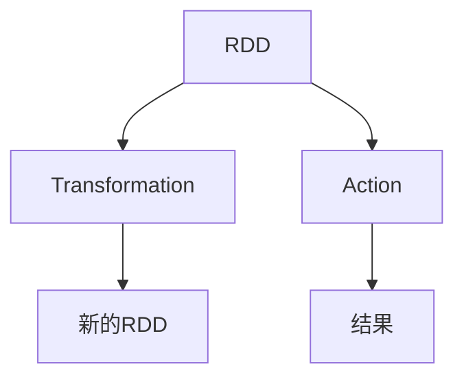
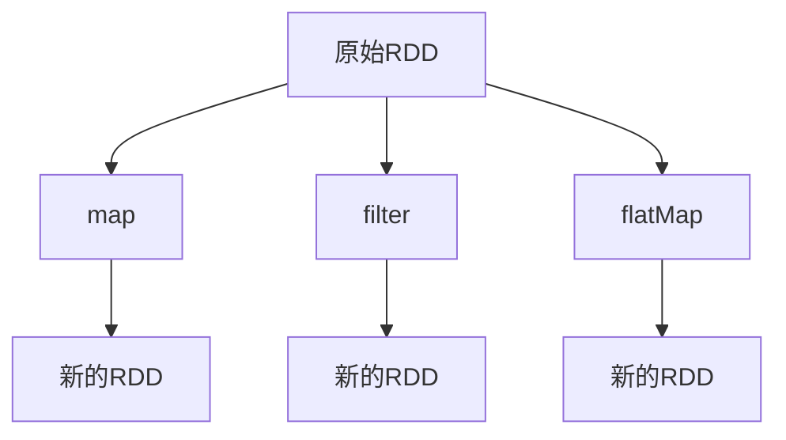
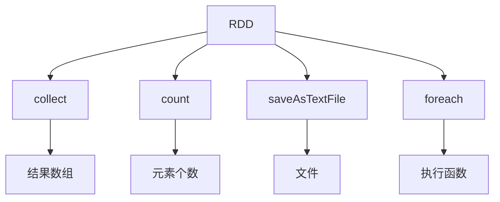
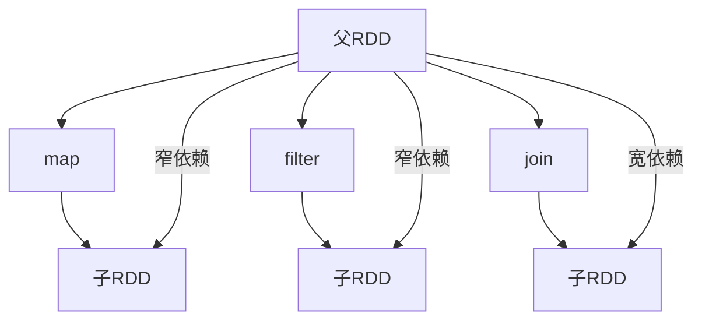

# RDD原理与代码实例讲解

## 1.背景介绍

在大数据时代,数据量的快速增长使得传统的数据处理方式已经无法满足现有需求。Apache Spark作为一种快速、通用的大规模数据处理引擎,可以高效地处理大规模数据。Spark的核心数据结构是弹性分布式数据集(Resilient Distributed Dataset,RDD)。RDD是Spark中最基本的数据抽象,可以并行化的容错的数据集合。

## 2.核心概念与联系

RDD具有以下几个核心概念:

1. **不可变(Immutable)**: RDD是不可变的,这意味着RDD一旦构建就不能被修改。任何对RDD的修改都会生成一个新的RDD。

2. **分区(Partitioned)**: RDD由多个分区(Partition)组成,每个分区存储在集群的不同节点上,从而实现数据的分布式存储和并行计算。

3. **依赖关系(Dependencies)**: 每个RDD都记录了它是如何从其他RDD或数据源派生而来的,这些信息被称为依赖关系。依赖关系使得RDD可以重新计算丢失的分区。

4. **延迟计算(Lazy Evaluation)**: Spark采用延迟计算的策略,即RDD的转换操作(Transformation)不会立即执行,而是记录下来,等到需要结果时才触发实际的计算(Action)。

5. **内存计算(In-Memory Computing)**: Spark会尽可能将中间结果数据存储在内存中,以加快迭代计算的速度。

6. **容错(Fault-Tolerant)**: 由于RDD记录了它们是如何从其他RDD或数据源派生而来的,因此Spark可以根据这些信息重新计算丢失的分区,从而实现容错。

RDD与Spark的其他核心概念密切相关,如Spark SQL、Spark Streaming、GraphX等,都是建立在RDD之上的。



## 3.核心算法原理具体操作步骤

RDD的核心算法原理主要包括以下几个方面:

### 3.1 RDD的创建

RDD可以通过以下几种方式创建:

1. **从集群中的文件创建**:使用`SparkContext.textFile()`等方法从HDFS、S3等文件系统中读取文件创建RDD。

2. **从驱动程序中的集合创建**:使用`SparkContext.parallelize()`方法从Scala集合或Python列表中创建RDD。

3. **从其他RDD转换而来**:使用RDD的转换操作(Transformation)从现有的RDD创建新的RDD。

4. **从其他数据源创建**:如Spark SQL、Hive、Kafka等数据源。

### 3.2 RDD的转换操作(Transformation)

转换操作是对RDD进行映射、过滤、联接等操作,生成新的RDD。常见的转换操作包括:

- `map()`: 对RDD中的每个元素应用一个函数,生成新的RDD。
- `filter()`: 返回一个新的RDD,只包含满足给定条件的元素。
- `flatMap()`: 类似于map,但每个输入元素被映射为0个或多个输出元素。
- `union()`: 返回一个新的RDD,包含源RDD和其他RDD的所有元素。
- `join()`: 对两个RDD进行内连接操作。



### 3.3 RDD的行动操作(Action)

行动操作是触发Spark作业执行的操作,如将RDD的数据持久化到文件系统或将结果返回到驱动程序。常见的行动操作包括:

- `collect()`: 将RDD的所有元素以数组的形式返回到驱动程序。
- `count()`: 返回RDD中元素的个数。
- `saveAsTextFile()`: 将RDD的元素以文本文件的形式写入到HDFS或其他文件系统中。
- `foreach()`: 对RDD中的每个元素执行一个函数操作。



### 3.4 RDD的依赖关系

RDD的依赖关系描述了RDD是如何从其他RDD或数据源派生而来的。Spark根据这些依赖关系来重新计算丢失的分区,从而实现容错。依赖关系分为以下两种类型:

1. **窄依赖(Narrow Dependency)**: 每个父RDD的分区最多被子RDD的一个分区使用。例如map、filter等操作产生的依赖关系就是窄依赖。

2. **宽依赖(Wide Dependency)**: 每个父RDD的分区可能被子RDD的多个分区使用。例如join、groupByKey等操作产生的依赖关系就是宽依赖。



## 4.数学模型和公式详细讲解举例说明

在RDD的实现中,涉及到一些数学模型和公式,用于优化性能和资源利用率。

### 4.1 数据分区策略

RDD的数据分区策略决定了如何将数据划分为多个分区,并分布在集群的不同节点上。常见的分区策略包括:

1. **HashPartitioner**: 根据key的哈希值对数据进行分区。

   $$
   partition = key.hashCode() \% numPartitions
   $$

   其中,`numPartitions`是分区的总数。

2. **RangePartitioner**: 根据key的范围对数据进行分区。

   $$
   partition = \left \lfloor \frac{key - rangeStart}{rangeLength} \times numPartitions \right \rfloor
   $$

   其中,`rangeStart`和`rangeLength`分别表示key的范围起点和范围长度。

### 4.2 数据局部性优化

Spark利用数据局部性原理来优化任务的执行效率。具体来说,Spark会尽可能将计算任务分配到存储相应数据的节点上,从而减少数据的网络传输。

假设有一个RDD `rdd`包含`N`个分区,分布在`M`个节点上。我们定义`rdd`的数据局部性得分为:

$$
locality\_score(rdd) = \sum_{i=1}^{N} \begin{cases}
1, & \text{if partition $i$ is computed on the node storing it}\\
0, & \text{otherwise}
\end{cases}
$$

Spark的任务调度器会尽量最大化所有RDD的数据局部性得分,从而优化整体性能。

### 4.3 内存管理

Spark采用统一的内存管理策略,在执行器的内存空间中划分出不同的区域,用于存储不同类型的数据。

假设一个执行器的总内存为`M`,其中:

- `R`是为运行时环境(如JVM元数据空间)保留的内存。
- `M-R`是用于存储数据和shuffle中间结果的内存区域,可以进一步划分为:
  - `M_s`: 用于存储shuffle中间结果的内存区域。
  - `M_c = M-R-M_s`: 用于存储RDD和广播变量的内存区域。

当内存不足时,Spark会根据内存管理策略自动将部分数据存储到磁盘上,以避免内存溢出。

## 5.项目实践:代码实例和详细解释说明

下面是一个使用Spark创建和操作RDD的示例代码:

```scala
// Scala版本
import org.apache.spark.SparkContext
import org.apache.spark.SparkConf

object RDDExample {
  def main(args: Array[String]): Unit = {
    // 创建SparkConf
    val conf = new SparkConf().setAppName("RDDExample").setMaster("local[*]")
    
    // 创建SparkContext
    val sc = new SparkContext(conf)
    
    // 从集合创建RDD
    val rdd1 = sc.parallelize(List(1, 2, 3, 4, 5))
    
    // 从文件创建RDD
    val rdd2 = sc.textFile("path/to/file.txt")
    
    // 转换操作
    val rdd3 = rdd1.map(x => x * x)
    val rdd4 = rdd3.filter(x => x > 10)
    
    // 行动操作
    println("RDD元素个数: " + rdd4.count())
    rdd4.foreach(println)
    
    // 停止SparkContext
    sc.stop()
  }
}
```

```python
# Python版本
from pyspark import SparkContext, SparkConf

if __name__ == "__main__":
    # 创建SparkConf
    conf = SparkConf().setAppName("RDDExample").setMaster("local[*]")
    
    # 创建SparkContext
    sc = SparkContext(conf=conf)
    
    # 从集合创建RDD
    rdd1 = sc.parallelize([1, 2, 3, 4, 5])
    
    # 从文件创建RDD
    rdd2 = sc.textFile("path/to/file.txt")
    
    # 转换操作
    rdd3 = rdd1.map(lambda x: x * x)
    rdd4 = rdd3.filter(lambda x: x > 10)
    
    # 行动操作
    print("RDD元素个数: " + str(rdd4.count()))
    rdd4.foreach(print)
    
    # 停止SparkContext
    sc.stop()
```

在上面的示例中,我们首先创建了一个`SparkContext`对象,它是Spark应用程序的入口点。然后,我们使用`parallelize()`方法从Python列表或Scala集合创建了一个RDD `rdd1`,使用`textFile()`方法从文件创建了另一个RDD `rdd2`。

接下来,我们对`rdd1`执行了一系列转换操作,包括`map()`和`filter()`。`map()`操作将每个元素平方,而`filter()`操作则过滤掉小于等于10的元素。最终,我们得到了一个新的RDD `rdd4`。

最后,我们执行了一些行动操作,如`count()`获取RDD元素个数,`foreach()`遍历打印每个元素。在执行完所有操作后,我们调用`stop()`方法停止`SparkContext`。

## 6.实际应用场景

RDD作为Spark的核心数据结构,在许多大数据处理场景中发挥着重要作用,包括但不限于:

1. **批量数据处理**: 利用RDD的并行计算能力,可以高效地处理大规模数据集,如日志分析、网页排名等。

2. **机器学习和数据挖掘**: Spark MLlib和ML Pipeline建立在RDD之上,可以用于构建和训练机器学习模型,如分类、聚类、推荐系统等。

3. **流式数据处理**: Spark Streaming将实时数据流转换为一系列的RDD,并利用Spark的计算引擎进行实时处理,如实时日志分析、网络监控等。

4. **图计算**: GraphX基于RDD构建了分布式图数据结构,可用于实现图算法和图分析,如PageRank、三角形计数等。

5. **SQL查询**: Spark SQL可以将RDD转换为DataFrame或Dataset,并支持SQL查询和数据处理。

## 7.工具和资源推荐

如果你想进一步学习和使用Spark RDD,以下是一些推荐的工具和资源:

1. **Apache Spark官方网站**: https://spark.apache.org/
   官方网站提供了丰富的文档、教程和示例代码。

2. **Spark编程指南**: https://spark.apache.org/docs/latest/rdd-programming-guide.html
   这是一个详细的RDD编程指南,涵盖了RDD的创建、转换、行动操作等核心概念。

3. **Spark示例程序**: https://github.com/apache/spark/tree/master/examples
   Apache Spark项目中包含了许多示例程序,可以帮助你快速上手。

4. **Spark交互式Shell**: Spark提供了Scala和Python的交互式Shell,方便你快速测试和探索RDD操作。

5. **Spark书籍**:
   - "Learning Spark" by Holden Karau, Andy Konwinski, Patrick Wendell and Matei Zaharia (O'Reilly)
   - "Spark: The Defin