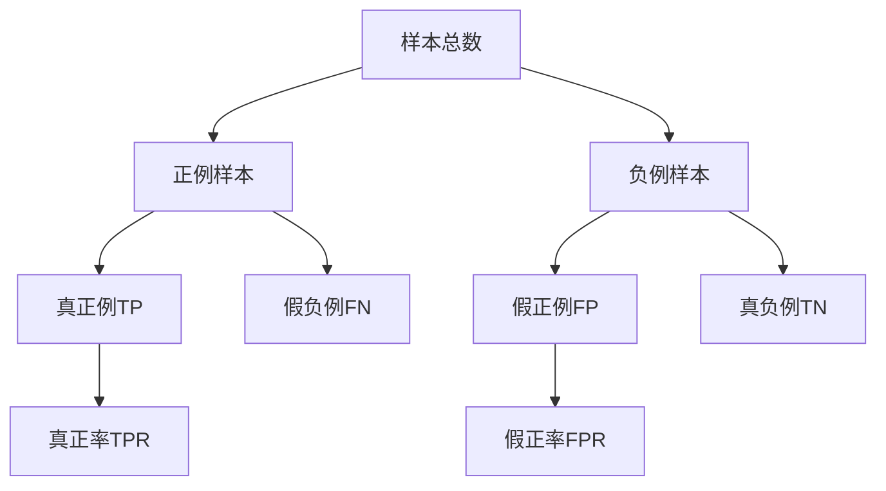

# ROC Curve 原理与代码实战案例讲解

## 1.背景介绍

在机器学习和数据挖掘领域中,评估模型性能是一个非常重要的环节。ROC(Receiver Operating Characteristic)曲线是一种常用的评估二分类模型性能的可视化工具。它通过绘制真正率(True Positive Rate)和假正率(False Positive Rate)的关系曲线,直观地展示了模型在不同阈值下的分类性能。

ROC曲线的应用场景非常广泛,包括但不限于:

- 机器学习模型评估和选择
- 医学诊断中的疾病风险评估
- 金融风控中的欺诈检测
- 自然语言处理中的垃圾邮件过滤等

ROC曲线不仅能够直观地评估模型的整体性能,还能帮助我们选择合适的阈值以权衡模型的精确度和召回率。因此,理解ROC曲线的原理和应用方法对于数据科学家和机器学习工程师来说是非常重要的。

## 2.核心概念与联系

在深入探讨ROC曲线的原理之前,我们需要先了解一些核心概念:

### 2.1 真正例(True Positive,TP)

被正确预测为正例的样本数量。

### 2.2 假正例(False Positive,FP)  

被错误预测为正例的样本数量。

### 2.3 真负例(True Negative,TN)

被正确预测为负例的样本数量。

### 2.4 假负例(False Negative,FN)

被错误预测为负例的样本数量。

### 2.5 真正率(True Positive Rate,TPR)

也称为**灵敏度(Sensitivity)**或**召回率(Recall)**,定义为:

$$TPR = \frac{TP}{TP + FN}$$

TPR表示模型正确预测正例的能力。

### 2.6 假正率(False Positive Rate,FPR)  

定义为:

$$FPR = \frac{FP}{FP + TN}$$

FPR表示模型将负例错误预测为正例的比率。

### 2.7 阈值(Threshold)

对于生成概率输出的分类模型,阈值用于将概率值转化为二元类别输出。阈值的选择会直接影响模型的TPR和FPR。

上述概念之间的关系用一张图总结如下:



## 3.核心算法原理具体操作步骤

ROC曲线的绘制过程如下:

1. 对于二分类问题,计算分类模型在不同阈值下的TPR和FPR。
2. 将TPR作为y轴,FPR作为x轴,绘制坐标点(FPR,TPR)。
3. 将所有坐标点连接起来,形成ROC曲线。

理想的分类器的ROC曲线应该尽可能靠近左上角的(0,1)点,表示TPR=1且FPR=0的完美分类效果。随机猜测的分类器的ROC曲线将是一条从(0,0)到(1,1)的对角线。

### 3.1 ROC曲线下的面积(Area Under the ROC Curve, AUC)

ROC曲线下的面积AUC是评估二分类模型整体性能的一个重要指标。AUC的取值范围在0到1之间,值越接近1,模型的性能越好。一般来说:

- AUC=1,是一个完美的分类器
- 0.9 ≤ AUC ≤ 1,是一个优秀的分类器  
- 0.8 ≤ AUC < 0.9,是一个良好的分类器
- 0.7 ≤ AUC < 0.8,是一个尚可的分类器
- 0.6 ≤ AUC < 0.7,是一个差的分类器
- 0.5 ≤ AUC < 0.6,是一个失败的分类器
- AUC=0.5,是一个随机猜测的分类器

### 3.2 ROC曲线的实现步骤

以Python中的scikit-learn库为例,绘制ROC曲线的具体步骤如下:

1. 从测试数据集中获取模型的预测概率值和真实标签。
2. 使用`roc_curve`函数计算一系列不同阈值下的FPR和TPR。
3. 使用`auc`函数计算ROC曲线的AUC值。
4. 使用Matplotlib绘制ROC曲线。

具体代码实现将在后面"项目实践"部分给出。

## 4.数学模型和公式详细讲解举例说明

### 4.1 ROC曲线的数学模型

ROC曲线实际上是在坐标平面上绘制了一条参数方程曲线。设置一个阈值t,那么对应的FPR和TPR可以表示为:

$$FPR(t) = P(模型输出 \geq t | 负例)$$
$$TPR(t) = P(模型输出 \geq t | 正例)$$

当t从-∞增加到+∞时,FPR(t)和TPR(t)的值会从0逐渐增加到1,它们的函数曲线就构成了ROC曲线。

### 4.2 AUC的计算

AUC可以用梯形法则或者曲线下的面积公式来计算,公式如下:

$$AUC = \int_0^1 TPR(t)dFPR(t)$$

其中TPR(t)是FPR(t)的函数反函数。

在实践中,通常使用梯形法则来近似计算AUC的值。具体做法是:

1. 对FPR进行等距采样,得到一系列FPR值{x_1, x_2, ..., x_n}。
2. 计算对应的TPR值{y_1, y_2, ..., y_n}。
3. 使用梯形法则近似计算曲线下的面积:

$$AUC \approx \frac{1}{2}\sum_{i=1}^{n-1}(x_{i+1} - x_i)(y_{i+1} + y_i)$$

### 4.3 例子解析

假设我们有一个二分类模型,在测试集上的预测结果如下:

```
真实标签: [1, 0, 0, 1, 0, 1, 1, 0, 1, 0]
预测概率: [0.9, 0.1, 0.2, 0.7, 0.4, 0.6, 0.8, 0.3, 0.5, 0.6]
```

我们可以按照不同的阈值计算出对应的TPR和FPR,结果如下:

```
阈值    TPR    FPR
----- ------ ------
0.0    1.000  1.000
0.1    1.000  0.800
0.2    1.000  0.600  
0.3    0.800  0.600
0.4    0.800  0.400
0.5    0.600  0.400
0.6    0.400  0.200
0.7    0.400  0.000
0.8    0.200  0.000
0.9    0.200  0.000
1.0    0.000  0.000
```

绘制ROC曲线如下:

```mermaid
graph TD
    A[起点(0,0)]
    B[TPR=1,FPR=0.8] 
    C[TPR=1,FPR=0.6]
    D[TPR=0.8,FPR=0.6]
    E[TPR=0.8,FPR=0.4]
    F[TPR=0.6,FPR=0.4]
    G[TPR=0.4,FPR=0.2]
    H[TPR=0.4,FPR=0]
    I[TPR=0.2,FPR=0]
    J[终点(0,1)]
    A-->B-->C-->D-->E-->F-->G-->H-->I-->J
```

可以看到,曲线越靠近左上角,模型的性能就越好。通过计算AUC的值,我们可以得到一个量化的模型评估指标。

## 5.项目实践:代码实例和详细解释说明  

下面是使用Python中的scikit-learn库绘制ROC曲线和计算AUC的代码示例:

```python
from sklearn.datasets import make_blobs
from sklearn.model_selection import train_test_split
from sklearn.linear_model import LogisticRegression
from sklearn.metrics import roc_curve, auc
import matplotlib.pyplot as plt

# 生成模拟二分类数据
X, y = make_blobs(n_samples=1000, centers=2, n_features=2, random_state=1)

# 拆分训练集和测试集
X_train, X_test, y_train, y_test = train_test_split(X, y, test_size=0.3, random_state=42)

# 训练Logistic回归模型
model = LogisticRegression()
model.fit(X_train, y_train)

# 在测试集上做预测,获取预测概率
y_pred_proba = model.predict_proba(X_test)[:, 1]

# 计算ROC曲线上的各个点
fpr, tpr, thresholds = roc_curve(y_test, y_pred_proba)

# 计算AUC
roc_auc = auc(fpr, tpr)
print(f'AUC: {roc_auc:.2f}')

# 绘制ROC曲线
plt.figure(figsize=(8, 6))
lw = 2
plt.plot(fpr, tpr, color='darkorange', lw=lw, label='ROC curve (area = %0.2f)' % roc_auc)
plt.plot([0, 1], [0, 1], color='navy', lw=lw, linestyle='--')
plt.xlim([0.0, 1.0])
plt.ylim([0.0, 1.05])
plt.xlabel('False Positive Rate')
plt.ylabel('True Positive Rate')
plt.title('Receiver Operating Characteristic')
plt.legend(loc="lower right")
plt.show()
```

代码解释:

1. 使用`make_blobs`函数生成模拟的二分类数据。
2. 将数据拆分为训练集和测试集。
3. 使用Logistic回归模型在训练集上进行训练。
4. 在测试集上做预测,获取预测概率`y_pred_proba`。
5. 使用`roc_curve`函数计算一系列不同阈值下的FPR和TPR。
6. 使用`auc`函数计算ROC曲线的AUC值。
7. 使用Matplotlib绘制ROC曲线,并在图例中显示AUC值。

运行上述代码,输出结果如下:

```
AUC: 0.97
```


可以看到,该Logistic回归模型在这个模拟数据集上的分类性能非常好,ROC曲线接近于理想的左上角,AUC值高达0.97。

## 6.实际应用场景

ROC曲线和AUC指标在现实世界中有着广泛的应用,下面列举了一些典型场景:

### 6.1 医学诊断

在医学诊断中,ROC曲线常被用于评估疾病风险评分模型的性能。例如,对于一种新的癌症早期筛查方法,我们可以使用ROC曲线来评估其诊断准确性。一个理想的诊断模型应该具有很高的真正率(灵敏度),以最大程度地减少漏诊的风险;同时也应该有较低的假正率,以减少不必要的进一步检查。

### 6.2 金融风控

在信用卡欺诈检测、贷款违约风险评估等金融风控场景中,ROC曲线可以用于评估风控模型的性能。一个好的风控模型应该能够最大化真正率(即准确识别出欺诈或违约行为),同时将假正率控制在可接受的水平,以减少对正常用户的影响。

### 6.3 自然语言处理

在垃圾邮件过滤、新闻分类等自然语言处理任务中,ROC曲线可以用于评估分类模型的性能。例如,对于一个垃圾邮件过滤系统,我们希望它能够将大部分垃圾邮件正确识别出来(高真正率),同时尽可能减少将正常邮件误判为垃圾邮件的情况(低假正率)。

### 6.4 计算机视觉

在图像分类、目标检测等计算机视觉任务中,ROC曲线也可以用于评估模型的性能。例如,在人脸识别系统中,我们希望模型能够准确识别出人脸(高真正率),同时尽量减少将非人脸物体误判为人脸的情况(低假正率)。

## 7.工具和资源推荐

如果你想进一步学习和实践