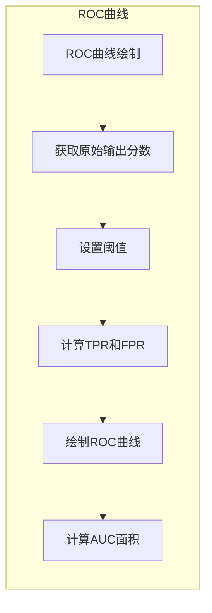

# ROC曲线原理与代码实例讲解

## 1.背景介绍

在机器学习和数据挖掘领域中,评估模型的性能是一个非常重要的任务。ROC(Receiver Operating Characteristic)曲线是一种常用的评估二分类模型性能的可视化方法。它通过绘制真阳性率(True Positive Rate,TPR)和假阳性率(False Positive Rate,FPR)的关系曲线,全面描述了分类模型在不同阈值设置下的性能表现。

ROC曲线最初起源于二战期间的军事领域,用于分析雷达接收系统的性能。后来被广泛应用于医学诊断、机器学习、数据挖掘等多个领域中的二分类问题评估。ROC曲线能够清晰地展现出模型的判别能力,是衡量分类模型优劣的重要工具之一。

## 2.核心概念与联系

### 2.1 阳性和阴性

在二分类问题中,我们通常将样本分为阳性(Positive)类和阴性(Negative)类。比如在医学诊断中,患病的样本为阳性类,健康的样本为阴性类;在信用卡欺诈检测中,欺诈交易为阳性类,正常交易为阴性类。

### 2.2 真阳性(TP)、真阴性(TN)、假阳性(FP)、假阴性(FN)

- 真阳性(True Positive,TP):实际为阳性类,且被正确预测为阳性类的样本数量。
- 真阴性(True Negative,TN):实际为阴性类,且被正确预测为阴性类的样本数量。  
- 假阳性(False Positive,FP):实际为阴性类,但被错误预测为阳性类的样本数量。
- 假阴性(False Negative,FN):实际为阳性类,但被错误预测为阴性类的样本数量。

### 2.3 真阳性率(TPR)和假阳性率(FPR)  

- 真阳性率(True Positive Rate,TPR)也称为灵敏度(Sensitivity)或命中率(Recall),定义为:

$$TPR = \frac{TP}{TP+FN}$$

TPR描述了分类器能够正确识别出阳性样本的能力。

- 假阳性率(False Positive Rate,FPR)也称为fallout或误报率,定义为:

$$FPR = \frac{FP}{FP+TN}$$ 

FPR描述了分类器将阴性样本错误地预测为阳性的比例。

TPR和FPR是ROC曲线的两个重要组成部分,ROC曲线实际上是以FPR为横坐标,TPR为纵坐标绘制的曲线。

### 2.4 ROC曲线

ROC曲线是在不同分类阈值设置下,TPR对FPR的变化曲线。理想的分类器在ROC曲线上应该尽可能接近于左上角的(0,1)点,这表示TPR=1且FPR=0的完美分类。

ROC曲线下面的面积被称为AUC(Area Under Curve),AUC的取值范围是0到1。一般来说,AUC值越大,说明分类器的性能越好。AUC=1表示完美分类,AUC=0.5表示分类器的性能不比随机分类好。

## 3.核心算法原理具体操作步骤

绘制ROC曲线的核心步骤如下:

1. **获取模型的原始输出分数**

对于每个样本,分类模型会输出一个原始分数(原始概率或置信度分数),表示该样本属于阳性类的可能性大小。我们需要获取所有样本的原始输出分数。

2. **设置阈值并计算TPR和FPR**

我们设置一系列不同的阈值,对于每个阈值:

- 将模型输出大于等于该阈值的样本预测为阳性类,否则预测为阴性类。
- 根据预测结果和实际标签,计算TP、FP、TN、FN的数量。
- 利用公式计算该阈值下的TPR和FPR。

3. **绘制ROC曲线**

将计算出的(FPR,TPR)作为坐标点,绘制到ROC平面上,并连接所有点,即得到ROC曲线。

4. **计算AUC面积**

利用数值积分或其他方法,计算ROC曲线下的面积,即AUC值。AUC值越大,说明分类器的性能越好。

下面是一个Python代码示例,展示了如何计算并绘制ROC曲线:

```python
import numpy as np
import matplotlib.pyplot as plt
from sklearn.metrics import roc_curve, auc

# 假设y_true是实际标签,y_score是模型输出的原始分数
y_true = np.array([0, 0, 1, 1])
y_score = np.array([0.1, 0.4, 0.35, 0.8])

# 计算ROC曲线上的坐标点
fpr, tpr, thresholds = roc_curve(y_true, y_score)

# 计算AUC值
roc_auc = auc(fpr, tpr)

# 绘制ROC曲线
plt.figure()
lw = 2
plt.plot(fpr, tpr, color='darkorange',
         lw=lw, label='ROC curve (area = %0.2f)' % roc_auc)
plt.plot([0, 1], [0, 1], color='navy', lw=lw, linestyle='--')
plt.xlim([0.0, 1.0])
plt.ylim([0.0, 1.05])
plt.xlabel('False Positive Rate')
plt.ylabel('True Positive Rate')
plt.title('Receiver Operating Characteristic')
plt.legend(loc="lower right")
plt.show()
```

上述代码使用scikit-learn库中的`roc_curve`函数计算ROC曲线上的坐标点,并使用`auc`函数计算AUC值。然后使用matplotlib库绘制ROC曲线。

## 4.数学模型和公式详细讲解举例说明

ROC曲线实际上是在不同分类阈值设置下,TPR对FPR的变化曲线。TPR和FPR的数学定义如下:

$$TPR = \frac{TP}{TP+FN}$$
$$FPR = \frac{FP}{FP+TN}$$

其中TP、FP、TN、FN分别代表真阳性、假阳性、真阴性、假阴性的样本数量。

为了更好地理解TPR和FPR,我们用一个具体的例子来说明。假设我们有一个二分类问题,需要判断一个人是否患有某种疾病。我们将患病的人标记为阳性类(Positive),健康的人标记为阴性类(Negative)。我们使用一个分类模型对100个人进行预测,结果如下:

- 真阳性(TP)数量为40,即有40个患病的人被正确预测为患病。
- 假阳性(FP)数量为10,即有10个健康的人被错误预测为患病。
- 真阴性(TN)数量为40,即有40个健康的人被正确预测为健康。
- 假阴性(FN)数量为10,即有10个患病的人被错误预测为健康。

根据上述数据,我们可以计算出TPR和FPR:

$$TPR = \frac{TP}{TP+FN} = \frac{40}{40+10} = 0.8$$
$$FPR = \frac{FP}{FP+TN} = \frac{10}{10+40} = 0.2$$

TPR=0.8表示该分类模型能够正确识别出80%的患病人群,FPR=0.2表示该模型将20%的健康人错误地预测为患病。

在ROC曲线上,我们将FPR作为横坐标,TPR作为纵坐标,绘制出一个坐标点(0.2,0.8)。通过设置不同的阈值,我们可以得到多个(FPR,TPR)坐标点,并将它们连接起来,就得到了ROC曲线。

ROC曲线下面的面积被称为AUC(Area Under Curve),AUC的取值范围是0到1。一般来说,AUC值越大,说明分类器的性能越好。AUC=1表示完美分类,AUC=0.5表示分类器的性能不比随机分类好。

在上面的例子中,如果我们将所有样本都预测为阴性类,那么TPR=0,FPR=0,对应ROC曲线上的(0,0)点;如果我们将所有样本都预测为阳性类,那么TPR=1,FPR=1,对应ROC曲线上的(1,1)点。一个理想的分类器在ROC曲线上应该尽可能接近于左上角的(0,1)点,这表示TPR=1且FPR=0的完美分类。

## 5.项目实践:代码实例和详细解释说明

在实际项目中,我们可以使用Python中的scikit-learn库来计算和绘制ROC曲线。下面是一个使用逻辑回归模型进行二分类,并绘制ROC曲线的示例代码:

```python
import numpy as np
from sklearn.datasets import make_blobs
from sklearn.linear_model import LogisticRegression
from sklearn.metrics import roc_curve, auc
import matplotlib.pyplot as plt

# 生成模拟二分类数据
X, y = make_blobs(n_samples=1000, centers=2, n_features=2, random_state=1)

# 训练逻辑回归模型
model = LogisticRegression()
model.fit(X, y)

# 获取模型预测的原始输出分数
y_score = model.decision_function(X)

# 计算ROC曲线上的坐标点
fpr, tpr, thresholds = roc_curve(y, y_score)

# 计算AUC值
roc_auc = auc(fpr, tpr)

# 绘制ROC曲线
plt.figure()
lw = 2
plt.plot(fpr, tpr, color='darkorange',
         lw=lw, label='ROC curve (area = %0.2f)' % roc_auc)
plt.plot([0, 1], [0, 1], color='navy', lw=lw, linestyle='--')
plt.xlim([0.0, 1.0])
plt.ylim([0.0, 1.05])
plt.xlabel('False Positive Rate')
plt.ylabel('True Positive Rate')
plt.title('Receiver Operating Characteristic')
plt.legend(loc="lower right")
plt.show()
```

代码解释:

1. 使用`make_blobs`函数生成模拟的二分类数据`X`和标签`y`。
2. 使用`LogisticRegression`训练一个逻辑回归模型。
3. 调用模型的`decision_function`方法获取每个样本的原始输出分数`y_score`。
4. 使用`roc_curve`函数计算ROC曲线上的坐标点`fpr`(假阳性率)和`tpr`(真阳性率)。
5. 使用`auc`函数计算ROC曲线下的面积`roc_auc`(AUC值)。
6. 使用matplotlib库绘制ROC曲线,将`fpr`作为横坐标,`tpr`作为纵坐标。
7. 在图中显示AUC值,并添加图例和标题等。

运行上述代码,我们可以得到如下ROC曲线图:



上图展示了绘制ROC曲线的核心流程。首先获取模型的原始输出分数,然后设置一系列阈值,对于每个阈值计算对应的TPR和FPR,将(FPR,TPR)作为坐标点绘制到ROC平面上,最后计算ROC曲线下的面积AUC。

通过观察ROC曲线的形状和AUC值的大小,我们可以直观地评估分类模型的性能。一个优秀的模型对应的ROC曲线应该尽可能靠近左上角的(0,1)点,AUC值也应该尽可能接近1。

## 6.实际应用场景

ROC曲线和AUC值在许多领域都有广泛的应用,包括但不限于:

1. **医学诊断**:在医学诊断中,ROC曲线可以用于评估诊断测试的准确性。例如,评估某种癌症筛查方法的性能。

2. **信用风险评估**:在信用风险评估中,ROC曲线可以用于评估贷款违约风险模型的性能。

3. **欺诈检测**:在信用卡欺诈检测、网络入侵检测等领域,ROC曲线可以用于评估欺诈检测模型的性能。

4. **机器学习模型评估**:在机器学习领域,ROC曲线和AUC值是评估二分类模型性能的重