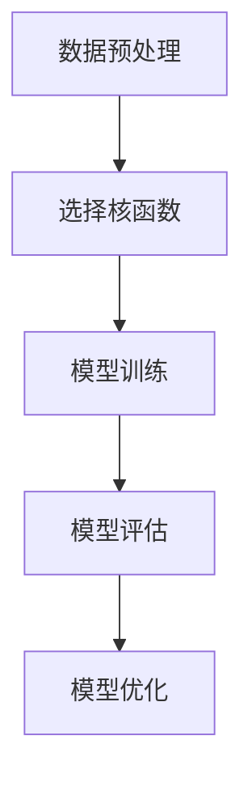

# SVM在地理信息系统领域中的应用与实例

## 1.背景介绍

地理信息系统（GIS）是一个用于捕获、存储、分析和管理地理空间数据的系统。随着数据量的增加和分析需求的复杂化，传统的分析方法已经无法满足现代GIS应用的需求。支持向量机（SVM）作为一种强大的机器学习算法，因其在分类和回归问题上的优越性能，逐渐在GIS领域中得到了广泛应用。

SVM的核心思想是通过找到一个最优超平面，将不同类别的数据点分开。其优势在于能够处理高维数据，并且在样本较少的情况下仍能保持较高的准确性。本文将详细探讨SVM在GIS中的应用，包括其核心概念、算法原理、数学模型、项目实践、实际应用场景、工具和资源推荐，以及未来的发展趋势与挑战。

## 2.核心概念与联系

### 2.1 支持向量机（SVM）

支持向量机是一种监督学习模型，主要用于分类和回归分析。其基本原理是通过找到一个最优超平面，将数据集中的不同类别分开。SVM的目标是最大化分类边界的间隔，从而提高模型的泛化能力。

### 2.2 地理信息系统（GIS）

GIS是一种用于捕获、存储、分析和管理地理空间数据的系统。它能够处理各种类型的地理数据，包括矢量数据和栅格数据。GIS的应用范围广泛，包括城市规划、环境监测、资源管理等。

### 2.3 SVM与GIS的联系

SVM在GIS中的应用主要体现在地理空间数据的分类和回归分析上。例如，利用SVM可以对遥感影像进行分类，从而识别不同的地物类型；还可以通过SVM进行地理空间数据的回归分析，预测环境变量的变化趋势。

## 3.核心算法原理具体操作步骤

### 3.1 数据预处理

在进行SVM分析之前，需要对地理空间数据进行预处理。常见的预处理步骤包括数据清洗、特征提取和数据标准化。

### 3.2 选择核函数

SVM的性能在很大程度上依赖于核函数的选择。常见的核函数包括线性核、多项式核、径向基函数（RBF）核等。不同的核函数适用于不同类型的数据分布。

### 3.3 模型训练

通过将预处理后的数据输入到SVM模型中，进行模型训练。训练过程中，SVM会找到一个最优超平面，将不同类别的数据点分开。

### 3.4 模型评估

通过交叉验证等方法对模型进行评估，确保其具有良好的泛化能力。常见的评估指标包括准确率、精确率、召回率和F1分数。

### 3.5 模型优化

通过调整模型参数（如惩罚参数C和核函数参数γ），对模型进行优化，以提高其分类或回归性能。



## 4.数学模型和公式详细讲解举例说明

### 4.1 支持向量机的数学模型

SVM的目标是找到一个最优超平面，使得分类间隔最大化。对于线性可分的数据集，超平面可以表示为：

$$
w \cdot x + b = 0
$$

其中，$w$ 是法向量，$b$ 是偏置项。分类间隔可以表示为：

$$
\frac{2}{||w||}
$$

### 4.2 拉格朗日乘子法

为了找到最优超平面，SVM引入了拉格朗日乘子法。目标函数可以表示为：

$$
L(w, b, \alpha) = \frac{1}{2} ||w||^2 - \sum_{i=1}^{n} \alpha_i [y_i (w \cdot x_i + b) - 1]
$$

其中，$\alpha_i$ 是拉格朗日乘子。

### 4.3 核函数

对于非线性可分的数据集，SVM通过引入核函数将数据映射到高维空间，从而实现线性可分。常见的核函数包括：

- 线性核：$K(x_i, x_j) = x_i \cdot x_j$
- 多项式核：$K(x_i, x_j) = (x_i \cdot x_j + c)^d$
- RBF核：$K(x_i, x_j) = \exp(-\gamma ||x_i - x_j||^2)$

### 4.4 举例说明

假设我们有一个简单的二维数据集，其中包含两类数据点。通过SVM，我们可以找到一个最优超平面，将这两类数据点分开。具体步骤如下：

1. 数据预处理：对数据进行标准化处理。
2. 选择核函数：选择RBF核函数。
3. 模型训练：通过训练数据集，找到最优超平面。
4. 模型评估：通过交叉验证评估模型性能。
5. 模型优化：调整参数，提高模型性能。

## 5.项目实践：代码实例和详细解释说明

### 5.1 数据集准备

首先，我们需要准备一个地理空间数据集。这里以一个遥感影像数据集为例，数据集包含不同地物类型的像素值。

### 5.2 数据预处理

对数据进行预处理，包括数据清洗、特征提取和标准化。

```python
import numpy as np
from sklearn.preprocessing import StandardScaler

# 加载数据集
data = np.load('remote_sensing_data.npy')
X = data[:, :-1]
y = data[:, -1]

# 数据标准化
scaler = StandardScaler()
X_scaled = scaler.fit_transform(X)
```

### 5.3 选择核函数和模型训练

选择RBF核函数，并进行模型训练。

```python
from sklearn.svm import SVC
from sklearn.model_selection import train_test_split

# 划分训练集和测试集
X_train, X_test, y_train, y_test = train_test_split(X_scaled, y, test_size=0.3, random_state=42)

# 选择RBF核函数
svm_model = SVC(kernel='rbf', C=1.0, gamma='scale')

# 模型训练
svm_model.fit(X_train, y_train)
```

### 5.4 模型评估

通过交叉验证评估模型性能。

```python
from sklearn.model_selection import cross_val_score

# 交叉验证
scores = cross_val_score(svm_model, X_train, y_train, cv=5)
print(f'Cross-validation accuracy: {np.mean(scores):.2f}')
```

### 5.5 模型优化

调整参数，提高模型性能。

```python
from sklearn.model_selection import GridSearchCV

# 参数网格
param_grid = {'C': [0.1, 1, 10], 'gamma': ['scale', 0.1, 1, 10]}

# 网格搜索
grid_search = GridSearchCV(SVC(kernel='rbf'), param_grid, cv=5)
grid_search.fit(X_train, y_train)

# 最优参数
print(f'Best parameters: {grid_search.best_params_}')
```

## 6.实际应用场景

### 6.1 遥感影像分类

利用SVM对遥感影像进行分类，可以识别不同的地物类型，如森林、农田、水体等。这对于环境监测和资源管理具有重要意义。

### 6.2 土地利用变化检测

通过对不同时期的遥感影像进行分类和比较，可以检测土地利用的变化情况。这对于城市规划和环境保护具有重要参考价值。

### 6.3 地质灾害预测

利用SVM对地质灾害数据进行分析，可以预测地质灾害的发生概率，从而提高防灾减灾能力。

### 6.4 气候变化分析

通过对气象数据进行回归分析，可以预测气候变化趋势，为气候变化研究提供数据支持。

## 7.工具和资源推荐

### 7.1 软件工具

- **QGIS**：开源的地理信息系统软件，支持多种地理数据格式，适用于地理数据的可视化和分析。
- **ArcGIS**：商业地理信息系统软件，功能强大，适用于复杂的地理数据分析和管理。
- **scikit-learn**：Python机器学习库，提供了丰富的机器学习算法，包括SVM。

### 7.2 数据资源

- **USGS Earth Explorer**：提供全球范围内的遥感影像数据，适用于遥感影像分类和变化检测。
- **NASA Earthdata**：提供多种地球科学数据，包括气象数据、遥感影像等，适用于气候变化分析和环境监测。

### 7.3 学习资源

- **Coursera**：提供多种机器学习和地理信息系统相关的在线课程，适合初学者和进阶学习者。
- **Kaggle**：数据科学竞赛平台，提供丰富的数据集和机器学习项目，适合实践和学习。

## 8.总结：未来发展趋势与挑战

### 8.1 未来发展趋势

随着数据量的增加和分析需求的复杂化，SVM在GIS中的应用前景广阔。未来，SVM有望在以下几个方面取得突破：

- **大数据分析**：随着遥感技术的发展，地理空间数据量不断增加，如何高效处理和分析大数据将成为SVM的重要应用方向。
- **深度学习结合**：将SVM与深度学习相结合，可以提高模型的分类和回归性能，适应更复杂的地理空间数据分析需求。
- **实时分析**：随着计算能力的提升，实时地理空间数据分析将成为可能，SVM在实时分析中的应用前景广阔。

### 8.2 挑战

尽管SVM在GIS中的应用前景广阔，但仍面临一些挑战：

- **计算复杂度**：SVM在处理大规模数据时，计算复杂度较高，如何提高计算效率是一个重要挑战。
- **参数选择**：SVM的性能在很大程度上依赖于参数的选择，如何自动化地选择最优参数是一个研究热点。
- **数据质量**：地理空间数据质量参差不齐，如何处理噪声和缺失数据，提高数据质量，是SVM应用中的一个重要问题。

## 9.附录：常见问题与解答

### 9.1 SVM在GIS中的优势是什么？

SVM在GIS中的优势主要体现在以下几个方面：

- **高维数据处理能力**：SVM能够处理高维数据，适用于复杂的地理空间数据分析。
- **小样本学习**：SVM在样本较少的情况下仍能保持较高的准确性，适用于数据稀缺的地理空间分析场景。
- **非线性分类**：通过引入核函数，SVM能够处理非线性分类问题，适用于复杂的地理空间数据分类。

### 9.2 如何选择合适的核函数？

选择合适的核函数需要根据数据的分布情况和具体的应用场景。常见的核函数包括线性核、多项式核和RBF核。一般来说，RBF核适用于大多数非线性分类问题，但具体选择需要通过交叉验证等方法进行评估。

### 9.3 SVM在GIS中的应用有哪些实际案例？

SVM在GIS中的应用包括遥感影像分类、土地利用变化检测、地质灾害预测和气候变化分析等。通过SVM，可以对地理空间数据进行高效的分类和回归分析，为环境监测、资源管理和城市规划提供数据支持。

### 9.4 如何提高SVM模型的性能？

提高SVM模型性能的方法包括：

- **数据预处理**：对数据进行清洗、特征提取和标准化，提高数据质量。
- **参数优化**：通过网格搜索等方法，选择最优的模型参数。
- **特征选择**：选择重要的特征，减少数据维度，提高模型的泛化能力。

### 9.5 SVM在处理大规模地理空间数据时的挑战是什么？

SVM在处理大规模地理空间数据时，主要面临计算复杂度高和内存消耗大的挑战。解决方法包括使用分布式计算、并行计算和增量学习等技术，提高计算效率和处理能力。

---

作者：禅与计算机程序设计艺术 / Zen and the Art of Computer Programming