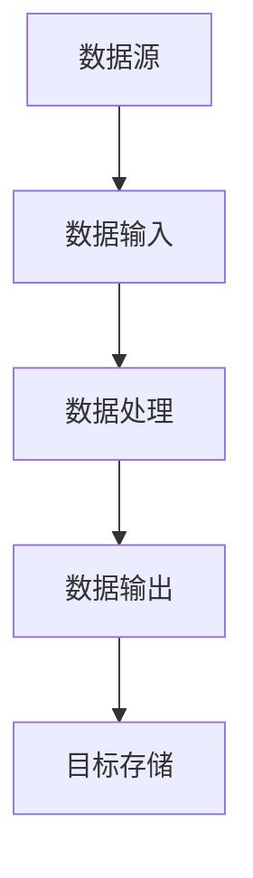
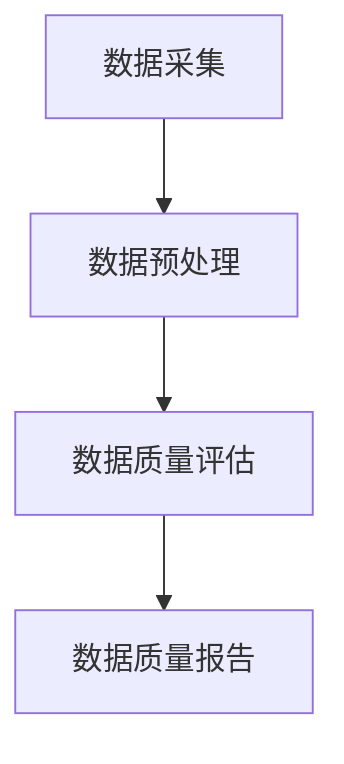

# Samza数据处理与数据质量测量

## 1.背景介绍

在大数据时代，数据处理和数据质量测量成为了企业和研究机构的核心任务。Apache Samza作为一个分布式流处理框架，因其高效、可靠和易于扩展的特性，广泛应用于实时数据处理场景。然而，数据质量问题常常成为数据处理过程中的瓶颈，影响了数据分析和决策的准确性。因此，理解Samza的工作原理并掌握数据质量测量的方法，对于提升数据处理效率和数据质量至关重要。

## 2.核心概念与联系

### 2.1 Samza的基本概念

Apache Samza是一个分布式流处理框架，主要用于处理实时数据流。其核心组件包括：

- **Job**：一个Samza作业，定义了数据处理的逻辑。
- **Stream**：数据流，表示数据的连续流动。
- **Task**：任务，处理数据流中的每一条消息。
- **Container**：容器，运行任务的执行环境。

### 2.2 数据质量的基本概念

数据质量是指数据的准确性、完整性、一致性、及时性和唯一性等特性。高质量的数据是数据分析和决策的基础。常见的数据质量问题包括：

- **缺失值**：数据中存在空值或缺失值。
- **重复数据**：数据集中存在重复的记录。
- **不一致数据**：数据在不同来源或不同时间点存在不一致。
- **错误数据**：数据中存在错误或不合理的值。

### 2.3 Samza与数据质量的联系

在使用Samza进行数据处理时，数据质量问题可能会影响处理结果的准确性和可靠性。因此，在数据处理的各个环节中，必须进行数据质量测量和控制，以确保最终的数据结果是高质量的。

## 3.核心算法原理具体操作步骤

### 3.1 Samza数据处理流程

Samza的数据处理流程可以分为以下几个步骤：

1. **数据输入**：从数据源（如Kafka、HDFS等）读取数据流。
2. **数据处理**：通过定义的任务逻辑对数据进行处理。
3. **数据输出**：将处理后的数据写入目标存储（如数据库、文件系统等）。

以下是一个简单的Samza数据处理流程的Mermaid流程图：



### 3.2 数据质量测量步骤

数据质量测量可以分为以下几个步骤：

1. **数据采集**：从数据源中采集数据。
2. **数据预处理**：对数据进行清洗、转换等预处理操作。
3. **数据质量评估**：使用数据质量指标对数据进行评估。
4. **数据质量报告**：生成数据质量报告，记录数据质量问题和改进建议。

以下是一个数据质量测量流程的Mermaid流程图：



## 4.数学模型和公式详细讲解举例说明

### 4.1 数据质量指标

数据质量指标是衡量数据质量的标准，常见的指标包括：

- **准确性**：数据的真实程度。可以用准确率（Accuracy）来表示，公式为：
  $$
  \text{Accuracy} = \frac{\text{Number of Correct Records}}{\text{Total Number of Records}}
  $$

- **完整性**：数据的完整程度。可以用完整率（Completeness）来表示，公式为：
  $$
  \text{Completeness} = \frac{\text{Number of Non-Missing Values}}{\text{Total Number of Values}}
  $$

- **一致性**：数据在不同来源或不同时间点的一致程度。可以用一致率（Consistency）来表示，公式为：
  $$
  \text{Consistency} = \frac{\text{Number of Consistent Records}}{\text{Total Number of Records}}
  $$

### 4.2 数据质量评估方法

数据质量评估方法包括统计分析、规则检查和机器学习等。以下是一些常用的方法：

- **统计分析**：通过统计数据的分布、均值、方差等指标，评估数据的质量。
- **规则检查**：通过预定义的规则（如数据格式、范围等），检查数据的质量。
- **机器学习**：通过训练机器学习模型，自动检测数据中的异常和错误。

## 5.项目实践：代码实例和详细解释说明

### 5.1 Samza数据处理代码实例

以下是一个使用Samza进行数据处理的简单代码实例：

```java
import org.apache.samza.config.Config;
import org.apache.samza.config.MapConfig;
import org.apache.samza.job.JobRunner;
import org.apache.samza.task.StreamTask;
import org.apache.samza.task.MessageCollector;
import org.apache.samza.task.TaskCoordinator;
import org.apache.samza.system.IncomingMessageEnvelope;
import org.apache.samza.system.OutgoingMessageEnvelope;

public class MySamzaTask implements StreamTask {
    @Override
    public void process(IncomingMessageEnvelope envelope, MessageCollector collector, TaskCoordinator coordinator) {
        String message = (String) envelope.getMessage();
        // 数据处理逻辑
        String processedMessage = processMessage(message);
        collector.send(new OutgoingMessageEnvelope(new SystemStream("kafka", "output-topic"), processedMessage));
    }

    private String processMessage(String message) {
        // 数据处理逻辑
        return message.toUpperCase();
    }

    public static void main(String[] args) {
        Config config = new MapConfig();
        JobRunner runner = new JobRunner(config);
        runner.run();
    }
}
```

### 5.2 数据质量测量代码实例

以下是一个使用Java进行数据质量测量的简单代码实例：

```java
import java.util.List;

public class DataQualityChecker {
    public double calculateAccuracy(List<String> records, List<String> correctRecords) {
        int correctCount = 0;
        for (int i = 0; i < records.size(); i++) {
            if (records.get(i).equals(correctRecords.get(i))) {
                correctCount++;
            }
        }
        return (double) correctCount / records.size();
    }

    public double calculateCompleteness(List<String> records) {
        int nonMissingCount = 0;
        for (String record : records) {
            if (record != null && !record.isEmpty()) {
                nonMissingCount++;
            }
        }
        return (double) nonMissingCount / records.size();
    }

    public double calculateConsistency(List<String> records, List<String> referenceRecords) {
        int consistentCount = 0;
        for (int i = 0; i < records.size(); i++) {
            if (records.get(i).equals(referenceRecords.get(i))) {
                consistentCount++;
            }
        }
        return (double) consistentCount / records.size();
    }

    public static void main(String[] args) {
        DataQualityChecker checker = new DataQualityChecker();
        List<String> records = List.of("A", "B", "C", "D");
        List<String> correctRecords = List.of("A", "B", "C", "D");
        List<String> referenceRecords = List.of("A", "B", "X", "D");

        double accuracy = checker.calculateAccuracy(records, correctRecords);
        double completeness = checker.calculateCompleteness(records);
        double consistency = checker.calculateConsistency(records, referenceRecords);

        System.out.println("Accuracy: " + accuracy);
        System.out.println("Completeness: " + completeness);
        System.out.println("Consistency: " + consistency);
    }
}
```

## 6.实际应用场景

### 6.1 实时数据分析

在金融、零售等行业，实时数据分析是关键任务。通过Samza，可以实时处理交易数据、用户行为数据等，进行实时监控和分析。同时，通过数据质量测量，确保分析结果的准确性和可靠性。

### 6.2 物联网数据处理

物联网设备生成大量的实时数据，这些数据需要及时处理和分析。Samza可以高效地处理物联网数据流，并通过数据质量测量，确保数据的准确性和完整性。

### 6.3 社交媒体数据分析

社交媒体平台生成大量的用户数据，通过Samza，可以实时处理和分析这些数据，进行用户行为分析、情感分析等。同时，通过数据质量测量，确保分析结果的准确性和一致性。

## 7.工具和资源推荐

### 7.1 工具推荐

- **Apache Samza**：分布式流处理框架，适用于实时数据处理。
- **Apache Kafka**：分布式消息系统，常用于数据流的传输。
- **Apache Hadoop**：分布式存储和处理框架，适用于大规模数据处理。
- **Apache Spark**：分布式数据处理框架，支持批处理和流处理。

### 7.2 资源推荐

- **Samza官方文档**：详细介绍了Samza的安装、配置和使用方法。
- **Kafka官方文档**：详细介绍了Kafka的安装、配置和使用方法。
- **Hadoop官方文档**：详细介绍了Hadoop的安装、配置和使用方法。
- **Spark官方文档**：详细介绍了Spark的安装、配置和使用方法。

## 8.总结：未来发展趋势与挑战

### 8.1 未来发展趋势

随着大数据技术的不断发展，数据处理和数据质量测量将变得更加重要。未来，分布式流处理框架（如Samza）将继续发展，提供更高效、更可靠的数据处理能力。同时，数据质量测量方法也将不断改进，提供更准确、更全面的数据质量评估。

### 8.2 挑战

尽管数据处理和数据质量测量技术不断进步，但仍面临一些挑战：

- **数据量的不断增长**：随着数据量的不断增长，数据处理和数据质量测量的难度也在增加。
- **数据多样性**：数据来源和数据类型的多样性，增加了数据处理和数据质量测量的复杂性。
- **实时性要求**：在一些应用场景中，数据处理和数据质量测量需要实时进行，增加了技术难度。

## 9.附录：常见问题与解答

### 9.1 Samza与其他流处理框架的区别

**问题**：Samza与其他流处理框架（如Apache Flink、Apache Storm）有什么区别？

**解答**：Samza与其他流处理框架的主要区别在于其设计理念和应用场景。Samza主要用于处理大规模的实时数据流，具有高效、可靠和易于扩展的特点。与Flink和Storm相比，Samza更注重与Kafka的集成，适用于需要高吞吐量和低延迟的应用场景。

### 9.2 如何提高数据质量

**问题**：在数据处理过程中，如何提高数据质量？

**解答**：提高数据质量的方法包括：

- **数据清洗**：对数据进行清洗，去除缺失值、重复数据和错误数据。
- **数据转换**：对数据进行转换，确保数据格式和范围的一致性。
- **数据验证**：通过预定义的规则和机器学习模型，对数据进行验证，检测数据中的异常和错误。
- **数据监控**：对数据质量进行实时监控，及时发现和解决数据质量问题。

### 9.3 如何选择合适的数据处理框架

**问题**：在实际应用中，如何选择合适的数据处理框架？

**解答**：选择合适的数据处理框架需要考虑以下几个因素：

- **数据量**：根据数据量的大小，选择合适的框架。对于大规模数据处理，可以选择Hadoop或Spark；对于实时数据处理，可以选择Samza或Flink。
- **数据类型**：根据数据类型，选择合适的框架。对于结构化数据，可以选择Hadoop或Spark；对于非结构化数据，可以选择Samza或Flink。
- **实时性要求**：根据实时性要求，选择合适的框架。对于需要实时处理的数据，可以选择Samza或Flink；对于批处理数据，可以选择Hadoop或Spark。

作者：禅与计算机程序设计艺术 / Zen and the Art of Computer Programming